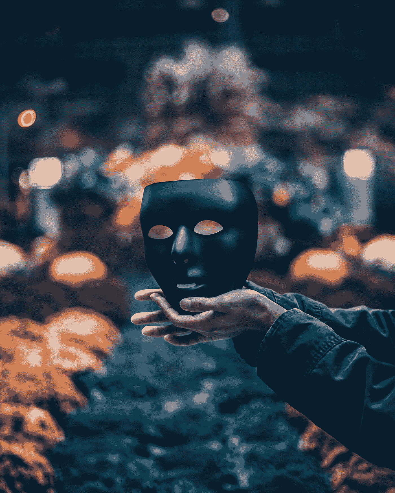

# 使用 SVG 的掩蔽效果

> 原文：<https://medium.com/javarevisited/masking-effect-using-svg-8c8752feae38?source=collection_archive---------3----------------------->

## 探索 SVG 第 3 部分

## 剪辑路径，遮罩

这是一篇关于 SVG 的高级文章。这里我们讨论 SVG 的两个主要概念，即剪辑路径和遮罩。它被用来隐藏图像的一部分，并显示另一部分。有很多这样的使用案例，比如把图像作为文本的背景，应用背景纹理效果，给物体制作图案等等。

由[约翰·努南](https://unsplash.com/@theonlynoonan?utm_source=medium&utm_medium=referral)在 [Unsplash](https://unsplash.com?utm_source=medium&utm_medium=referral) 上拍摄