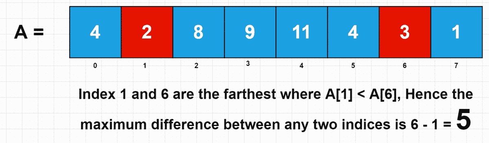

# 两个指数之间的最大差异|编码面试|排序| 30 天准备计划|第 2 天—问题 5

> 原文：<https://medium.com/javarevisited/maximum-difference-between-two-indices-coding-interview-sorting-30-days-preparation-plan-1b194c54fff7?source=collection_archive---------3----------------------->

这个问题属于中等类别问题，VMWare、Google、Amazon 都问过。

为了更好地理解这个问题，在阅读完每一节之后，试着编写这个方法的代码。如果你被困住了😉，您可以随时查看我为您提供的注释代码…