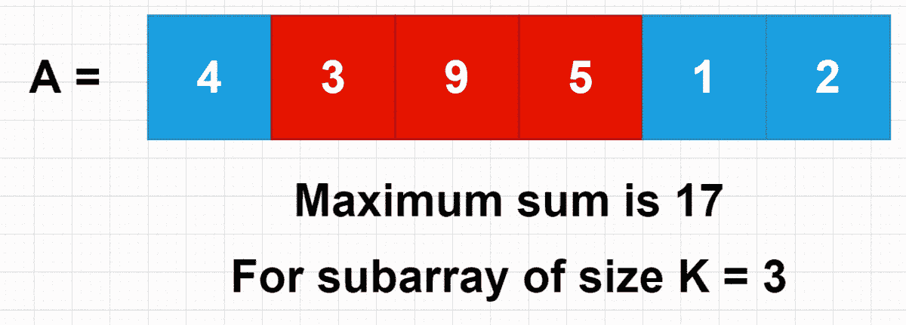

# 规模为 K 的最大和子数组—编码面试|滑动窗口| 30 天准备计划|第 4 天—问题 1

> 原文：<https://medium.com/javarevisited/maximum-sum-subarray-of-size-k-coding-interview-sliding-window-30-days-preparation-plan-11270ac0a5b3?source=collection_archive---------1----------------------->

这个问题对🥳来说既容易又有趣；因此一个合适的例子来介绍滑动窗口模式。该策略类似于给定总和的 [**最小子阵**](/interviewnoodle/smallest-subarray-with-a-given-sum-coding-interview-sliding-window-pattern-e735a86ec41c) 。

为了更好地理解这个问题，在阅读完每一节之后，试着编写这个方法的代码。如果你卡住了…