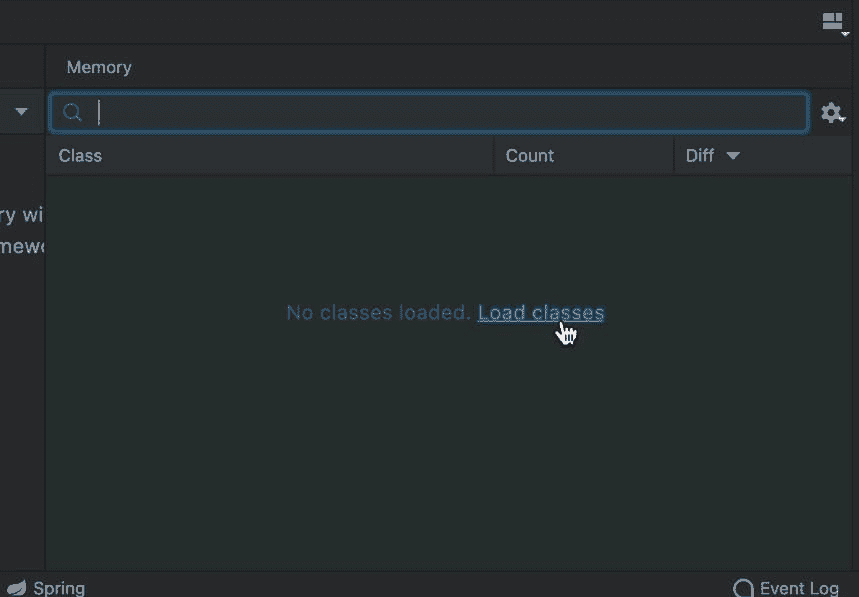
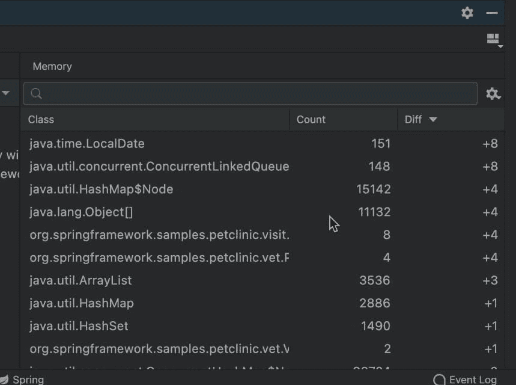
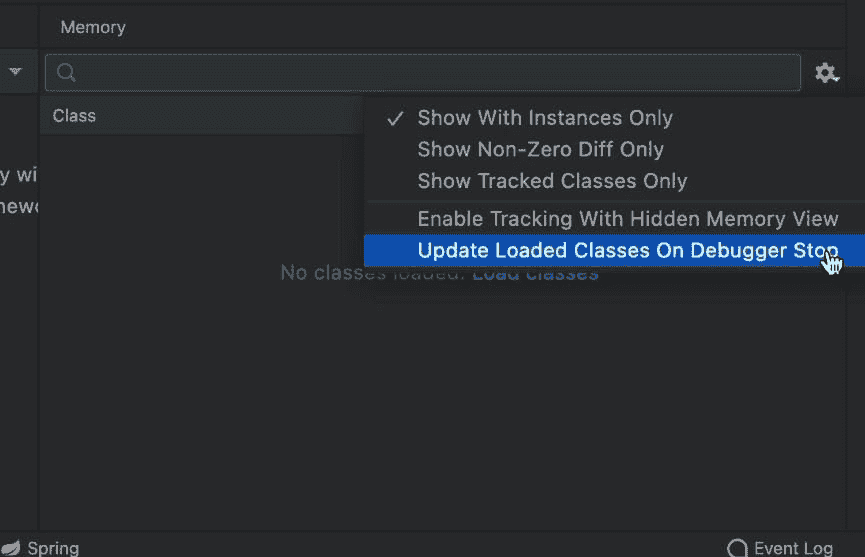
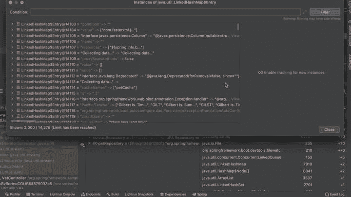
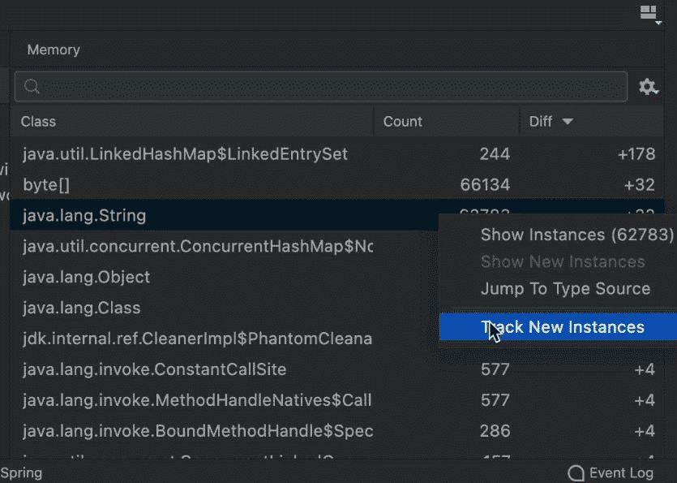
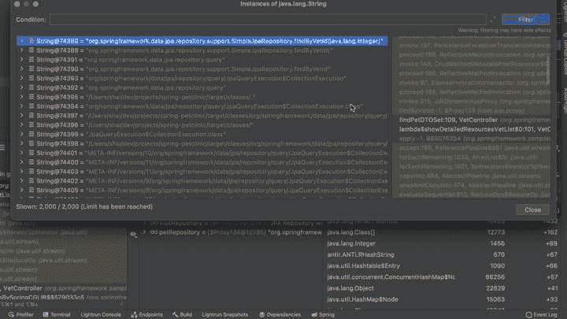

# 内存调试和观察注释

> 原文：<https://medium.com/javarevisited/memory-debugging-and-watch-annotations-8c7e32d2f691?source=collection_archive---------0----------------------->


在深入调试内存问题和其他令人惊讶的运行过程之前，内存调试能力(这是令人惊讶的)…我想讨论一下我在[最后一个小鸭子帖子](https://talktotheduck.dev/debugging-collections-streams-and-watch-renderers)中留下的一个观点。在那里，我们讨论了定制手表渲染器。这个超级酷！

但也很繁琐。在我们继续之前，如果你愿意，我会在这些视频中讲述这些主题中的大部分:

# 观察注释

上一次我们讨论了如何定制监视用户界面来更有效地呈现复杂的对象。但这有一个问题:“我们并不孤独”。

我们是团队的一部分。对每台机器都这样做既困难又令人沮丧。如果您正在构建一个库或一个 API，并且希望在默认情况下有这种行为，该怎么办？

这就是 JetBrains 提供的独特解决方案:自定义注释。只需用调试器的提示注释您的代码，配置将对您的整个团队/用户是无缝的。为此，我们需要将 JetBrains 注释添加到项目路径中。您可以将它添加到 Maven POM 文件中:

```
<dependency>
 <groupId>org.jetbrains</groupId>
 <artifactId>annotations</artifactId>
 <version>23.0.0</version>
</dependency>
```

一旦这样做了，我们就可以注释前一只小鸭子的类来达到同样的效果

```
import org.jetbrains.annotations.Debug.Renderer;// snipped code ...@Renderer(text = "\"Repository has \" + count() + \" elements\",",
  childrenArray = "finaAll()",
  hasChildren = "count() > 0")
public interface VisitRepository extends JpaRepository<Visit, Integer> {
  // snipped code  ...
}
```

注意，我们需要对注释中的字符串进行转义，这样它们才是有效的 [Java 字符串](https://www.java67.com/2019/11/how-to-remove-duplicate-characters-from-string-in-java.html)。我们需要对引号进行转义，并使用它们来编写“正确的”字符串。

同样，其他一切都与我们在前面的小鸭子中看到的内容和结果相匹配。

# 内存调试器

这篇文章的主要焦点是内存调试能力。默认情况下，JetBrains 禁用了大部分这些功能来提高程序执行性能。我们可以通过在底部工具窗口的右侧选中它来启用内存调试器视图。

[](https://javarevisited.blogspot.com/2018/09/top-5-courses-to-learn-intellij-idea-java-and-android-development.html)

更糟。这对性能的影响如此之大，以至于 IntelliJ 不会加载该类的实际内容，直到我们明确地单击内存监视器中间的“Load Classes”按钮:



你可以想象，这很快就过时了。如果你的机器很慢，那么这是一件很棒的事情。但是如果您有一台特别强大的机器，那么您可能希望打开“在调试器停止时更新加载的类”:

[](https://javarevisited.blogspot.com/2011/02/how-to-setup-remote-debugging-in.html)

这有效地消除了点击的需求，但代价是执行速度变慢。但是结果我们得到了什么呢？

# 内存使用

该面板向我们展示了在单步执行代码或在断点之间跳转时使用内存块的位置。内存占用并不明显，但内存分配的规模却很明显。

diff 列在跟踪诸如内存泄漏之类的问题时特别有用。您可以了解泄漏对象被分配到哪里，以及在两点之间添加的对象的类型。随着时间的推移，你可以对记忆有一个很低的感知。这是一个低级视图，比我们通常使用的 profiler 视图更精细。

但是还有更多。我们可以双击列表中的每一个对象，然后看到:



在这里，我们可以看到在整个堆中分配的这种类型的所有对象。我们可以了解内存位置中真正保存了什么，并再次更深入地了解潜在的内存泄漏。

# 内存检查

“跟踪新实例”支持对堆分配进行更多的跟踪。我们可以在每个对象类型的基础上启用它。请注意，这只适用于“适当的对象”，而不是数组。您可以通过右键单击来启用它:



一旦我们启用了这一功能，就可以在任何地方跟踪堆分配。我们得到了内存分配的回溯，可以用来缩小分配堆中每个对象的确切代码行！



真正的好处是增强了 diff 功能。启用此功能后，我们可以区分此时分配的特定对象。假设您有一个代码块泄漏了一个类型为`MyObject`的对象。如果您在`MyObject`上启用跟踪，并在两个断点之间运行，您可以看到`MyObject`的每个分配都只在这个代码块中执行...

内存分配的回溯将向您显示这些对象实例的分配位置。来自内存分配器的文字堆栈跟踪！

这在内存密集型应用程序中有时很难看到。当多个线程在内存中分配多个对象时，噪声很难过滤。但是在我使用的所有[工具](/javarevisited/10-best-java-development-tools-you-can-learn-66f7d4d837e6)中，这是迄今为止最简单的。

# 最后

Java 中我最喜欢的一点是没有真正的内存错误。没有无效的内存地址。没有导致无效内存访问的未初始化内存。没有无效指针，没有内存地址(这是我们经常遇到的)或手动配置。东西“就是管用”。

但是仍然存在超越[垃圾收集调优](https://talktotheduck.dev/debugging-ram-java-garbage-collection-java-heap-deep-dive-part-1)的痛点。堆大小是 [Java](/javarevisited/10-best-places-to-learn-java-online-for-free-ce5e713ab5b2) 中的一大痛点。不一定是泄密。有时候只是我们不理解的浪费。多余的内存去哪里了？

调试器让我们绘制一条直接指向源代码行的堆栈跟踪直线。我们可以检查内存内容并获得适用的内存统计信息，这远远超出了分析器的范围。需要明确的是:剖析器非常适合从“全局”的角度来看待内存。调试器可以用特定代码块的完整列表来充实这个画面。