# Java 中的内存泄漏:如何检测和避免

> 原文：<https://medium.com/javarevisited/memory-leak-in-java-how-to-detect-and-avoid-dea648fba770?source=collection_archive---------0----------------------->

## 问题类型和解决方法

## 对 Java 中什么是内存泄漏、它们是如何引起的以及防止它们的可行策略的深入概述。

Java 为编程提供了广泛的可能性，选择使用 Java 是有充分理由的。这是一种排版的高级编程语言，由 [Sun Microsystems](https://ru.wikipedia.org/wiki/Sun_Microsystems) 创建，后来被[甲骨文](https://www.oracle.com/index.html)赎回，具有相当灵活的语法。20 多年来，Java 一直保持着它的受欢迎程度，在世界技术市场上处于领先地位。

它的一个优势是在 [Java](https://jelvix.com/blog/php-vs-java) 中的自动化内存管理，尤其是与 [C](/javarevisited/10-best-c-programming-courses-for-beginners-2c2c1f6bcb12) 和 [C++语言](/javarevisited/10-advanced-c-books-and-courses-for-experienced-programmers-a90c3942471a)相比，后者没有这个功能。这是使用内置垃圾收集器技术[垃圾收集器](https://www.baeldung.com/jvm-garbage-collectors)或 GC 来执行的。为了解释这一重要特性，值得注意的是，系统在其内存中积累了占用内存但未被使用的对象。该工具极大地帮助消除了像[内存泄漏](https://www.javatpoint.com/memory-leak-in-java)这样的问题。

当然， [Java](/javarevisited/10-best-places-to-learn-java-online-for-free-ce5e713ab5b2) 并不是唯一一个拥有垃圾收集器这种重要而有用功能的平台。但是除了它的其他特性，比如 HotSpot optimizer 或者优秀的向后兼容性，比较起来——[Java](https://jelvix.com/blog/kotlin-vs-java)当然在其他平台中脱颖而出。

那么如果 [Java](https://jelvix.com/blog/java-vs-net-comparison) 有这么有用的分配和清除内存的功能又有什么问题呢？让我们看看。

# 什么是内存泄漏及其原因？

为了更好地理解直接示例的本质，您应该从 Java 内存结构开始。

**1。内存结构及其清理**

Java 应用程序数据可以存储在空间块中，如堆栈或堆。

*   存储器是存储对堆元素和原始值类型的引用的储存库；
*   [堆](https://javarevisited.blogspot.com/2011/05/java-heap-space-memory-size-jvm.html)包含堆栈中变量引用的动态对象。

[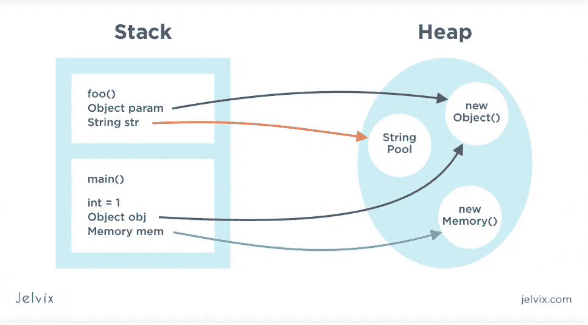](https://javarevisited.blogspot.com/2016/10/how-to-increase-heap-size-of-eclipse-OutOfMemoryError.html)

因此，在默认设置下，堆可以比堆栈占用更多的内存空间。但是，可以通过在增加堆大小后将其设置为低于堆栈值来手动更改这些设置。

堆栈有[后进先出](https://www.geeksforgeeks.org/lifo-last-in-first-out-approach-in-programming/)原则(最后进入，先离开)。每当引用元素或基元值调用新方法时，都会在堆栈顶部释放一块内存:

[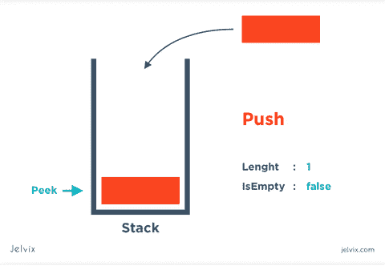](https://javarevisited.blogspot.com/2022/02/-stack-and-queue-data-structure-interview-questions.html)

与堆栈不同，堆不会自行清理。所以，系统急需一个[垃圾收集器函数](/javarevisited/7-best-courses-to-learn-jvm-garbage-collection-and-performance-tuning-for-experienced-java-331705180686)。没有它的存在，我们只能管理堆的大小:

[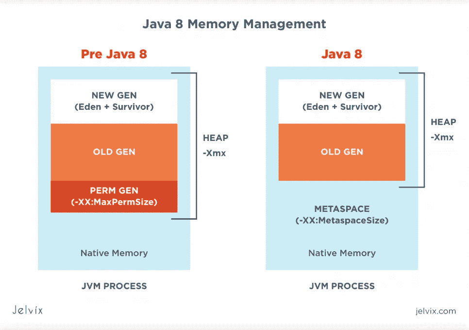](https://javarevisited.blogspot.com/2019/04/top-5-courses-to-learn-jvm-internals.html)

随着时间的推移，对可能包含堆栈变量的堆中对象的引用成为垃圾收集器的合适目标，这取决于其类型。并且，当红色的项出现在堆内存中时，它们可以被收集器组装起来。

**内存中垃圾项的例子:**

[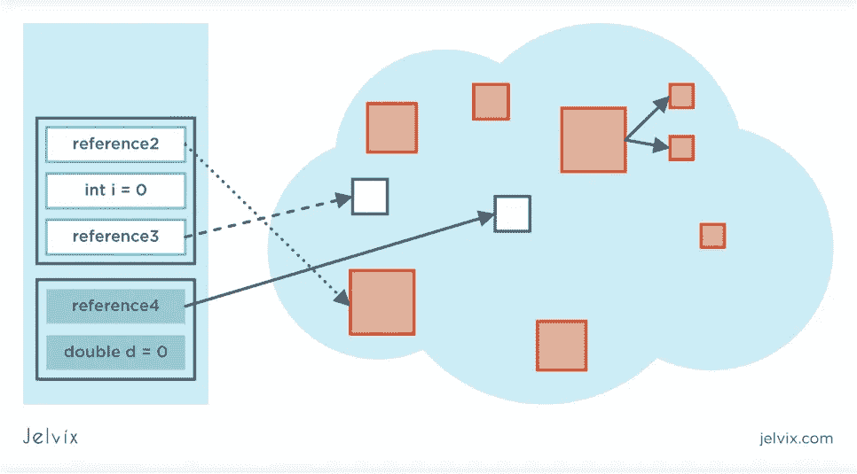](https://www.java67.com/2019/08/best-books-to-learn-java-virtual-machine-in-depth.html)

**2。内存泄漏**

[Java 内存泄漏](https://javarevisited.blogspot.com/2011/10/how-substring-in-java-works.html)是 GC 在系统中留下不使用的元素时的一种错误。这可能是因为无法移除堆栈中可能引用的一些垃圾项。

**典型的泄密例子:**

[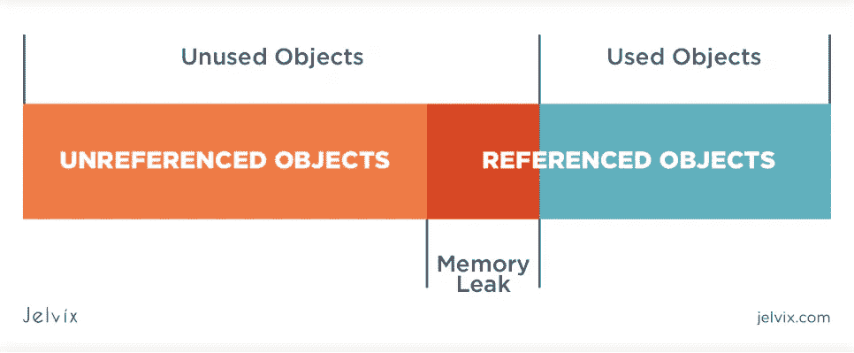](https://javarevisited.blogspot.com/2013/01/threadlocal-memory-leak-in-java-web.html)

这种泄漏对利用系统资源的能力及其整体生产率具有负面影响。如果忽略这个问题，系统会完全耗尽数据存储空间，并以一个不可逆的错误 [Java 内存不足错误](https://javarevisited.blogspot.com/2011/09/javalangoutofmemoryerror-permgen-space.html)结束。

最好使用内存管理工具来优化它。其中最相关的是:

*   惠普[OpenView Operations](https://www.hpe.com/us/en/integrated-systems/software.html)(OVO)；
*   [JMETER](https://jmeter.apache.org/) 由阿帕奇；
*   [IBM Tivoli](https://www.ibm.com/docs/en/sapm/7.7.0.1?topic=SSATHD_7.7.0/com.ibm.itm.doc_6.3fp2/itm63fp2_qsg_en.htm) 由 IBM；
*   [JProbe Profiler](https://www.techrepublic.com/article/jprobe-profiler-the-perfect-profiling-tool/) 由 TechRepublic 提供。

**3。Java 中内存泄漏的原因**

Java 中的内存泄漏可能是由于代码中不可预见的错误造成的，这些错误将对不需要的对象的引用保存在云中。这些链接阻塞了 GC 函数。因此，不可能清理存储库，这些元素不会有效地使用它。

**Java 内存泄漏的主要原因:**

*   无限缓存；
*   一个会话中文件溢出；
*   替换操作系统页面过多；
*   用户数据系统的缺陷；
*   在集合中插入元素而不删除它们；
*   不可复制的聆听方式。

# Java 中的内存泄漏及其类型

各种类型的泄漏都是可能的。它们的差异是基于它们是如何产生的以及是什么导致了它们。

最常见的泄漏类型:

**1。静态变量的过度使用**

Java 中静态字段的生命周期通常与应用程序会话时间相对应，没有考虑使用 [ClassLoader](https://www.baeldung.com/java-classloaders) 功能的垃圾收集。在命令执行期间分析内存堆时，我们可以观察到控制点 1 和 2 之间的内存增加:

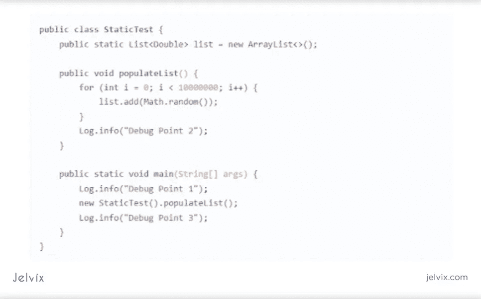

但是在 VisualVM 中的第 3 点停止方法 populateList()，堆存储库仍然没有得到处理。但是如果不考虑第 2 行中的静态，它将改变内存值:

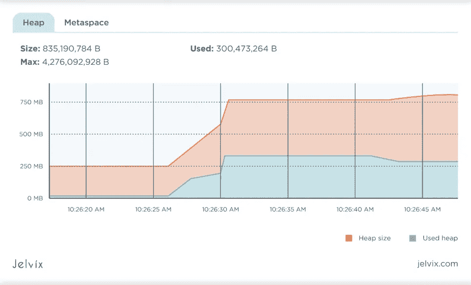

在这种情况下，在使用 populateList()方法进行操作后，收集器会清理堆内存，因为对对象的所有引用都被停用:

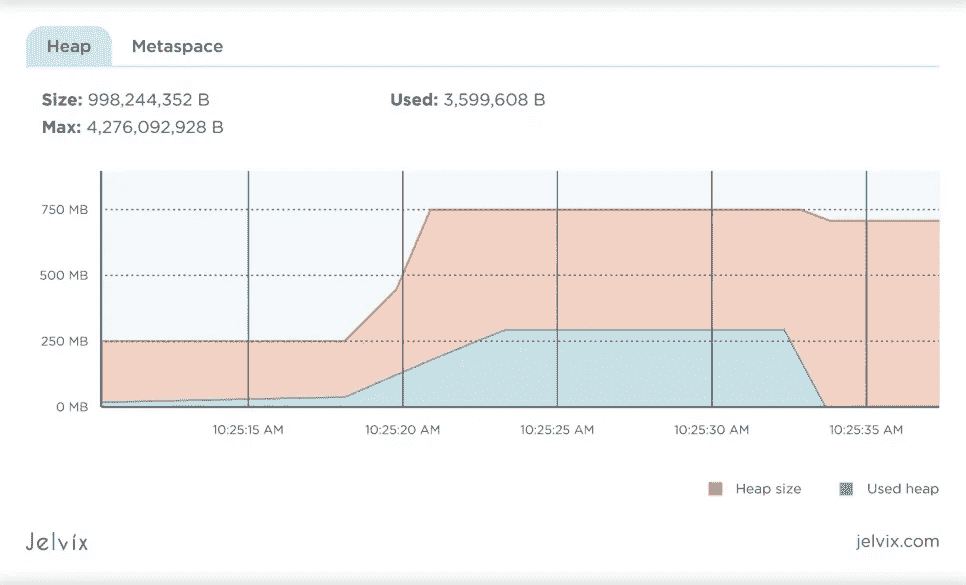

**2。参考外部的内部类的可用性**

为了初始化静态类，你总是需要来自外部类的例子。每个非静态默认类都包含一个对保存它的类的隐藏引用。如果使用内部类对象，即使关闭外部类对象，它也不会被 GC 收集。

例如，假设一个类包含一个非静态值，并且引用了几个体积元素。在这种情况下，内部类对象的创建有这样的统计指标:

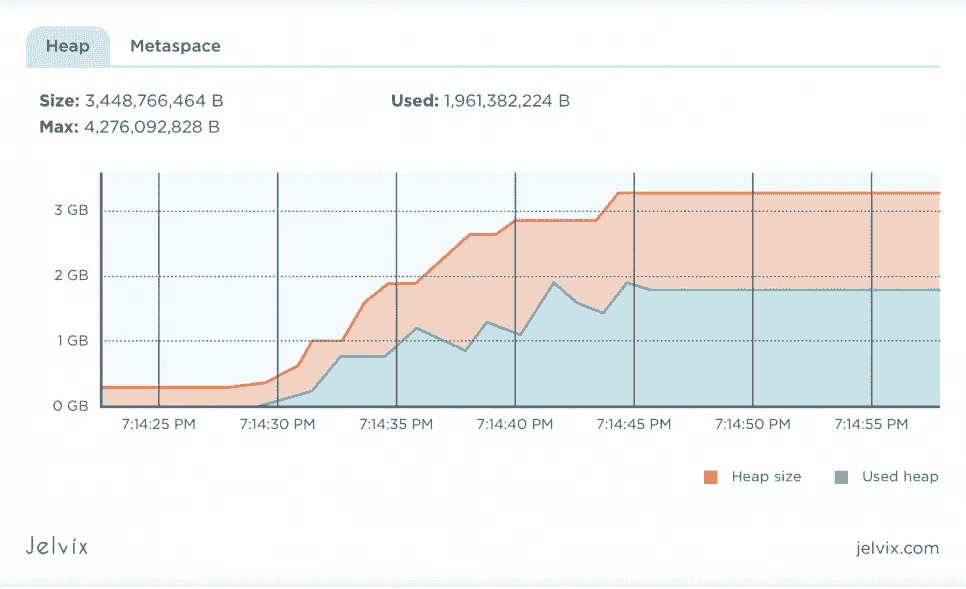

将内部或匿名类的值变为静态时，内存值会彻底改变。这可能是因为内部类的内容引用了外部对象，从而阻塞了 GC 的主要功能。

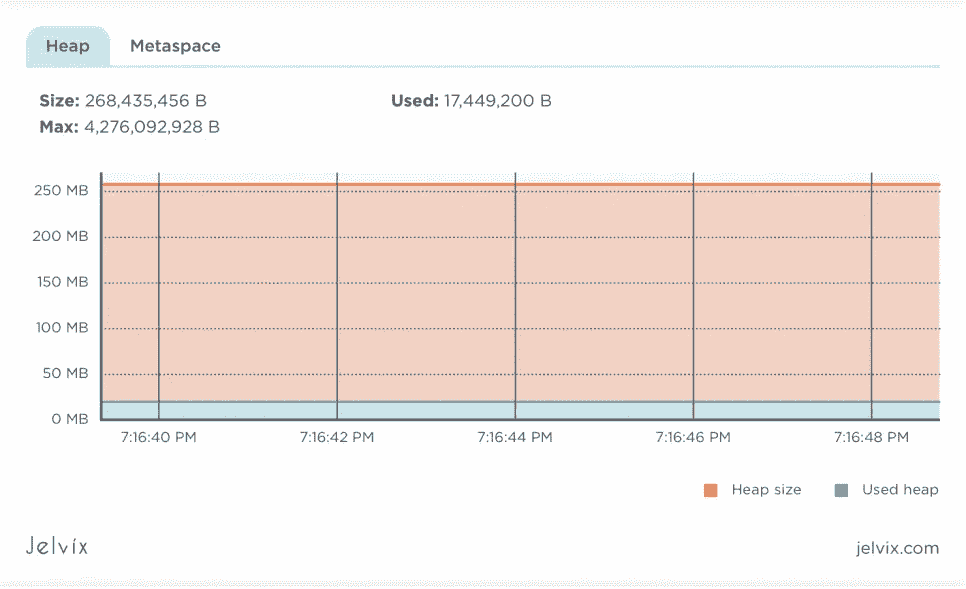

**3。app 中未关闭的资源**

每当我们创建一个新的连接或打开一个线程时，JVM 总是为新的线程或连接分配内存空间。这种连接可以具有带有综合数据库的会话对象。

如果我们不关闭这些资源，就有可能导致存储被阻塞。这造成了垃圾收集器无法检测和移除这些对象的风险。而如果你忽略了维护资源的稳定和正确关闭，它们就会填满内存，最多出现一个 Java 内存不足的错误。

**4。使用 finalize()方法**

在该方案中，当我们有一个具有重新定义的 finalize()方法的类时，它的对象可能不会及时收集 GC，而是会排队等待删除。此外，finalize()中被错误重写的代码及其与垃圾收集器的速度不匹配会导致错误 OutOfMemoryError。

例如，以一个具有重定义方法 finalize()的类为例，它需要时间。如果 GC 收集了大量的元素，那么就会形成这样一个堆分数:

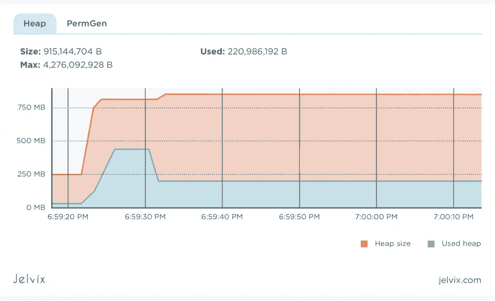

如果您简单地删除一个重新定义的 finalize()，您可以得到这个值:

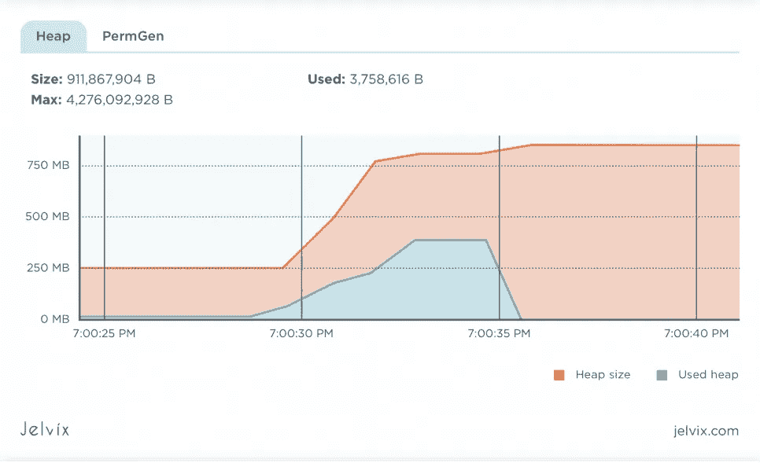

**5。使用实习字符串**

在 Java system version 6 中，有必要小心使用体积字符串。版本 7 将字符串池的更改从 PermGen 移到了 HeapSpace。如果您调用一个方法 intern()来读取一个大的字符串，它将被保存到常量内存的字符串池中( [PermGen](https://www.baeldung.com/java-permgen-metaspace) )。这个方法存储在 PermGen 中，直到会话结束，这会导致应用程序耗尽内存。

永久内存的一个例子是当读取一个文件的字符串而没有它的国际:

**6。ThreadLocals 接合**

[ThreadLocal](https://docs.oracle.com/javase/7/docs/api/java/lang/ThreadLocal.html) —通过关闭变量的值来创建流安全性的工具。同时，所有线程都有一个指向重复 ThreadLocal 变量的隐藏链接，并保存它们的副本，而不是使用所有线程中的资源。

这个特性除了有用之外，还有一些错误。如果使用不当，它们会影响泄漏。

ThreadLocal 变量必须在删除包含它们的线程后由 GC 收集。但是，某些系统服务器可能无法正确使用此功能。发生这种情况的原因是，服务器不是为所有请求创建一个新线程，而是应用整个线程池。

服务器中的池重用线程，使垃圾收集器无法访问它们，并占用内存。

**7。实现不正确的 equals()和 hashCode()**

在创建新类时，我们经常会遇到 equals()和 hashCode()方法的覆盖错误。HashSet 和 HashMap 通常使用这样的方法，如果它们包含覆盖错误，这可能会导致过多的内存消耗。

例如，您可以使用 [ORM Hibernate](https://hibernate.org/orm/) ，它采用 equals()和 hashCode()方法来处理项目并将它们存储在缓存中。如果这些方法没有被覆盖，Hibernate 将不会分析这些项，缓存将填充它们的副本，从而导致内存泄漏。

# 症状和 Java 内存泄漏检测

**1。内存泄漏症状**

有几个可疑点可能表明存在泄漏:

*   持续和不可预见的系统故障；
*   不稳定的应用程序功能支持；
*   长会话期间出现错误 Java . lang . out of memory error；
*   系统删除连接对象；
*   整体系统性能显著降低。

**2。如何检测 Java 内存泄漏**

为了检测泄漏，需要几种工具和技术，以及它们的组合。有一个可信方法的列表:

**2.1。** [**内存概要分析器**](https://developer.android.com/studio/profile/memory-profiler) —跟踪存储库中占用空间的文件和项目的工具。它们能够检测泄漏并分析系统中所用元素的正确分布。此外，估计处理时间。

分析 Java 内存最常用的工具:

*   EJ 技术公司的 JProfiler
*   甲骨文公司的 Java VisualVM
*   YourKit 有限公司生产的 Yourkit。

**2.2。订婚** [**堆垃圾场**](https://stackoverflow.com/questions/407612/how-to-get-a-thread-and-heap-dump-of-a-java-process-on-windows-thats-not-runnin) **。这是一个为 Java 内存存储中的堆创建即时快照的工具。需要这样的图像来控制所用对象的数量及其在内存中的权重。此外，该工具跟踪由系统创建的元素的数量以及可能影响泄漏的因素。**

**2.3。激活** [**详细垃圾收集**](https://www.ibm.com/docs/en/mon-diag-tools?topic=types-verbose-garbage-collection) **日志。**这个工具能够演示对存储库和 GC 中的堆配置的更改。它提供了应用程序最精确的特性和性能。并通过识别堆中合适的元素、替代方法和 JVM 参数来优化收集器的性能。

例如，使用 JVM 启动方法在 app 中激活详细收集:

-XX:+use serial GC-xms 1024m-xmx 1024m-verbose:GC

-verbose:gc 参数激活收集信息的记录。默认情况下，日志保存到 stdout，并为所有 GC 生成行。还可以使用-XX: +UseSerialGC 参数指定顺序 GC，并设置堆大小。

这有助于及时检测泄漏并配置应用程序健康指标。

GC 日志激活的例子可以在 GitHub 服务中找到。

# 如何修复内存泄漏？纠错方法

为了解决这个问题，有必要首先考虑它出现的原因。因此，有必要确定泄漏的类型，并根据其种类来解决问题。对于每种类型，在 Java 中有不同的修复内存错误的方案:

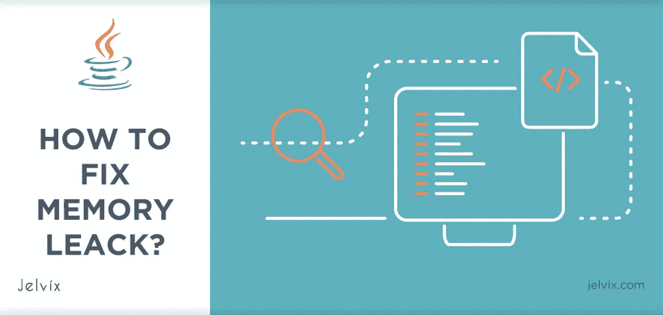

**1。如何解决内存错误？**

**1.1。使用静态变量时:**

尽量减少系统中静态字段的使用。在这种情况下，您可以使用延迟加载，而不是紧急加载对象。

**1.2。如果有内部类，参照外部:**

如果不需要外部类元素，可以将内部类转换为静态类。

**1.3。如果应用的资源没有关闭:**

最后应该及时激活完成资源的使用。

**1.4。使用 finalize()方法时:**

应该减少到零与决赛选手的任何工作。

**1.5。使用实习字符串时**

尝试将 Java 应用程序升级到最新版本。在第 6 版之后，这可以通过将字符串池移动到堆的空闲位置来实现。为了避免错误[内存不足错误](https://docs.oracle.com/javase/8/docs/technotes/guides/troubleshoot/memleaks002.html#:~:text=OutOfMemoryError%20exception.,heap%20cannot%20be%20expanded%20further.)，在处理批量字符串时，您可以扩展 PermGen 的大小。

**1.6。使用 ThreadLocals** 时

在不需要 ThreadLocal 变量时对它们进行稳定的清理。具有 remove()属性的 ThreadLocal 删除所有当前线程的变量值。必须在 finally 块中关闭它，以确保它被停用。

**1.7。当实现不正确的 equals()和 hashCode()**

当创建新元素时，最好重写 equals()和 hashCode()路径。

**2。消除内存泄漏的其他方法**

当不清楚内存泄漏发生的原因时，您还可以应用其他方法来防止内存泄漏。

**2.1。使用基准测试:**

对于 Java 中代码性能的详细分析，您可以使用它的基准测试。这样，通过比较不同执行任务方式的效率，就很容易评估它们的效率。这将优先考虑最佳实践，从而避免不必要的内存消耗。

**2.2。参考对象 app:**

在 Java 中应用特殊引用对象的选项，而不是直接引用应用程序中的元素。使用 java.lang.ref 包中包含的这种链接允许垃圾收集器简单地删除多余的对象。

**2.3。代码审查:**

平庸，但在某些情况下同样有效的方法——检查代码。有时它有助于一次性消除内存泄漏。

**2.4。启用分析:**

通过使用上述方法，您可以发现可用于存储应用程序资源的存储区域。

**2.5。详细垃圾收集:**

前面提到的另一种方式。包括这种模式，我们可以密切监视 GC 的工作。

遵守这些存储空间的规则并合理使用它，可以帮助消除产生 Java 后备编程和 Java 后备语言的情况。这是整个系统正常运行的基础。

**3。移除工具时出错:**

*   [Quest Foglight for Java](https://support.quest.com/technical-documents/foglight-for-java-ee-technologies/5.9.13/supported-platforms-and-servers) (用于堆监控)；
*   [MAT](https://www.vogella.com/tutorials/EclipseMemoryAnalyzer/article.html) (用于堆转储分析)。

正如研究 Java 的专家所报道的，在门户网站[Habr](https://habr.com/ru/post/324144/)——引用:

*"* *在找到并修复漏洞后，将所有步骤重复一遍，分析内存，并向* [*内存分析器*](https://www.eclipse.org/mat/downloads.php) *报告，以确保修复有所帮助，这不会是多余的。”*

要清楚地了解 Java 中的内存错误，可以在下面找到更多信息:

# 结论

因此，分析这个问题——什么是 Java 中的内存泄漏，很明显它会像疾病一样影响系统并恶化其整体状况。如果不治疗，会导致不可挽回的后果。由于这是一个非常严重的问题，尽管乍一看并不明显，但需要及时识别和解决。

如果在问题存在的最初迹象出现后很久才被发现，这个问题就不容易解决。没有一种神奇的药丸可以一次性修复漏洞，即使是在 Java 编程领域，也是如此。

但是，如果使用[应用](https://jelvix.com/services/mobile-app-development)始终包括使用经过验证的方法、概要分析、跟踪、Java 内存管理和代码验证，那么这类问题的出现就可以减少到零。

还有你在 Java 里遇到过内存泄漏吗？请在评论中分享你识别问题类型的经验和解决问题的方法！

[联系我们](https://jelvix.com/services/mobile-app-development)获取更多关于 Java 中内存泄漏的信息以及防止内存泄漏的操作策略。

*原载于*[*https://jelvix.com*](https://jelvix.com/blog/java-memory-leak)*。*