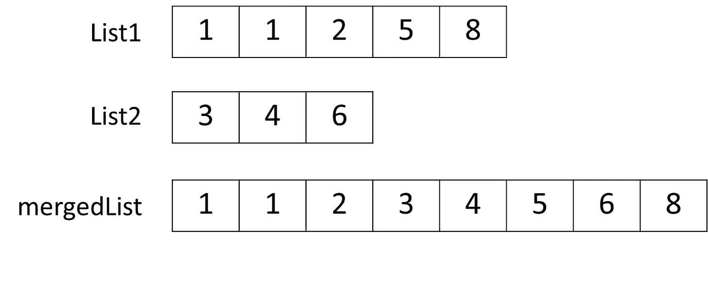

# 合并两个排序列表

> 原文：<https://medium.com/javarevisited/merge-two-sorted-lists-d7fa94b23f6f?source=collection_archive---------2----------------------->

给定两个排序列表，将它们合并成一个新的排序列表。

合并两个排序列表

# 解决办法

我们可以将两个列表合并成一个新列表，并应用一种排序算法，比如冒泡排序、插入或快速排序。我们要做的是实现一个新的算法，其性能为 [NlogN](https://codersite.dev/big-o-notation-analysis-of-algorithms/) 。

*   我们定义了一个新的列表，以排序的方式添加其他两个列表中的所有元素。