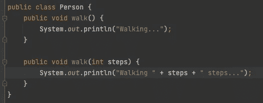
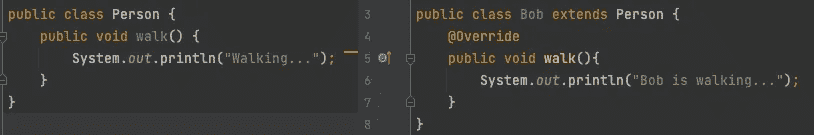

# Java 中的方法覆盖和重载

> 原文：<https://medium.com/javarevisited/method-overriding-and-overloading-in-java-5cdc99bbef0e?source=collection_archive---------2----------------------->

在 Java 中重写和重载一个方法有什么区别？这些东西是做什么用的？

方法重载是在一个类中提供两个或多个名称相同但参数不同的独立方法，例如不同的方法签名。方法返回类型可能不同，也可能不同，所以我们可以重用方法名。

使用方法重载的主要原因是为了减少重复的代码，并且不必记住多个方法名。

举个简单的例子，这里有一个 Person 类。如果我们既想让一个人行走，又想让他们走指定的步数，那该怎么办？我们可以重用方法名并放入一个 steps 参数，使 walk 方法可以带参数或不带参数使用，而不是像`walkSteps(int steps)`那样创建一个新方法。

Walk 方法重载

[方法重载](https://javarevisited.blogspot.com/2011/08/what-is-polymorphism-in-java-example.html)一般在类内使用，需要改变参数。

方法重写是指在子类中定义的方法已经存在于具有相同方法签名的父类中。在子类中，在方法签名上方使用了`@Overrride`注释，以提醒编译器使用该方法，而不是父方法。

例如，假设我们有一个可以行走的人类，而 Bob 是人的子类，也可以行走。要自定义 Bob 的 walk 方法，我们只需添加注释并添加自定义实现。

遍历方法被覆盖

[方法覆盖](http://www.java67.com/2012/08/what-is-method-overriding-in-java-example-tutorial.html)用于给出父类中已经提供的方法的自定义实现。如果需要，可以使用`super.methodName()`访问父方法。重写时，子方法必须使用与父方法相同的参数。