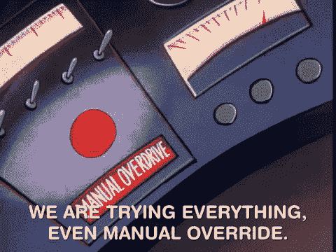
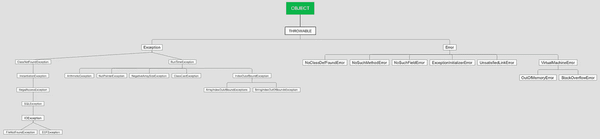

# java 中的方法覆盖

> 原文：<https://medium.com/javarevisited/method-overriding-in-java-6b1c9025f769?source=collection_archive---------8----------------------->

[](https://javarevisited.blogspot.com/2015/01/why-override-equals-hashcode-or-tostring-java.html)

方法覆盖

现在，这是 java 的一个重要话题，大多数新手都陷入了困境。即使他们知道什么是压倒一切的，他们也看不到这背后的概念或想法。所以在这里，我试图尽可能简单地解释它。

在面向对象编程中，有一种东西叫做坚实原则，它帮助程序员创建可理解、可读和可测试的代码。固体代表五个原则:

1.  [**年代**单一责任原则](https://javarevisited.blogspot.com/2017/04/single-responsibility-principle-example.html)
2.  O**笔闭合原理**
3.  **L** 伊斯科夫替代原理
4.  **I** 界面偏析原理
5.  **D** 依赖反转原理

现在，我们将解释开闭原则，该原则规定“**类应该对扩展开放，对修改**关闭”。这意味着什么？这意味着我们可以将超类的属性继承给子类，但是我们不能修改现有的类。就像我们修改或改变类的属性一样，影响范围可能是巨大的，这需要大量的调试和消磨时间。简而言之，我们可以说，我们可以添加新的功能，而不会触及或破坏现有的功能。编写一个子类并为其提供实现总是更好。

现在在你的脑海中出现了另一个问题，为什么我们需要子类？写它的目的是什么？可以为以下目的编写子类:

1.  添加新功能。
2.  修改现有的功能。
3.  继承现有的功能。

所以在方法重写中，我们将看到所有这些是如何工作的。当涉及到重写方法时，有一些规则。

1.  子类方法名应该与超类方法名相同。
2.  方法的参数(即类型、顺序和参数数量)必须与超类方法参数相同。
3.  子类方法的返回类型必须与超类相同。
4.  当涉及到方法中的访问修饰符时，子类必须是相同的或更高的访问修饰符。
5.  如果超类方法是静态的，那么我们只能在子类中用 static 重写。



例外的雇佣关系

现在，当涉及到异常时，您应该知道在重写方法时特定异常的层次结构。当超类方法抛出某个**检查异常**时，子类方法将做如下所述的事情:

1.  忽略方法级异常
2.  子类可以抛出与超类相同的异常
3.  子类方法可以抛出任何未检查的异常。
4.  从超类向子类抛出异常的层次结构只是从高到低。

当超类方法抛出未检查的异常时，

1.  忽略方法级异常
2.  子类可以抛出与超类相同的异常
3.  它可以抛出任何其他未检查的异常。
4.  它可以抛出任何检查过的异常。

现在让我们试着执行一些代码，以便理解如何在 java 中实现方法覆盖。

```
class Overriding {
    public static void main(String[] args) {
        System.out.println("Hello, this is going to override!");
        new React().show();
        System.out.println(new React().show());

    }
}

class JS{
    int show(){
        return 2;
    }
}

class React extends JS{
    int show(){
        return 4;
    }
}
```

```
java -cp /tmp/M2Ak9TdNc5 Overriding
Hello, this is going to override!
4
```

那么这里发生了什么？实际上，我们有三节课:

1.  重写代码执行的地方，这是主类。
2.  JS——它包含一些我们将在类内覆盖的行为 React。
3.  React —这里我们继承了 JS 类的行为，并对其进行了修改。

现在是重写类，JVM 从 main 方法启动并执行代码，并打印第一行，如上面的终端“ ***你好，这将重写*** ”所示。在下一行中，它创建了一个子类的对象，并为该对象调用了方法。这就是为什么它在控制台中打印 **4** 而不是 2。

我希望你明白这个主题，如果你有任何困惑，请告诉我，以便我可以用一些更具互动性的例子来更深入地解释它。更多类似的话题，请关注，如果你喜欢这些内容，请鼓掌。敬请期待！

