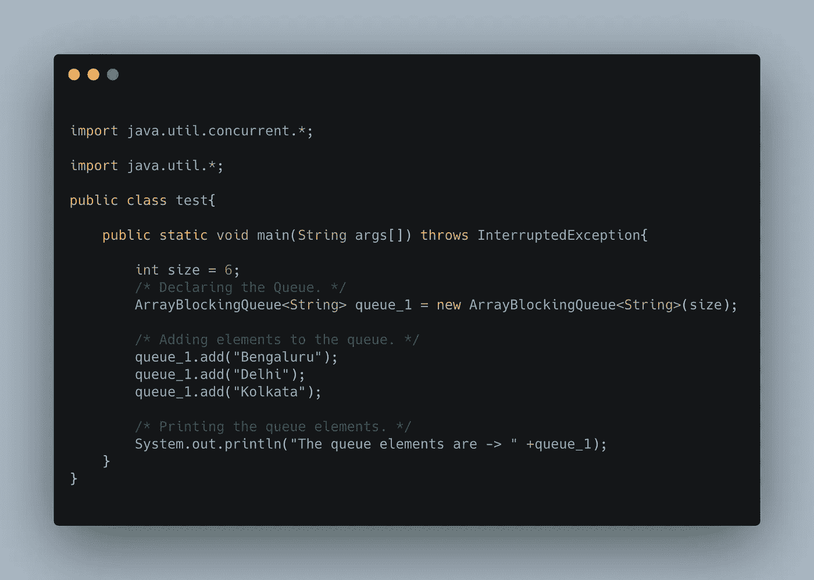
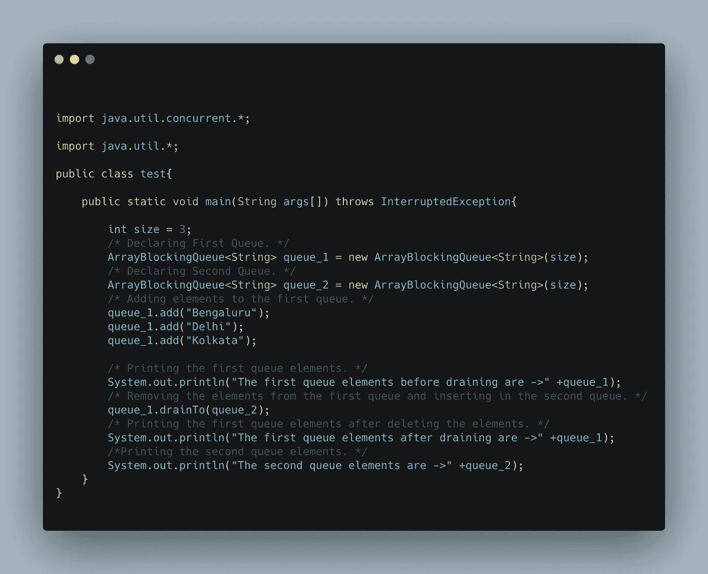
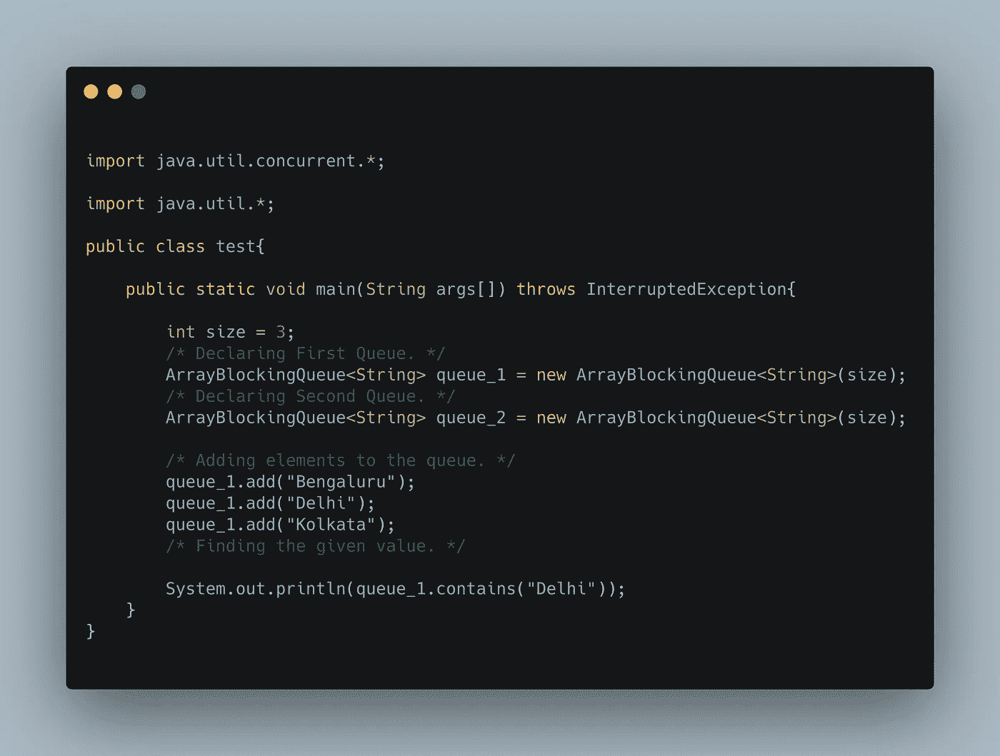
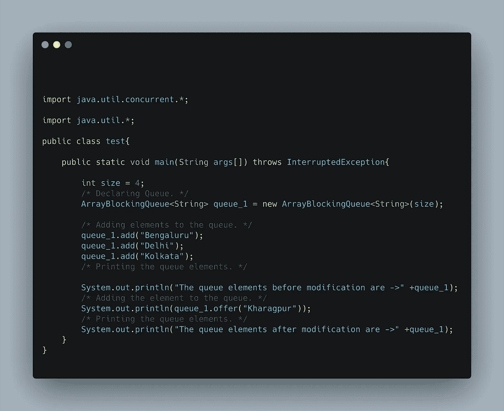
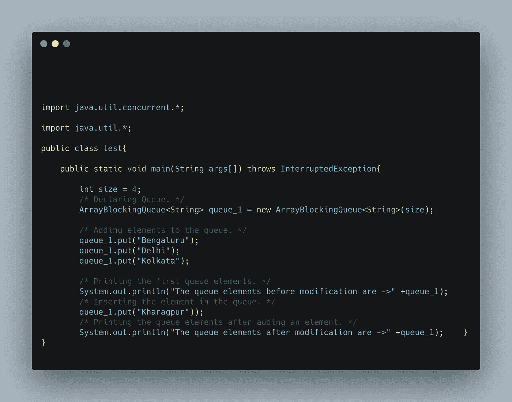
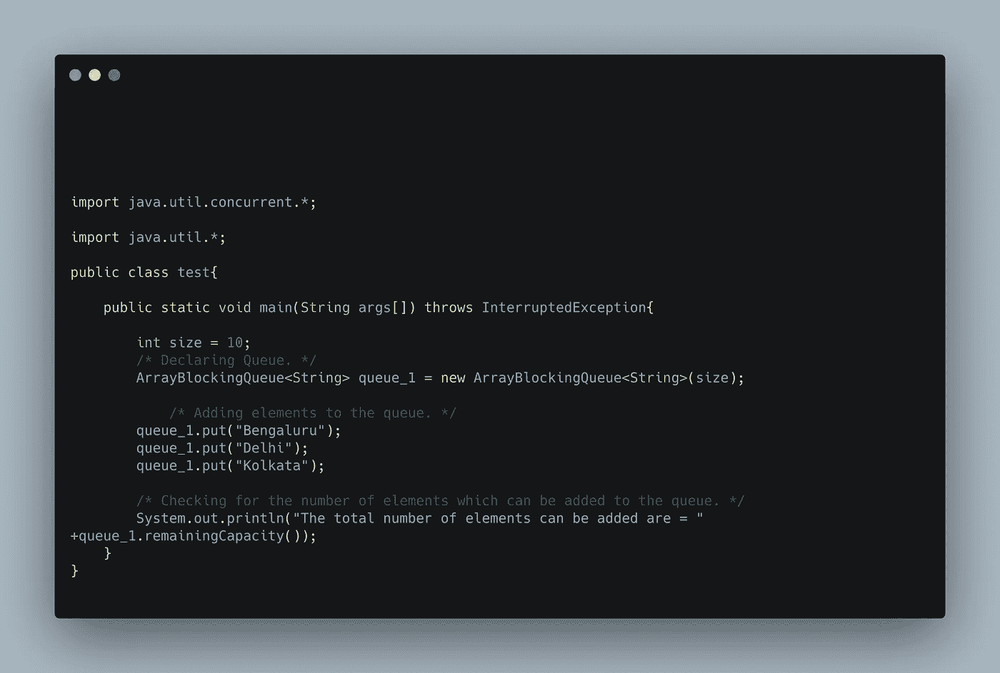
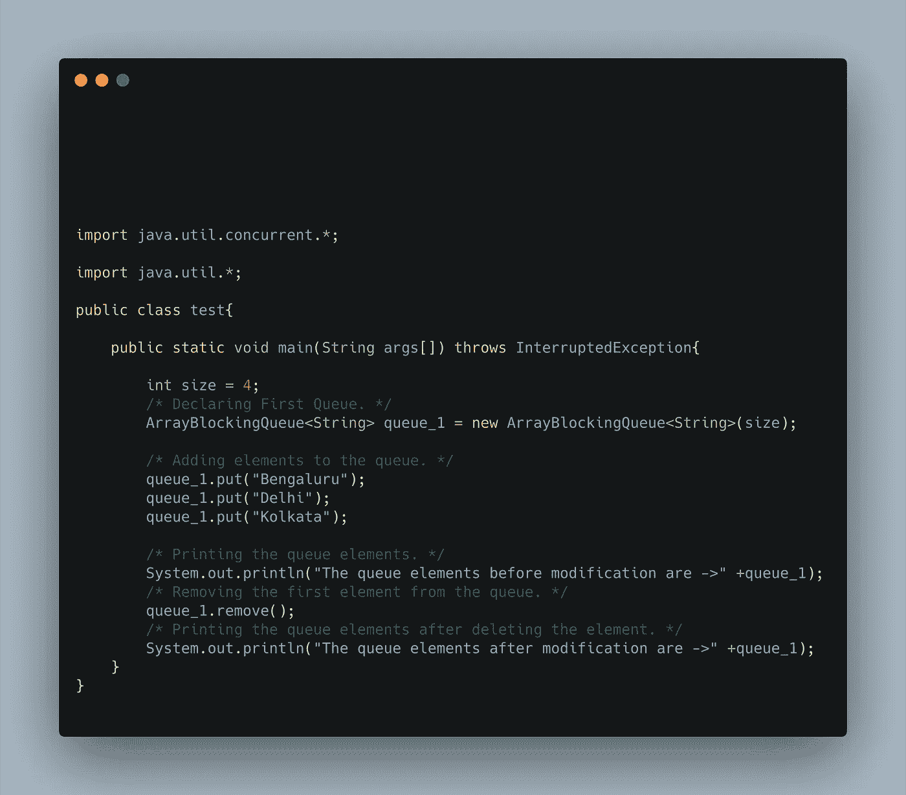
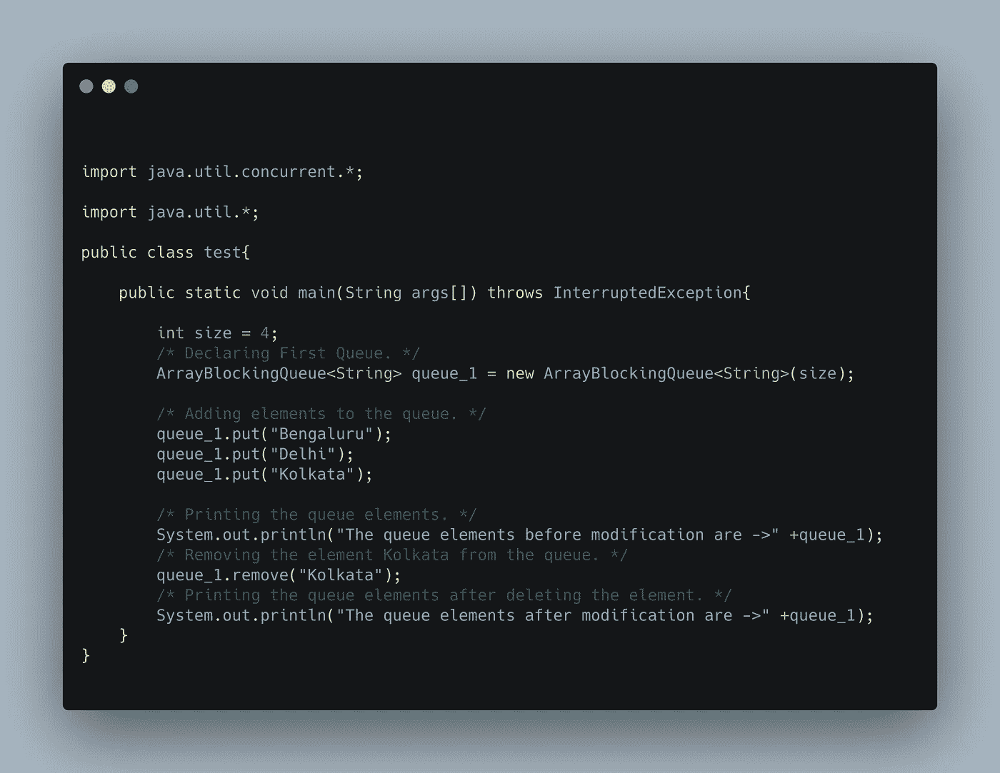
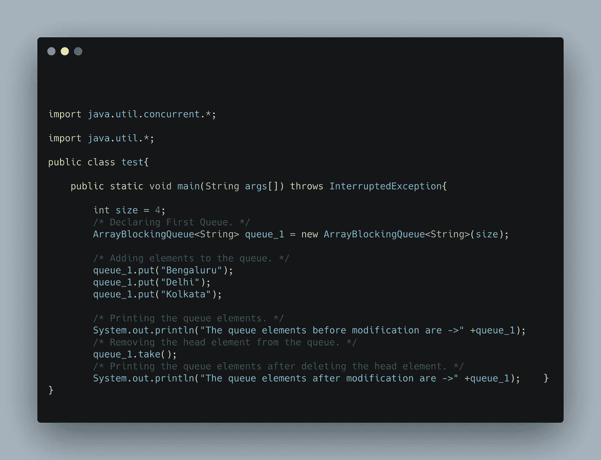

# 阻塞队列接口的方法

> 原文：<https://medium.com/javarevisited/methods-in-blocking-queue-interface-a1ffa2c07fe2?source=collection_archive---------2----------------------->

读者们好，

我带着我的关于常用于阻塞队列接口的**方法的新文章回来了，并对它们有了更多的了解！**

**与** [**阻塞队列相关的方法**](https://www.java67.com/2015/12/producer-consumer-solution-using-blocking-queue-java.html) **:** 阻塞队列接口有多种方法，下面介绍几种:-

**1。add(Value)方法:**阻塞队列中的 add(Value)方法用于将一个元素插入到阻塞队列中，这是在数组阻塞队列中可以看到的最简单的实现，其中元素的插入和删除都很容易，而且元素的插入只发生在数组阻塞队列中有空位的时候，如果[数组阻塞队列](https://javarevisited.blogspot.com/2012/12/blocking-queue-in-java-example-ArrayBlockingQueue-LinkedBlockingQueue.html#axzz6i534L5Aj)中没有空位，那么系统等待队列为数组阻塞队列中的新元素腾出位置。它是一个布尔类型修饰符。给定方法的示例如下所示:

代码片段 1.1:向阻塞队列添加元素的代码示例

**上述代码的输出将是:第一个队列元素是->【Bengaluru，Delhi，Kolkata】**

**2。drainTo(Queue Name)方法:**drain to(Queue Name)方法用于将第一个数组阻塞队列的内容移动到另一个数组阻塞队列，或者我们可以简单地说，该方法删除第一个数组阻塞队列的内容，并将其插入第二个数组阻塞队列，并使第一个数组阻塞队列为空。给定方法的示例如下所示:

代码片段 2.2:将元素从一个队列移至另一个队列的代码示例

**上述代码的输出将是:清空前的第一个队列元素是- >【孟加拉鲁、德里、加尔各答】
清空后的第一个队列元素是- > []
第二个队列元素是- >【孟加拉鲁、德里、加尔各答】**

**3。contains(Value)方法:**contains(Value)方法用于检查数组阻塞队列中的特定元素，如果元素存在，则返回或打印“真”值，否则返回或打印“假”值。它是一个[布尔型修饰符](https://javarevisited.blogspot.com/2018/05/3-ways-to-convert-string-to-boolean-in.html)。给定方法的示例如下所示:

代码片段 3.3:检查队列中元素的代码示例

**上述代码的输出将是:True**

**4。drainTo(队列名，值的数量)方法:**drain to(队列名，值的数量)方法用于将第一个数组阻塞队列的一定数量的值或内容移动到另一个数组阻塞队列中，或者我们可以简单地说，该方法删除第一个数组阻塞队列的特定数量的值或内容，并将其插入第二个[数组阻塞队列](https://www.java67.com/2015/12/producer-consumer-solution-using-blocking-queue-java.html)。给定方法的示例如下所示:

代码片段 4.4:将第一个元素从一个队列移至另一个队列的代码示例

**上述代码的输出将是:清空前的第一个队列元素是->【Bengal uru，Delhi，Kolkata】
清空后的第一个队列元素是->【Delhi，Kolkata】
第二个队列元素是->【Bengal uru】**

**5。offer(Value)方法:**offer(Value)方法用于将一个特定的值插入到数组阻塞队列中，当队列中有空间容纳要插入的元素时，它返回或打印“True ”,否则它将打印或返回“False ”,新元素无法插入到队列中。给定方法的示例如下所示:

代码片段 5.5:在队列中添加元素的代码示例

**上面代码的输出是:修改前的队列元素是->【Bengal uru，Delhi，Kolkata】
True
修改后的队列元素是->【Bengal uru，Delhi，Kolkata，Kharagpur】**

**6。put(Value)方法:**如果有可用空间，put(Value)方法用于将给定值插入队列，否则系统等待队列中创建空间。它是空的类型。给定方法的示例如下所示:

代码片段 6.6:如果有剩余空间，则在队列中添加元素的代码示例

**上述代码的输出将是:修改前的队列元素是->【Bengal uru，Delhi，Kolkata】
修改后的队列元素是->【Bengal uru，Delhi，Kolkata，Kharagpur】**

**7。remainingCapacity()方法:**remaining capacity()返回或打印可以添加到队列中的新元素的数量，以完全填满队列，并且队列中没有剩余空间。给定方法的示例如下所示:

代码片段 7.7:检查队列空间的代码示例

**上面代码的输出是:可以添加的元素总数= 7**

**8。remove()方法:**remove()方法用于删除队列中的元素，该方法从前面删除队列中的元素，即首先插入队列的元素首先被删除。它是空的类型。给定方法的示例如下所示:

代码片段 8.8:从队列中移除第一个元素的代码示例

**上面代码的输出会是:修改前的队列元素是- >【孟加拉鲁鲁，德里，加尔各答】
修改后的队列元素是- >【德里，加尔各答】。**

**9。remove(Value)方法:**remove(Value)方法用于从队列中删除给定的元素，这个方法只从队列中删除给定的元素，不管它位于给定队列中的什么位置。给定方法的示例如下所示:

代码片段 9.9:从队列中移除特定元素的代码示例

**上面代码的输出是:修改前的队列元素是- >【孟加拉鲁鲁，德里，加尔各答】
修改后的队列元素是- >【孟加拉鲁鲁，德里】**

**10。take()方法:**take()方法用于从给定的队列中删除第一个或头元素。给定方法的示例如下所示:

代码片段 10.10:从队列中移除第一个元素的代码示例

**上面代码的输出是:修改前的队列元素是->【Bengal uru，Delhi，Kolkata】
修改后的队列元素是->【Delhi，Kolkata】。**

**不断学习，不断成长，不断探索！**

**万事如意！**

更多有趣和信息丰富的文章和提示，请关注我的<https://swapnilkant11.medium.com/>****和**[**Linkedin**](https://www.linkedin.com/in/swapnil-kant-279a3b148/)**