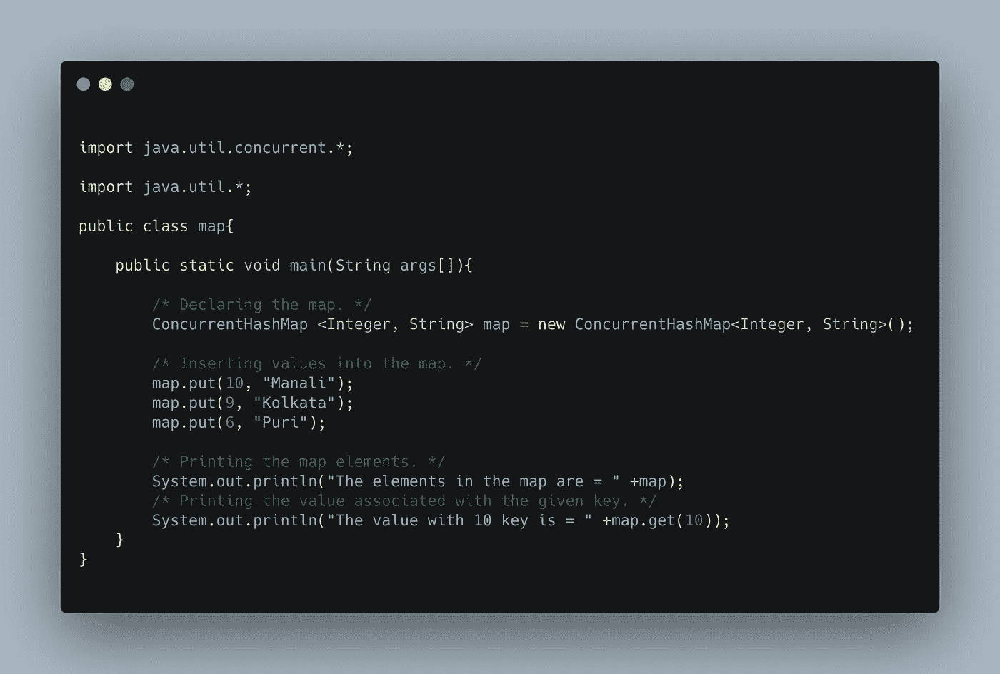
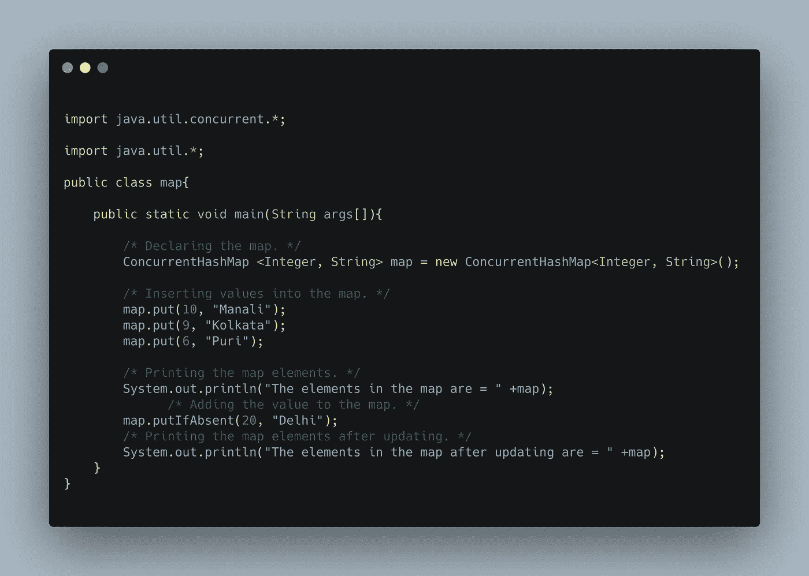
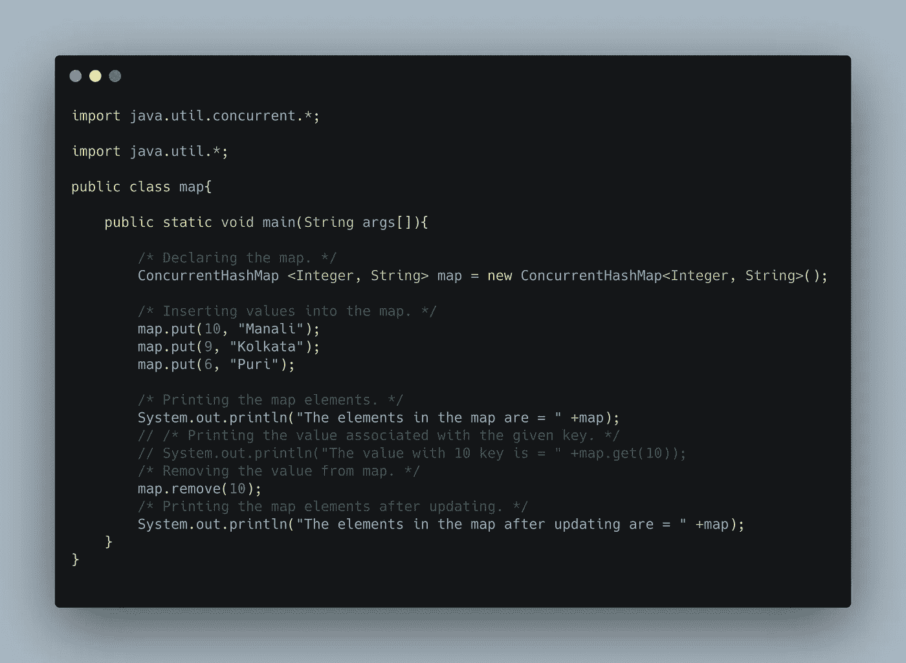
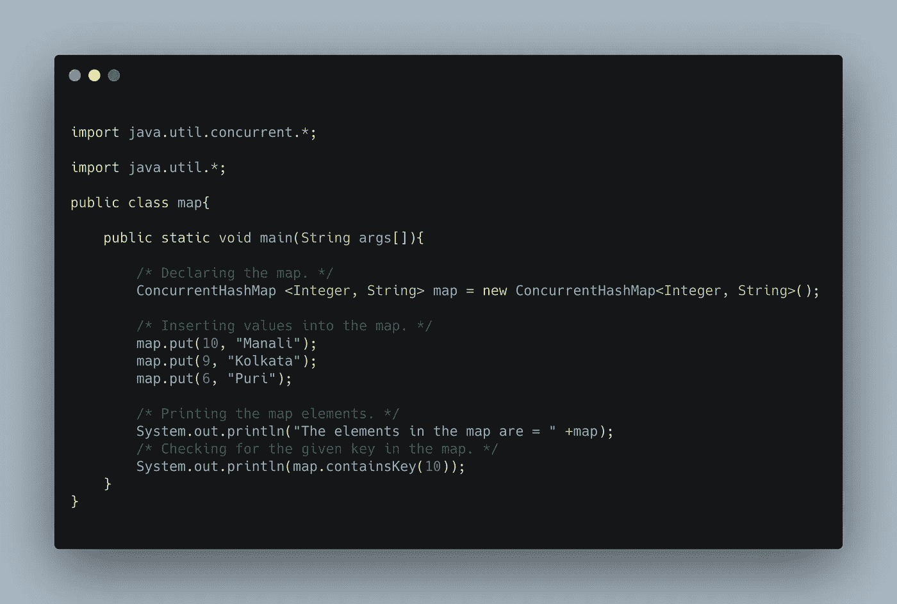
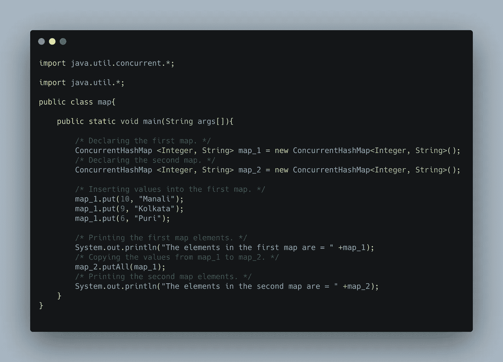
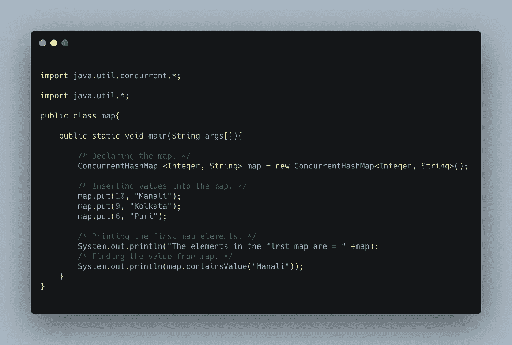
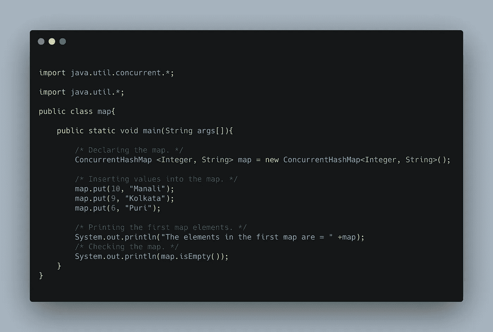
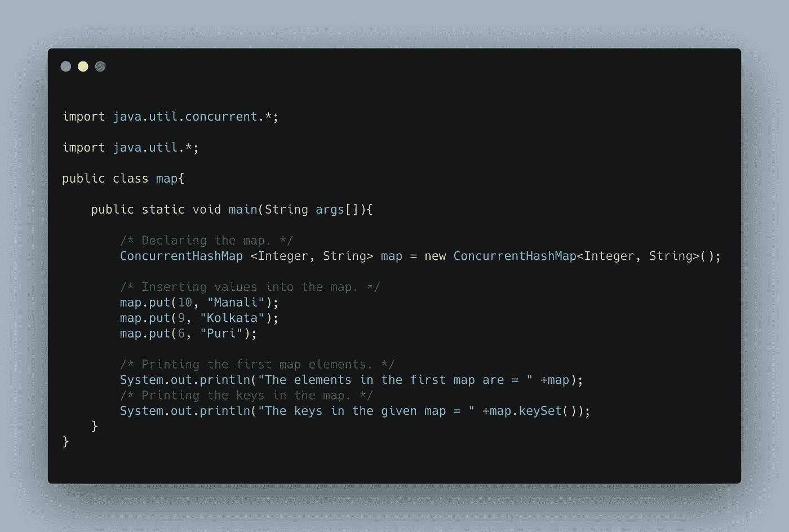

# 并发 HashMap 中的方法

> 原文：<https://medium.com/javarevisited/methods-in-concurrent-hashmap-659d60b31328?source=collection_archive---------3----------------------->

读者们好，

我带着我的关于在 java 并发 hashmap 中经常使用的**方法的新文章回来了，并且对它们有了更多的了解！**

首先，让我们了解一下[什么是散列表](https://www.java67.com/2017/08/top-10-java-hashmap-interview-questions.html)以及它们是如何在 java 中实现的。

**定义:**并发 HashMap 可以定义为以一个表的形式存储用户数据的映射，这个表有一个唯一的键和它对应的数据以及下一个数据的引用，这样即使在运行时，用户也可以根据自己的需要删除、添加或修改数据。它可以由于不断增加的散列冲突而自我变异，并且具有 O(n)的时间复杂度。

**并发哈希表中的重要方法:**有各种各样的方法与[并发哈希表](https://www.java67.com/2020/02/25-examples-of-concurrenthashmap-in-java.html)相关，下面描述了其中一些方法的正确实现:

**1。put(key，value)方法:**`put(key, value)`方法用于将给定值插入到映射中相应的键中，每个值都有其唯一的键。如果不同的值有相同的键，那么第一个插入的值将被下一个具有相同键的值替换。它有两个参数 key 和要插入到映射中的值。示例如下:

代码片段 1.1:如何向地图添加元素的代码示例

**上述代码的输出将是:地图中的元素为={6=Puri，9=Kolkata，10=Manali}。**

**2。get(key)方法:**get(key)方法用于返回或打印与作为参数接受的给定键值映射或关联的值。下面是一个例子:

代码片段 2.2:关于如何使用键找到映射元素的代码示例

**上面代码的输出是:map 中的元素为= {6=Puri，9=Kolkata，10 =Manali }
key 为 10 的值为= Manali。**

**3。putIfAbsent(key，value)方法:**putIfAbsent(key，value)用于在映射中插入或映射带有相关键的值，如果要插入带有键的值，而相同的键已经插入到映射中，则值不会插入到映射中，而如果键值是唯一的，值可能重复也可能不重复，则值成功插入到映射中。示例如下所示:

代码片段 3.3:如何更新地图的代码示例

**上面代码的输出是:地图中的元素为= { 6 =普里，9 =加尔各答，10 =马纳里}
更新后的地图中的元素为= { 20 =德里，6 =普里，9 =加尔各答，10 =马纳里}。**

**4。remove(key)方法:**`remove(key)`方法从映射中删除与作为参数传递的键相关联的值，或者甚至可以返回从用户定义的变量中的映射中删除的值，如果没有与给定键相关联的值，则返回 null 或先前的值。示例如下所示:

代码片段 4.4:如何使用键从映射中删除给定值的代码示例

**上述代码的输出为:地图中的元素为= { 6 =普里，9 =加尔各答，10 =马纳里}
更新后的地图中的元素为= { 6 =普里，9 =加尔各答}。**

**5。containsKey(key)方法:**contains key(key)方法用于检查给定的键在映射中是否存在，如果存在，则该方法返回 true，否则返回 false。示例如下所示:

代码片段 5.5:关于如何使用键检查映射中的元素的代码示例

**上面代码的输出是:map 中的元素= {6=Puri，9=Kolkata，10=Manali}
True。**

**6。putAll(映射名)方法:**putAll(映射名)方法将所有的值和与之相关的键复制到用户定义的另一个映射中，而不删除第一个映射或复制值的映射中的值。示例如下所示:

代码片段 6.6:如何将所有元素从一个地图复制到另一个地图的代码示例

**上面代码的输出是:第一个 map 中的元素是= {6=Puri，9=Kolkata，10=Manali}
第二个 map 中的元素是= {6=Puri，9=Kolkata，10=Manali}**

**7。containsValue(value)方法:**如果给定的值被映射到表中，containsValue(value)方法返回 true，否则返回 false。示例如下所示:

代码片段 7.7:关于如何在不使用键的情况下从映射中检查元素的代码示例

**上面代码的输出是:map 中的元素= {6=Puri，9=Kolkata，10=Manali}
True。**

**8。isempty()方法:**如果给定的表为空，isempty()方法返回 true，否则返回 false。示例如下所示:

代码片段 8.8:如何检查空地图的代码示例

**上面代码的输出是:map 中的元素= {6=Puri，9=Kolkata，10=Manali}
False。**

9。keySet()方法:keySet()方法返回存在于映射中的完整的键集合，类似地，人们可以使用 values 方法只获得存在于映射中的值集合。示例如下所示:

代码片段 9.9:显示地图所有键的代码示例

**上面代码的输出是:map 中的元素= {6=Puri，9=Kolkata，10=Manali}
给定 map 中的键= [6，9，10]**

这就是关于并发 hashmap 的全部内容，它的方法继续探索 java 中的并发 hashmap。

继续学习，继续成长，继续探索！

**万事如意！**

更多有趣和信息丰富的文章和提示请关注我的 [**中型**](https://swapnilkant11.medium.com/) **和** [**Linkedin**](https://www.linkedin.com/in/swapnil-kant-279a3b148/)