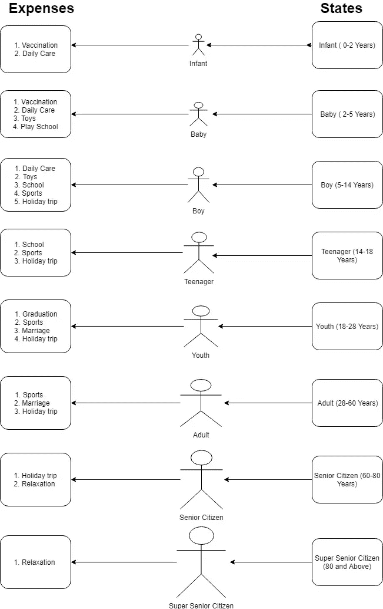

# 状态设计模式和策略设计模式的设计差异

> 原文：<https://medium.com/javarevisited/micro-biology-of-state-and-strategy-design-pattern-2add63460ab7?source=collection_archive---------3----------------------->

我们都知道状态和策略模式被归类在行为设计模式下。其中对象保持不变，但是行为根据上下文和操作类型而改变。现在，让我们理解这两种设计模式及其微观生物学差异。

**状态模式:**当对象根据内部状态改变其行为时，使用状态模式。对象在运行时部分改变其类型或行为是一种干净的方式。

**策略模式:**策略模式又称为 ***策略模式。*** 当一个特定的对象有多个算法或计算，并且上下文实现是在运行时决定的时候使用。

[](https://javarevisited.blogspot.com/2018/02/top-5-java-design-pattern-courses-for-developers.html)

战略

# 两种设计模式之间的差异与实时用例。

让我们以人类的生命周期为例。

我们都知道当我们一年比一年老的时候。我们在生活中会遇到许多状态，在每个状态下我们会执行不同的任务。

让我们以各种状态为例

1.  婴儿(0-2 岁)
2.  婴儿(2-5 岁)
3.  男孩(5-14 岁)
4.  青少年(14-18 岁)
5.  青年(18-28 岁)
6.  成人(28-60 岁)
7.  老年公民(60-80 岁)
8.  超级老年人(80 岁及以上)

让我们完成各种任务

1.  接种疫苗
2.  日托
3.  玩具
4.  运动
5.  游戏学校
6.  学校
7.  毕业
8.  结婚
9.  假日

现在，我们已经确定了需要执行的状态和任务。在如下所示的简单图表中，我们可以很容易地[区分状态和策略模式](http://javarevisited.blogspot.sg/2014/04/difference-between-state-and-strategy-design-pattern-java.html)。

[](https://medium.com/swlh/5-free-object-oriented-programming-online-courses-for-programmers-156afd0a3a73)

# 用于计算人员运行时费用的策略模式的实现。

**ApplicationRun.java**，用来充当应用的入口点。

```
package org.nbk.designpattern.behavioural.strategy.example;public class **ApplicationRun** {public static void main(String[] args) {
        LifeCycleStrategy lifeCycleStrategy = new Infant();
        LifeCycleStrategyContext lifeCycleStrategyContext = new LifeCycleStrategyContext(lifeCycleStrategy);
        lifeCycleStrategyContext.getExpenses();
    }
}
```

我们创建一个接口**LifeCycleStrategy.java**，它拥有一个人的每个**生命周期**的公共行为。

```
package org.nbk.designpattern.behavioural.strategy.example;public interface **LifeCycleStrategy** {
   public void getExpenses();
}
```

我们创建一个上下文类**LifeCycleStrategyContext.java**，它是我们的**生命周期策略**接口的集合。本课程将帮助注入用于计算费用的年龄类别类型。

```
package org.nbk.designpattern.behavioural.strategy.example;public class **LifeCycleStrategyContext** {

    private LifeCycleStrategy lifeCycleStrategy;

    public LifeCycleStrategyContext(LifeCycleStrategy lifeCycleStrategy){
    this.lifeCycleStrategy = lifeCycleStrategy;
    }

    public void getExpenses() {
    lifeCycleStrategy.getExpenses();
    }
}
```

最后，我们有一个具体的类，它将帮助我们得到费用。在我们的例子中，我想计算一个婴儿的费用。

**Infant.java**实现**LifeCycleStrategy.java**接口，获取婴儿生命周期的所有常见行为。

```
package org.nbk.designpattern.behavioural.strategy.example;public class Infant implements **LifeCycleStrategy** {@Override
    public void getExpenses() {
        System.out.println(" Expenses of Infants");
        System.out.println(" 1\. Vaccination");
        System.out.println(" 2\. Day Care");
    }
}
```

# 实现状态设计模式以获取年龄类别组的生命周期。

**ApplicationRun.java**曾经充当应用的入口点。

```
package org.nbk.designpattern.behavioural.state.example;public class **ApplicationRun** {public static void main(String[] args) {LifeCycleState lifeCycleState = new Infant();
        LifeCycleStateContext lifeCycleStateContext = new LifeCycleStateContext();
        lifeCycleStateContext.setLifeCycleState(lifeCycleState);
        lifeCycleStateContext.getLifeCycle();
    }
}
```

我们创建了一个接口**LifeCycleState.java**，它有共同的行为来识别生命周期。

```
package org.nbk.designpattern.behavioural.state.example;public interface **LifeCycleState** {
    public void getLifeCycle(LifeCycleStateContext ctx);
}
```

我们创建一个名为 LifeCycleStateContext.java**的 **StateContext** 类。context 类通过**life cycle estate**接口聚合。上下文使用构造函数在**运行时**设置**生命周期**的类型。 **getLifeCycle** 方法有助于获取具体**life cycle estate**的生命周期。**

```
package org.nbk.designpattern.behavioural.state.example;public class **LifeCycleStateContext** {private LifeCycleState lifeCycleState;public LifeCycleStateContext() {}public void setLifeCycleState(LifeCycleState lifeCycleState) {
        this.lifeCycleState = lifeCycleState;
    }public LifeCycleStateContext(LifeCycleState lifeCycleState) {
        this.lifeCycleState = lifeCycleState;
    }public LifeCycleState getLifeCycleState() {
        return lifeCycleState;
    }
    public void getLifeCycle() {
        lifeCycleState.getLifeCycle(this);
    }
}
```

最后，我们有子具体类**Infant.java**，它实现了我们的**LifeCycleState.java**接口来定义上下文的生命周期。

```
package org.nbk.designpattern.behavioural.state.example;public class **Infant** implements **LifeCycleState**{@Override
    public void getLifeCycle(LifeCycleStateContext ctx) {
        System.out.println("I am an Infant");
    }
}
```

# 状态模式与战略模式

这两种模式是相似的，但是这两种模式之间的思想略有不同。

**策略模式定义了一系列可互换的算法**，即该模式可用于任何种类的**计算或算法。**然而，在**状态模式中，行为完全根据实际状态而改变。**

在策略模式中，**客户端应该知道要使用的策略类型，并明确地更改**。鉴于，**每个状态被一个接一个地链接，以创建状态模式中有限状态机**中定义的流。

# 结论

**状态模式:** It 当开发人员想要**避免原始 if/else 语句时非常有用。**取而代之的是，**提取逻辑来分离类**，并让我们的**上下文对象将行为委托给状态类中实现的**方法。此外，我们可以利用状态之间的转换，其中一个状态可以改变上下文的状态。

**策略模式:**很棒当我们有**多种方式来执行同一个任务** **(在软件语言中当我们有多种算法来执行同一个操作)**时，我们应该考虑实现策略模式。通过使用这种模式，**我们可以自由添加/删除算法，因为这些算法的切换对应用程序来说是不透明的**。