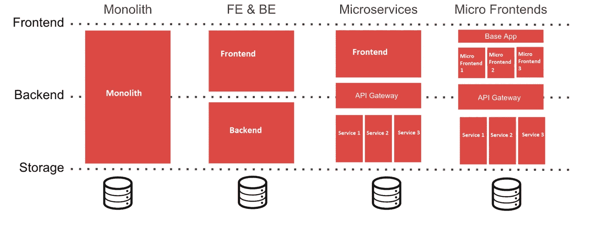

# 微前端…软件开发的未来

> 原文：<https://medium.com/javarevisited/micro-frontends-future-of-software-development-e4cc1c386523?source=collection_archive---------0----------------------->

近年来，[微服务](/javarevisited/8-best-online-courses-to-learn-service-oriented-soa-and-microservices-architecture-94c01d6b94e6)越来越受欢迎，许多组织使用这种架构风格来避免大型整体后端的限制。

现在，出现了将前端模块分解成更小、更简单的模块的模式，这些模块可以被开发、测试和部署。

一种架构风格，其中可独立交付的前端应用程序被组合以构建目标应用程序

微前端更小，更内聚，可维护的代码库，后台有 [REST API](/javarevisited/10-best-java-web-services-rest-soap-and-api-courses-for-beginners-724a8f51298d) 。

[](https://javarevisited.blogspot.com/2019/08/top-5-online-training-courses-to-learn-frontend-web-development.html)

**建筑风格的演变**

**实现方式:-**

1.  [JavaScript](/javarevisited/my-favorite-free-tutorials-and-courses-to-learn-javascript-8f4d0a71faf2) 代码将用于加载包含小部件 UI 显示所需 DOM(文档对象模型)结构的小部件代码。
2.  JavaScript 文件将保存在 FAAST 服务器上(**前端作为服务技术**)。它将在内部连接微服务以获取数据，并基于数据形成 DOM 结构并发送到目标网站
3.  为了使[的 CSS 可定制名称空间，CSS](/javarevisited/10-best-css-online-courses-for-beginners-and-experienced-developers-54aa2e8c0253) 将被保存在 DOM 响应中。目标网站可以按照他们的要求放置 CSS

有两种方法可以实现微前端(小部件)

1.  iframes
2.  用 JS 构建小部件的整个 DOM，并将其放在目标页面上

**iframe 方法的问题:-**

1.iframe 维度在父页面的 iframe 元素上是固定的，因此调整大小将是一个问题

2.由于小部件嵌入在 Iframe 中，所以可定制的 [CSS](/javarevisited/top-10-free-courses-to-learn-html-5-css-3-and-web-development-872d62d97a97) 将是不可能的

3.由于上述问题，选择方法"*在 JS 中构建您的小部件的整个 DOM，并将其放在目标页面上"*

**微前端配置步骤:-**

1.将下面提到的代码嵌入到你的应用程序 UI 代码中我们需要显示小部件的地方

```
*<div id=”BankBalanceWidget”>**<script src=”https://www.sds-banking.com/balancewidget.js?id=880911">**</script>**</div>*
```

2.每当应用程序调用这个 JavaScript 时，请求就会被转发到 FAAST 服务。这将在内部连接到微服务，并以 DOM 结构格式为小部件返回响应。

3.在 DOM 响应中，将提供 CSS 名称空间，以根据客户端要求应用可定制的 CSS。

谢谢你……