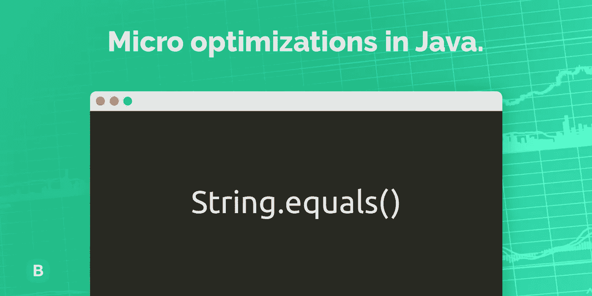

# Java 中的微优化。字符串.等于()

> 原文：<https://medium.com/javarevisited/micro-optimizations-in-java-string-equals-22be19fd8416?source=collection_archive---------1----------------------->

大家好，我是 Dmytro Dumanskiy，我是面向企业的物联网平台 [Blynk](https://blynk.io/) 的首席技术官和联合创始人。我们努力让企业将电子设备连接到互联网变得简单，并构建白标应用程序来远程监控它们。这是我的第一篇英文文章，所以请原谅我的错误。