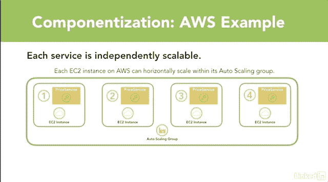
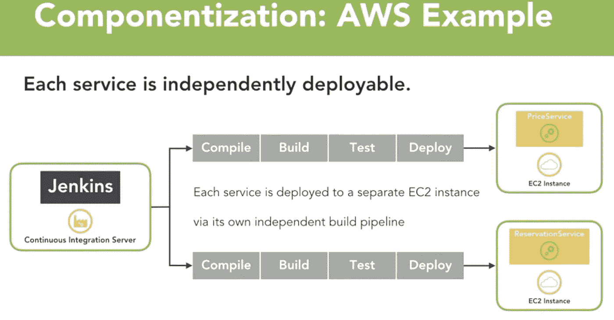

# 用 JHipster 构建微服务的微服务架构入门

> 原文：<https://medium.com/javarevisited/microservices-architecture-primer-for-building-microservices-with-jhipster-ea037c6bbfb9?source=collection_archive---------1----------------------->

LinkedIn Learning/Lynda.com

# 介绍

吉普斯特

在本文中，我们将向您简要介绍微服务，作为使用 [JHipster](http://www.jhipster.tech/) 构建具有[微服务](http://www.jhipster.tech/microservices-architecture/)后端的 web 应用程序的基础。

我们将详细介绍微服务的几个一般特征。如果你想了解更多，请查看 [JHipster Github Repo](https://github.com/jhipster) 。

# 概述

> 微服务架构是一种面向服务的架构，由松散耦合的元素组成，这些元素具有有界的上下文 *—* ***阿德里安·科克罗夫特***

微服务架构风格没有精确的定义。然而，一般来说，在高层次上，微服务架构风格是一种应用程序开发方法，其中您创建一套单独的、独立的服务。

## 微服务:

*   在各自独立的进程中运行。
*   是独立可扩展的。
*   可以独立部署。
*   有自己的数据存储。
*   通常围绕单一业务功能构建。
*   使用 HTTP 等轻量级协议与其他微服务通信。
*   是分离的和内聚的。

> 微服务是小型的自治服务，它们协同工作***——Sam Newman***

独立可扩展的服务

# 微服务特征概述— LinkedIn Learning

> 微服务架构风格是一种将单个应用程序开发为一套小型服务的方法，每个应用程序都在自己的进程中运行，并通过轻量级机制进行通信，通常是 HTTP 资源 API ***—马丁·福勒***

## 通过服务的组件化

组件:组件是一个可以独立替换和升级的软件单元。

在微服务架构中，每个服务充当一个组件。

通过服务的组件化

## 围绕产品而非项目组织的服务

**项目:**交付一个软件，然后移交。

和...相对

产品:开发团队从设计到部署接管软件。

重要的是利用**跨职能团队**，这样拥有服务的团队就有了实现新功能所需的每个人。他们不应该为了开发新功能而求助于单独的设计、UI 或数据库团队。

## 智能端点和哑管道

> *成为网络的一部分，而不是在网络的背后* ***—伊恩·罗宾逊***

从重量级消息代理(如企业服务总线)转向 HTTP 和轻量级消息队列以进行服务间通信。

转向服务间的粗粒度通信，以使每条消息完成更多工作，并减少消息总数。

# 附加微服务特性

## 分散数据管理

**有界上下文:**通过将大型模型划分成具有明确定义的相互关系的不同上下文来处理大型模型的方法。

每个服务边界应该对应一个有界的上下文。

**多语言持久性:**每个服务管理自己的数据库，这些数据库可以是完全不同的数据库系统。*如* **RDMS、noSQL 或图**

每个服务都应该有自己的数据库。每个团队应该可以自由选择最能满足其需求的数据存储。

## 基础设施自动化

**自助服务:**允许开发人员调配他们自己的新服务器或虚拟机。

您肯定需要转向持续集成/持续交付，并自动部署到每个新环境中。运行大量的自动化测试和静态分析也很重要。

您还希望能够自动扩展您的基础架构。

可独立部署的服务

**故障设计**

应用程序需要被设计成能够容忍服务的失败。客户必须尽可能优雅地应对失败。

能够快速检测到故障并在可能的情况下自动恢复服务非常重要。*例如* **自愈服务**

还需要复杂的监控和日志记录。

# 想了解更多？

有兴趣了解这个主题的更多信息吗？然后查看 LinkedIn Learning 上的课程，该课程将涵盖以下内容:

*   微服务架构综述。
*   JHipster 概述。
*   如何使用 JHipster Yeoman 框架创建利用 Java8、Spring、网飞 OSS 和 Angular 的微服务应用的演练。
*   如何将此应用程序部署到 AWS、Azure 和 Cloud Foundry 的演练。

# 请点击这里查看:

[Linkedin Learning:开始 30 天免费试用](//linkedin-learning.pxf.io/c/1252615/469502/8005)

<https://www.linkedin.com/learning/jhipster-build-and-deploy-spring-boot-microservices?trk=insiders_43129714_learning>  

*原载于 LinkedIn Pulse(*[*)https://www . LinkedIn . com/Pulse/micro services-architecture-primer-doing-jhipster-Chris-anata lio/*](https://www.linkedin.com/pulse/microservices-architecture-primer-doing-jhipster-chris-anatalio/)*)*

JHipster 由 Ippon Technologies([https://www.ippon.tech/](https://www.ippon.tech/))赞助。

# 了解更多关于 JHipster 的信息

<http://www.jhipster.tech/>  <https://github.com/jhipster> 