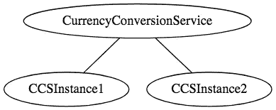
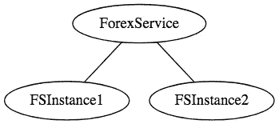
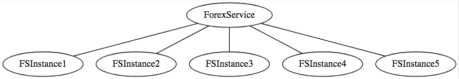
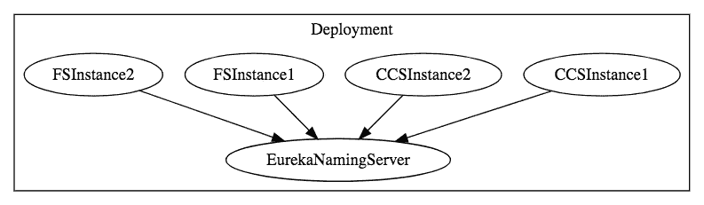

# Spring Boot 和春天云的微服务—第 1 部分

> 原文：<https://medium.com/javarevisited/microservices-with-spring-boot-and-spring-cloud-part-1-3a865da6d581?source=collection_archive---------1----------------------->

本指南将帮助您了解微服务和微服务架构的基础知识。我们还将开始研究 Spring Boot 微服务的基本实现。

> 我们将创建几个微服务，并让它们使用 Eureka 命名服务器和 Ribbon 进行客户端负载平衡。

这是一个 5 部分的文章系列

Spring Boot 的微服务

*   当前部分—第 1 部分—微服务架构入门
*   第 2 部分— [创建外汇微服务](https://www.springboottutorial.com/creating-microservices-with-spring-boot-part-2-forex-microservice)
*   第 3 部分— [创建货币兑换微服务](https://www.springboottutorial.com/creating-microservices-with-spring-boot-part-3-currency-conversion-microservice)
*   第 4 部分— [使用 Ribbon 进行负载平衡](https://www.springboottutorial.com/microservices-with-spring-boot-part-4-ribbon-for-load-balancing)
*   第 5 部分— [使用 Eureka 命名服务器](https://www.springboottutorial.com/microservices-with-spring-boot-part-5-eureka-naming-server)

在本系列的第 1 部分中，我们将介绍微服务的概念，并了解如何使用 Spring Boot 和 Spring Cloud 创建出色的微服务。

# 你会学到的

*   什么是独石？
*   什么是微服务？
*   微服务面临哪些挑战？
*   Spring Boot 和 Spring Cloud 如何让开发微服务变得简单？
*   如何用 Ribbon 实现客户端负载均衡？
*   如何实现一个命名服务器(Eureka 命名服务器)？
*   如何用命名服务器和 Ribbon 连接微服务？

# 免费课程—10 步学会

*   [免费 5 天挑战——学习春天和 Spring Boot](https://links.in28minutes.com/SBT-Page-Top-LearningChallenge-SpringBoot)
*   [用 10 个步骤学习 Spring Boot](https://links.in28minutes.com/in28minutes-10steps-springboot)
*   [10 步学会 Docker](https://links.in28minutes.com/in28minutes-10steps-docker)
*   [十步学会 Kubernetes](https://links.in28minutes.com/in28minutes-10steps-k8s)
*   [用 10 个步骤学习 AWS](https://links.in28minutes.com/in28minutes-10steps-aws-beanstalk)

# 微服务概述—大图

在这一系列文章中，我们将创建两个微服务:

*   外汇服务——缩写为 FS
*   货币兑换服务—缩写为 CCS

> 如果你对一些事情不清楚，不要担心。我们的想法是在动手之前给出一个大图，然后一步一步地创建微服务

# 外汇服务

外汇服务(FS)是服务提供商。它提供各种货币的货币兑换值。让我们假设它与外汇交易所对话，并提供货币之间的当前转换值。

请求和响应示例如下所示:

转到[http://localhost:8000/currency-exchange/from/EUR/to/INR](http://localhost:8000/currency-exchange/from/EUR/to/INR)

```
{
  id: 10002,
  from: "EUR",
  to: "INR",
  conversionMultiple: 75,
  port: 8000,
}
```

上面的请求是欧元对印度卢比的货币兑换值。在响应中，conversionMultiple 为 75。

> 稍后我们将在响应中讨论端口。

# 货币兑换服务

货币转换服务(CCS)可以将一批货币转换成另一种货币。它使用外汇服务来获取当前的货币兑换值。CCS 是服务消费者。

请求和响应示例如下所示:

到达[http://localhost:8100/currency-converter/from/EUR/to/INR/quantity/10000](http://localhost:8100/currency-converter/from/EUR/to/INR/quantity/10000)

```
{
  id: 10002,
  from: "EUR",
  to: "INR",
  conversionMultiple: 75,
  quantity: 10000,
  totalCalculatedAmount: 750000,
  port: 8000,
}
```

上面的请求是找出 10000 欧元的印度卢比值。总计算金额为 750000 印度卢比。

下图显示了 CCS 和 FS 之间的通信。


# 尤里卡命名服务器和功能区

根据负载，我们可以运行货币转换服务和外汇服务的多个实例。



并且每个服务的实例数量可能会随时间而变化。下图显示了一个具体的实例，其中有 5 个外汇服务的实例。


在上述情况下，需要在这 5 个实例中均匀分配负载。


在这一系列文章中，我们将使用 Ribbon 进行负载平衡，使用 Eureka 命名服务器注册所有微服务。


> 如果你对一些事情不清楚，不要担心。我们的想法是在动手之前给出一个大图，然后一步一步地创建微服务

# 什么是整体应用？

你曾经在项目中工作过吗

*   每隔几个月发布一次
*   它具有广泛的特性和功能
*   有一个超过 50 人的团队在为它工作
*   调试问题是一个巨大的挑战
*   引进新技术和新工艺几乎是不可能的

这些是整体应用的典型特征。

> Monolith 应用程序通常非常庞大——超过 100，000 行代码。在某些情况下，甚至超过百万行代码。

独石的特点是

*   大型应用程序
*   长发布周期
*   大型团队

典型的挑战包括

*   可扩展性挑战
*   新技术采用
*   新流程——敏捷？
*   难以自动化测试
*   难以适应现代发展实践
*   适应设备爆炸

# 微服务

微服务架构是作为整体架构的可扩展性和创新挑战的解决方案而发展的。

针对微服务提出了许多定义

> 协同工作的小型自治服务—萨姆·纽曼
> 
> 将单个应用程序开发为一套小服务，每个小服务运行在自己的进程中，并通过轻量级机制(通常是 HTTP 资源 API)进行通信。这些服务是围绕业务功能构建的，可由全自动部署机器独立部署。这些服务几乎没有集中管理，它们可能用不同的编程语言编写，使用不同的数据存储技术——詹姆斯·刘易斯和马丁·福勒

虽然微服务没有一个公认的定义，但对我来说，有几个重要的特征:

*   REST——围绕 RESTful 资源构建。通信可以是基于 HTTP 或事件的。
*   精心挑选的小型可部署单元——有界环境
*   支持云—动态扩展

# 微服务架构是什么样子的？

这是一块巨石的样子。一次申请搞定一切。


这是使用微服务架构开发的相同应用程序的外观。


微服务架构包括许多与消息交互的小型、设计良好的组件。


# 微服务的优势

优势

*   新技术和流程适应变得更加容易。您可以使用我们创建的更新的微服务来尝试新技术。
*   更快的发布周期
*   利用云进行扩展

# 微服务架构面临的挑战

虽然开发许多较小的组件看起来很容易，但是微服务架构有许多固有的复杂性。

让我们来看一些挑战:

*   需要快速设置:你不能花一个月的时间来设置每个微服务。你应该可以快速创建微服务。
*   自动化:因为有许多更小的组件而不是一个整体，所以你需要自动化所有的事情——构建、部署、监控等等。
*   可见性:您现在有许多较小的组件需要部署和维护。可能有 100 或 1000 个组件。您应该能够自动监控和识别问题。你需要所有组件都有很好的可视性。
*   有界环境:决定微服务的边界不是一件容易的事情。领域驱动设计中的有界上下文是一个很好的起点。你对领域的理解需要一段时间。您需要确保微服务边界不断发展。
*   配置管理:您需要跨环境维护数百个组件的配置。您需要一个配置管理解决方案
*   动态扩展和缩减:只有当您的应用程序可以在云中轻松扩展和缩减时，微服务的优势才会实现。
*   一组卡片:如果调用链底部的一个微服务失败，它会对所有其他微服务产生连锁影响。微服务在设计上应该是容错的。
*   调试:当有一个问题需要调查时，您可能需要跨不同组件查看多个服务。集中式日志记录和仪表板对于简化问题调试至关重要。
*   一致性:你不可能有多种工具来解决同一个问题。虽然促进创新很重要，但围绕用于实现/部署/监控微服务的语言、平台、技术和工具进行一些去中心化的治理也很重要。

***8.5 万订阅用户*** 正在我们的 ***Youtube 频道*** 上学习 AWS、Docker、Kubernetes、Spring Boot 和微服务。

[***订阅*** 现在就开始学习！](https://links.in28minutes.com/in28minute-YT-Subscribe)

# 微服务架构挑战解决方案

# Spring Boot

> 支持快速构建生产就绪型应用

提供非功能性特征

*   嵌入式服务器(使用容器轻松部署)
*   指标(监控)
*   健康检查(监控)
*   外部化配置

# 春天的云

> Spring Cloud 提供云使能您的微服务的解决方案。它利用了网飞(网飞 OSS)开源的一些云解决方案，并建立在这些解决方案之上。

## 重要的 Spring 云模块

动态上下缩放。结合使用

*   命名服务器(尤里卡)
*   功能区(客户端负载平衡)
*   假装(更容易休息的客户)

可见性和监控

*   Zipkin 分布式跟踪
*   网飞 API 网关

配置管理

*   Spring 云配置服务器

容错能力

*   高起鳞癣

# 微服务系列文章

在这一系列文章中，我们将创建两个微服务:

*   外汇服务——缩写为 FS
*   货币兑换服务—缩写为 CCS

下图显示了 CCS 和 FS 之间的通信。我们将在这两个组件之间建立通信。


我们希望能够动态地增加和减少这些服务的实例数量。



并且每个服务的实例数量可能会随时间而变化。下图显示了一个具体的实例，其中有 5 个外汇服务的实例。



实现动态扩展和缩减的解决方案需要回答两个问题

*   货币兑换服务(CCS)如何知道有多少外汇服务(FS)实例处于活动状态？
*   货币转换服务(CCS)如何在活动实例之间分配负载。

因为我们希望这是动态的，所以我们不能在 CCS 中硬编码 FS 的 URL。这就是我们引入命名服务器的原因。



组件(CCS 和 FS)的所有实例都向 Eureka 命名服务器注册。当 FS 需要调用 CCS 时，它会向 Eureka 命名服务器请求活动实例。我们将使用 Ribbon 在不同的 FS 实例之间进行客户端负载平衡。

下面显示了当 CCS 向 FS 发出请求时会发生什么的高级序列图:


# 后续步骤

与 Spring Boot 一起继续学习微服务

*   当前部分—第 1 部分—微服务架构入门
*   第 2 部分— [创建外汇微服务](https://www.springboottutorial.com/creating-microservices-with-spring-boot-part-2-forex-microservice)
*   第 3 部分— [创建货币兑换微服务](https://www.springboottutorial.com/creating-microservices-with-spring-boot-part-3-currency-conversion-microservice)
*   第 4 部分— [使用 Ribbon 进行负载平衡](https://www.springboottutorial.com/microservices-with-spring-boot-part-4-ribbon-for-load-balancing)
*   第 5 部分— [使用 Eureka 命名服务器](https://www.springboottutorial.com/microservices-with-spring-boot-part-5-eureka-naming-server)

# 进一步学习

> [2020 年 Java 开发者路线图](https://javarevisited.blogspot.com/2019/10/the-java-developer-roadmap.html)
> [2020 年 Java 开发者应该学习的 10 件事](http://javarevisited.blogspot.sg/2017/12/10-things-java-programmers-should-learn.html)
> [2020 年要学习并掌握 Spring 云的 5 门课程](http://javarevisited.blogspot.sg/2018/04/top-5-spring-cloud-courses-for-java.html)
> [2020 年学习 Spring 框架的 5 门免费课程](http://www.java67.com/2017/11/top-5-free-core-spring-mvc-courses-learn-online.html)
> [2020 年学习 Spring 安全的 5 门课程](http://www.java67.com/2017/12/top-5-spring-security-online-training-courses.html)
> [有经验的 Java 开发者应该阅读的 5 本 Spring 书籍](http://javarevisited.blogspot.sg/2018/04/5-spring-framework-books-experienced-Java-developers-2018.html)
> [2020 年成为 Java 开发者应该知道的 5 大框架](http://javarevisited.blogspot.sg/2018/05/10-tips-to-become-better-java-developer.html)
> [Java 程序员的 20 个 Spring 和 REST 面试问题](https://javarevisited.blogspot.com/2018/02/top-20-spring-rest-interview-questions-answers-java.html#axzz57Kv4wGXe)

感谢您阅读本文。如果你喜欢这些高级 Spring Boot、Docker、AWS、Fullstack Java 开发者课程，那么请在你最喜欢的平台(脸书、Twitter 或 LinkedIn)上分享。如果您有任何问题或反馈，请留言。

[](/javarevisited/10-advanced-spring-boot-courses-for-experienced-java-developers-5e57606816bd) [## 面向有经验的 Java 开发人员的 10 门高级 Spring Boot 课程

### 高级 Spring Boot 课程为有经验的 Java 开发人员学习 Spring Boot 测试，云和容器…

medium.com](/javarevisited/10-advanced-spring-boot-courses-for-experienced-java-developers-5e57606816bd) [](https://javarevisited.blogspot.com/2019/10/the-java-developer-roadmap.html#123) [## 2020 年 Java 开发者路线图

### 大家好，首先祝大家 2020 新年快乐。我已经分享了很多成为网络的路线图…

javarevisited.blogspot.com](https://javarevisited.blogspot.com/2019/10/the-java-developer-roadmap.html#123)