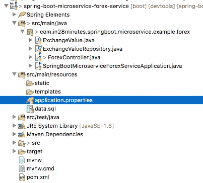

# 采用 Spring Boot 和 Spring Cloud 的微服务—第 2 部分 Forex 微服务的架构

> 原文：<https://medium.com/javarevisited/microservices-with-spring-boot-and-spring-cloud-part-2-architecture-of-forex-microservice-21260aa1ce53?source=collection_archive---------3----------------------->

我们来学习一下微服务和微服务架构的基础知识。我们还将开始研究 Spring Boot 微服务的基本实现。我们将创建几个微服务，并让它们使用 Eureka 命名服务器和 Ribbon 进行客户端负载平衡。

以下是微服务系列大纲:Spring Boot 微服务

*   第 1 部分— [微服务架构入门](https://www.springboottutorial.com/creating-microservices-with-spring-boot-part-1-getting-started)
*   当前部分—第 2 部分—创建外汇微服务
*   第 3 部分— [创建货币兑换微服务](https://www.springboottutorial.com/creating-microservices-with-spring-boot-part-3-currency-conversion-microservice)
*   第 4 部分— [使用 Ribbon 进行负载平衡](https://www.springboottutorial.com/microservices-with-spring-boot-part-4-ribbon-for-load-balancing)
*   第 5 部分— [使用 Eureka 命名服务器](https://www.springboottutorial.com/microservices-with-spring-boot-part-5-eureka-naming-server)

这是本系列的第 2 部分。在这一部分，我们将重点创建外汇微服务。

# 你会学到的

*   如何用 Spring Boot 创建微服务？
*   如何创建 JPA 实体和资源？
*   如何让 Spring MVC、Spring Boot、JPA、Hibernate 和 H2 协同工作？

<https://dev.to/javinpaul/top-10-courses-to-learn-spring-boot-and-microservices-for-java-programmers-3hjg>  

# 免费课程—10 步学会

*   [免费 5 天挑战——学习春天和 Spring Boot](https://links.in28minutes.com/SBT-Page-Top-LearningChallenge-SpringBoot)
*   [用 10 个步骤学习 Spring Boot](https://links.in28minutes.com/in28minutes-10steps-springboot)
*   [10 步学会 Docker](https://links.in28minutes.com/in28minutes-10steps-docker)
*   [十步学会 Kubernetes](https://links.in28minutes.com/in28minutes-10steps-k8s)
*   [用 10 个步骤学习 AWS](https://links.in28minutes.com/in28minutes-10steps-aws-beanstalk)

# 资源概述

外汇服务(FS)是服务提供商。它提供各种货币的货币兑换值。让我们假设它与外汇交易所对话，并提供货币之间的当前转换值。

请求和响应示例如下所示:

转到[http://localhost:8000/currency-exchange/from/EUR/to/INR](http://localhost:8000/currency-exchange/from/EUR/to/INR)

```
{
  id: 10002,
  from: "EUR",
  to: "INR",
  conversionMultiple: 75,
  port: 8000,
}
```

上面的请求是欧元对印度卢比的货币兑换值。在响应中，conversionMultiple 为 75。

# 项目代码结构

下面的屏幕截图显示了我们将创建的项目的结构。



一些细节:

*   SpringBootMicroserviceForexServiceApplication.java——用 Spring 初始化器生成的 Spring Boot 应用程序类。这个类充当应用程序的启动点。
*   `pom.xml` -包含构建这个项目所需的所有依赖项。我们将使用 Spring Boot 入门网站和 JPA。
*   `ExchangeValue.java` -交换价值实体
*   `ExchangeValueRepository.java`-exchange evalue JPA 知识库。这是使用 Spring 数据 JpaRepository 创建的。
*   `ForexController.java` - Spring Rest 控制器公开外汇兑换服务。
*   data . SQL-exchange _ value 表的初始数据。从实体创建表后，Spring Boot 将执行这个脚本。

# 您将需要的工具

*   Maven 3.0+是您的构建工具
*   你最喜欢的 IDE。我们使用 Eclipse。
*   JDK 1.8 以上

如果您想了解关于工具的更多信息，请查看这篇文章:

<https://www.java67.com/2018/04/10-tools-java-developers-should-learn.html>  

# 用代码示例完成 Maven 项目

> 我们的 Github 存储库中有所有的代码示例—[https://Github . com/in 28 minutes/spring-boot-examples/tree/master/spring-boot-basic-microservice](https://github.com/in28minutes/spring-boot-examples/tree/master/spring-boot-basic-microservice)

# 使用 Spring Initializr 引导

用 Spring Initializr 创建微服务是小菜一碟。

spring Initializr[http://start.spring.io/](https://start.spring.io/)是启动你的 Spring Boot 项目的伟大工具。

您可以使用 Spring Initializr 创建各种各样的项目。


对于 Web 服务项目，必须完成以下步骤

*   启动 Spring Initializr 并选择以下选项
*   选择`com.in28minutes.springboot.microservice.example.forex`作为群组
*   选择`spring-boot-microservice-forex-service`作为神器
*   选择以下依赖项
*   网
*   开发工具
*   初级 JPA
*   氘
*   单击生成项目。
*   将项目导入 Eclipse。文件->导入->现有 Maven 项目。

# 创建交换价值实体

```
@Entity
public class ExchangeValue {

  @Id
  private Long id;

  @Column(name="currency_from")
  private String from;

  @Column(name="currency_to")
  private String to;

  private BigDecimal conversionMultiple;
  private int port;

  public ExchangeValue() {

  }
    public ExchangeValue(Long id, String from, String to, BigDecimal conversionMultiple) {
    super();
    this.id = id;
    this.from = from;
    this.to = to;
    this.conversionMultiple = conversionMultiple;
  } public Long getId() {
    return id;
  } public String getFrom() {
    return from;
  } public String getTo() {
    return to;
  } public BigDecimal getConversionMultiple() {
    return conversionMultiple;
  }

  public int getPort() {
    return port;
  } public void setPort(int port) {
    this.port = port;
  }}
```

需要注意的重要事项:

*   `@Entity`:指定该类是一个实体。该注释应用于实体类。
*   `@Id`:指定实体的主键。

# 创建交换价值 JPA 存储库

/spring-boot-microservice-forex-service/src/main/Java/com/in 28 minutes/spring boot/microservice/example/forex/exchangevaluerepository . Java

```
package com.in28minutes.springboot.microservice.example.forex;
import org.springframework.data.jpa.repository.JpaRepository;public interface ExchangeValueRepository extends 
    JpaRepository<ExchangeValue, Long>{
  ExchangeValue findByFromAndTo(String from, String to);
}
```

笔记

*   `public interface ExchangeValueRepository extends JpaRepository<ExchangeValue, Long>` -我们使用两个泛型扩展 JpaRepository-exchange value&Long。ExchangeValue 是被管理的实体，并且 ExchangeValue 的主键是 Long。
*   `ExchangeValue findByFromAndTo(String from, String to);` -我们想要查询从一种货币到另一种货币的转换值。我们正在为它定义一个查询方法。

# 创建资源—外汇控制器

/spring-boot-microservice-forex-service/src/main/Java/com/in 28 minutes/spring boot/microservice/example/forex/forex controller . Java

```
@RestController
public class ForexController {

  @Autowired
  private Environment environment;

  @Autowired
  private ExchangeValueRepository repository;

  @GetMapping("/currency-exchange/from/{from}/to/{to}")
  public ExchangeValue retrieveExchangeValue
    (@PathVariable String from, @PathVariable String to){

    ExchangeValue exchangeValue = 
        repository.findByFromAndTo(from, to);

    exchangeValue.setPort(
        Integer.parseInt(environment.getProperty("local.server.port")));

    return exchangeValue;
  }
}
```

笔记

*   `@RestController public class ForexController {` -创建一个控制器来公开一个 Rest 服务
*   `@Autowired private Environment environment` -我们希望恢复服务器端口。这将帮助我们识别哪个实例服务正在返回响应。
*   `@Autowired private ExchangeValueRepository repository` -自动连接存储库。
*   `ExchangeValue exchangeValue = repository.findByFromAndTo(from, to)` -从数据库中获取兑换值。
*   `exchangeValue.setPort(Integer.parseInt(environment.getProperty("local.server.port")))` -从环境中获取端口，并将其设置到响应 bean 中。

# 配置应用程序名称和一些其他配置

/spring-boot-microservice-forex-service/src/main/resources/application . properties

```
spring.application.name=forex-service
server.port=8000spring.jpa.show-sql=true
spring.h2.console.enabled=true
```

我们为此应用程序分配了一个端口 8000，并启用了调试日志。

# 将一些测试数据插入 data.sql

让我们通过创建一个名为 data.sql 的文件来插入一些测试数据。Spring Boot 自动配置确保在应用程序启动时加载这些数据。

/spring-boot-microservice-forex-service/src/main/resources/data . SQL

```
insert into exchange_value(id,currency_from,currency_to,conversion_multiple,port)
values(10001,'USD','INR',65,0);
insert into exchange_value(id,currency_from,currency_to,conversion_multiple,port)
values(10002,'EUR','INR',75,0);
insert into exchange_value(id,currency_from,currency_to,conversion_multiple,port)
values(10003,'AUD','INR',25,0);
```

# 测试外汇微服务

转到[http://localhost:8000/currency-exchange/from/EUR/to/INR](http://localhost:8000/currency-exchange/from/EUR/to/INR)

```
{
  id: 10002,
  from: "EUR",
  to: "INR",
  conversionMultiple: 75,
  port: 8000,
}
```

# 后续步骤

Spring Boot 的微服务

*   第 1 部分— [微服务架构入门](https://www.springboottutorial.com/creating-microservices-with-spring-boot-part-1-getting-started)
*   当前部分—第 2 部分—创建外汇微服务
*   第 3 部分— [创建货币兑换微服务](https://www.springboottutorial.com/creating-microservices-with-spring-boot-part-3-currency-conversion-microservice)
*   第 4 部分— [使用 Ribbon 进行负载平衡](https://www.springboottutorial.com/microservices-with-spring-boot-part-4-ribbon-for-load-balancing)
*   第 5 部分— [使用尤里卡命名服务器](https://www.springboottutorial.com/microservices-with-spring-boot-part-5-eureka-naming-server)

如果你需要更多的资源，可以看看这些为 Java 开发者准备的 [**高级 Spring Boot 课程**](/javarevisited/10-advanced-spring-boot-courses-for-experienced-java-developers-5e57606816bd) :

</javarevisited/10-advanced-spring-boot-courses-for-experienced-java-developers-5e57606816bd>  

# 完整的代码示例

# /spring-boot-microservice-forex-service/POM . XML

```
*<?xml version="1.0" encoding="UTF-8"?>*
<project  xmlns:xsi="http://www.w3.org/2001/XMLSchema-instance"
  xsi:schemaLocation="http://maven.apache.org/POM/4.0.0 http://maven.apache.org/xsd/maven-4.0.0.xsd">
  <modelVersion>4.0.0</modelVersion> <groupId>com.in28minutes.springboot.microservice.example.forex</groupId>
  <artifactId>spring-boot-microservice-forex-service</artifactId>
  <version>0.0.1-SNAPSHOT</version>
  <packaging>jar</packaging> <name>spring-boot-microservice-forex-service</name>
  <description>Microservices with Spring Boot and Spring Cloud - Forex Service</description> <parent>
    <groupId>org.springframework.boot</groupId>
    <artifactId>spring-boot-starter-parent</artifactId>
    <version>2.0.0.RELEASE</version>
    <relativePath/> *<!-- lookup parent from repository -->*
  </parent> <properties>
    <project.build.sourceEncoding>UTF-8</project.build.sourceEncoding>
    <project.reporting.outputEncoding>UTF-8</project.reporting.outputEncoding>
    <java.version>1.8</java.version>
    <spring-cloud.version>Finchley.M8</spring-cloud.version>
  </properties> <dependencies>
    <dependency>
      <groupId>org.springframework.boot</groupId>
      <artifactId>spring-boot-starter-data-jpa</artifactId>
    </dependency>
    <dependency>
      <groupId>org.springframework.boot</groupId>
      <artifactId>spring-boot-starter-web</artifactId>
    </dependency> <dependency>
      <groupId>org.springframework.boot</groupId>
      <artifactId>spring-boot-devtools</artifactId>
      <scope>runtime</scope>
    </dependency>
    <dependency>
      <groupId>com.h2database</groupId>
      <artifactId>h2</artifactId>
      <scope>runtime</scope>
    </dependency>
    <dependency>
      <groupId>org.springframework.boot</groupId>
      <artifactId>spring-boot-starter-test</artifactId>
      <scope>test</scope>
    </dependency>
  </dependencies> <dependencyManagement>
    <dependencies>
      <dependency>
        <groupId>org.springframework.cloud</groupId>
        <artifactId>spring-cloud-dependencies</artifactId>
        <version>${spring-cloud.version}</version>
        <type>pom</type>
        <scope>import</scope>
      </dependency>
    </dependencies>
  </dependencyManagement> <build>
    <plugins>
      <plugin>
        <groupId>org.springframework.boot</groupId>
        <artifactId>spring-boot-maven-plugin</artifactId>
      </plugin>
    </plugins>
  </build> <repositories>
    <repository>
      <id>spring-snapshots</id>
      <name>Spring Snapshots</name>
      <url>https://repo.spring.io/snapshot</url>
      <snapshots>
        <enabled>true</enabled>
      </snapshots>
    </repository>
    <repository>
      <id>spring-milestones</id>
      <name>Spring Milestones</name>
      <url>https://repo.spring.io/milestone</url>
      <snapshots>
        <enabled>false</enabled>
      </snapshots>
    </repository>
  </repositories> <pluginRepositories>
    <pluginRepository>
      <id>spring-snapshots</id>
      <name>Spring Snapshots</name>
      <url>https://repo.spring.io/snapshot</url>
      <snapshots>
        <enabled>true</enabled>
      </snapshots>
    </pluginRepository>
    <pluginRepository>
      <id>spring-milestones</id>
      <name>Spring Milestones</name>
      <url>https://repo.spring.io/milestone</url>
      <snapshots>
        <enabled>false</enabled>
      </snapshots>
    </pluginRepository>
  </pluginRepositories> </project>
```

# /spring-boot-microservice-forex-service/src/main/Java/com/in 28 minutes/spring boot/microservice/example/forex/exchange value . Java

```
package com.in28minutes.springboot.microservice.example.forex;
import java.math.BigDecimal;import javax.persistence.Column;
import javax.persistence.Entity;
import javax.persistence.Id;@Entity
public class ExchangeValue {

  @Id
  private Long id;

  @Column(name="currency_from")
  private String from;

  @Column(name="currency_to")
  private String to;

  private BigDecimal conversionMultiple;
  private int port;

  public ExchangeValue() {

  }
    public ExchangeValue(Long id, String from, String to, BigDecimal conversionMultiple) {
    super();
    this.id = id;
    this.from = from;
    this.to = to;
    this.conversionMultiple = conversionMultiple;
  } public Long getId() {
    return id;
  } public String getFrom() {
    return from;
  } public String getTo() {
    return to;
  } public BigDecimal getConversionMultiple() {
    return conversionMultiple;
  }

  public int getPort() {
    return port;
  } public void setPort(int port) {
    this.port = port;
  }}
```

# /spring-boot-microservice-forex-service/src/main/Java/com/in 28 minutes/spring boot/microservice/example/forex/exchangevaluerepository . Java

```
package com.in28minutes.springboot.microservice.example.forex;
import org.springframework.data.jpa.repository.JpaRepository;public interface ExchangeValueRepository extends 
    JpaRepository<ExchangeValue, Long>{
  ExchangeValue findByFromAndTo(String from, String to);
}
```

# /spring-boot-microservice-forex-service/src/main/Java/com/in 28 minutes/spring boot/microservice/example/forex/forex controller . Java

```
package com.in28minutes.springboot.microservice.example.forex;
import java.math.BigDecimal;import org.springframework.beans.factory.annotation.Autowired;
import org.springframework.core.env.Environment;
import org.springframework.web.bind.annotation.GetMapping;
import org.springframework.web.bind.annotation.PathVariable;
import org.springframework.web.bind.annotation.RestController;@RestController
public class ForexController {

  @Autowired
  private Environment environment;

  @Autowired
  private ExchangeValueRepository repository;

  @GetMapping("/currency-exchange/from/{from}/to/{to}")
  public ExchangeValue retrieveExchangeValue
    (@PathVariable String from, @PathVariable String to){

    ExchangeValue exchangeValue = 
        repository.findByFromAndTo(from, to);

    exchangeValue.setPort(
        Integer.parseInt(environment.getProperty("local.server.port")));

    return exchangeValue;
  }
}
```

# /spring-boot-microservice-forex-service/src/main/Java/com/in 28 minutes/spring boot/microservice/example/forex/spring boot microservice foreserviceapplication . Java

```
package com.in28minutes.springboot.microservice.example.forex;import org.springframework.boot.SpringApplication;
import org.springframework.boot.autoconfigure.SpringBootApplication;@SpringBootApplication
public class SpringBootMicroserviceForexServiceApplication { public static void main(String[] args) {
    SpringApplication.run(SpringBootMicroserviceForexServiceApplication.class, args);
  }
}
```

# /spring-boot-microservice-forex-service/src/main/resources/application . properties

```
spring.application.name=forex-service
server.port=8000spring.jpa.show-sql=true
spring.h2.console.enabled=true
```

# /spring-boot-microservice-forex-service/src/main/resources/data . SQL

```
insert into exchange_value(id,currency_from,currency_to,conversion_multiple,port)
values(10001,'USD','INR',65,0);
insert into exchange_value(id,currency_from,currency_to,conversion_multiple,port)
values(10002,'EUR','INR',75,0);
insert into exchange_value(id,currency_from,currency_to,conversion_multiple,port)
values(10003,'AUD','INR',25,0);
```

# /spring-boot-microservice-forex-service/src/test/Java/com/in 28 minutes/spring boot/microservice/example/forex/spring boot microservice forexserviceapplicationtests . Java

```
package com.in28minutes.springboot.microservice.example.forex;import org.junit.Test;
import org.junit.runner.RunWith;
import org.springframework.boot.test.context.SpringBootTest;
import org.springframework.test.context.junit4.SpringRunner;@RunWith(SpringRunner.class)
@SpringBootTest
public class SpringBootMicroserviceForexServiceApplicationTests { @Test
  public void contextLoads() {
  }}
```

你可能喜欢的其他 Java 和 Spring 文章

*   每个 Java 开发人员都应该知道的 5 个 Spring Boot 特性([特性](https://javarevisited.blogspot.com/2018/11/top-5-spring-boot-features-java.html#axzz5YFjHrt5j)
*   2020 年学习春天和 Spring Boot 的五大免费课程([课程](http://www.java67.com/2017/11/top-5-free-core-spring-mvc-courses-learn-online.html))
*   5 2020 年在线掌握 Spring Boot 课程([课程](https://javarevisited.blogspot.com/2018/05/top-5-courses-to-learn-spring-boot-in.html))
*   Java 开发人员在 2020 年应该学会的 10 件事([目标](https://javarevisited.blogspot.com/2017/12/10-things-java-programmers-should-learn.html#axzz5atl0BngO))
*   Java 开发人员在日常生活中使用的 10 个工具([工具](http://javarevisited.blogspot.sg/2017/03/10-tools-used-by-java-programming-Developers.html#axzz55lrMRnNC))
*   2020 年成为更好的 Java 开发人员的 10 个技巧
*   Java 程序员可以从 Spring 学习的 3 个最佳实践([最佳实践](https://javarevisited.blogspot.com/2018/06/3-best-practices-java-programmers-can-learn-from-spring-framework.html#axzz5K0PIOpHD))
*   2020 年学习 Spring Boot 和春云的 5 门课程([课程](https://javarevisited.blogspot.com/2018/07/top-5-books-to-learn-spring-boot-and-spring-cloud-java.html))
*   改变 Spring Boot Tomcat 端口的 3 种方法([教程](https://www.java67.com/2019/07/spring-boot-3-ways-to-change-port-of-tomcat.html))
*   Java 开发者应该学习的 10 个 Spring MVC 注解([注解](https://www.java67.com/2019/04/top-10-spring-mvc-and-rest-annotations-examples-java.html))
*   15 Spring Boot Java 程序员面试问题([问题](https://www.java67.com/2018/06/top-15-spring-boot-interview-questions-answers-java-jee-programmers.html))

</javarevisited/10-advanced-spring-boot-courses-for-experienced-java-developers-5e57606816bd>  <https://javarevisited.blogspot.com/2019/10/the-java-developer-roadmap.html#123> 