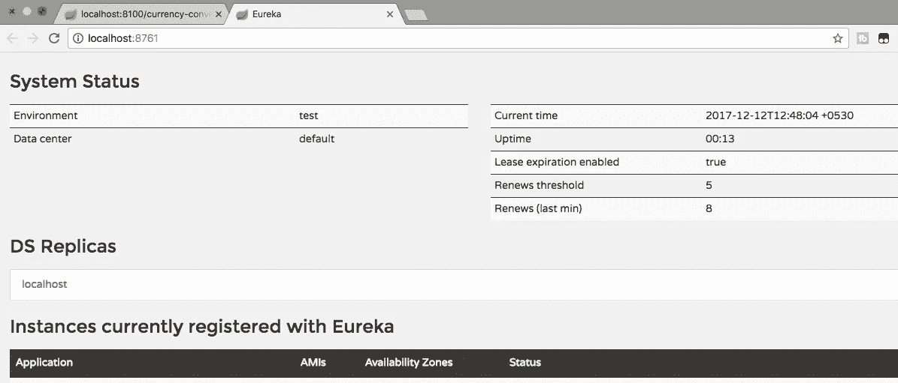
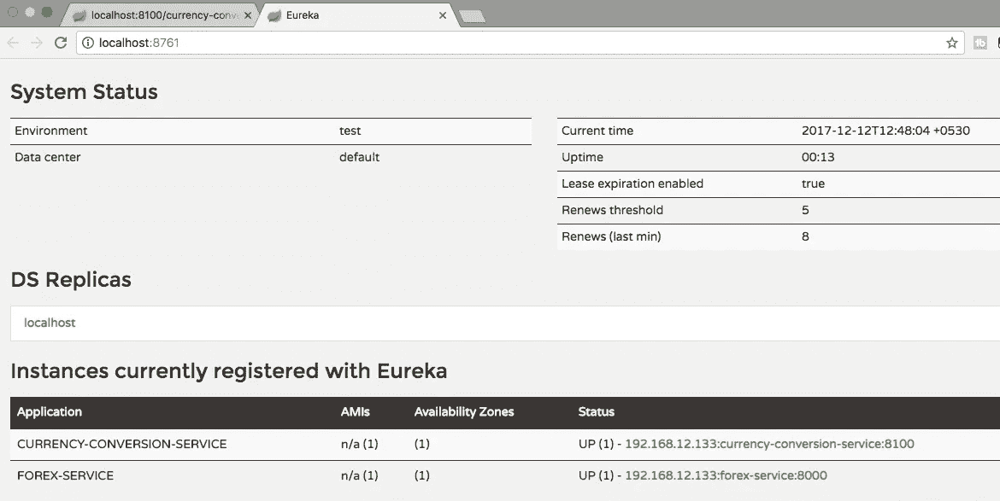
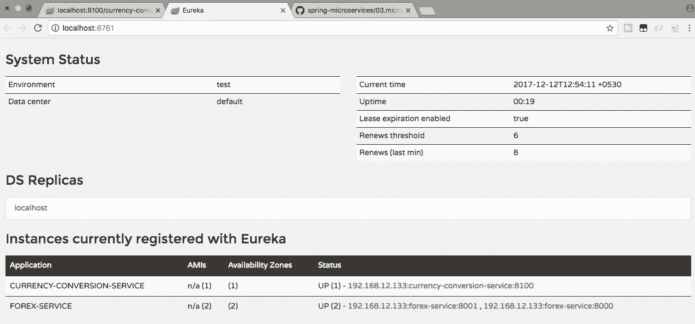
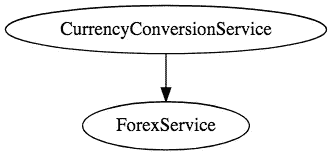

# Spring Boot 微服务—第 5 部分—使用 Eureka 命名服务器的示例

> 原文：<https://medium.com/javarevisited/microservices-with-spring-boot-part-5-example-using-eureka-naming-server-69eca3ad69b6?source=collection_archive---------1----------------------->

我们来学习一下微服务和微服务架构的基础知识。我们还将开始研究 Spring Boot 微服务的基本实现。我们将创建几个微服务，并让它们使用 Eureka 命名服务器和 Ribbon 进行客户端负载平衡。

# 免费课程—10 步学会

*   [免费 5 天挑战——学习春天和 Spring Boot](https://links.in28minutes.com/SBT-Page-Top-LearningChallenge-SpringBoot)
*   [10 步学会 Spring Boot](https://links.in28minutes.com/in28minutes-10steps-springboot)
*   [10 步学会 Docker](https://links.in28minutes.com/in28minutes-10steps-docker)
*   [10 步学会 Kubernetes](https://links.in28minutes.com/in28minutes-10steps-k8s)
*   [用 10 个步骤学习 AWS](https://links.in28minutes.com/in28minutes-10steps-aws-beanstalk)

以下是微服务系列大纲:Spring Boot 微服务

*   第 1 部分— [微服务架构入门](https://www.springboottutorial.com/creating-microservices-with-spring-boot-part-1-getting-started)
*   第 2 部分— [创建外汇微服务](https://www.springboottutorial.com/creating-microservices-with-spring-boot-part-2-forex-microservice)
*   第 3 部分— [创建货币兑换微服务](https://www.springboottutorial.com/creating-microservices-with-spring-boot-part-3-currency-conversion-microservice)
*   第 4 部分— [使用 Ribbon 实现负载平衡](https://www.springboottutorial.com/microservices-with-spring-boot-part-4-ribbon-for-load-balancing)
*   当前部分—第 5 部分—使用 Eureka 命名服务器

这是本系列的第 5 部分。在这一部分中，我们将着重于启用 Eureka 命名服务器，并让微服务与之通信。

# 你会学到的

*   命名服务器的需求是什么？
*   尤里卡是什么？
*   命名服务器如何实现微服务之间的位置透明？

# 微服务概述

在第 2 部分和第 3 部分中，我们创建了两个微服务，并在它们之间建立了通信。


在第 4 部分中，我们使用 Ribbon 在 Forex 服务的两个实例之间分配负载。

但是，我们在 CCS 中硬编码了两个 Forex 服务实例的 URL。

```
forex-service.ribbon.listOfServers=localhost:8000,localhost:8001
```

这意味着每当有一个新的 FS 实例时，我们都需要更改 CCS 的配置。那不酷。

在这一部分，我们将使用 Eureka 命名服务器来解决这个问题。


# 您将需要的工具

*   Maven 3.0+是您的构建工具
*   你最喜欢的 IDE。我们使用 Eclipse。
*   JDK 1.8 以上

# 用代码示例完成 Maven 项目

> 我们的 Github 存储库中有所有的代码示例—[https://Github . com/in 28 minutes/spring-boot-examples/tree/master/spring-boot-basic-microservice](https://github.com/in28minutes/spring-boot-examples/tree/master/spring-boot-basic-microservice)

# 用 Spring Initializr 引导 Eureka 命名服务器

用 Spring Initializr 创建 Eureka 命名服务器是小菜一碟。

spring Initializr[http://start.spring.io/](https://start.spring.io/)是启动你的 Spring Boot 项目的伟大工具。

您可以使用 Spring Initializr 创建各种各样的项目。

对于 Web 服务项目，必须完成以下步骤

*   启动 Spring Initializr 并选择以下选项
*   选择`com.in28minutes.springboot.microservice.eureka.naming.server`作为群组
*   选择`spring-boot-microservice-eureka-naming-server`作为神器
*   选择以下依赖项
*   尤里卡
*   开发工具
*   单击生成项目。
*   将项目导入 Eclipse。文件->导入->现有 Maven 项目。

> 不要忘记在依赖项中选择尤里卡

# 启用尤里卡

位于`SpringBootMicroserviceEurekaNamingServerApplication`的 EnableEurekaServer。

```
@SpringBootApplication
@EnableEurekaServer
public class SpringBootMicroserviceEurekaNamingServerApplication {
```

为 Eureka 服务器配置应用程序名称和端口

/spring-boot-microservice-eureka-naming-server/src/main/resources/application . properties

```
spring.application.name=netflix-eureka-naming-server
server.port=8761eureka.client.register-with-eureka=false
eureka.client.fetch-registry=false
```

# 启动尤里卡命名服务器

将`SpringBootMicroserviceEurekaNamingServerApplication`作为 Java 应用程序启动。

你可以在`[http://localhost:8761](http://localhost:8761)`建立尤里卡

您会看到还没有实例连接到 Eureka。



# 将 FS 和 CCS 微服务与 Eureka 连接

在两个微服务上进行这些更改

添加到 pom.xml

```
<dependency>
      <groupId>org.springframework.cloud</groupId>
      <artifactId>spring-cloud-starter-netflix-eureka-client</artifactId>
    </dependency>
```

在 application.properties 中配置 Eureka URL

```
eureka.client.service-url.default-zone=http://localhost:8761/eureka
```

重新启动 CCS 和 FS 的所有实例。您会看到 CCS 和 FS 微服务已注册到 Eureka 命名服务器。太酷了！



屏幕截图显示如何在 8081 上启动外汇服务的附加实例。


您会看到一个 CCS 实例和两个 FS 微服务实例注册到了 Eureka 命名服务器。



# 通过尤里卡发送功能区请求

您需要做的就是删除这个配置

在 application.properties 中移除此配置

```
forex-service.ribbon.listOfServers=localhost:8000,localhost:8001
```

重新启动 CCS 实例。

# 尤里卡在行动

目前，我们已经启动并运行了以下服务

*   8100 上的货币兑换微服务(CCS)
*   8000 和 8001 上的两个 Forex 微服务实例
*   尤里卡服务器启动

现在，您将看到对 CCS 的请求将通过 Eureka 由 Ribbon 在 Forex 微服务的两个实例之间分发。

# 请求 1

转到[http://localhost:8100/currency-converter-feign/from/EUR/to/INR/quantity/10000](http://localhost:8100/currency-converter-feign/from/EUR/to/INR/quantity/10000)

```
{
  id: 10002,
  from: "EUR",
  to: "INR",
  conversionMultiple: 75,
  quantity: 10000,
  totalCalculatedAmount: 750000,
  port: 8000,
}
```

# 请求 2

到[http://localhost:8100/currency-converter-feign/from/EUR/to/INR/quantity/10000](http://localhost:8100/currency-converter-feign/from/EUR/to/INR/quantity/10000)

```
{
  id: 10002,
  from: "EUR",
  to: "INR",
  conversionMultiple: 75,
  quantity: 10000,
  totalCalculatedAmount: 750000,
  port: 8001,
}
```

您可以看到两个响应中的端口号是不同的。

> 练习:在 8002 上启动另一个外汇服务实例。您会看到负载也会自动传递给它

酷！太棒了。不是吗。

# 摘要

我们现在已经创建了两个微服务，并在它们之间建立了通信。



我们使用 Ribbon 在 Forex 服务和作为命名服务器的 Eureka 这两个实例之间分配负载。

当我们推出外汇服务新实例时，您会看到负载会自动分配给它们。

这一系列 5 篇文章背后的想法是通过微服务给人一种 Spring Boot 和春天云的感觉。

微服务有更多的应用领域。下次见，干杯！

# 完整的代码示例

# /spring-boot-microservice-currency-conversion-service/POM . XML

```
*<?xml version="1.0" encoding="UTF-8"?>*
<project  xmlns:xsi="http://www.w3.org/2001/XMLSchema-instance"
  xsi:schemaLocation="http://maven.apache.org/POM/4.0.0 http://maven.apache.org/xsd/maven-4.0.0.xsd">
  <modelVersion>4.0.0</modelVersion> <groupId>com.in28minutes.springboot.microservice.example.currency-conversion</groupId>
  <artifactId>spring-boot-microservice-currency-conversion</artifactId>
  <version>0.0.1-SNAPSHOT</version>
  <packaging>jar</packaging> <name>spring-boot-microservice-currency-conversion</name>
  <description>Microservices with Spring Boot and Spring Cloud - Currency Conversion Service</description> <parent>
    <groupId>org.springframework.boot</groupId>
    <artifactId>spring-boot-starter-parent</artifactId>
    <version>2.0.0.RELEASE</version>
    <relativePath /> *<!-- lookup parent from repository -->*
  </parent> <properties>
    <project.build.sourceEncoding>UTF-8</project.build.sourceEncoding>
    <project.reporting.outputEncoding>UTF-8</project.reporting.outputEncoding>
    <java.version>1.8</java.version>
    <spring-cloud.version>Finchley.M8</spring-cloud.version>
  </properties> <dependencies>
    <dependency>
      <groupId>org.springframework.cloud</groupId>
      <artifactId>spring-cloud-starter-netflix-eureka-client</artifactId>
    </dependency>
    <dependency>
      <groupId>org.springframework.boot</groupId>
      <artifactId>spring-boot-starter-web</artifactId>
    </dependency> <dependency>
      <groupId>org.springframework.cloud</groupId>
      <artifactId>spring-cloud-starter-openfeign</artifactId>
    </dependency> <dependency>
      <groupId>org.springframework.cloud</groupId>
      <artifactId>spring-cloud-starter-netflix-ribbon</artifactId>
    </dependency> <dependency>
      <groupId>org.springframework.boot</groupId>
      <artifactId>spring-boot-devtools</artifactId>
      <scope>runtime</scope>
    </dependency>
    <dependency>
      <groupId>org.springframework.boot</groupId>
      <artifactId>spring-boot-starter-test</artifactId>
      <scope>test</scope>
    </dependency>
  </dependencies> <dependencyManagement>
    <dependencies>
      <dependency>
        <groupId>org.springframework.cloud</groupId>
        <artifactId>spring-cloud-dependencies</artifactId>
        <version>${spring-cloud.version}</version>
        <type>pom</type>
        <scope>import</scope>
      </dependency>
    </dependencies>
  </dependencyManagement> <build>
    <plugins>
      <plugin>
        <groupId>org.springframework.boot</groupId>
        <artifactId>spring-boot-maven-plugin</artifactId>
      </plugin>
    </plugins>
  </build> <repositories>
    <repository>
      <id>spring-snapshots</id>
      <name>Spring Snapshots</name>
      <url>https://repo.spring.io/snapshot</url>
      <snapshots>
        <enabled>true</enabled>
      </snapshots>
    </repository>
    <repository>
      <id>spring-milestones</id>
      <name>Spring Milestones</name>
      <url>https://repo.spring.io/milestone</url>
      <snapshots>
        <enabled>false</enabled>
      </snapshots>
    </repository>
  </repositories> <pluginRepositories>
    <pluginRepository>
      <id>spring-snapshots</id>
      <name>Spring Snapshots</name>
      <url>https://repo.spring.io/snapshot</url>
      <snapshots>
        <enabled>true</enabled>
      </snapshots>
    </pluginRepository>
    <pluginRepository>
      <id>spring-milestones</id>
      <name>Spring Milestones</name>
      <url>https://repo.spring.io/milestone</url>
      <snapshots>
        <enabled>false</enabled>
      </snapshots>
    </pluginRepository>
  </pluginRepositories> </project>
```

# /spring-boot-microservice-currency-conversion-service/src/main/Java/com/in 28 minutes/spring boot/microservice/example/currency conversion/currencyconversionbean . Java

```
package com.in28minutes.springboot.microservice.example.currencyconversion;
import java.math.BigDecimal;public class CurrencyConversionBean {
  private Long id;
  private String from;
  private String to;
  private BigDecimal conversionMultiple;
  private BigDecimal quantity;
  private BigDecimal totalCalculatedAmount;
  private int port; public CurrencyConversionBean() { } public CurrencyConversionBean(Long id, String from, String to, BigDecimal conversionMultiple, BigDecimal quantity,
      BigDecimal totalCalculatedAmount, int port) {
    super();
    this.id = id;
    this.from = from;
    this.to = to;
    this.conversionMultiple = conversionMultiple;
    this.quantity = quantity;
    this.totalCalculatedAmount = totalCalculatedAmount;
    this.port = port;
  } public Long getId() {
    return id;
  } public void setId(Long id) {
    this.id = id;
  } public String getFrom() {
    return from;
  } public void setFrom(String from) {
    this.from = from;
  } public String getTo() {
    return to;
  } public void setTo(String to) {
    this.to = to;
  } public BigDecimal getConversionMultiple() {
    return conversionMultiple;
  } public void setConversionMultiple(BigDecimal conversionMultiple) {
    this.conversionMultiple = conversionMultiple;
  } public BigDecimal getQuantity() {
    return quantity;
  } public void setQuantity(BigDecimal quantity) {
    this.quantity = quantity;
  } public BigDecimal getTotalCalculatedAmount() {
    return totalCalculatedAmount;
  } public void setTotalCalculatedAmount(BigDecimal totalCalculatedAmount) {
    this.totalCalculatedAmount = totalCalculatedAmount;
  } public int getPort() {
    return port;
  } public void setPort(int port) {
    this.port = port;
  }}
```

# /spring-boot-microservice-currency-conversion-service/src/main/Java/com/in 28 minutes/spring boot/microservice/example/currency conversion/currencyconversioncontroller . Java

```
package com.in28minutes.springboot.microservice.example.currencyconversion;import java.math.BigDecimal;
import java.util.HashMap;
import java.util.Map;import org.slf4j.Logger;
import org.slf4j.LoggerFactory;
import org.springframework.beans.factory.annotation.Autowired;
import org.springframework.http.ResponseEntity;
import org.springframework.web.bind.annotation.GetMapping;
import org.springframework.web.bind.annotation.PathVariable;
import org.springframework.web.bind.annotation.RestController;
import org.springframework.web.client.RestTemplate;@RestController
public class CurrencyConversionController { private Logger logger = LoggerFactory.getLogger(this.getClass()); @Autowired
  private CurrencyExchangeServiceProxy proxy; @GetMapping("/currency-converter/from/{from}/to/{to}/quantity/{quantity}")
  public CurrencyConversionBean convertCurrency(@PathVariable String from, @PathVariable String to,
      @PathVariable BigDecimal quantity) { Map<String, String> uriVariables = new HashMap<>();
    uriVariables.put("from", from);
    uriVariables.put("to", to); ResponseEntity<CurrencyConversionBean> responseEntity = new RestTemplate().getForEntity(
        "http://localhost:8000/currency-exchange/from/{from}/to/{to}", CurrencyConversionBean.class,
        uriVariables); CurrencyConversionBean response = responseEntity.getBody(); return new CurrencyConversionBean(response.getId(), from, to, response.getConversionMultiple(), quantity,
        quantity.multiply(response.getConversionMultiple()), response.getPort());
  } @GetMapping("/currency-converter-feign/from/{from}/to/{to}/quantity/{quantity}")
  public CurrencyConversionBean convertCurrencyFeign(@PathVariable String from, @PathVariable String to,
      @PathVariable BigDecimal quantity) { CurrencyConversionBean response = proxy.retrieveExchangeValue(from, to); logger.info("{}", response); return new CurrencyConversionBean(response.getId(), from, to, response.getConversionMultiple(), quantity,
        quantity.multiply(response.getConversionMultiple()), response.getPort());
  }}
```

# /spring-boot-microservice-currency-conversion-service/src/main/Java/com/in 28 minutes/spring boot/microservice/example/currency conversion/currencyexchangeserviceproxy . Java

```
package com.in28minutes.springboot.microservice.example.currencyconversion;import org.springframework.cloud.openfeign.FeignClient;
import org.springframework.cloud.netflix.ribbon.RibbonClient;
import org.springframework.web.bind.annotation.GetMapping;
import org.springframework.web.bind.annotation.PathVariable;@FeignClient(name="forex-service")
@RibbonClient(name="forex-service")
public interface CurrencyExchangeServiceProxy {
  @GetMapping("/currency-exchange/from/{from}/to/{to}")
  public CurrencyConversionBean retrieveExchangeValue
    (@PathVariable("from") String from, @PathVariable("to") String to);
}
```

# /spring-boot-microservice-currency-conversion-service/src/main/Java/com/in 28 minutes/spring boot/microservice/example/currency conversion/spring boot microservice currencyconversionapplication . Java

```
package com.in28minutes.springboot.microservice.example.currencyconversion;import org.springframework.boot.SpringApplication;
import org.springframework.boot.autoconfigure.SpringBootApplication;
import org.springframework.cloud.client.discovery.EnableDiscoveryClient;
import org.springframework.cloud.netflix.feign.EnableFeignClients;@SpringBootApplication
@EnableFeignClients("com.in28minutes.springboot.microservice.example.currencyconversion")
@EnableDiscoveryClient
public class SpringBootMicroserviceCurrencyConversionApplication { public static void main(String[] args) {
    SpringApplication.run(SpringBootMicroserviceCurrencyConversionApplication.class, args);
  }
}
```

# /spring-boot-微服务-货币-转换-服务/src/main/resources/application . properties

```
spring.application.name=currency-conversion-service
server.port=8100
eureka.client.service-url.default-zone=http://localhost:8761/eureka
```

# /spring-boot-microservice-currency-conversion-service/src/test/Java/com/in 28 minutes/spring boot/microservice/example/currency conversion/spring boot microservice currencyconversionapplicationtests . Java

```
package com.in28minutes.springboot.microservice.example.currencyconversion;import org.junit.Test;
import org.junit.runner.RunWith;
import org.springframework.boot.test.context.SpringBootTest;
import org.springframework.test.context.junit4.SpringRunner;@RunWith(SpringRunner.class)
@SpringBootTest
public class SpringBootMicroserviceCurrencyConversionApplicationTests { @Test
  public void contextLoads() {
  }}
```

# /spring-boot-microservice-eureka-naming-server/POM . XML

```
*<?xml version="1.0" encoding="UTF-8"?>*
<project  xmlns:xsi="http://www.w3.org/2001/XMLSchema-instance"
  xsi:schemaLocation="http://maven.apache.org/POM/4.0.0 http://maven.apache.org/xsd/maven-4.0.0.xsd">
  <modelVersion>4.0.0</modelVersion> <groupId>com.in28minutes.springboot.microservice.eureka.naming.server</groupId>
  <artifactId>spring-boot-microservice-eureka-naming-server</artifactId>
  <version>0.0.1-SNAPSHOT</version>
  <packaging>jar</packaging> <name>spring-boot-microservice-eureka-naming-server</name>
  <description>Microservices with Spring Boot and Spring Cloud - Eureka Naming Server</description> <parent>
    <groupId>org.springframework.boot</groupId>
    <artifactId>spring-boot-starter-parent</artifactId>
    <version>2.0.0.RELEASE</version>
    <relativePath/> *<!-- lookup parent from repository -->*
  </parent> <properties>
    <project.build.sourceEncoding>UTF-8</project.build.sourceEncoding>
    <project.reporting.outputEncoding>UTF-8</project.reporting.outputEncoding>
    <java.version>1.8</java.version>
    <spring-cloud.version>Finchley.M8</spring-cloud.version>
  </properties> <dependencies>
    <dependency>
      <groupId>org.springframework.cloud</groupId>
      <artifactId>spring-cloud-starter-netflix-eureka-server</artifactId>
    </dependency> <dependency>
      <groupId>org.springframework.boot</groupId>
      <artifactId>spring-boot-starter-test</artifactId>
      <scope>test</scope>
    </dependency>
  </dependencies> <dependencyManagement>
    <dependencies>
      <dependency>
        <groupId>org.springframework.cloud</groupId>
        <artifactId>spring-cloud-dependencies</artifactId>
        <version>${spring-cloud.version}</version>
        <type>pom</type>
        <scope>import</scope>
      </dependency>
    </dependencies>
  </dependencyManagement> <build>
    <plugins>
      <plugin>
        <groupId>org.springframework.boot</groupId>
        <artifactId>spring-boot-maven-plugin</artifactId>
      </plugin>
    </plugins>
  </build> <repositories>
    <repository>
      <id>spring-snapshots</id>
      <name>Spring Snapshots</name>
      <url>https://repo.spring.io/snapshot</url>
      <snapshots>
        <enabled>true</enabled>
      </snapshots>
    </repository>
    <repository>
      <id>spring-milestones</id>
      <name>Spring Milestones</name>
      <url>https://repo.spring.io/milestone</url>
      <snapshots>
        <enabled>false</enabled>
      </snapshots>
    </repository>
  </repositories> <pluginRepositories>
    <pluginRepository>
      <id>spring-snapshots</id>
      <name>Spring Snapshots</name>
      <url>https://repo.spring.io/snapshot</url>
      <snapshots>
        <enabled>true</enabled>
      </snapshots>
    </pluginRepository>
    <pluginRepository>
      <id>spring-milestones</id>
      <name>Spring Milestones</name>
      <url>https://repo.spring.io/milestone</url>
      <snapshots>
        <enabled>false</enabled>
      </snapshots>
    </pluginRepository>
  </pluginRepositories> </project>
```

# /spring-boot-microservice-eureka-naming-server/src/main/Java/com/in 28 minutes/spring boot/microservice/eureka/naming/server/spring boot microservice eurekanamingserverapplication . Java

```
package com.in28minutes.springboot.microservice.eureka.naming.server;import org.springframework.boot.SpringApplication;
import org.springframework.boot.autoconfigure.SpringBootApplication;
import org.springframework.cloud.netflix.eureka.server.EnableEurekaServer;@SpringBootApplication
@EnableEurekaServer
public class SpringBootMicroserviceEurekaNamingServerApplication { public static void main(String[] args) {
    SpringApplication.run(SpringBootMicroserviceEurekaNamingServerApplication.class, args);
  }
}
```

# /spring-boot-microservice-eureka-naming-server/src/main/resources/application . properties

```
spring.application.name=netflix-eureka-naming-server
server.port=8761eureka.client.register-with-eureka=false
eureka.client.fetch-registry=false
```

# /spring-boot-microservice-eureka-naming-server/src/test/Java/com/in 28 minutes/spring boot/microservice/eureka/naming/server/spring boot microservice eurekanamingserveraapplicationtests . Java

```
package com.in28minutes.springboot.microservice.eureka.naming.server;import org.junit.Test;
import org.junit.runner.RunWith;
import org.springframework.boot.test.context.SpringBootTest;
import org.springframework.test.context.junit4.SpringRunner;@RunWith(SpringRunner.class)
@SpringBootTest
public class SpringBootMicroserviceEurekaNamingServerApplicationTests { @Test
  public void contextLoads() {
  }}
```

# /spring-boot-microservice-forex-service/POM . XML

```
*<?xml version="1.0" encoding="UTF-8"?>*
<project  xmlns:xsi="http://www.w3.org/2001/XMLSchema-instance"
  xsi:schemaLocation="http://maven.apache.org/POM/4.0.0 http://maven.apache.org/xsd/maven-4.0.0.xsd">
  <modelVersion>4.0.0</modelVersion> <groupId>com.in28minutes.springboot.microservice.example.forex</groupId>
  <artifactId>spring-boot-microservice-forex-service</artifactId>
  <version>0.0.1-SNAPSHOT</version>
  <packaging>jar</packaging> <name>spring-boot-microservice-forex-service</name>
  <description>Microservices with Spring Boot and Spring Cloud - Forex Service</description> <parent>
    <groupId>org.springframework.boot</groupId>
    <artifactId>spring-boot-starter-parent</artifactId>
    <version>2.0.0.RELEASE</version>
    <relativePath/> *<!-- lookup parent from repository -->*
  </parent> <properties>
    <project.build.sourceEncoding>UTF-8</project.build.sourceEncoding>
    <project.reporting.outputEncoding>UTF-8</project.reporting.outputEncoding>
    <java.version>1.8</java.version>
    <spring-cloud.version>Finchley.M8</spring-cloud.version>
  </properties> <dependencies>
    <dependency>
      <groupId>org.springframework.cloud</groupId>
      <artifactId>spring-cloud-starter-netflix-eureka-client</artifactId>
    </dependency>
    <dependency>
      <groupId>org.springframework.boot</groupId>
      <artifactId>spring-boot-starter-data-jpa</artifactId>
    </dependency>
    <dependency>
      <groupId>org.springframework.boot</groupId>
      <artifactId>spring-boot-starter-web</artifactId>
    </dependency> <dependency>
      <groupId>org.springframework.boot</groupId>
      <artifactId>spring-boot-devtools</artifactId>
      <scope>runtime</scope>
    </dependency>
    <dependency>
      <groupId>com.h2database</groupId>
      <artifactId>h2</artifactId>
      <scope>runtime</scope>
    </dependency>
    <dependency>
      <groupId>org.springframework.boot</groupId>
      <artifactId>spring-boot-starter-test</artifactId>
      <scope>test</scope>
    </dependency>
  </dependencies> <dependencyManagement>
    <dependencies>
      <dependency>
        <groupId>org.springframework.cloud</groupId>
        <artifactId>spring-cloud-dependencies</artifactId>
        <version>${spring-cloud.version}</version>
        <type>pom</type>
        <scope>import</scope>
      </dependency>
    </dependencies>
  </dependencyManagement> <build>
    <plugins>
      <plugin>
        <groupId>org.springframework.boot</groupId>
        <artifactId>spring-boot-maven-plugin</artifactId>
      </plugin>
    </plugins>
  </build> <repositories>
    <repository>
      <id>spring-snapshots</id>
      <name>Spring Snapshots</name>
      <url>https://repo.spring.io/snapshot</url>
      <snapshots>
        <enabled>true</enabled>
      </snapshots>
    </repository>
    <repository>
      <id>spring-milestones</id>
      <name>Spring Milestones</name>
      <url>https://repo.spring.io/milestone</url>
      <snapshots>
        <enabled>false</enabled>
      </snapshots>
    </repository>
  </repositories> <pluginRepositories>
    <pluginRepository>
      <id>spring-snapshots</id>
      <name>Spring Snapshots</name>
      <url>https://repo.spring.io/snapshot</url>
      <snapshots>
        <enabled>true</enabled>
      </snapshots>
    </pluginRepository>
    <pluginRepository>
      <id>spring-milestones</id>
      <name>Spring Milestones</name>
      <url>https://repo.spring.io/milestone</url>
      <snapshots>
        <enabled>false</enabled>
      </snapshots>
    </pluginRepository>
  </pluginRepositories> </project>
```

# /spring-boot-microservice-forex-service/src/main/Java/com/in 28 minutes/spring boot/microservice/example/forex/exchange value . Java

```
package com.in28minutes.springboot.microservice.example.forex;
import java.math.BigDecimal;import javax.persistence.Column;
import javax.persistence.Entity;
import javax.persistence.Id;@Entity
public class ExchangeValue {

  @Id
  private Long id;

  @Column(name="currency_from")
  private String from;

  @Column(name="currency_to")
  private String to;

  private BigDecimal conversionMultiple;
  private int port;

  public ExchangeValue() {

  }
    public ExchangeValue(Long id, String from, String to, BigDecimal conversionMultiple) {
    super();
    this.id = id;
    this.from = from;
    this.to = to;
    this.conversionMultiple = conversionMultiple;
  } public Long getId() {
    return id;
  } public String getFrom() {
    return from;
  } public String getTo() {
    return to;
  } public BigDecimal getConversionMultiple() {
    return conversionMultiple;
  }

  public int getPort() {
    return port;
  } public void setPort(int port) {
    this.port = port;
  }}
```

# /spring-boot-microservice-forex-service/src/main/Java/com/in 28 minutes/spring boot/microservice/example/forex/exchangevaluerepository . Java

```
package com.in28minutes.springboot.microservice.example.forex;
import org.springframework.data.jpa.repository.JpaRepository;public interface ExchangeValueRepository extends 
    JpaRepository<ExchangeValue, Long>{
  ExchangeValue findByFromAndTo(String from, String to);
}
```

# /spring-boot-microservice-forex-service/src/main/Java/com/in 28 minutes/spring boot/microservice/example/forex/forex controller . Java

```
package com.in28minutes.springboot.microservice.example.forex;
import java.math.BigDecimal;import org.springframework.beans.factory.annotation.Autowired;
import org.springframework.core.env.Environment;
import org.springframework.web.bind.annotation.GetMapping;
import org.springframework.web.bind.annotation.PathVariable;
import org.springframework.web.bind.annotation.RestController;@RestController
public class ForexController {

  @Autowired
  private Environment environment;

  @Autowired
  private ExchangeValueRepository repository;

  @GetMapping("/currency-exchange/from/{from}/to/{to}")
  public ExchangeValue retrieveExchangeValue
    (@PathVariable String from, @PathVariable String to){

    ExchangeValue exchangeValue = 
        repository.findByFromAndTo(from, to);

    exchangeValue.setPort(
        Integer.parseInt(environment.getProperty("local.server.port")));

    return exchangeValue;
  }
}
```

# /spring-boot-microservice-forex-service/src/main/Java/com/in 28 minutes/spring boot/microservice/example/forex/spring boot microservice foreserviceapplication . Java

```
package com.in28minutes.springboot.microservice.example.forex;import org.springframework.boot.SpringApplication;
import org.springframework.boot.autoconfigure.SpringBootApplication;
import org.springframework.cloud.client.discovery.EnableDiscoveryClient;@SpringBootApplication
@EnableDiscoveryClient
public class SpringBootMicroserviceForexServiceApplication { public static void main(String[] args) {
    SpringApplication.run(SpringBootMicroserviceForexServiceApplication.class, args);
  }
}
```

# /spring-boot-microservice-forex-service/src/main/resources/application . properties

```
spring.application.name=forex-service
server.port=8000spring.jpa.show-sql=true
spring.h2.console.enabled=trueeureka.client.service-url.default-zone=http://localhost:8761/eureka
```

# /spring-boot-microservice-forex-service/src/main/resources/data . SQL

```
insert into exchange_value(id,currency_from,currency_to,conversion_multiple,port)
values(10001,'USD','INR',65,0);
insert into exchange_value(id,currency_from,currency_to,conversion_multiple,port)
values(10002,'EUR','INR',75,0);
insert into exchange_value(id,currency_from,currency_to,conversion_multiple,port)
values(10003,'AUD','INR',25,0);
```

# /spring-boot-microservice-forex-service/src/test/Java/com/in 28 minutes/spring boot/microservice/example/forex/spring boot microservice forexserviceapplicationtests . Java

```
package com.in28minutes.springboot.microservice.example.forex;import org.junit.Test;
import org.junit.runner.RunWith;
import org.springframework.boot.test.context.SpringBootTest;
import org.springframework.test.context.junit4.SpringRunner;@RunWith(SpringRunner.class)
@SpringBootTest
public class SpringBootMicroserviceForexServiceApplicationTests { @Test
  public void contextLoads() {
  }}
```