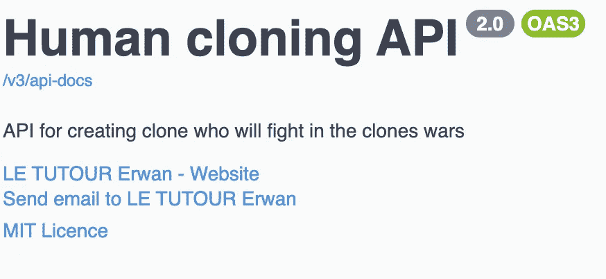
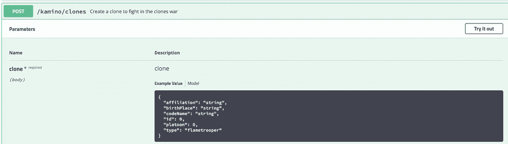
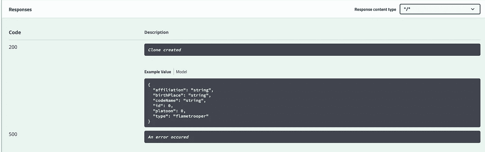
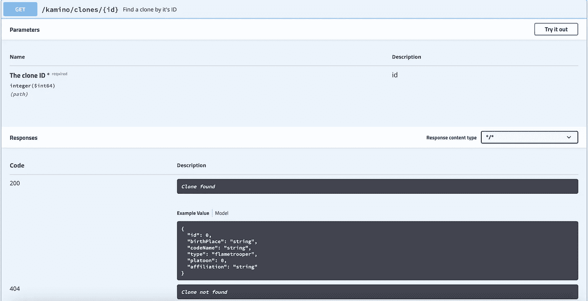
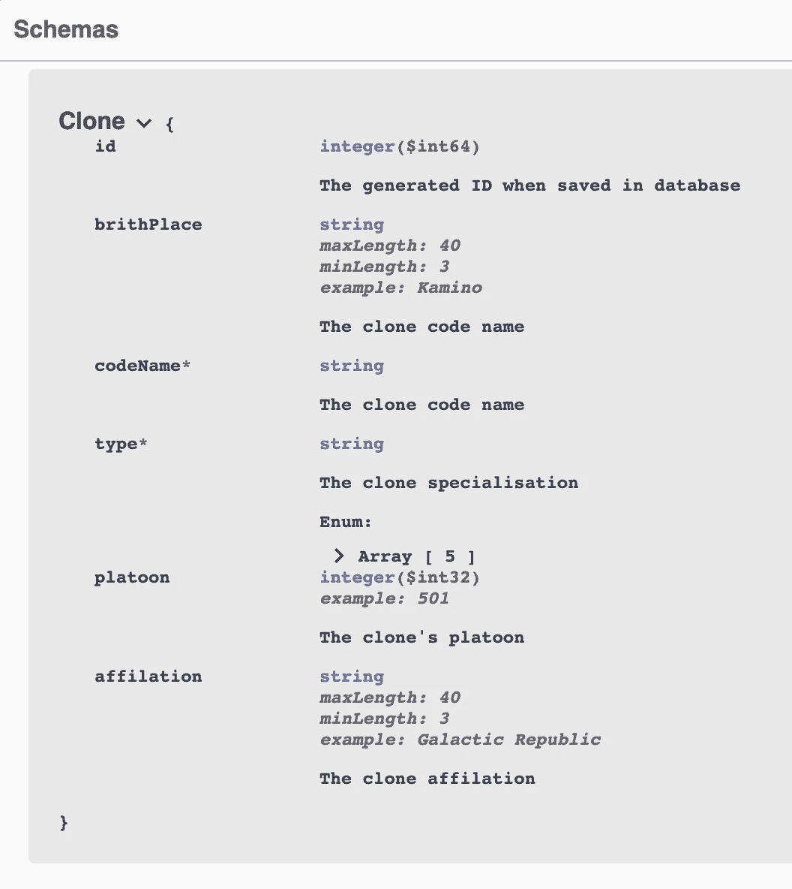

# 从 Swagger 2 迁移到 OpenAPI 3

> 原文：<https://medium.com/javarevisited/migration-from-swagger-2-to-openapi-3-391f3e97da73?source=collection_archive---------0----------------------->

## 发现记录我们 API 的新方法

许多 API 都是使用 [Swagger](https://swagger.io/) 编写的，这是一件好事，API 被编写成文档，便于理解它们如何工作以及如何调用它们。
但是很多这些 API 都是使用 Swagger 2 编写的，现在 [OpenApi](https://swagger.io/specification/) 发布了([从 2017 年开始，实际版本是 3.1，从 15/02/2021](https://en.wikipedia.org/wiki/OpenAPI_Specification#Release_dates) 开始可用)一些项目没有更新他们的文档工具，我将在本文中尝试帮助你这样做。

# 你需要什么

为了遵循本教程，您将需要一个 [REST API](/javarevisited/top-5-books-and-courses-to-learn-restful-web-services-in-java-using-spring-mvc-and-spring-boot-79ec4b351d12?source=---------17------------------) ，因此您可以:

*   按照[教程来构建你的 API](/javarevisited/building-a-simple-rest-api-with-springboot-3f2e4b123ebb) 和[教程来文档化它](/javarevisited/documenting-your-api-with-swagger-c27a94104135)
*   克隆这个库的[swagger 分支](https://github.com/ErwanLT/HumanCloningFacilities)
*   使用 Swagger 2 准备好您自己的 API 文档

# 步骤 1:摆脱 SpringFox 依赖关系

当我们第一次实现 Swagger 时，我们将这些依赖项添加到 have 中

*   在[http://localhost:8080/v2/API-docs](http://localhost:8080/v2/api-docs)生成的 json
*   在[的界面 http://localhost:8080/swagger-UI . html](http://localhost:8080/swagger-ui.html)
*   Bean 验证

我们将不再需要它，所以您可以从您的 [pom.xml](https://maven.apache.org/guides/introduction/introduction-to-the-pom.html) 中取消它们。
这三个依赖项将被一个取代

有了这种依赖性，我们将拥有:

*   json 生成了[http://localhost:8080/v3/API-docs/](http://localhost:8080/v3/api-docs/)
*   UI 页面[http://localhost:8080/swagger-UI . html](http://localhost:8080/swagger-ui.html)
*   bean 验证

在这一点上，我们应该有一些编译问题，因为一些注释由于我们已经替换的丢失的依赖项。我们现在就更正。

# 步骤 2:更改端点的注释

在上一个教程中，我们使用一个配置类记录了我们的 API

这里我们有两个选择

*   声明新的配置类
*   在我们的[控制器](https://javarevisited.blogspot.com/2017/11/difference-between-component-service.html)中使用注释

我会给你 2 个 OpenApi 方式的前面的代码等价的例子

## 配置类

## 带注释

## 它在用户界面上会是什么样子

前面的例子在 UI 页面中看起来是一样的，所以由您来选择您想要使用的方法

# 步骤 3:更改端点的注释

## Swagger 2.0 注释

让我们举一个例子

这里有一个用 classique Swagger 2 注释记录的 [POST 方法](https://www.java67.com/2016/09/when-to-use-put-or-post-in-restful-web-services.html)

*   **@ApiOperation** :描述针对特定路径的操作或者典型的 HTTP 方法。
*   **@ApiResponses** :一个允许多个 ApiResponse 对象列表的包装器。这里我有 2 个 **@ApiResponse** 来描述我的 200 和 500 HTTP 状态返回代码。
    我还可以描述我的状态将返回什么，200 将用一个 objet 响应，所以我将 object 类添加到*响应*字段。

这将在 UI 页面中呈现如下图片

这是 GET 方法的第二个例子

这里除了前面的注释，我还使用 **@ApiParam** 添加了方法参数的文档。

有了新的依赖关系，所描述的注释不再相同。
那么让我们来看看发生了什么变化。

## OpenAPI 注释

在上面的例子中，我们可以看到一些操作上的变化。

*   **@ API Operation**->**@ Operation**，*值*字段变为*汇总*，*注释*变为*描述。*
*   **@ApiResponse** :字段 *code* 变成 *responseCode* 不再是整数而是字符串，字段 *message* 也变成 *description* 。
    最大的变化是响应字段现在是一个注释。**@内容。**
*   **@ApiParam** 变成**@参数**

它们是其他的变化，但是由于这里没有用到，我推荐你使用 [openAPI 文档](https://springdoc.org/#Introduction)。

# 步骤 4:更改模型的注释

## Swagger 2.0 注释

所以在 Swagger 2 中，当我想记录一个对象时，我的类看起来像这样

如你所见，我的类用 **@ApiModel** 注释，它的属性用 **@ApiModelProperty 注释。** **@ ApiModelProperty**允许我们添加描述(值)、名称、数据类型、示例值和允许值等定义。

## OpenAPI 注释

如果您仔细查看我的 ApiResponse(状态代码为 200)，您将会看到响应现在是 **@Content** ，并且我们为 schema 字段提供了将像这样返回的类@ Schema(implementation = my class . class)。有了注释，OpenApi 知道加载哪个类，所以我不必用类似注释来注释我的类，但是我仍然可以记录我的属性。

那么，我在这里做了什么？
像以前一样，我的字段被记录，但我使用了两种不同的方法进行验证(大小)。

我可以使用 bean 验证注释，或者我可以使用模式注释的属性，结果将是相同的。

位置属性不再存在，字段的顺序与类的顺序相同。

感谢您的阅读时间，和以前一样，本教程中使用的代码可以在[this Github repository](https://github.com/ErwanLT/HumanCloningFacilities)toOpenApi 分支中找到。