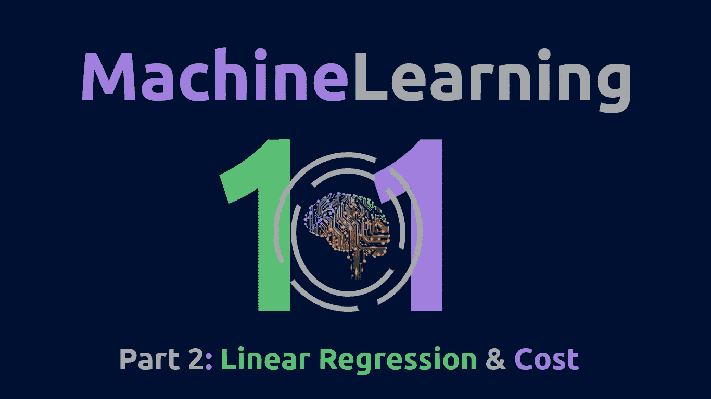
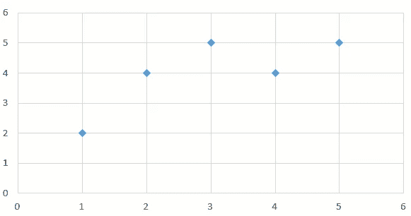
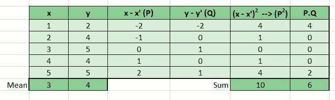
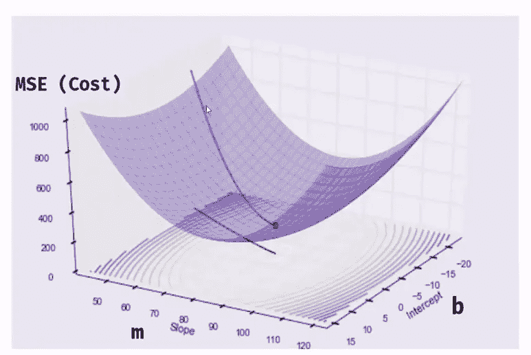
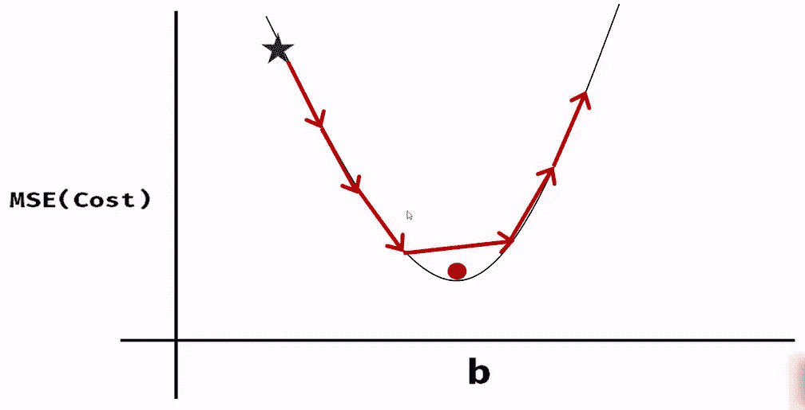
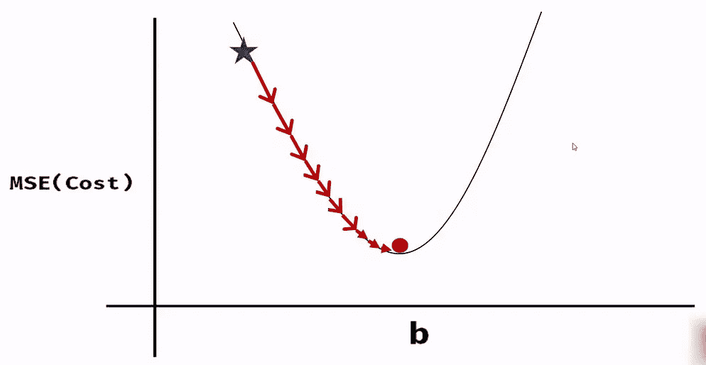
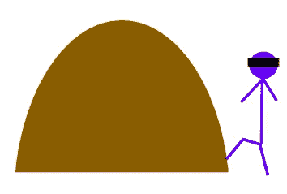
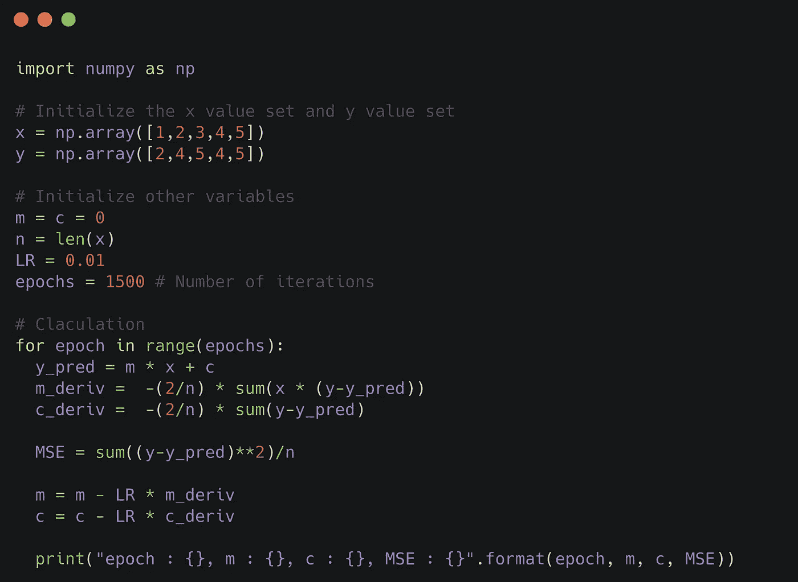

# ML 101(第二部分):线性回归、梯度下降和成本

> 原文：<https://medium.com/javarevisited/ml-101-part-2-linear-regression-gradient-descend-cost-58950ae85301?source=collection_archive---------0----------------------->



又见面了。

今天的帖子是我的机器学习 101 帖子系列的第 2 部分。在阅读这篇文章之前，如果你对机器学习一无所知，你可以参考[第一部分:机器学习基础](/@phantomgrin/ml-101-part-1-basics-of-machine-learning-1734836696c1)。

为今天的主题做个介绍，我将回忆一下我在以前的帖子中提到的一些事情，这些事情与线性回归有关。

使用机器学习，我们可以回答 5 种类型的问题。所以机器学习中的所有算法都是为了回答其中一个问题而形成的。以下是这些问题及其相关算法:

1.  多少或多少？→ ***回归算法***
2.  a 还是 B？→ ***分类算法***
3.  这是怎么组织的？→ ***聚类算法***
4.  很奇怪吗？→ ***异常检测算法***
5.  下一步该怎么办？→ ***强化学习算法***

大多数时候，基于问题 1 和 2 的算法是在监督学习下，而问题 3 和 4 是在非监督学习下。(在 [ML 101:第一部分](/@phantomgrin/ml-101-part-1-basics-of-machine-learning-1734836696c1)中查看更多关于监督、非监督和强化学习的信息)

现在我们来看看线性回归。顾名思义，线性回归属于回归算法。它回答了' ***多少*** 或' ***多少'*** 的问题。

为了讨论这个话题，让我们举一个例子:我们要测量运动的小时数和燃烧的卡路里数之间的关系。(假设卡路里的单位是千焦)。因为小时是独立变量，所以它是 X 轴，而卡路里是 Y 轴(因变量)。


具有 x 和 y 坐标的表格

如果我们将它绘制成散点图，我们将得到如下结果:



散点图中上表的点

在这里，蓝色菱形表示上表中提到的实际值。

那么，如果有人告诉你他们锻炼的小时数，并问你大概消耗了多少卡路里呢？这就是我们需要一种机制来预测随时间变化的卡路里。这些机制之一是线性回归。

在线性回归中，我们所做的是找到最佳拟合线，这样，我们可以使用该线预测新`**X**`的值。

从学校级别的数学中，我们知道一条线的方程:y=mx+c，对于线性回归也是一样的。我们做的是，系统地找出这个“m”和“c”。由此，我们确定最佳拟合线或 y^ (y hat)

> y^ = mx + c

让我们来看看如何为上面的数据集计算最佳拟合线。

在`**y^ = mx + c**`中找到`**m**`的数学方程式是:

```
m = ∑ (x-x’).(y-y’) / ∑(x-x’)²
```

因此，我们将扩展上表来计算如下等式:



方程式的计算

现在使用上表:

```
m = 6 / 10 = 0.6
```

太好了！现在我们必须找到 c，我们该怎么做呢？

在求上述方程的 c 时，有一个非常重要的概念我们需要知道。也就是说，最佳拟合线应该穿过点(A)，在该点处，线`**x = x’**`(x 的平均值)和`**y = y’**`**(y 的平均值)相互交叉。查看下图，了解更多信息:**

****

**最佳拟合线，x=x '线和 y=y '线在 A 点相交**

**如上所述，点 A 是所有 3 条线上的点；`**y^= mx+c**`、`**y=y’**`和`**x=x’**`。因此，我们可以使用该逻辑计算 c(我们已经知道 m):**

```
y' = mx'+cc = y' - mx' = 4 - (0.6 * 3)
c = 4 - 1.8
c = 2.2
```

**因此，在该数据集中，最佳拟合线为:**

> **y^ = 0.6x + 2.2**

**太好了！！我们找到了数据集的最佳拟合线！很简单，不是吗？但是在实际场景中，数据集比我举的例子要复杂得多。因此，该模型不能容易地计算最佳拟合线。这就是为什么线性回归以迭代的方式发生。那是什么意思？**

**当模型获得数据集时，在第一次迭代中，他计算随机最佳拟合线的`**m**`和`**c**`。然后，他使用实际值和预测值查看最佳拟合线的“ ***误差*** ”或“ ***成本*** ”。然后在下一次迭代中，他再次调整最佳拟合线的`**m**`和`**c**`，以最小化该误差。这个循环会持续我们在模型中提到的迭代次数。因此，我们需要对模型进行微调，使其停在最佳拟合直线方程上。**

****

**m 和 c 的值在每次迭代中更新以获得最优解(来源:[走向数据科学，2019](https://towardsdatascience.com/linear-regression-using-gradient-descent-97a6c8700931) )**

**让我们更详细地了解一下这是如何发生的:**

**正如我之前提到的，首先，我们从随机的 m 和 c 值(通常都为零)开始，并计算这些值的 y^。下一步，我们计算这一行的“ ***成本*** 或“ ***误差*** ”。有许多函数可以用于这种计算。这些被称为 ***成本函数*** 。一个这样的函数是“*”或“ ***均方误差*** ”。***

***MSE 取实际值和预测值之间的差值，并对其求平方，以避免抵消负值和正值。然后将所有这些相加，除以数据点的数量。***

```
*MSE = (1/n) ∑ (y-y^)²*
```

***MSE 将是我在这篇文章后面使用的成本函数。但是，让我告诉你还有哪些可用的成本函数:***

```
*SEE = Standard Error of Estimate
SEE = √ ∑(y-y^)² /(n-2)MAE = Mean Absolute Error
MAE = (1/n) ∑ |y-y^|RAE = Relative Absolute Error
RAE = ∑ |y-y^| / ∑ |y-y'|RSE = Relative Squared Error
RSE = ∑ (y-y^)² / ∑ (y-y')²CoD = Coefficient of Determination (R²)
CoD = 1 - (∑(y-y^)² / ∑(y-y')²) 
CoD = 1 - RSE*
```

***所以现在我们选择了`**MSE**`作为我们的成本函数。我们接下来要做的是使用成本函数来计算估计的 m 和 c 的成本。然后我们需要对`**m**`和`**c**`做一个小的调整，这样我们可以进一步最小化 MSE， ***(如果可能的话)*** 。***

***你没奇怪我为什么说:“如果可能”吗？那是因为`**m,**` `**c**`和`**MSE**`之间的图形总是弯曲的，如下图:***

******

***MSE、m 和 b 之间的图(在我们的例子中是 c)[来源: [YouTube，2019](https://www.youtube.com/watch?v=vsWrXfO3wWw) ]***

***如果我们一次取两个平面并绘制此图，它将给出如下两个曲线图:***

************

***MSE 和 m 以及 MSE 和 b 之间的图(在我们的例子中是 c)[来源: [YouTube，2019](https://www.youtube.com/watch?v=vsWrXfO3wWw) ]***

***所以我们需要正确地找到图表的最低点。如果我们采取固定大小的步骤，很有可能会超过最低点。相反，我们需要根据我们在图表中的当前位置采取措施。***

************

***如何通过固定大小的步骤移动将无法达到全局最小值，而采取成比例的步骤将在达到全局最小值方面起作用。【来源: [YouTube，2019](https://www.youtube.com/watch?v=vsWrXfO3wWw)***

***所以我想到的下一个问题是，我们如何确定该走多大的一步，向哪个方向走。这就是梯度下降开始起作用的时候。***

***想象你是下图中被蒙住眼睛的登山者:***

******

***你的脚会辨别山坡的坡度，是陡峭还是平坦。根据这一点，你会知道你的步伐应该有多大。***

***另一方面，从斜坡的方向，你可以猜出你下一步需要走的方向。***

***例如，在山脚附近，你会感觉山很陡，你会向上迈出巨大的一步以快速到达山顶。同样，在接近顶部时，你会觉得斜坡几乎是平的，你会采取较小的步骤以避免过度。***

***像登山者一样，梯度下降在调整`**m**`和`**c**`时也要考虑两件事。也就是往哪个方向走，步子要迈多大。***

***为此，我们需要测量在特定时刻`MSE-m-c curve graph`中一点的斜率。那么怎么才能走坡呢？这时，你的高级数学知识就很重要了😋***

***两点(或一条线)之间的斜率计算如下:→***

```
*change in y / change in x
= (y1-y2) / (x1-x2) 

      → ***dy / dx****
```

***那一分呢？我们如何计算一个点的斜率？因为两个点完全相同，所以`dy`和`dx`都将为零，不是吗？***

***在这种情况下，我们通过考虑 y 和 x 的微小变化(接近零)来计算斜率。这由`**△y / △x**`表示。我们用导数的知识来计算这个`**△y**`和`**△x**`。***

***让我们看看我们的 MSE 方程:***

```
*MSE = (1/n) ∑ (y-y^)²*
```

***我们可以用下面的 m 和 c 写这个方程，用方程`mx+c`代替`y^`。***

```
*MSE = (1/n) ∑ (y-(mx+c))²*
```

***如你所见，我们需要找到 MSE 和两个变量之间的关系。那就是`m`和`c`。在这种情况下，我们不能简单地计算整个方程的导数。相反，我们必须计算出“ ***【偏导数】***”(∂).偏导数是在假设方程中所有其他变量都为零的情况下计算的导数，除了我们考虑的变量。这意味着，如果我们想计算上述方程对`m`的偏导数，我们假设`c`为零，并计算方程的导数。***

***因此，MSE 方程关于`m`和`c`的偏导数如下:***

```
*∂/∂m = (2/n) ∑ -x(y-(mx+c))
∂/∂c = (2/n) ∑ -(y-(mx+c))*
```

***现在我们知道该往哪个方向走，才能达到全局最小值。台阶的大小呢？这就是“ ***学习率***”(LR)的概念发挥作用的地方。学习率是一个固定值，表示我们的校正或学习应该有多大。LR 和偏导数一起给出了我们需要对`m`或`c`进行的总调整，以便在下一个`m`或`c`进行推导。***

> ***尽管 LR 是一个固定值，但当与偏导数相乘时，它会根据点在图上的位置给出一个比例值。***

***好吧！现在让我们用一个简单的代码来实现它。(你可以用 Jupyter 笔记本或者 Colab 笔记本试试这个)***

******

***实现梯度下降算法的代码([代码](https://gist.github.com/PhantomGrin/a6ace45009bd893f93ec1ff1e9154f7b))***

***输出:***

```
*epoch : 0, m : 0.6000000000000176, c : 2.1999999999999362, MSE : 0.47999999999999987 
epoch : 1, m : 0.6000000000000176, c : 2.1999999999999362, MSE : 0.47999999999999987 
epoch : 2, m : 0.6000000000000176, c : 2.1999999999999362, MSE : 0.47999999999999987
...
...
...
epoch : 1497, m : 0.6000000000000176, c : 2.1999999999999362, MSE : 0.47999999999999987 
epoch : 1498, m : 0.6000000000000176, c : 2.1999999999999362, MSE : 0.47999999999999987 
epoch : 1499, m : 0.6000000000000176, c : 2.1999999999999362, MSE : 0.47999999999999987*
```

***你可以看到计算出的`m`和`c`与我们手动计算的`m`和`c`几乎吻合。***

> ***请注意，LR 和 epochs 是要微调的值。最初将纪元设置为一个较低的值，如 20，将 LR 设置为 3 个小数点(例如 0.001)。运行代码，看看 MSE 是增加还是减少。如果增加，LR 变小，反之亦然，如果减少。找到合适的 LR 后，增加历元。***

***找到了。我们涵盖了我们需要知道的关于线性回归的一切，包括成本函数和梯度下降！我们还检查了代码是如何完成的。然而，这些模型有着悠久的历史，并且它们有自己的使用各种 python 库的实现。最佳实践是使用它们而不是手动编码，除非您想尝试一下。***

***我希望我增加了你的知识。😇让我们在下一个帖子里见面吧。同时，如果你有任何疑问或地方，请随时发表评论。***

***快乐学习！❤***

> ***PS:如果你想查看如何用 scikit-learn 实现线性回归，可以查看我下面的要点。👇***

***[https://gist . github . com/phantom grin/10 DC 8 c 7 c 9 a 796 c 91 CAC 386 ee 779 f 017 e](https://gist.github.com/PhantomGrin/10dc8c7c9a796c91cac386ee779f017e)***