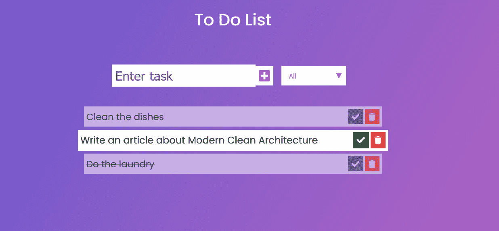

# 现代清洁建筑

> 原文：<https://medium.com/javarevisited/modern-clean-architecture-c1765f8f3fc1?source=collection_archive---------0----------------------->

干净的建筑是罗伯特·c·马丁创造的一个术语。主要思想:
实体和用例独立于框架、UI、数据库和外部服务。

干净的架构风格对可维护性有积极的影响:

*   我们可以在没有框架、UI 和基础设施的情况下测试领域实体和用例。
*   技术决策可以在不影响领域代码的情况下改变。反之亦然。甚至有可能不费吹灰之力就切换到新的框架。

我的目标是使学习曲线变平，减少实现一个干净架构的工作量。这就是为什么我创建了[现代清洁建筑](https://github.com/bertilmuth/modern-clean-architecture) 图书馆。

在本文中，我将向您展示如何创建一个具有现代干净架构的应用程序。从一个 [HTML](/javarevisited/10-best-html-and-css-courses-for-beginners-in-2021-6757eec00032) / [JavaScript](/javarevisited/my-favorite-free-tutorials-and-courses-to-learn-javascript-8f4d0a71faf2) 前端到一个 [Spring Boot 后端](/javarevisited/top-10-courses-to-learn-spring-boot-in-2020-best-of-lot-6ffce88a1b6e)。重点将放在后端。

让我们从示例应用程序的概述开始。永恒的经典。

## 待办事项列表应用程序示例

一个*待办事项列表*是一个*任务*的集合。一个任务有一个*名称*，并且或者*完成或者*未完成。作为用户，您可以:

*   创建一个单一的待办事项列表，并坚持下去
*   添加任务
*   完成一项任务，或“不完成”它
*   删除任务
*   列出所有任务
*   过滤已完成/未完成的任务

下面是包含 1 个未完成任务和 2 个已完成任务的待办事项列表:

我们从应用程序的核心领域实体开始。然后我们向外走到[前端。](/javarevisited/6-best-frontend-development-courses-for-beginners-to-learn-in-2021-f2772157864)

## 域实体

中心域实体是 [TodoList](https://github.com/bertilmuth/modern-clean-architecture/blob/main/samples/todolist/src/main/java/com/example/todolist/domain/TodoList.java) 和 [Task](https://github.com/bertilmuth/modern-clean-architecture/blob/main/samples/todolist/src/main/java/com/example/todolist/domain/Task.java) 。

*待分解*实体包含:

*   唯一的 id，
*   任务列表，
*   添加、完成、删除任务的域方法…

*TodoList* 实体不包含公共 setters。Setters 会破坏正确的封装。

这是 [TodoList](https://github.com/bertilmuth/modern-clean-architecture/blob/main/samples/todolist/src/main/java/com/example/todolist/domain/TodoList.java) 实体的一部分。[龙目岛](https://projectlombok.org/)标注缩短代码。

*AggregateRoot* 接口有什么用？聚合根是 Eric Evans 在[领域驱动设计](/javarevisited/7-best-books-to-learn-design-patterns-for-java-programmers-5627b93eefdb) (DDD)中提出的一个术语:

> 聚合是一组相关联的对象，出于数据更改的目的，我们将它们视为一个单元。每个集合都有一个根和一个边界。边界定义了集合内部的内容。根是聚合中包含的单个特定实体。

我们只能通过聚合根来更改聚合的状态。在我们的例子中，这意味着:我们总是必须使用 *TodoList* 来添加、删除或更改任务。

这允许 *TodoList* 执行约束。例如，我们不能将名称为空的任务添加到列表中。

*AggregateRoot* 接口是 [jMolecules](https://github.com/xmolecules/jmolecules) 库的一部分。该库使得 DDD 概念在域代码中显而易见。在构建过程中，[byte buddy 插件](https://github.com/xmolecules/jmolecules-integrations/tree/main/jmolecules-bytebuddy)将注释映射到 [Spring 数据注释](https://www.java67.com/2021/01/spring-data-jpa-interview-questions-answers-java.html)。

所以我们只有一个模型。用于表示领域概念和持久性。尽管如此，我们在域代码中没有任何特定于持久性的注释。我们不把自己绑在任何框架上。

[*任务*](https://github.com/bertilmuth/modern-clean-architecture/blob/main/samples/todolist/src/main/java/com/example/todolist/domain/Task.java) 类类似，但它实现了 jMolecules *实体*接口代替:

任务的构造函数是包私有的。所以我们不能从[域包](https://github.com/bertilmuth/modern-clean-architecture/tree/main/samples/todolist/src/main/java/com/example/todolist/domain)之外创建*任务*的实例。而*任务*类是[不可变](/javarevisited/how-to-create-an-immutable-list-list-and-map-in-java-5ac1254c128?source=---------31------------------)。在聚合的边界之外，不可能对其状态进行任何更改。

我们需要一个存储库来存储 *TodoList。*在领域代码中坚持领域术语，称为<https://github.com/bertilmuth/modern-clean-architecture/blob/main/samples/todolist/src/main/java/com/example/todolist/domain/TodoLists.java>*:*

*代码再次使用了 jMolecues 注释: *Repository* 。在构建期间，ByteBuddy 插件将其翻译成一个 [Spring 数据仓库](https://javarevisited.blogspot.com/2021/08/top-5-spring-data-jpa-courses-for-java.html)。*

*我们将跳过域异常，因为它们没有什么特别的。这就是完整的[域包](https://github.com/bertilmuth/modern-clean-architecture/tree/main/samples/todolist/src/main/java/com/example/todolist/domain)。*

## *行为(即用例)*

*接下来，我们定义对最终用户可见的应用程序的行为。用户与应用程序的任何交互如下进行:*

1.  *用户界面发送*请求*。*
2.  *后端通过执行一个*请求处理程序来做出反应。*请求处理器完成完成请求所需的一切:
    -访问数据库
    -调用外部服务
    -调用域实体方法*
3.  *请求处理器**可以**返回一个*响应*。*

*我们用 Java 8 函数接口实现了一个*请求处理器*。*

*返回*响应*的处理程序实现 *java.util.Function* 接口。下面是[*add task*](https://github.com/bertilmuth/modern-clean-architecture/blob/main/samples/todolist/src/main/java/com/example/todolist/behavior/AddTask.java)*处理程序的代码。这个处理程序**

*   **从[*AddTaskRequest*](https://github.com/bertilmuth/modern-clean-architecture/blob/main/samples/todolist/src/main/java/com/example/todolist/behavior/request/AddTaskRequest.java)*，*中提取待办事项列表 id 和任务名称**
*   **在存储库中查找待办事项列表(或者抛出异常)，**
*   **将请求中名称为的任务添加到列表中，**
*   **返回一个带有添加的任务 id 的[*AddTaskResponse*](https://github.com/bertilmuth/modern-clean-architecture/blob/main/samples/todolist/src/main/java/com/example/todolist/behavior/response/AddTaskResponse.java)*。***

***Lombok 使用 *TodoLists* 存储库接口创建一个构造函数作为构造函数参数。我们将任何外部依赖作为[接口](https://javarevisited.blogspot.com/2013/04/10-abstract-class-and-interface-interview-question-java-answers.html#axzz4pk4W5ie3)传递给处理程序的构造函数。***

**请求和响应是不可变的对象:**

**现代干净架构库[(反)序列化 JSON](https://www.java67.com/2017/05/how-to-convert-java-object-to-json-using-Gson-example-tutorial.html) 。**

**接下来，是一个不返回响应的处理程序的例子。 [*删除任务*](https://github.com/bertilmuth/modern-clean-architecture/blob/main/samples/todolist/src/main/java/com/example/todolist/behavior/DeleteTask.java) 处理程序接收一个 [*删除任务请求*](https://github.com/bertilmuth/modern-clean-architecture/blob/main/samples/todolist/src/main/java/com/example/todolist/behavior/request/DeleteTaskRequest.java) 。因为处理程序没有返回响应，所以它实现了*消费者*接口。**

**还有一个问题:谁创建了这些处理程序？**

**答案:实现 [*行为模型*](https://github.com/bertilmuth/requirementsascode/blob/master/requirementsascodecore/src/main/java/org/requirementsascode/BehaviorModel.java) 接口的类。对于这种请求，行为模型将每个*请求*类映射到*请求处理程序*。**

**下面是[*TodoListBehaviorModel*](https://github.com/bertilmuth/modern-clean-architecture/blob/main/samples/todolist/src/main/java/com/example/todolist/behavior/TodoListBehaviorModel.java)的一部分:**

**`user(...)`语句定义了请求类别。对于返回*响应*的处理程序，我们使用`systemPublish(...)`。而`system(...)`则是针对那些没有。**

***行为模型*有一个外部依赖作为接口传入的构造函数。它创建所有的处理程序，并将适当的依赖项注入其中。**

**通过配置*行为模型*的依赖关系，我们配置了所有的处理程序。这正是我们想要的:一个我们可以改变或转换对技术的依赖的中心。这就是技术决策如何在不影响领域代码的情况下改变。**

## **web 层(即适配器)**

**现代[清洁架构](/javarevisited/clean-architecture-a-must-read-software-design-book-for-developers-41189b8ca122)中的 web 层可以非常薄。在其最简单的形式中，它只包含两个类:**

*   **一个用于依赖项配置的类**
*   **一个用于异常处理的类**

**下面是[*TodoListConfiguration*](https://github.com/bertilmuth/modern-clean-architecture/blob/main/samples/todolist/src/main/java/com/example/todolist/adapter/spring/TodoListConfiguration.java)*类:***

***Spring 将 *TodoLists* repository 接口的实现注入到 *behaviorModel(…)* 方法中。该方法创建了一个作为 bean 的*行为模型*实现。***

**如果应用程序使用外部服务，configuration 类是将具体实例创建为 beans 的地方。并将它们注入*行为模型*。**

**那么，[控制器](https://javarevisited.blogspot.com/2017/11/difference-between-component-service.html)都在哪里呢？**

**好吧。不需要你去创造任何东西。至少如果你只处理 POST 请求的话。(关于 GET 请求的处理，请参见后面的问答。)**

**[*spring-behavior-web*](https://github.com/bertilmuth/modern-clean-architecture/tree/main/spring-behavior-web)*库是*现代洁净建筑*库的一部分。我们为 POST 请求定义了一个端点。我们在 [*应用程序中指定该端点的 URL。*](https://github.com/bertilmuth/modern-clean-architecture/blob/main/samples/todolist/src/main/resources/application.properties)***

**`behavior.endpoint = /todolist`**

**如果该属性存在，spring-behavior-web 将在后台为端点设置一个控制器。该控制器接收 POST 请求。**

**我们不需要编写特定于 Spring 的代码来添加新的行为。我们不需要添加或更换控制器。**

**当端点接收到 POST 请求时，会发生以下情况:**

1.  **spring-behavior-web 反序列化请求，**
2.  **spring-behavior-web 将请求传递给由行为模型配置的行为，**
3.  **该行为将请求传递给适当的请求处理器(如果有的话)，**
4.  **spring-behavior-web 序列化响应并将其传递回端点(如果有端点的话)。**

**默认情况下，spring-behavior-web 将每个对请求处理程序的调用包装在一个事务中。**

## **发送发布请求**

**一旦我们启动了 [Spring Boot 应用程序](https://www.java67.com/2018/05/difference-between-springbootapplication-vs-EnableAutoConfiguration-annotations-Spring-Boot.html)，我们就可以向端点发送 [POST 请求](https://www.java67.com/2019/03/7-examples-of-httpurlconnection-in-java.html)。**

**我们在 JSON 内容中包含了一个`@type`属性。以便 spring-behavior-web 可以在反序列化期间确定正确的请求类。**

**例如，这是待办事项应用程序的一个有效的`curl`命令。它向端点发送一个[*FindOrCreateListRequest*](https://github.com/bertilmuth/modern-clean-architecture/blob/main/samples/todolist/src/main/java/com/example/todolist/behavior/request/FindOrCreateListRequest.java)*。***

***`curl -H "Content-Type: application/json" -X POST -d '{"@type": "FindOrCreateListRequest"}' [http://localhost:8080/todolist](http://localhost:8080/todolist)`***

***这是在 Windows PowerShell 中使用的相应语法:***

***`iwr http://localhost:8080/todolist -Method 'POST' -Headers @{'Content-Type' = 'application/json'} -Body '{"@type": "FindOrCreateListRequest"}'`***

## ***异常处理***

***spring-behavior-web 的异常处理与“普通”spring 应用程序没有什么不同。我们创建一个用`@ControllerAdvice`注释的类。我们将带有`@ExceptionHandler`的方法注释放在其中。***

***参见[*TodoListExceptionHandling*](https://github.com/bertilmuth/modern-clean-architecture/blob/main/samples/todolist/src/main/java/com/example/todolist/adapter/spring/TodoListExceptionHandling.java)示例:***

**注意，在实际应用中，不同的异常类型需要不同的处理。**

## **前端**

**待办事项列表应用程序的前端包括:**

*   **一个 [*HTML 页面*](https://github.com/bertilmuth/modern-clean-architecture/blob/main/samples/todolist/src/main/resources/static/index.html) ，**
*   **一个 [*CSS 文件*](https://github.com/bertilmuth/modern-clean-architecture/blob/main/samples/todolist/src/main/resources/static/styles.css) 用于格式化、**
*   **还有一个 [*main.js JavaScript 文件*](https://github.com/bertilmuth/modern-clean-architecture/blob/main/samples/todolist/src/main/resources/static/main.js)**

**我们这里重点关注 *main.js* 。它发送请求并更新网页。**

**以下是它的部分内容:**

**例如，这是一个[*listtaksrequest*](https://github.com/bertilmuth/modern-clean-architecture/blob/main/samples/todolist/src/main/java/com/example/todolist/behavior/request/ListTasksRequest.java)的 JSON 对象:**

> **const request = { " @ type ":" listasksrequest "，" todoListUuid ":todoListUuid }；**

***post(…)* 方法将*请求*发送到后端，并将*响应*传递给*响应处理程序*。(您作为第二个参数传入的回调函数。)**

**这就是待办事项列表应用程序的全部内容。**

# **问题与答案**

**如果…会怎样**

**…我想发送 GET 请求而不是 POST 请求？**

**…我希望 web 层与行为分开发展？**

**…我想使用与 [Spring](/javarevisited/10-best-online-courses-to-learn-spring-framework-in-2020-f7f73599c2fd) 不同的框架？**

**…我有一个比待办事项列表示例大得多的应用程序。我如何构建它？**

**[这里的](https://github.com/bertilmuth/modern-clean-architecture/wiki/Questions-&-Answers)是 anwers。**

# **结论**

**在本文中，我向您展示了一种实现干净架构的特殊方法。还有很多其他的方法。**

**我的目标是减少构建干净架构的工作量。并拉平学习曲线。**

**为了实现这一点，现代干净架构库提供了以下特性:**

*   ****不可变请求和响应的序列化**没有序列化特定注释。**
*   ****不需要 dto。**您可以在 web 层和用例中为请求/响应使用相同的不可变对象。**
*   ****接收和转发 POST 请求的通用端点**。可以添加和使用新的行为和域逻辑，而无需编写特定于框架的代码。**

**在我的下一篇文章中，我将描述如何测试一个现代的干净的架构。**

**我邀请你访问[现代清洁建筑](https://github.com/bertilmuth/modern-clean-architecture/) GitHub 页面。**

**参见[待办事项示例应用](https://github.com/bertilmuth/modern-clean-architecture/tree/main/samples/todolist)。**

**请在评论中给我反馈。你怎么想？**

**如果你想了解我正在做的事情或给我留言，请在 [LinkedIn](https://www.linkedin.com/in/bertilmuth/) 或 [Twitter](https://twitter.com/BertilMuth) 上关注我。**

# **承认**

**感谢 Surya Shakti 发布原创前端 only [待办事项代码](https://suryashakti1999.medium.com/to-do-list-app-using-javascript-for-absolute-beginners-13ea9e38a033)。**

**感谢 Oliver Drotbohm 为我指出了令人敬畏的 jMolecules 图书馆。**