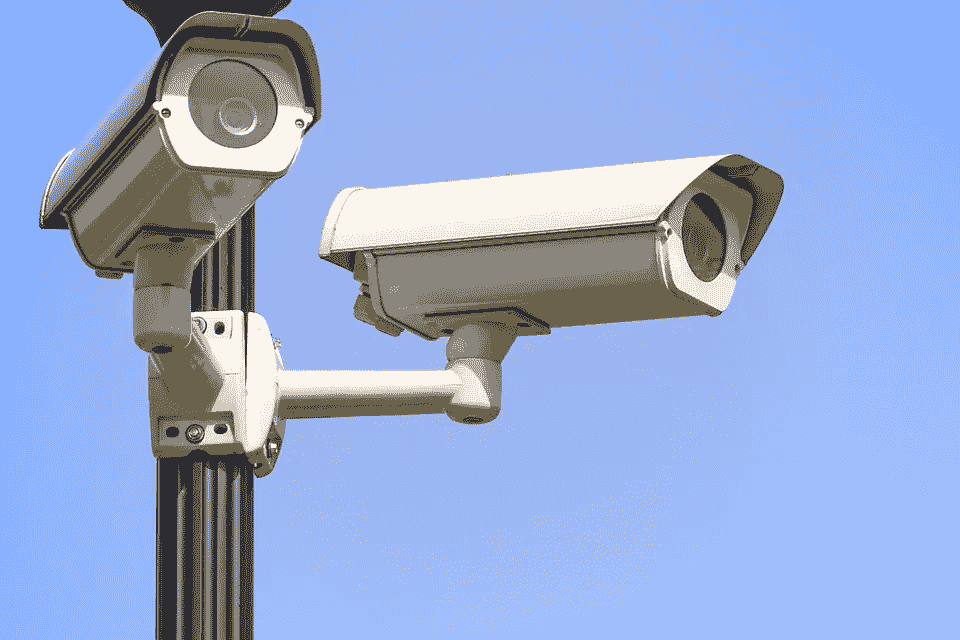
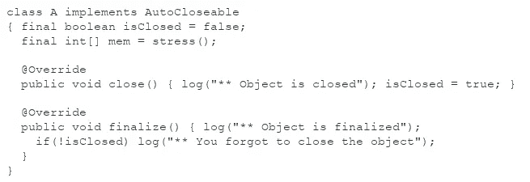
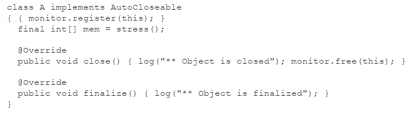
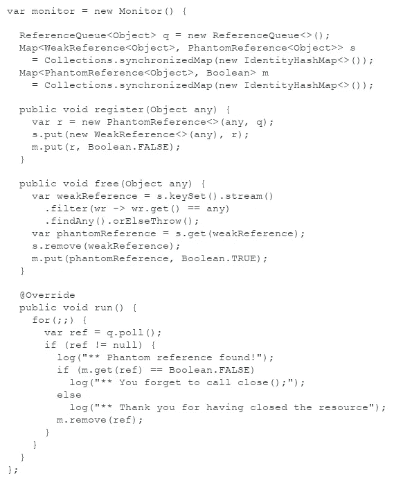
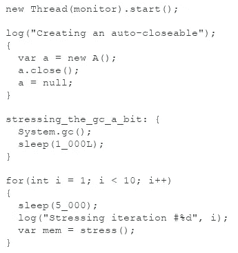
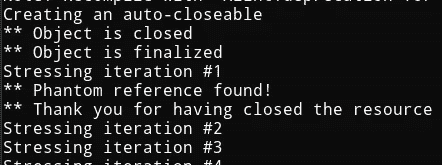
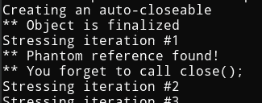

# 通过引用监控 close()

> 原文：<https://medium.com/javarevisited/monitoring-close-via-references-c0b111e98a5?source=collection_archive---------1----------------------->

在这个故事中，我们研究了一种方法来监控 Java 中从`AutoCloseable`接口对`close()`方法的调用。所探索的方法依赖于弱引用和幻影引用。



[https://pix abay . com/photos/monitoring-security-surveillance-1305045/](https://pixabay.com/photos/monitoring-security-surveillance-1305045/)

同时阅读:[docs.oracle.com/en/java/javase/17/docs/api/
java.base/java/lang/ref/PhantomReference.html](https://docs.oracle.com/en/java/javase/17/docs/api/java.base/java/lang/ref/PhantomReference.html)，以及其中的参考文献。

# 一个非范例

为了给本文的主题预热，让我们考虑一个被监控的资源处理程序的非常基本的例子:

[](https://javarevisited.blogspot.com/2014/10/right-way-to-close-inputstream-file-resource-in-java.html)

使用 finalize 进行监控

当[垃圾收集器](http://javarevisited.blogspot.sg/2017/02/use-string-deduplication-to-save-memory-from-duplicates-in-java8.html#axzz53GlhtuGG)试图终结对象时，将会调用`finalize`方法。在该方法中，检查对象是否已经关闭。

这里的操作是日志记录，但是您可以想象不同的事情。至关重要的一点是，确保不要在其他地方再次强烈引用您的对象，以防止最终对它进行垃圾收集。

我们的目标是提供一个类似的行为，而不是重写终结，而是利用引用。

# 三种参考文献

*(本节是非正式的，旨在刷新记忆，不提供关于该主题的全面指导；主要是因为我不确定能得到全部；随意带点准确度)*

## 强引用

强引用是引用对象的最标准方式。基本上，当某个变量持有对一个对象的引用时，该对象就是强可达的。通常情况下:

```
var a = new A();
// the object A is strongly reachable,
// as some variable holds a ref to ita = null;
// the object is not strongly reachable
```

当一个对象是强可达的时，它不能被 GC 单独收集。

## 定稿

当 GC 检测到一个合格的对象时，它将调用它的 finalize 方法。该对象成为最终对象。这种情况肯定只会发生一次。

如果在 [finalize 方法](https://javarevisited.blogspot.com/2012/11/difference-between-final-finally-and-finalize-java.html#axzz5WKm9BB8F)中将对象引用存储在其他地方(强),终结将不再发生，对象最终也不会被垃圾回收。

## 幻影可达

当一个对象不是强可达的，并且不是由弱引用(或软引用)持有时，它就是幻影可达的。它还必须已经被最终确定，并且一个`[PhantomReference](https://javarevisited.blogspot.com/2014/03/difference-between-weakreference-vs-softreference-phantom-strong-reference-java.html)` [](https://javarevisited.blogspot.com/2014/03/difference-between-weakreference-vs-softreference-phantom-strong-reference-java.html)必须引用它。

对于`PhantomReference`来说，泄漏对对象的引用是不可能的:`get()`方法总是返回 null

```
var a = new A();
var phantomReference = new PhantomReference<>(a, queue);
// here, the object is still strongly reachable
assert phantomReference.get() == null;
assert a != null;a = null;
// we stop strongly referencing the object
// the object may, or not, be phantom reachable
// (depending on the finalization)assert phantomReference.get() == null;
```

`queue`参数是一个`java.lang.ref.ReferenceQueue`。可以使用线程安全的引用队列来获取幻影可达的幻影引用。在这一点上，我们知道没有其他的引用可以指向我们的对象，它已经被最终确定。

## 弱可达的

一个对象是弱可达的，如果它不是强可达的并且某个`WeakReference`引用了它。

`WeakReference`可以通过`get()`方法取回对象，但是返回的引用是否为 null 是不确定的。事实上，可以保证当对象仍然是强可达的时候，`get()`方法将返回对象引用。

```
var a = new A();
var weakReference = new WeakReference<>(a);
// here, the object is still strongly reachable
assert weakReference.get() == a;a = null;
// we stop strongly referencing the object
// the object may, or not, be weakly reachableif ((a = weakReference.get()) != null) {
  // the object is now strongly referenced again!
}// only when weakReference.get() == null,
// will the object be finalized.
```

因此，弱引用有时足以取回对象，但不足以阻止垃圾回收。

# 实现监视器

让我们回到监控问题上来。

我们想要的是，在另一个监视线程中，保持某些特定资源种类的状态:

[](https://www.java67.com/2019/08/best-books-to-learn-java-virtual-machine-in-depth.html)

我们想要监控的资源处理程序

资源处理程序在初始化时在我们的监视器对象上注册自己。在一个`close()`操作之后，对象提醒监视器释放。

*`*finalize()*`*的覆盖仅用于记录目的。**

## *监控动态*

*监视器应该保持一个对象是否被关闭的状态。这暗示了一些地图`Object -> Boolean`。*

*这样做的问题是，监视器持有对对象的强引用，这可能会很成问题，因为监视器不会检测对象是否被垃圾收集:不会！*

*这句话更像是建议将地图`PhantomReference -> Boolean`与`ReferenceQueue`一起使用。当监控器从队列中轮询一个虚拟的可到达引用时，它可以检查映射并查看相关的`AutoCloseable`是否已经关闭。*

*如果我们这样做，我们将遇到另一个问题:我们的对象现在不可能提醒监视器它已经关闭。的确，`PhantomReference`不能用来知道它们指的是哪个对象，它们的相等性是由同一性来执行的。这意味着我们不能改变地图来推动关闭状态。*

*我们建议的解决方法是维护另一张`WeakReference -> PhantomReference`地图，并进行以下协作:*

*[](https://javarevisited.blogspot.com/2011/04/garbage-collection-in-java.html)

monitor 对象，实现 Runnable。* 

*当类`A`的`AutoCloseable`对象注册时，它存储一对对自身的引用`(weakRef, phantomRef)`，以及一对`(phantomRef, Boolean)`。*

*当对象完成其`close()`方法时，调用`free()`方法。此时，该对象仍然是强可达的(它在方法参数中！).弱引用肯定会返回对象引用，根据这一点，我们可以移除弱引用并获得相关联的幻像引用。*

*对象不是弱可达的，我们在关闭状态图中挂钩值`Boolean = TRUE`。*

*当对象将被终结时，引用队列将最终轮询幻象引用，并且监视器将能够检查对象是否确实已被正确关闭。*

# *压力测试！*

*对于压力测试，我们将运行这个简单的场景:*

**

*压力测试场景*

*监视器在另一个线程中运行。对象被创建，然后被关闭，然后对它的唯一强引用被取消。*

*我们更新了 GC-thread 优先级，稍微放松了一下。然后，我们运行了一些压力测试，在我堆上分配了大量的整数，以便进行少量的垃圾收集。对象无法与压力测试共存(我的电脑不够强大)。*

*结果如下:*

**

*如您所见，对象终结比队列的轮询结果发生得更快。在`System.gc()`呼叫之后，它会上升一点。只有在第一次压力迭代之后，对象才是幻影可达的，这可能是因为此时系统确实需要内存。*

*监视器已成功检测到我们的对象已关闭。*

*这里是同样的测试，当我们注释`a.close();`指令时:*

**

*事件的顺序没有太大变化。不同的是，我们的监视器成功地探测到物体没有关闭。*

*顺便提一下，如果我们忘记从监视器中释放对象，监视器会认为对象从未关闭，并在那个方向发出警告。因此，这是一种悲观的方法。*

*今天就到这里吧！*

*我希望你喜欢这本书，它给了你尝试参考特性的动力。*

*用法可能很酷，比如资源日志。你有其他想法吗？不要犹豫，在评论中分享它们:-)*