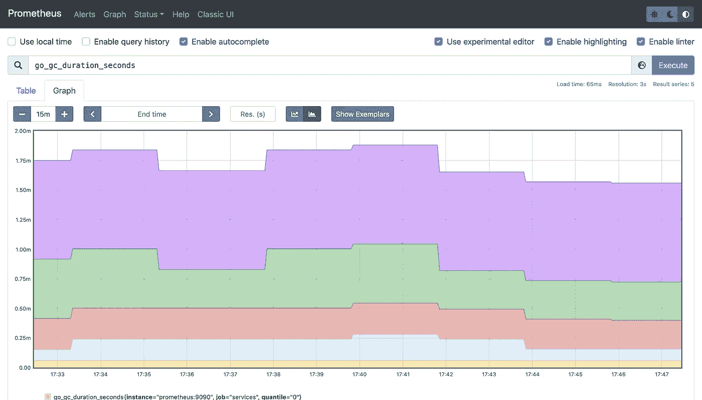

# 普罗米修斯设置与 docker-compose。

> 原文：<https://medium.com/javarevisited/monitoring-setup-with-docker-compose-part-1-prometheus-3d2c9089ee82?source=collection_archive---------1----------------------->

## 完整的监控堆栈—第 1 部分。

本教程是 [**监控堆栈系列**的第 1 部分。](https://verbosemode.dev/list/monitoring-stack-with-prometheus-grafana-and-docker-3e6e4b94523c)