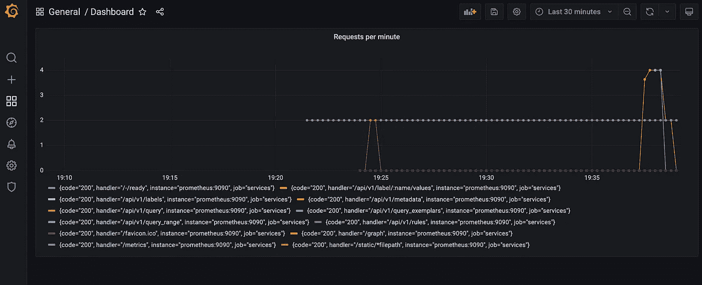

# 用 docker-compose 设置 Grafana。

> 原文：<https://medium.com/javarevisited/monitoring-setup-with-docker-compose-part-2-grafana-2cd2d9ff017b?source=collection_archive---------0----------------------->

## 完整的监控堆栈—第 2 部分。

显示每分钟 HTTP 请求的 Grafana 仪表板。

本教程是 [**监控栈系列**](https://verbosemode.dev/list/monitoring-stack-with-prometheus-grafana-and-docker-3e6e4b94523c) 的第二部分。

# 简而言之:格拉夫纳是什么？

[Grafana](https://grafana.com/) 是一款根据您的指标创建丰富仪表板的工具。Grafana 可以从许多不同的数据源获取信息，包括 Prometheus。