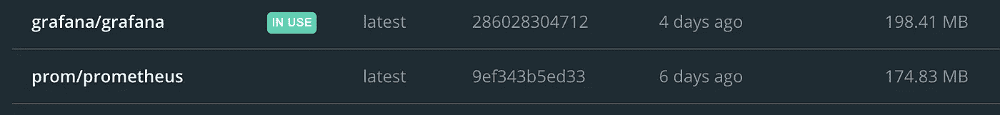
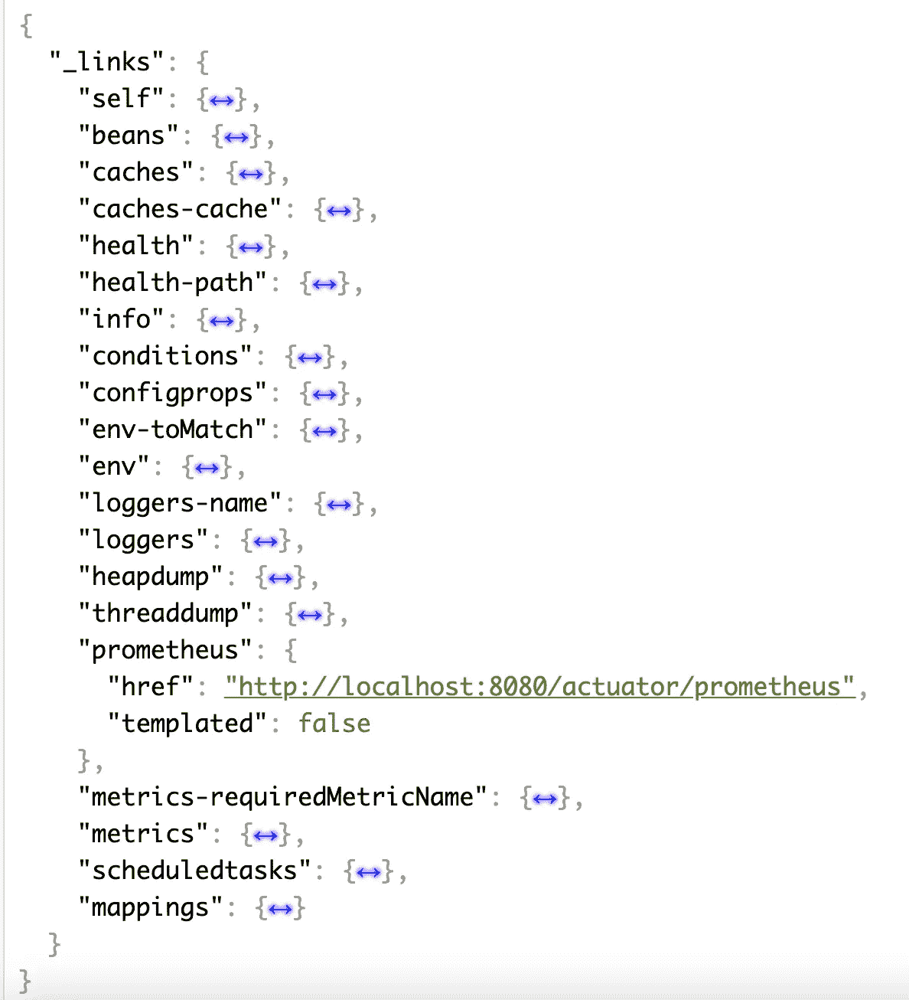
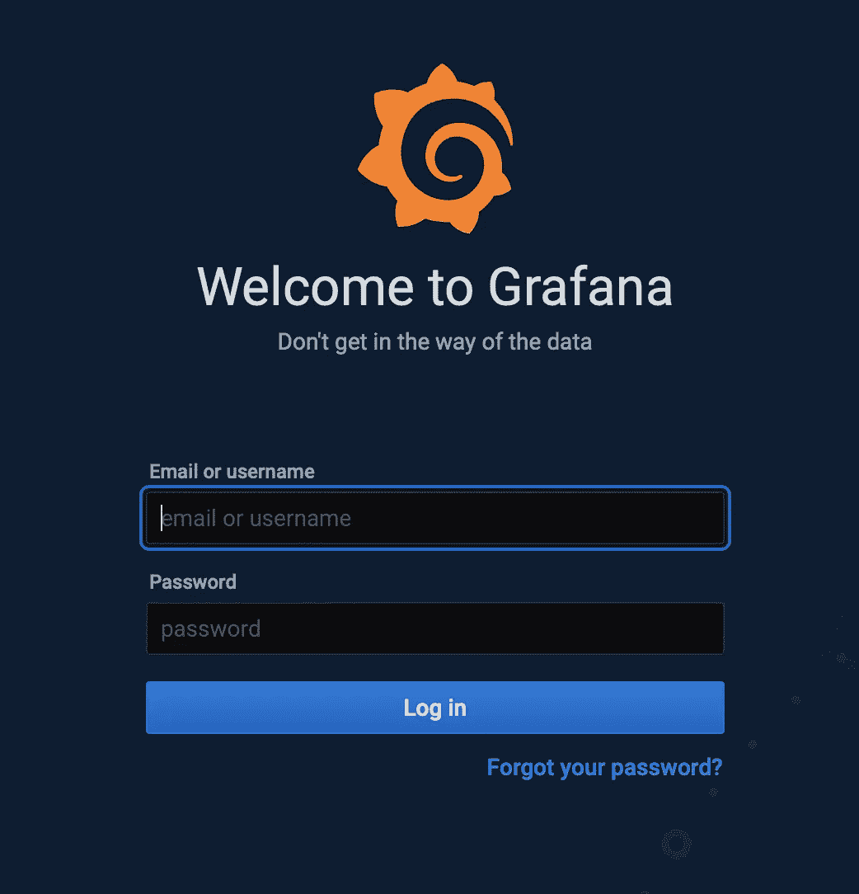
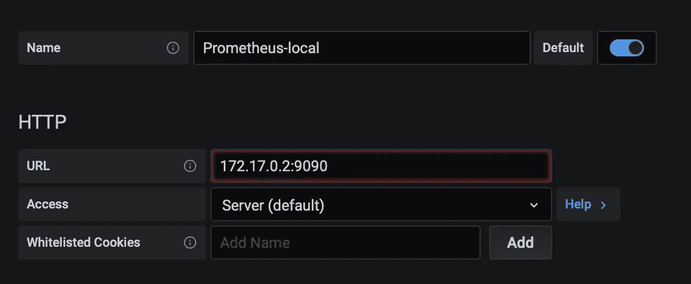

# 使用 Prometheus et Grafana 监控您的 REST api

> 原文：<https://medium.com/javarevisited/monitoring-your-rest-api-with-prometheus-et-grafana-6b909a7b0c69?source=collection_archive---------0----------------------->


在[构建了](/javarevisited/building-a-simple-rest-api-with-springboot-3f2e4b123ebb)、[保护了](/javarevisited/securing-your-rest-api-with-springsecurity-8ba440fe7b58)、[记录了](/javarevisited/documenting-your-api-with-swagger-c27a94104135)我们的 API 之后，我们现在将学习如何监控它。为此，我们将使用[普罗米修斯](https://prometheus.io/)和[格拉法纳](https://grafana.com/):

*   普罗米修斯公司**将负责收集 API 指标**
*   **Grafana** 将在面板中显示，以帮助可视化指标

# 你需要什么

如果你遵循了之前的教程，你只需要[安装 docker](https://docs.docker.com/get-docker/) 来托管我们的 prometheus 和 grafana。
如果您需要运行 API，您可以使用以下两个选项:

*   拉[本库](https://github.com/ErwanLT/HumanCloningFacilities)分支主
*   用 [Spring initializr](https://start.spring.io/) 创建一个快速启动项目
*   安装 docker

# 导入 Grafana 和 Prometheus 图像

要将 grafana 和 Prometheus 添加到您的 docker 本地注册表，请访问 docker-hub 进行搜索:

*   [格拉夫纳](https://hub.docker.com/r/grafana/grafana/)
*   [普罗米修斯](https://hub.docker.com/r/prom/prometheus)

然后，使用命令行拉动。

通常情况下，您应该在 docker CLI 中看到类似这样的内容。

[](https://www.java67.com/2018/02/5-free-docker-courses-for-java-and-DevOps-engineers.html)

你可以直接在[容器](https://javarevisited.blogspot.com/2020/11/why-devops-engineer-learn-docker-kubernetes.html#axzz6dXsEfLvJ)中运行 Grafana，但是普罗米修斯将需要进一步的配置。

# 将我们的指标导出到普罗米修斯

首先，为了导出我们的 API 指标，我们需要向 pom.xml 添加一些新的依赖项

```
<!-- Spring boot actuator to expose metrics endpoint -->
<dependency>
    <groupId>org.springframework.boot</groupId>
    <artifactId>spring-boot-starter-actuator</artifactId>
</dependency>
<!-- Micormeter core dependecy  -->
<dependency>
    <groupId>io.micrometer</groupId>
    <artifactId>micrometer-core</artifactId>
</dependency>
<!-- Micrometer Prometheus registry  -->
<dependency>
    <groupId>io.micrometer</groupId>
    <artifactId>micrometer-registry-prometheus</artifactId>
</dependency>
```

## 执行器

第一个依赖项让我们知道一些关于我们正在运行的应用程序的有用信息。要读取它们，我们只需要启动我们的应用程序，然后转到 http://localhost:8080/actuator。

[](https://www.java67.com/2021/02/spring-boot-actuator-interview-questions-answers-java.html)

## 普罗米修斯

正如你在上面的捕获中看到的，在第三个依赖项中，我们的执行器中有一个普罗米修斯部分。
如果我点击该链接，我会看到代表我的应用指标的值列表，例如:

*   jvm 信息
*   端点上的 http 请求状态
*   记录事件
*   …

既然我们向/prometheus 端点公开了我们的指标，我们需要配置 prometheus 服务器来收集它们。

## 配置文件

我们需要配置 prometheus 从端点收集数据，为此我们需要覆盖 prometheus.yml 文件。

首先我们需要创建一个 prometheus.yml 文件。

```
global:
  scrape_interval:     15s 
  evaluation_interval: 15s 

rule_files:
*# - "first_rules.yml"
# - "second_rules.yml"* scrape_configs:
  - job_name: 'prometheus'
    static_configs:
      - targets: ['127.0.0.1:9090']

  - job_name: 'spring-actuator'
    metrics_path: '/actuator/prometheus'
    scrape_interval: 5s
    static_configs:
      - targets: ['XXXXXX:8080']
```

用你的 IP 地址替换 XXXXXXX，因为 prometheus 将在一个 [docker 容器](/javarevisited/10-free-courses-to-learn-docker-and-devops-for-frontend-developers-691ac7652cee?source=---------94------------------)中运行，他不知道 localhost。

其次，我们将创建一个 docker 文件，用新的配置文件 myApp.dockerfile 运行 prometheus

```
FROM prom/prometheus
ADD prometheus.yml /etc/prometheus/prometheus.yml
```

使用该文件，我们指定 docker 创建 prometheus 映像的副本，并将我们新创建的 prometheus.yml 添加到正确的目录中。

既然我们在 prometheus 上收集了我们的指标，现在我们可以在 Grafana 中配置我们的数据源。

# 配置 Grafana

## 注册



当你在你的容器上访问你的 Grafana，你到达一个登录页面，通过这个页面你可以使用默认的凭证 **admin/admin。**

## 配置数据源

在左边的导航栏中，当您单击齿轮图标时，会显示一个名为 datasource 的子菜单，单击它。

在这里，我们希望将之前配置的 Prometheus 添加为数据源。

在可能的数据源列表中，选择 Prometheus。



在 URL 输入中，输入您的 prometheus 容器 ip 地址。
你可以测试你的连接，如果有效你可以继续下一步，如果有错误，你可以阅读 grafana 文档找到连接的方法。

## 创建仪表板

现在我们已经登录到 Grafana，我们可以制作一些仪表板来显示我们的指标

[](https://javarevisited.blogspot.com/2021/02/-spring-boot-testing-interview-questions-answers-java.html)

在这里，我创建了 4 个请求，通过状态代码显示对我的 API 端点的 HTTP 请求的数量。

感谢您的阅读时间，和以前一样，本教程中使用的代码可以在 [this Github repository](https://github.com/ErwanLT/HumanCloningFacilities) ，branch monitoring 中找到。