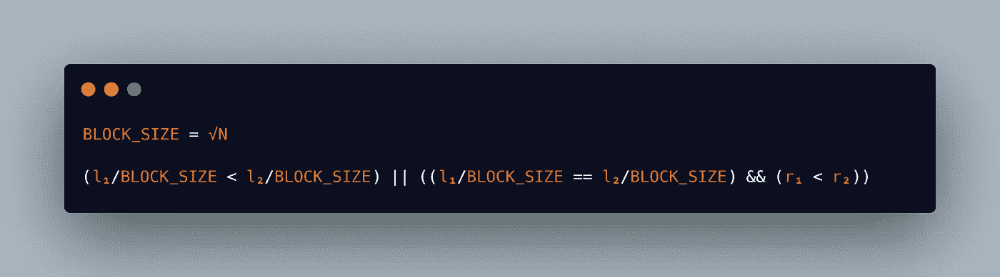
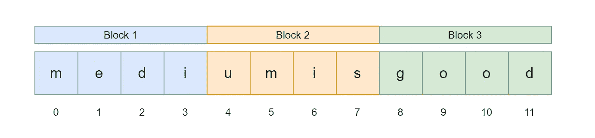
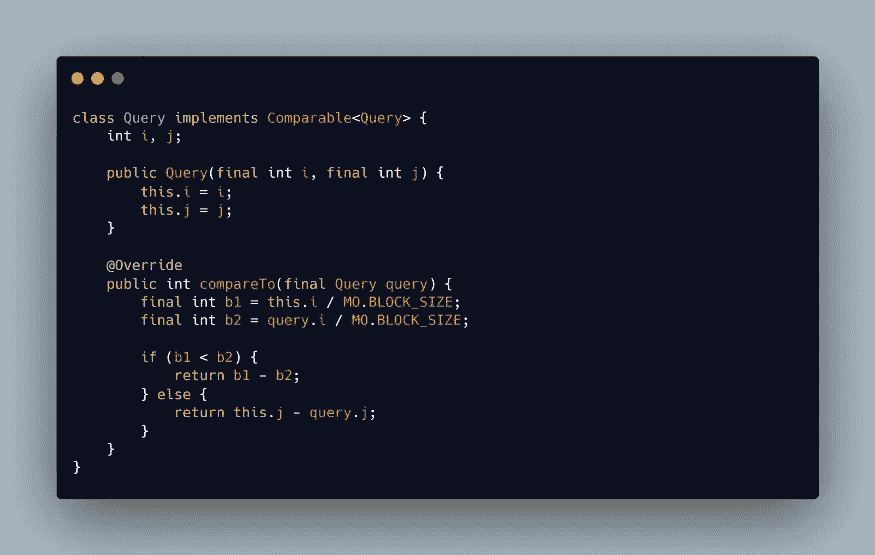
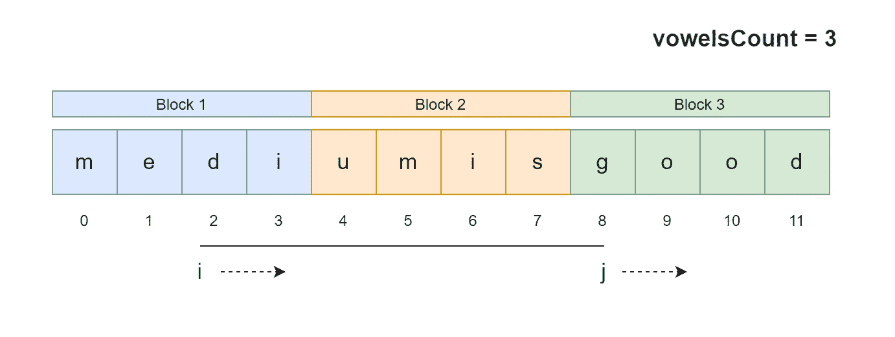
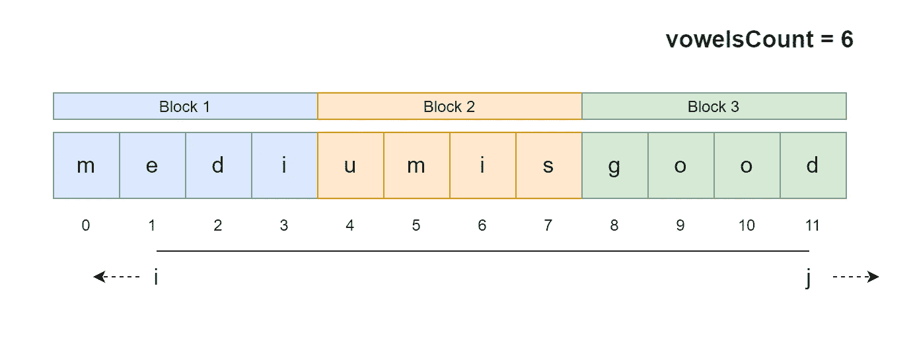
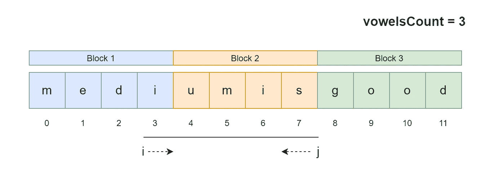
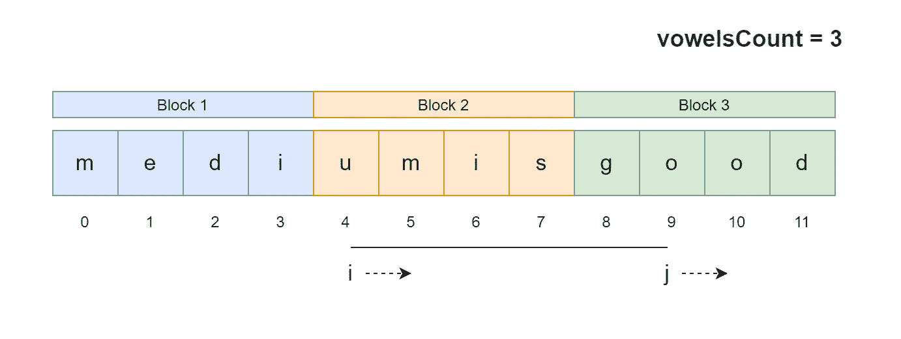
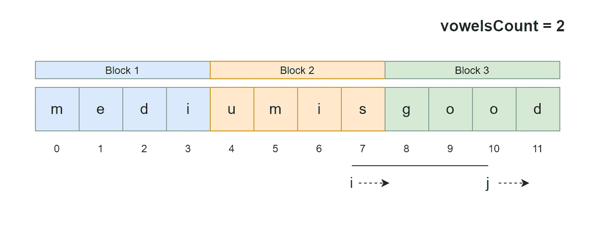

# 莫算法——范围查询变得简单

> 原文：<https://medium.com/javarevisited/mos-algorithm-range-queries-made-easy-6c35047369ca?source=collection_archive---------1----------------------->

## 一种解决离线范围查询问题的有效方法😏


阿里安·达尔维什在 [Unsplash](https://unsplash.com?utm_source=medium&utm_medium=referral) 上拍摄的照片

**莫氏算法**又名**平方根分解**，一种非常高效简单的解决**范围查询问题的技术(RQP)。**为了让莫的算法工作，**必须**离线**。在本帖中，我们将了解 RQP、离线 RPQ、求解 RQP 的简单方法以及使用莫算法的有效方法。**

## **什么是范围查询问题？**

**给你一个序列**n 个值***【a₁】、【A₃】、…【aₙ】***。你也被给予 ***Q*** 的查询。在每次查询中，会给你两个值 ***l*** 和 ***r*** 。你的任务是对子序列 ***、Aₗ、…、Aᵣ₋₁、Aᵣ*** 中的元素执行函数 ***f(l，r)*******

## ****什么是离线查询问题？****

****如果满足以下条件，则 RQP 处于离线状态****

1.  ****所有的查询都是预先知道的。****
2.  ****给定序列上没有更新操作。****

## ****问题陈述****

****给你一个序列 ***一个*** 的 ***N 个*** 的值 ***A₁、A₂、A₃、…、Aₙ.*** 你也给出了 ***Q*** 的查询。每个查询会有两个值 ***l*** 和 *r* 。你的任务是找出范围 ***Aₗ，Aₗ₊₁，…，Aᵣ₋₁，Aᵣ*** 中的元音数****

## ****天真的方法****

****一个简单的方法是，对每个查询 ***(l，r)*** 从**迭代到 ***r*** ，找出范围内元音的个数。下面给出了一个示例代码片段。******

************

******朴素方法的 Java 代码片段******

********时间复杂度** 上述代码的时间复杂度为 ***O(N*Q)*** 其中 **N =序列中元素的数量**和 **Q =查询的数量。********

## ******莫算法******

******莫的算法遵循两个简单的步骤来提高解决方案的效率******

1.  ******将序列分成 ***√N*** *块。*******
2.  ******重新排列所有查询，使查询 ***(l₁，r₁)*** 在 ***(l₂，r₂)*** 之前，如果******

************

******莫的订单条件******

******通过以上述方式重新排列查询，我们倾向于在处理另一个块的查询之前处理一个块的所有查询，从而最小化指针移动 ***i*** 和 ***j.*********

************

******样本序列******

******现在我们有一个大小为 12 的字母序列。现在我们应用第一步，在我们的序列中计算块大小******

*********BLOCK_SIZE = √12 ≈ 3，*** 所以，我们把我们的序列分成 3 个大小为 4 的块。******

************

******序列分为√N 个块******

******现在考虑给我们以下查询 ***(4，9)，(3，7)，(2，8)，(0，5)，(7，10)，(1，11)*********

******下一步是根据**生产订单安排上述查询。**下面给出了排序逻辑的 java 代码片段******

************

******Soring 逻辑的代码片段******

******现在，查询将重新排列为 ***(0，5)，(2，8)，(1，11)，(3，7)，(4，9)，(7，10)*********

******现在我们按照新的顺序处理查询******

1.  ******最初， ***i*** ， ***j*** ， ***vowelsCount*** 会被设置为 ***0*** 。******
2.  ******整个想法基于两个观察******

```
****a. While **incrementing** ***i*** we are excluding ***A[i]*** from our range and while **decrementing *i*** we are including ***A[i]*** in our range.
b. While **incrementing *j*** we are including ***A[j]*** from our range and while **decrementing *j*** we are including ***A[j]*** in our range.****
```

******3.第一个查询是 ***(0，5)*** 。 ***我*** 在正确的位置。所以，我们增加 ***j*** 直到达到 ***5*** 。在递增 ***j*** 的同时如果出现在***A【j】***的字母是元音我们递增 ***vowelsCount*** 。******

************

******处理查询(0，5)******

******4.下一个查询是***【2，8】***。目前，**T5、I、**j 分别处于 ***0*** 和 ***5*** 位置。因此我们递增 ***j*** 直到它到达 ***8*** 并且递增 ***i*** 直到它到达索引 **2** 。当递增 ***j*** 时，如果***【j】***处的字母是元音，我们递增***【vowelsCount】，*** 并且当递增 ***i*** 时，如果 ***处的字母 A【I】***是元音，我们递减 ***vowelsCount*********

************

******过程查询(2，8)******

******5.接下来的查询是 ***(1，11)*** 。目前，***I******j***分别在位 ***2*** 和 ***8*** 。所以我们增加 ***j*** 直到它到达 ***11*** 并且减少 ***i*** 直到它到达索引 **1** 。当递减 ***i 时，我们递增 vowelsCount*** 并且当递增 j 时，我们递增 ***vowelsCount*** 。******

************

******6.同样，我们可以根据剩余的查询调整指针 ***i*** 和 **j** 。剩下的步骤如下图所示******

************

******过程查询(3，7)******

************

******过程查询(4，9)******

************

******过程查询(7，10)******

******一旦处理完所有的查询，我们就可以按照给定的查询顺序打印结果。******

********时间复杂度** 对于每个查询，有两次移动，一次是指针 ***i*** 和指针 ***j*********

********指针的移动 *i*** 所有的查询都是按照 ***l*** 值按块分组的方式进行排序的。因此，在处理完当前块中的所有查询之前，我们不会移动到下一个块。所以， ***i* 的**运动对于每次查询都会是 ***O(√N)*** 。所以对于 Q 查询，复杂度将是 ***O(Q * √N)*********

********指针的移动 *j*** 所有查询按照 ***r* 的升序排序。**所以，对于给定的块 ***j*** 将一直递增。因此， ***j*** 对于每个块**可以一直行进到 ***N*** 。**所以复杂度会是 ***O(N * √N)*********

****所以，整体复杂度会是***O(Q *√N)+O(N *√N)= O((N+Q)*√N)*******

## ****结论****

****莫的算法在竞技编程中会很有用。你可以在 [codechef](https://www.codechef.com/tags/problems/mos-algorithm) ，SPOJ，codeforces 等上面找到莫算法的练习题。其中一个著名的问题是**DQUERY**from**SPOJ******

****<https://www.spoj.com/problems/DQUERY/>  

你可以在下面的 Github 网址中找到上述问题的解决方案

<https://github.com/ganeshkumarm1/DSAlgo/tree/master/src/com/dsalgo/Algorithms/MOAlgorithm/DistinctVowels>  

# 谢谢你🤘

要了解我的更多信息，请访问 [ganeshkumarm.me](https://www.ganeshkumarm.me)

[](https://www.buymeacoffee.com/ganeshkumarm)****