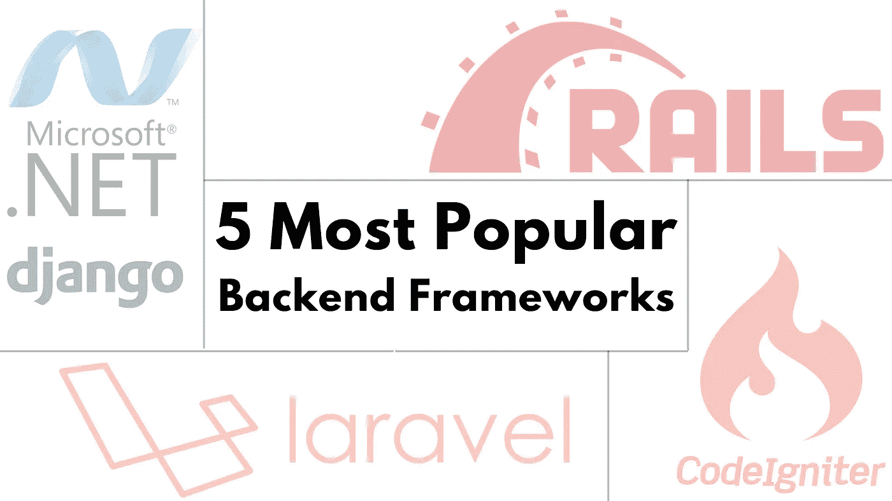

# 5 种最流行的网络开发后端框架(2023)🏅

> 原文：<https://medium.com/javarevisited/most-popular-backend-frameworks-93ffd55272a6?source=collection_archive---------2----------------------->

网站通常被认为是用户交互的前端。

然而，大部分魔法发生在后端。

由于后端是开发者定义网站如何运作的地方，它被描述为网站的**引擎**。🚀

相反，后端框架提供了创建网站后端的最佳实践、模式和工具。

简而言之，[后端框架](/javarevisited/10-best-backend-frameworks-for-web-development-8d19e337f774)定义了应该如何存储、处理和查询数据。

您将在本文中了解到最流行的后端框架，并找出哪个**选择了正确的框架**来构建强大的后端并加速您的 web 开发过程。

或者，选择正确的后端框架将降低您的总体成本。😉

# 网络开发的 5 个最佳后端框架(2023 年更新)🏆

所以，让我们开始了解什么样的后端框架在 2023 年最适合您。

## 为什么后端框架对网络开发至关重要？

*   他们提供了更好的架构来开发网站或应用程序。
*   该框架帮助您更快地编写 [SQL 查询](https://www.java67.com/2018/02/5-free-database-and-sql-query-courses-programmers.html)，并且不需要手动重写完整的 SQL 查询。
*   他们有独特的建筑风格。(例如，MVC)，这产生了既可用又可维护的代码。
*   应用程序和网站可以得到高效开发。
*   使用一个框架，你可以用更少/没有代码来开发，你会得到更多的特性。

## (Python 开发 Django

[Django](/javarevisited/my-favorite-courses-to-learn-django-for-beginners-2020-ac172e2ab920) 于 2005 年 7 月首次发布，是一个基于 Python 的开源框架，鼓励快速开发和干净的范例设计。由经验丰富的开发人员构建，他们处理大量与 web 开发相关的工作，允许您专注于构建您的应用程序，而不必发明轮子。

## (4)面向 PHP 开发的 Codeigniter

Codeigniter 是由 EllisLab 于 2006 年 2 月 28 日发布的一个 [PHP 框架](/javarevisited/10-best-php-courses-for-beginners-and-experienced-developers-db18057a814f)。它是为那些想要一个简单而有吸引力的工具集来构建全功能 web 应用程序的 web 开发人员创建的。CodeIgniter 是用 PHP 构建动态网站最流行的框架之一。

## (PHP 开发用 Laravel

Laravel 的公开发布是在 2011 年，从那时起它就是最流行的 PHP 框架之一。大约有 114640 多个活跃的 Laravel 网站。Laravel 是一个简单而优雅的 web 开发框架，因为它干净而全面的语法，结合了模型-视图-控制器架构来开发 web 应用程序。

## (2)用于 Ruby 开发的 Ruby on Rails

[Ruby on Rails](/javarevisited/10-best-ruby-on-rails-courses-for-beginners-dca4d66e9f7b) (或 Rails)是一个用 Ruby 编程语言编写的免费开源 web app 开发框架。它于 2004 年 8 月首次发布。

从技术上来说，它被描述为通过操作系统的命令行界面安装的 RubyGem 包库。该框架为开发人员提供了一种更快捷的方式来编写代码。它是一组代码库，为日常琐事提供现成的解决方案，如为网站创建表格、表单或菜单。

## (1)ASP.NET 框架。净发展

2002 年，微软推出了 ASP.NET 作为软件框架[。它缩写为. net，包括几种编码语言、库和编辑器。ASP.NET 框架允许你创建各种各样的应用，比如网络应用、移动应用、游戏、云、物联网等。](/javarevisited/7-best-online-courses-to-learn-asp-net-core-and-mvc-in-depth-a68c1b728090)

# 总结

现在，您已经非常熟悉我们上面列出的最好的后端框架了。这些框架在 web 开发人员中很受欢迎，因为它们为构建 web 应用程序提供了有用的工具和抽象。值得注意的是，不同框架的流行程度会因项目的特定需求和开发人员的偏好而异。

## 文章来源:

<https://bit.ly/3OLRkLy> 