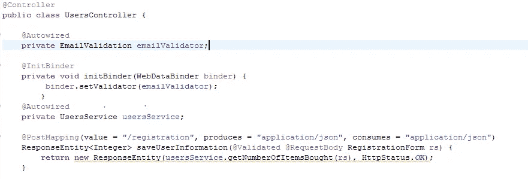
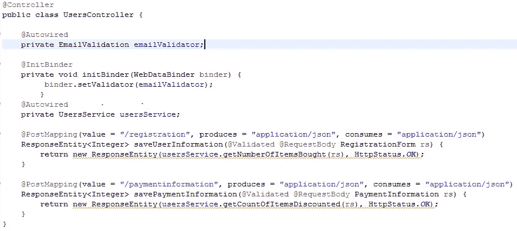
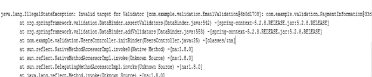
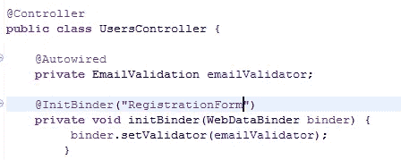
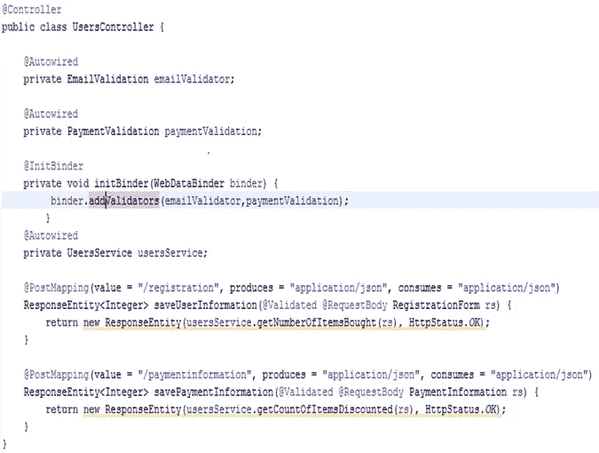
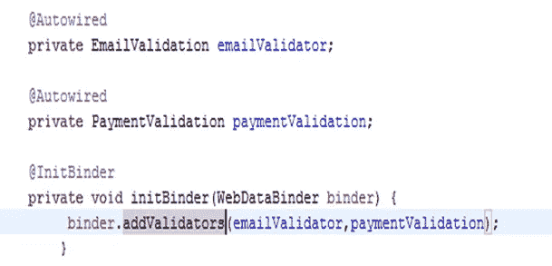
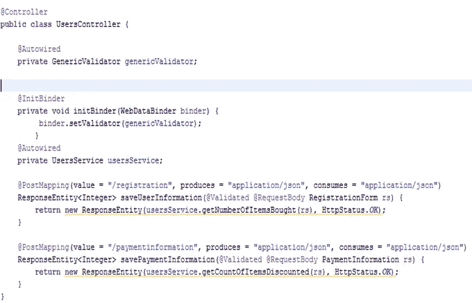
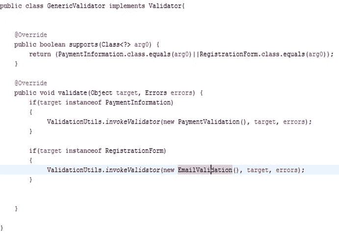

# 使用 Spring 验证配置多个验证器

> 原文：<https://medium.com/javarevisited/multiple-validations-using-spring-validation-aee5d89f0e79?source=collection_archive---------2----------------------->

Spring 通过 Spring Validation 简化了请求验证，Spring Validation 使我们能够将验证器绑定到控制器。

使用基于 Spring 的验证，控制器的验证器是通过在控制器中用@Initbinder 注释接受 WebDataBinder 类型的参数和 void 返回类型的方法来指定的。

然而，这种方法有其自身的局限性。我将在此详细阐述可能出现的问题以及您可以规避它们的方法。

只要控制器有一个接受 RegistrationForm 类型请求的单个端点，或者有多个接受相同类型请求的端点，一切似乎都很好。

但是，当我们有两个不同的端点，有两种不同的请求类型，即 RegistrationForm 和 PaymentInformation 时，一切都乱套了。

默认情况下，使用@initbinder 绑定的验证器将应用于控制器的所有端点，而不考虑其类型。

因此，尽管我们的目的只是验证 RegistrationForm 类型的输入，但现在将在 registration form 和 PaymentInformation 上强制执行验证。这导致了 IllegalStateException，因为 spring 现在试图在请求被发送到支付端点时用 EmailValidator 验证 PaymentInformation 请求

通过在@InitBinder 注释中明确指定我们想要验证的输入类型，我们可以避免跨端点对所有输入字段进行隐式强制验证

这告诉 spring 验证器只应用于 RegistrationForm 类型的请求。

到目前为止一切顺利。但是在某些情况下，我们希望验证不同类型的请求参数。一个看似显而易见的解决方案是为每个控制器配置多个验证器。

在下面的例子中，我们有两个端点，每个端点都有不同类型的输入，每个端点都需要不同的验证器。

在用@InitBinder 注释的方法中使用 WebDataBinder 参数上的 addValidators 指定多个验证器似乎是一个解决方案。

然而，使用@Initbinder 不能指定多个验证器，否则会导致新的问题。

一个明显的缺陷是两个验证现在都将应用于两个端点。

我们又回到了起点。

但并不是所有事情都像看上去那么糟糕。我们仍然可以通过基于绑定上下文信息指定要使用的验证器来解决这个问题

在这里，我们确定请求字段的类型，并应用适当的验证器，从而成功地用两个验证器配置控制器，同时根据请求类型限制验证的应用。

另一种简洁的方法是创建一个通用/复合验证器，并使用@InitBinder 绑定它

这里需要注意的是，当请求参数的类型是付款信息或注册表单时，我们配置 override 方法以返回 true。

类似地，我们通过配置 validator()方法来调用适当的验证器，以根据作为参数传递给方法的请求类型来触发验证

因此，我们不仅用多个验证器配置控制器，而且还控制验证的应用。