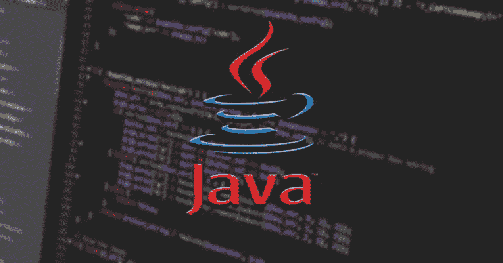

# 必须知道的 Java 面试问题

> 原文：<https://medium.com/javarevisited/must-know-java-interview-questions-7c7208a10669?source=collection_archive---------1----------------------->

在这篇文章中，我们将看到一些在面试中必须知道和经常问的 java 问题，这是我个人经验的汇编。

## 基础知识:

1.  什么是 JDK、JRE 和 JVM？
2.  解释抽象和封装？
3.  什么是继承、聚合和关联？
4.  什么是 java 中的 try-with 资源？
5.  解释不同的 J [ava 8 特点](https://ds73306.medium.com/important-java-8-features-e52c8d8e8662)？
6.  为什么 Java 中的字符串是不可变的？
7.  解释一下 JVM 内存模型？
8.  解释垃圾收集？
9.  什么是异常，什么是异常处理？
10.  解释自动装箱和拆箱？
11.  什么是类型转换？用父子继承的例子解释。
12.  为什么 Java 平台是独立的？
13.  在 java 中有多少种方法可以创建对象？
14.  什么是集合框架？
15.  解释一下 static，this，和 super 关键字？
16.  最后解释一下，finalize 和 final 关键字？

## 高级:

1.  什么是序列化？
2.  解释散列表的内部工作原理？([回答](https://www.java67.com/2013/06/how-get-method-of-hashmap-or-hashtable-works-internally.html))
3.  什么是并发 HashMap？([回答](https://javarevisited.blogspot.com/2020/09/10-examples-of-concurrenthashmap-in-java.html))
4.  ArrayList 和 LinkedList 的区别。([回答](https://www.java67.com/2012/12/difference-between-arraylist-vs-LinkedList-java.html))
5.  比较者和可比者之间的差异。
6.  ArrayList 和 HashMap 的默认大小是多少？
7.  什么是标记接口和功能接口？
8.  解释 java 中的类加载和类加载器的类型？
9.  Java 中的泛型是什么？
10.  我们如何创建自定义异常？
11.  什么是协变返回类型？([回答](https://javarevisited.blogspot.com/2014/03/covariant-method-overriding-of-java-5.html))
12.  什么是线程？
13.  什么是守护线程？
14.  start()和 run()的区别？([回答](https://www.java67.com/2015/12/difference-between-thread-start-and-run-method-java.html))
15.  Volatile 关键字是什么？
16.  同步方法和块的区别？
17.  sleep()、wait()、yeild()的区别？
18.  你说的僵局是什么意思？
19.  解释 Join()？
20.  什么是 ThreadLocal 和 Threadpool？
21.  解释 hashcode()和 equals()。用 HashSet 的例子解释。
22.  什么是不可变类？如何使一个类不可变？
23.  什么是 Singleton？
24.  classNotFound 和 NoClassDefinitionFound 的区别？([回答](https://javarevisited.blogspot.com/2011/07/classnotfoundexception-vs.html#axzz6H3LuQtU5))
25.  什么是消费者，谓词，供应商？
26.  map()和 flatMap()的区别？([回答](https://javarevisited.blogspot.com/2016/03/difference-between-map-and-flatmap-in-java8.html))
27.  使用 stream API 对映射进行排序以获取出现频率最高的字符的示例。

这些应该包括 Java 的技术讨论。

快乐学习:)