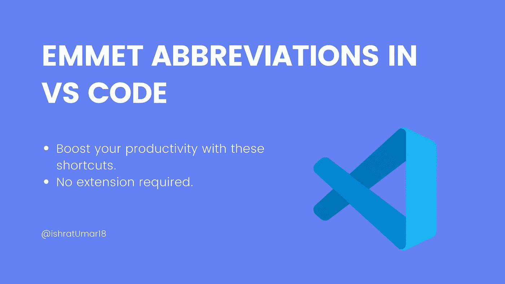
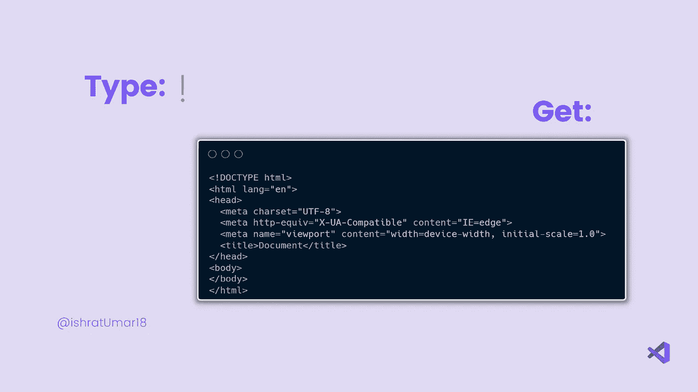
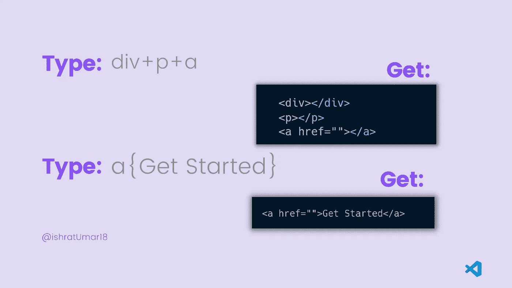
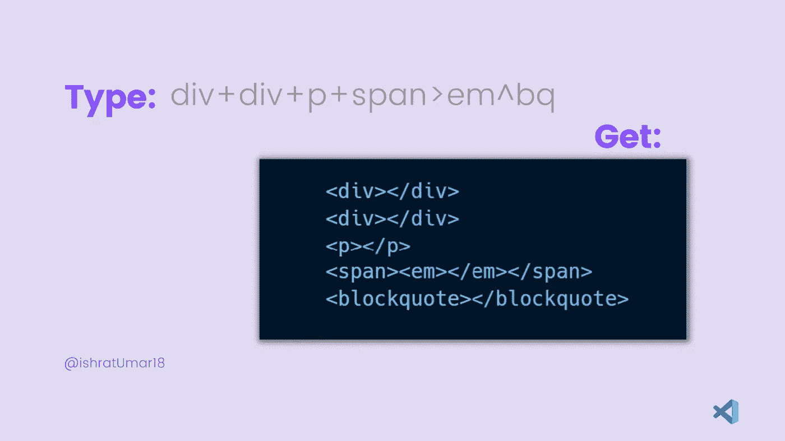
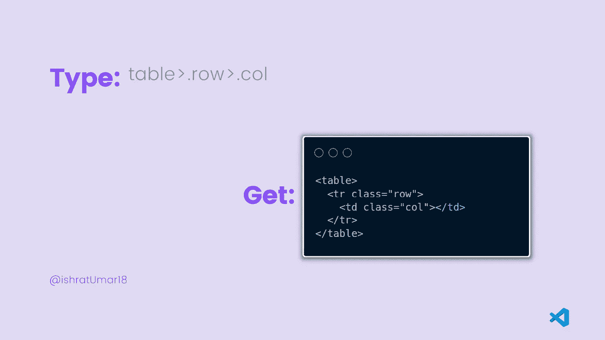
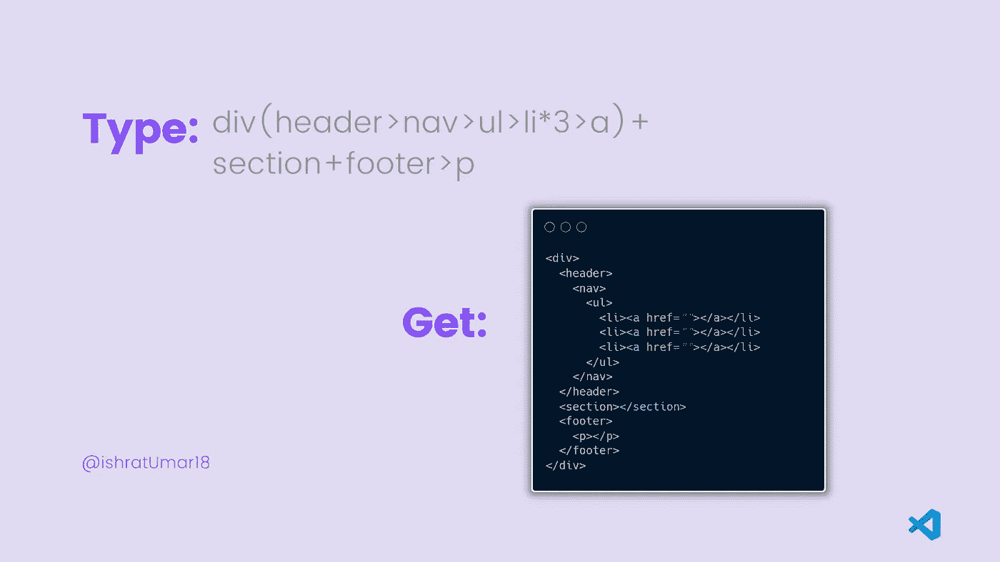

# 必须知道 VS 代码快捷键

> 原文：<https://medium.com/javarevisited/must-know-vs-code-shortcuts-50371a8b94b6?source=collection_archive---------3----------------------->

## 备忘单

## developer✨✨visual 工作室代码快捷键

Visual Studio 代码快捷方式

当编写成百上千行代码时，这些 VS 代码快捷方式就派上了用场。这些帮助你更快地编码，并提高你的生产力 10 倍。此外，使用这些快捷方式不需要任何扩展。

让我们学点魔法🧨

## 感叹号'！'

打开你的 [VS 代码编辑器](/javarevisited/8-best-vs-code-courses-for-beginners-to-learn-online-bd5c169f59b7)，创建一个文件，键入`!`，按回车键得到 HTML 样板文件。恭喜你只需输入`!`就能写出 11 行代码。

看到我之前说的魔法了吗？真的就这么简单。

如果你看下面的插图，你会得到类似的结果:

感叹号'！'

## ID 和类属性

**散列** `#`用于 id 属性，点`.`用于类属性。这些属性将生成一个带有`id` 和`class`的`
`，或者你可以键入任何你想要的东西。

参见下面给出的示例，其中`.header`将生成一个带有`class = header`的`div`，而`.navbar#header`将生成一个带有`class = navbar`和`id = header.`的`div`

ID 和类属性

## 兄弟:+和文本:{ }

**加**符号`+`用于创建彼此相邻的元素。

**花括号** `{ }`用于在元素的开始和结束标记之间写入文本。

参见下面给出的例子，其中`

`、`

`和``是同级元素，而“**开始**”是写在开始和结束标签``之间的文本。

兄弟:+和文本:{ }

## 孩子: >

**大于**符号`>`用于创建元素的子元素。

参见下面给出的例子，其中``是父元素，`<em></em>`是子元素。

孩子: >

## 攀升:^

**向上爬**符号`^`用于写入子元素之后的元素，该元素应该是父元素的兄弟元素。它本质上意味着脱离元素，成为父元素的兄弟。

参见下面给出的例子，其中``是父元素，`<em></em>`是它的子元素。你也可以看到`<blockquote></blockquote>`是和写在`^`之后的``在同一层的元素。

攀升:^

## 乘法:*

**乘法**符号`*`用于生成多个相同类型的元素。

在给定的例子中，我们只是通过将`li` 乘以`3`来生成`3 lis` 。

乘法:*

## 隐式标记名

通过输入标签的名称来生成元素，如给定示例中的`table`。

隐式标记名

## 分组: ( )

括号用于将不同的元素组合在一起。

请参见下面给出的示例，以便更好地理解。

分组: ( )

更多信息，请参见 [**Emmet 文档**](https://docs.emmet.io/cheat-sheet/) 中的完整备忘单。

## 结论

感谢您的阅读！希望你觉得有用！💙
如果你有兴趣阅读更多内容，请关注我，别忘了订阅我的时事通讯，在你的收件箱里接收故事。

[***中型***](https://ishratumar.medium.com/)***|***[***Twitter***](https://twitter.com/ishratUmar18)***|***[***GitHub***](https://github.com/ishratUmar18/)***|***[***hash node***](https://hashnode.com/@ishratUmar18)***|***