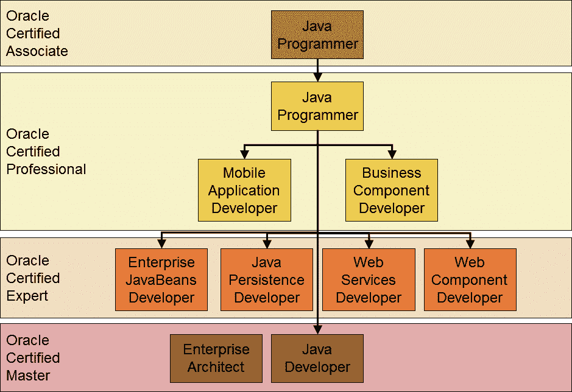
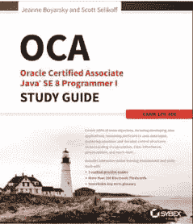
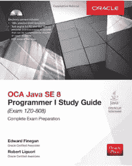
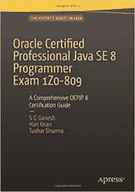
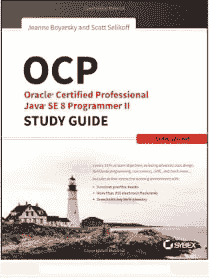

# 我最喜欢的通过 Java SE 8 认证的书籍和课程——OCAJP 8 和 OCPJP 8

> 原文：<https://medium.com/javarevisited/my-favorite-books-and-courses-to-pass-java-se-8-certification-ocajp-8-and-ocpjp-8-b657a195aa07?source=collection_archive---------1----------------------->

大家好，尽管 Java SE 17 认证和 [Java SE 11 认证](https://javarevisited.blogspot.com/2019/12/how-to-crack-java-se-11-certification.html)已经出来了，许多 Java 程序员仍然在争取 Java 8 认证。

Java SE 11 认证更难是有原因的，如果你的工作、晋升或任何其他原因需要 Java 认证，Java SE 8 认证是最好的。为了成为 Java 8 认证的开发人员，你需要通过两个考试，代码为 1z 0–808 的 OCAJP 8 考试和代码为 1z 0–809 的 OCPJP8 考试。

如果你只是通过了 [OCAJP8](http://javarevisited.blogspot.sg/2014/09/latest-OCPJP-exam-java-8-certification-oracle-java-se-8.html) 考试，你就不会成为 Java SE 8 认证程序员。为了准备这两种考试，除了每天编写程序之外，你还需要选择一个好的学习指南和一个好的模拟考试模拟器。

由于世界各地对 Java 8 认证专业人员的需求很大，如果你正在做一些无聊的 it 工作，并希望成为一名应用程序开发人员，那么通过学习 Java 8 似乎是一个改变职业道路的好机会。

Java 认证将为你提供知识，并让你比其他申请同一份 Java 开发人员工作的候选人更有竞争力。

自从 Java 8 于 2014 年 3 月 18 日发布以来，已经过去了将近 6 年，OCAJP 8 和 OCPJP 8 现在都是既定的考试。你会在网上找到很多[书](http://javarevisited.blogspot.sg/2013/07/2-books-to-prepare-oracle-java-7-certification-OCA-OCP-OCPJP.html)，资料，模拟题来准备这两个考试。但是，如果你不小心，你会失去很多时间去追逐那些没有多大帮助的资源。

为了创建一个计划，然后按照这个计划工作以获得 Java 8 认证，第一步是选择一本好书或学习指南。在这篇文章中，我将分享一些最好的 OCAJP8 和 OCPJP8 书籍，供您选择。

# Java 8 认证的 5 本最佳书籍和课程

成功通过 1z 0–808 和 1z 0–809 等 Java 8 认证的一个重要步骤是选择一个针对 [OCAJP8](http://javarevisited.blogspot.sg/2015/07/good-time-to-become-java-certified-programmer-discount.html) 的学习指南和一个针对 OCPJP8 的学习指南。学习指南不仅全面涵盖了考试主题，还提供了与每个主题相关的考试提示。

如果你对 90%的分数感到满意，那么一本学习指南就足够了，前提是你还要有一个好的考试模拟器，比如<http://shareasale.com/r.cfm?b=1130600&u=880419&m=43514&urllink=&afftrack=>**[**Enthuware**](https://javarevisited.blogspot.com/2017/07/entuware-or-whizlabs-which-exam-simulator-best-for-java-certification.html)[Udemy](https://click.linksynergy.com/fs-bin/click?id=JVFxdTr9V80&subid=0&offerid=323058.1&type=10&tmpid=14538&RD_PARM1=https%3A%2F%2Fwww.udemy.com%2Fjava-oca%2F)，或者大卫·梅尔的在线 [**认证问题**](http://bit.ly/2uymzB1) 。**

**<https://click.linksynergy.com/fs-bin/click?id=JVFxdTr9V80&subid=0&offerid=323058.1&type=10&tmpid=14538&RD_PARM1=https%3A%2F%2Fwww.udemy.com%2Fjava-oca%2F>  

学习指南、在线课程和模拟考试的结合是在有限的时间内破解任何 Java 认证的最佳方式。

## 1.[Mala Gupta 的 OCA Java SE 8 程序员 I 认证指南](https://www.amazon.com/OCA-Java-Programmer-Certification-Guide/dp/1617293253?tag=javamysqlanta-20)

这是 OCAJP8 考试的优秀学习指南。[Mala Gupta]在提供专门为认证需求定制的高质量内容方面做了大量工作。

这本书不仅涵盖了所有考试主题，还强调了从考试角度来看很重要的关键概念，这些概念是棘手问题的基础。这本书还包含一个完整的模拟考试，你可以使用任何专业的考试模拟器，如大卫·梅尔的[**1z 0–808 dumps**](https://www.certification-questions.com/practice-exam/java/1z0-808?affiliateCode=fcff36fd-557a-4713-abf6-973e9924770f&utm_source=Javin&utm_medium=affiliate&utm_campaign=affiliate)**。**

你也可以把这本书和 Udemy 上的 [**完整的 Java 大师班**](https://click.linksynergy.com/deeplink?id=JVFxdTr9V80&mid=39197&murl=https%3A%2F%2Fwww.udemy.com%2Fcourse%2Fjava-the-complete-java-developer-course%2F) 课程结合起来，你会以良好的状态通过这次考试。本课程还非常详细地涵盖了大多数认证主题。

**

## **2. [OCA:甲骨文认证助理 Java SE 8 程序员 I 学习指南](https://www.amazon.com/dp/1118957407?tag=javamysqlanta-20)**

**这是另一本准备 OCA 或 Oracle Certified Associate Java SE 8 程序员 I 认证(即考试代码 1z 0–808)的好书。这本书是 Java 8 OCA 认证的完整学习指南，涵盖了每一个考试主题。**

**这本书以一个评估测试开始，这是一个很好的方法来衡量你对 Java 8 和 OCA 考试目标的了解程度。这将让你很好地了解你需要多长时间准备 OCAJP 8 级考试或 1z 0–808。**

**类似于 whiz labs[**1z 0–808 考试模拟器**](http://shrsl.com/?g0ce) ，也解释了为什么正确的答案是正确的，为什么不正确的答案是错误的，这将帮助你建立你的概念，避免误解。**

****

## **3. [OCA Java SE 8 程序员 I Oracle 学习指南](https://www.amazon.com/Programmer-Study-Guide-1Z0-808-Oracle/dp/1259587517?tag=javamysqlanta-20)**

**这是准备 OCA Java SE 8 程序员 I 学习指南或考试 1z 0–808 的第三本书，这本书最棒的部分是它来自 Oracle 和 Java，这意味着您可以放心，它涵盖了 1z 0–808 考试目标的每一个细节。**

**这本书还附带了一张模拟考试的光盘，你可以用它来做进一步的准备，但模拟考试并不真正达标，与真正的考试相比非常容易。最好还是依靠专业的 Java 8 模拟器，比如 [Whizlabs 或者 Enthuware](https://javarevisited.blogspot.com/2017/07/entuware-or-whizlabs-which-exam-simulator-best-for-java-certification.html) 。你可以在这里 找到 Java 8 模拟器 [**的好列表。**](http://www.java67.com/2017/03/top-10-ocajp-and-ocpjp-exam-simulators.html)**

****

## **4.[Ganesh、Hari 和 Tushar 参加的 Oracle 认证专业 Java SE 8 程序员考试 1z 0–809](https://www.amazon.com/Oracle-Certified-Professional-Programmer-1Z0-809/dp/1484218353/?tag=javamysqlanta-20)**

**这是 Oracle 认证专家 Java SE 8 程序员考试或 1z 0–809 的最新和最棒的学习指南。您会发现许多小而实用的代码示例，这对真正理解 Java 8 概念非常重要。**

**这本书不仅涵盖了 1z 0–809 的每一个考试主题，还以易于理解的方式介绍了 Java 8 的新功能，并提供了适当的考试提示。**

**这本书还包含了许多每章的练习题，包括全长模拟考试，你可以和大卫·梅尔的 [**免费 Z0-809 转储**](http://javarevisited.blogspot.com/2015/11/5-free-ocajp8-ocpjp8-mock-exams-and-practice-questions.html) 一起参加，测试你在考试前的准备情况。**

****

## **5. [OCP:甲骨文认证专业 Java SE 8 程序员 II 学习指南](https://www.amazon.com/OCP-Certified-Professional-Programmer-1Z0-809/dp/1119067901?tag=javamysqlanta-20)**

**这是 Jeanne Boyarsky 和 Scott Selikoff 的 Java 8 认证指南的第 2 部分。第一个指南涵盖了 OCA 考试，本指南涵盖了 OCP 考试或 1z 0–809 考试。**

**但是，我还发现这本书对于那些希望升级他们的认证的程序员来说也是一个很好的资源，比如目前持有 Java 6 或以前版本的认证并准备参加[1z 0–813](http://javarevisited.blogspot.sg/2017/05/which-java-8-certification-should-you-take-1Z0-808-809-810-813-OCAJP-OCPJP.html)考试的程序员，以及准备参加[1z 0–810](https://javarevisited.blogspot.com/2017/01/difference-between-ocpjp-8-upgrade-exams-1Z0-813-1Z0-810.html#axzz5W8ldCgsD)考试的 Java SE 7 认证开发人员。**

****

**除了这本书，你还可以在 Udemy 上查看 [**完整的 Java SE 8 开发者训练营——OCA Prep 包含**](https://click.linksynergy.com/fs-bin/click?id=JVFxdTr9V80&subid=0&offerid=323058.1&type=10&tmpid=14538&RD_PARM1=https%3A%2F%2Fwww.udemy.com%2Flearn-java-se-8-and-prepare-for-the-java-associate-exam%2F) 。对于正在学习 Java SE 8 并希望成为认证开发人员的初学者来说，这是一个理想的在线培训课程，就像希望开始软件开发职业生涯的应届毕业生或希望通过学习 Java 的基本知识来提高其市场竞争力的开发人员一样**

# **Java 8 认证的推荐资源:**

**以下是准备 ocajp 8([1z 0–808](http://javarevisited.blogspot.com/2017/04/ocajp-1z0-808-best-books-and-mock-exams-Java8-certification.html))和 OCAPJP8(1z 0–809)考试的一些有用资源。有些资源是免费的，你必须购买一些资源，但鉴于实际考试费用是 245 美元或 10，100 印度卢比，花更多的钱来准备是值得的。总比重考好。**

*   **[完整的 Java 大师班](https://click.linksynergy.com/deeplink?id=JVFxdTr9V80&mid=39197&murl=https%3A%2F%2Fwww.udemy.com%2Fcourse%2Fjava-the-complete-java-developer-course%2F)**
*   **[免费 OCAJP 8 和 OCPJP8 模拟考试](http://javarevisited.blogspot.com/2015/11/5-free-ocajp8-ocpjp8-mock-exams-and-practice-questions.html)**
*   **[ocajp 8 和 OCPJP8 的最佳考试模拟器](http://javarevisited.blogspot.com/2016/11/top-5-java-8-practice-test-and-exam-simulators-best-OCAJP-OCAPJP.html)**
*   **[Java SE 8 认证(OCAJP 8)的大纲和完整细节](https://education.oracle.com/pls/web_prod-plq-dad/db_pages.getpage?page_id=5001&get_params=p_exam_id:1Z0-809)**
*   **[链接报名 Java 8 考试](http://www.pearsonvue.com/oracle/)**
*   **[进一步阅读的最佳 Java 8 书籍](http://www.java67.com/2015/07/5-books-learn-java-8-functional-programming.html)**
*   **[做 Java 认证的好处](http://javarevisited.blogspot.com/2014/01/does-java-certifications-like-scjp-ocjp-ocpjp-helps-carrer-job-interviews.html)**
*   **[准备 OCAJP8 认证的技巧](http://javarevisited.blogspot.com/2016/12/5-tips-to-prepare-for-oracle-java-certifications-OCAJP-OCPJP-exams.html)**
*   **[Java 认证课程](https://javarevisited.blogspot.com/2018/01/top-5-java-8-certifications-courses-training-online-OCAJP.html)**

**以上就是关于准备 OCAJP8 和 OCPJP8 认证的一些**最佳书籍。正如我所说，如果你渴望成为 Java SE 8 认证程序员，仅仅通过 OCAJP8 或 1z 0–808 考试是不够的。****

**顺便说一句，只有通过 OCPJP8 这样的 1z 0–809 考试，你才能获得职称或认证。这就是为什么我分享了 OCAJP8 和 T2 OCPJP8 认证的书籍，因为只准备 OCAJP8 或 ocpjp 8 没有任何意义。**

**不过，还有一些其他方法可以成为 Java Se 8 认证程序员，例如，如果你已经持有 Java SE 7 认证，那么你可以参加 1z 0–810 考试，成为 Java SE 8 认证程序员。**

**或者，如果您是 SCJP 6、SCPJP6 或 SCJP 1.4 程序员，或者持有任何较低版本的 Java 认证，您可以参加 Java SE 8 升级考试，成为 Java 8 认证开发人员。该考试的考试代码为[1z 0–813](http://javarevisited.blogspot.sg/2017/01/difference-between-ocpjp-8-upgrade-exams-1Z0-813-1Z0-810.html)。**

**虽然 Java SE 8 认证比[**Java SE 11 认证更容易，但我强烈建议，即使是已认证的 Java 开发人员，也要升级他们的认证，争取最新的 Java 认证，以获得更好的工作前景、认可，并获得相对于其他候选人的竞争优势。**](https://javarevisited.blogspot.com/2019/10/top-5-books-courses-to-crack-oracles-java-se-11-certification-OCAJP11.html)**

**万事如意。**

****您可能喜欢的其他媒体文章:****

**</javarevisited/top-5-java-online-courses-for-beginners-best-of-lot-1e1e240a758>  </javarevisited/what-java-programmers-should-learn-in-2020-648050533c83>  </javarevisited/what-next-for-senior-developers-in-tech-project-manager-technical-architect-or-a-devops-engineer-b532a80c9ba1> **