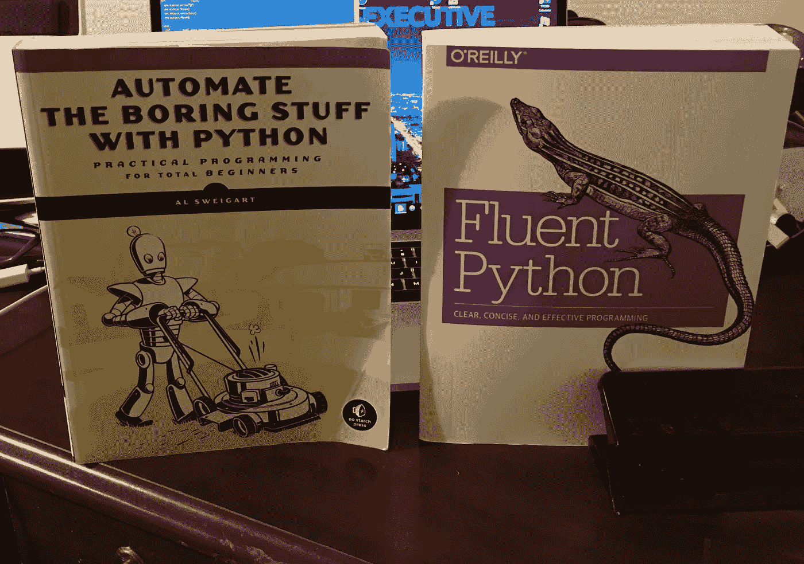
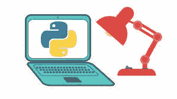
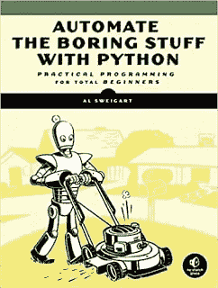
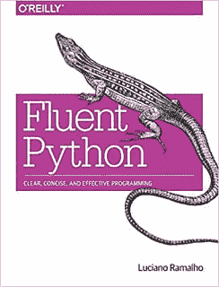
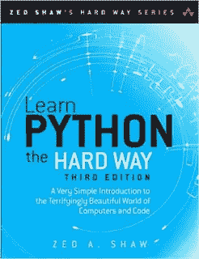
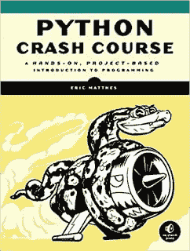
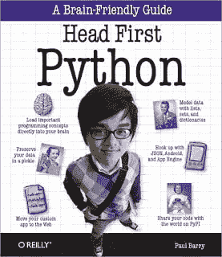
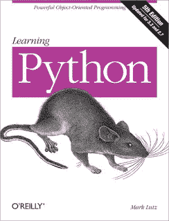
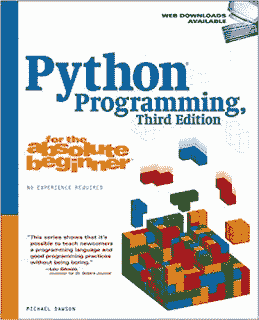

# 面向初学者和有经验的程序员的 10 大 Python 编程书籍——最佳之选

> 原文：<https://medium.com/javarevisited/my-favorite-books-to-learn-python-in-depth-77465633b46e?source=collection_archive---------0----------------------->

大家好，如果你正在制定你的技术目标或提升你的技能，并且需要一些想法，我会建议你在 2023 年学习 Python。无论你是一名 AI 专家还是一名计算机科学学生，在你的职业生涯中迟早会遇到 Python 编程语言，掌握好 Python 知识对你的职业生涯大有裨益。

如果你已经制定了目标，并且正在寻找学习 Python 的最佳资源，并且喜欢最好的 Python 书籍和课程，那么你来对地方了。早些时候，我已经分享了 [**最佳 Python 课程**](/javarevisited/10-best-python-3-courses-on-udemy-ddd4e3ec5dbf)[网站](/javarevisited/10-free-python-tutorials-and-courses-from-google-microsoft-and-coursera-for-beginners-96b9ad20b4e6)和[最佳 Python 项目](/javarevisited/10-best-coursera-projects-for-java-and-python-developers-623ba816939f)，在本文中，我将分享您可以阅读以深入学习 Python 的最佳书籍。

从 1991 年开始， [Python](https://www.python.org/) 现在已经占领了编程世界。Python 最初只是一个简单的脚本解决方案，现在已经无处不在。与 [Rust](https://javarevisited.blogspot.com/2020/01/top-5-courses-and-books-to-learn-rust-programming-language.html) 、 [Golang](https://www.java67.com/2019/12/top-5-courses-to-learn-go-or-golang.html) 和 [Dart](https://javarevisited.blogspot.com/2020/01/top-5-courses-to-learn-dart-programming.html) 不同，Python 不是一门新语言，但仍被认为是一门现代编程语言。

凭借其出色的库和框架，Python 正在推动数据科学、Web 开发、机器学习、服务器端开发、自动化和通用编程，这就是为什么学习 Python 有意义的原因。

不像某些编程语言像 [Java](/javarevisited/10-free-courses-to-learn-java-in-2019-22d1f33a3915) 或 [C++](https://hackernoon.com/top-5-free-c-courses-to-learn-programming-in-2019-d27352277da0) 适合服务器端应用和复杂程序但不适合简单的东西，因为它优秀的库和充满活力的社区，你可以使用 [Python](https://dev.to/javinpaul/7-python-online-courses-for-beginners-and-intermediate-programmers-1h4k) 做几乎任何事情，从面向对象编程到编写简单的脚本。

作为一个技术博客的作者，我经常收到类似**的问题，学习 Python 的最好方法是什么？** **学习 Python 3 有哪些最好的书？** [**学习 Python 应该加入哪些在线课程**](/better-programming/top-5-courses-to-learn-python-in-2018-best-of-lot-26644a99e7ec) **等。？**

虽然在线课程是很好的开始，我以前也分享过一些 [**最好的 Python 课程**](https://hackernoon.com/top-5-courses-to-learn-python-in-2018-best-of-lot-26644a99e7ec) ，我觉得，书仍然有它们的位置。它们是任何技术最全面、最权威的知识来源，Python 也不例外。

即使你对 Python 一无所知，你也可以用这些书来开始你的 Python 生涯，我特别选择了一些促进动手学习并且易于初学者理解的书籍，以及一些供高级 Python 程序员进一步探索的书籍。

一旦你在使用像 [**完整的 Python 3 Bootcamp**](https://click.linksynergy.com/deeplink?id=JVFxdTr9V80&mid=39197&murl=https%3A%2F%2Fwww.udemy.com%2Fcomplete-python-bootcamp%2F) 这样的在线课程时找到了自己的脚，你就可以通过阅读这些书籍来更深入地了解庞大的 Python 世界。

# 2023 年学习 Python 编码的十大书籍

所以，在不浪费更多时间的情况下，让我们从初学者和中级开发人员学习 Python 的最佳书籍开始。有些书甚至对有经验的 Python 开发人员和任何想把 Python 技能提高到一个新水平的人都非常有用。

## 1.[用 Python 自动化枯燥的东西](https://www.amazon.com/Automate-Boring-Stuff-Python-Programming/dp/1593275994?tag=javamysqlanta-20)

这是我几年前开始学习 Python 时，和 *Head First Python* 一起阅读的第一本书。从那时起，这就是我的 Python 入门书。**我开始学习 Python 来自动化一些事情，**书名吸引了我，但我没有失望，因为这本书名副其实。

它会直接教你所有实用的东西，比如发送电子邮件通知、阅读文件、添加到 XLS、删除网络上的数据，以及使用 [Python](https://hackernoon.com/10-free-python-programming-courses-for-beginners-to-learn-online-38312f3b9912) 自动化琐碎的事情，而无需你花费日日夜夜学习排序算法、面向对象编程和各种计算机科学的东西。

如果你是一个通过做真实的事情来学习的人，那么这本书是给你的。另一件很棒的事情是，作者 Al Sweigart 也在 Udemy 上创建了一个相同标题的在线课程 [**“用 Python 编程自动化枯燥的东西”，**](https://click.linksynergy.com/deeplink?id=JVFxdTr9V80&mid=39197&murl=https%3A%2F%2Fwww.udemy.com%2Fautomate%2F) 所以如果你想听他更积极的学习，你也可以在阅读这本书的同时加入那个课程。

## 2.[流畅的 Python:清晰、简洁、有效的编程，作者卢西亚诺·拉马尔霍](https://www.amazon.com/Fluent-Python-Concise-Effective-Programming/dp/1491946008?tag=javamysqlanta-20)

这是我最喜欢的高级 Python 程序员的书，因为它将帮助你学习编写更好的 Python 程序的最佳技术。

应用书中的经验将有助于您为现实世界的 Python 项目编写更清晰、更简短、更快速的 Python 代码。

这就像是 Python 程序员的有效 Java，如果你需要更多的建议，你可以将这本书与 Daniel Bader 的[**《Python 窍门:令人敬畏的 Python 特性的自助餐》**](https://www.amazon.com/Python-Tricks-Buffet-Awesome-Features/dp/1775093301?tag=javamysqlanta-20) 以及其他令人敬畏的书籍结合起来，学习一些高级的 Python 技巧。

## 3.[学习 Python 3 的艰辛历程，作者 Zed A. Shaw](https://www.amazon.com/dp/0134692888/?tag=javamysqlanta-20)

如果你问一本针对初学者的 Python 书籍，很多人会推荐*“艰难地学习 Python，作者 Zed a . Shaw】*这也发生在我身上。正如 Jason 在评论中指出的，现在也有了一个新版本“艰难地学习 python 3”，鉴于 python 2.7 已经推出，Python 3 正在取而代之，这个版本更加贴切。

这是我的 Python 伙伴推荐给我的一本书，但我没有机会看，因为我更喜欢[“用 Python 自动化枯燥的东西”](https://click.linksynergy.com/deeplink?id=JVFxdTr9V80&mid=39197&murl=https%3A%2F%2Fwww.udemy.com%2Fautomate%2F)和[“Head First Python”](https://javarevisited.blogspot.com/2019/07/top-5-books-to-learn-python-in-2019.html)这本书。我后来读了它，并从中学到了很多，因为它填补了我学习中的许多空白。

阅读多位作者的书也有助于你更好地理解这个概念，因为有些人更好地解释了一个主题，而其他人则解释了其他主题。如果你喜欢泽德·肖的《艰难的学习方法》,那么你一定会喜欢这本书。我也建议把这个和这个 [**Python 编程大师班**](https://click.linksynergy.com/deeplink?id=JVFxdTr9V80&mid=39197&murl=https%3A%2F%2Fwww.udemy.com%2Fpython-the-complete-python-developer-course%2F) 结合起来，两全其美。

## 4. [Python 速成班](https://www.amazon.com/Python-Crash-Course-Hands-Project-Based/dp/1593276036?tag=javamysqlanta-20)

Eric Matthes 的《Python 速成课程:基于项目的编程实践入门》是另一本学习 Python 的很棒的实践书籍，它非常像这个列表中的第一本书。

如果因为某些原因，你无法联系到 Zed Shaw，这份名单上第一本 Python 书籍的作者，那么你应该试试这本书。

这是一个关于 Python 的快速、全面的介绍，它将让你编写程序、解决问题，并使事情马上工作。如果你想结合在线课程，我建议你加入 Coursera 上的 [**Python for Everybody 课程**](https://coursera.pxf.io/c/3294490/1164545/14726?u=https%3A%2F%2Fwww.coursera.org%2Fspecializations%2Fpython) ，它很棒，而且和这些书很配。

如果你觉得 Coursera 的课程有用，因为它们是由知名公司如谷歌、IBM、亚马逊和世界上最好的大学创建的，我建议你加入 Coursera 的订阅计划

<https://coursera.pxf.io/c/3294490/1164545/14726?u=https%3A%2F%2Fwww.coursera.org%2Fcourseraplus>  

这种单次订阅可以让你无限制地访问他们最受欢迎的**课程**、**专业**、**专业证书**和**指导项目**。它每年花费大约 399 美元，但是它完全值得你的钱，因为你得到了无限的证书。

## 5.[保罗·巴里著《头先 Python:有益大脑的指南》](https://www.amazon.com/Head-First-Python-Brain-Friendly-Guide/dp/1491919531?tag=javamysqlanta-20)

这本书教会了我 Python。我是 Head First 系列书籍的忠实粉丝，已经看完了它们的大部分畅销书，如 [Head First Java](/swlh/top-10-java-books-for-programmers-all-time-great-82b0ee0b831a) 和 [Head First Design Pattern](https://www.java67.com/2016/10/top-5-object-oriented-analysis-and-design-patterns-book-java.html) ，我真的很喜欢它们让学习变得有趣的方式。

他们独特的风格不仅鼓励你长时间阅读这本书而不感到厌倦，而且还会推动你一路上做一些事情。

这种工作和娱乐的模式也有助于你保留知识。谈到主题，这本书对初学者来说很棒，但不如**《Python 速成教程》**或 [**《用 Python 自动化枯燥的东西》**](https://click.linksynergy.com/deeplink?id=JVFxdTr9V80&mid=39197&murl=https%3A%2F%2Fwww.udemy.com%2Fautomate%2F) 这本书实用，但它仍然是一本非常好的开始学习 Python 的书。

## 6.[学习 Python，第 5 版](https://www.amazon.com/Learning-Python-5th-Mark-Lutz/dp/1449355730?tag=javamysqlanta-20)

马克·卢茨的《学习 Python》是另一本学习 Python 的好书。这是好奇的开发人员的必读之作，也就是说，那些想要了解“为什么”以及“如何”的人它提供了对 [Python](https://www.java67.com/2017/05/top-7-free-python-programming-books-pdf-online-download.html) 的全面覆盖。

它几乎涵盖了你需要知道的关于 Python 编程的一切:数据类型、操作符、语句、语法、模块、函数、包等等。我真的很喜欢第一章，并问了一个关于 Python 和人们为什么使用 Python 的问题。

如果你是初学者，这个可以帮到你很多。这本书很棒的一点是，每一章都以一个小测验结束，所以你需要时刻挑战自己。简而言之，一本[初学 Python](https://javarevisited.blogspot.com/2019/07/top-5-books-to-learn-python-in-2019.html) 的必读书。

## 7. [Python 编程绝对初学者，第 3 版](https://www.amazon.com/Python-Programming-Absolute-Beginner-3rd/dp/1435455002?tag=javamysqlanta-20)

麦可·道森的《绝对初学者 Python 编程》第三版是一本非常值得推荐的初学者学习 Python 的书。

这本书的内容令人兴奋，因为它专注于视频游戏编程。当你看完杂志的时候，你已经准备好创建你自己的游戏了。由于许多程序员喜欢视频游戏，他们可以很容易地与本书中解释的概念联系起来。

## 8.[丹·巴德的 Python 把戏](https://www.amazon.com/Python-Tricks-Buffet-Awesome-Features-ebook/dp/B0785Q7GSY?tag=javamysqlanta-20)

这是我向每一个 Python 程序员推荐的书，不管他用 Python 做什么，比如脚本、web 抓取、数据分析或 web 开发。这本书对于 Java 开发者来说是有效的 Java，对于 CPP 程序员来说是有效的 C++。

如果你是 Python 新手，并且你更喜欢在线课程，我推荐你在 Udemy 上查看由何塞·马西亚尔·波尔蒂利亚主持的 [**完整 Python 训练营**](https://click.linksynergy.com/deeplink?id=JVFxdTr9V80&mid=39197&murl=https%3A%2F%2Fwww.udemy.com%2Fcourse%2Fcomplete-python-bootcamp%2F) 课程。这可能是 2023 年开始学习 Python 的最佳课程，你可以将这本书与课程结合起来，很快成为一名专业的 Python 开发人员。

以上是关于 2023 年及以后学习 Python 的一些**最佳书籍。这些是一些永恒的 Python 书籍，应该在每个严肃的 Python 程序员的书架上占有一席之地。无论你是用 Python 做[数据科学，还是用 Django 或者](/@javinpaul/9-data-science-and-machine-learning-courses-by-harvard-ibm-udemy-and-others-12a0c7c23ec1) [Flask](https://javarevisited.blogspot.com/2020/01/top-5-courses-to-learn-flask-for-web-development-with-python.html) 创建 web 应用，更好地学习 Python 编程只会让你成为更好的 Python 开发者。**

**如果你真的想深入学习 Python，这里有更多免费和付费的资源供你进一步学习**

*   [2023 年学习 Python 的 10 个理由](https://javarevisited.blogspot.com/2018/05/10-reasons-to-learn-python-programming.html)
*   [初学 Python 的 5 大课程](https://javarevisited.blogspot.com/2018/03/top-5-courses-to-learn-python-in-2018.html)
*   [2023 年网络开发者路线图](https://hackernoon.com/the-2019-web-developer-roadmap-ab89ac3c380e)
*   [Python 开发者的五大 Web 开发框架](https://javarevisited.blogspot.com/2019/04/top-5-python-web-development-frameworks.html)
*   Python 和 JavaScript，从哪个开始比较好？
*   [深入学习 Python 的 10 门免费在线课程](https://javarevisited.blogspot.com/2018/12/10-free-python-courses-for-programmers.html)
*   [面向数据科学和机器学习的 8 大 Python 库](https://javarevisited.blogspot.com/2018/10/top-8-python-libraries-for-data-science-machine-learning.html)
*   [Python vs . Java——初学者应该学习哪种编程语言？](https://javarevisited.blogspot.com/2018/06/java-vs-python-which-programming-language-to-learn-first.html)
*   [5 Python 中的数据科学和机器学习课程](https://javarevisited.blogspot.com/2018/03/top-5-data-science-and-machine-learning-online-courses-to-learn-online.html)
*   [面向程序员的 10 门 Python 课程和认证](/better-programming/top-5-courses-to-learn-python-in-2018-best-of-lot-26644a99e7ec)
*   [学习数据科学的五大 Python 书籍](https://javarevisited.blogspot.com/2019/08/top-5-python-books-for-data-science-and-machine-learning.html)
*   [面向程序员的 10 本免费 Python 编程书籍](http://www.java67.com/2017/05/top-7-free-python-programming-books-pdf-online-download.html)

感谢您阅读本文。如果你喜欢这些 **Python 书籍**，那么请把这篇文章分享给你的朋友和同事。如果您有任何问题或反馈，请留言，如果您有我应该阅读的 Python 书籍，请随时与我们分享。

**P. S.** —如果你更喜欢互动阅读和边做边学，而不是阅读书籍或观看视频，那么你也可以看看[**CodeCademy Learn Python 3 课程**](https://bit.ly/learnpython3codecademy) ，这是一门边做边学 Python 的很棒的课程。这是他们职业套装的一部分，但值得学习。

<https://bit.ly/learnpython3codecademy>  

如果你需要更多的选择，你可以查看这些中型文章:

</better-programming/top-5-courses-to-learn-python-in-2018-best-of-lot-26644a99e7ec>  </swlh/5-free-python-courses-for-beginners-to-learn-online-e1ca90687caf>  </javarevisited/8-projects-you-can-buil-to-learn-python-in-2020-251dd5350d56> 