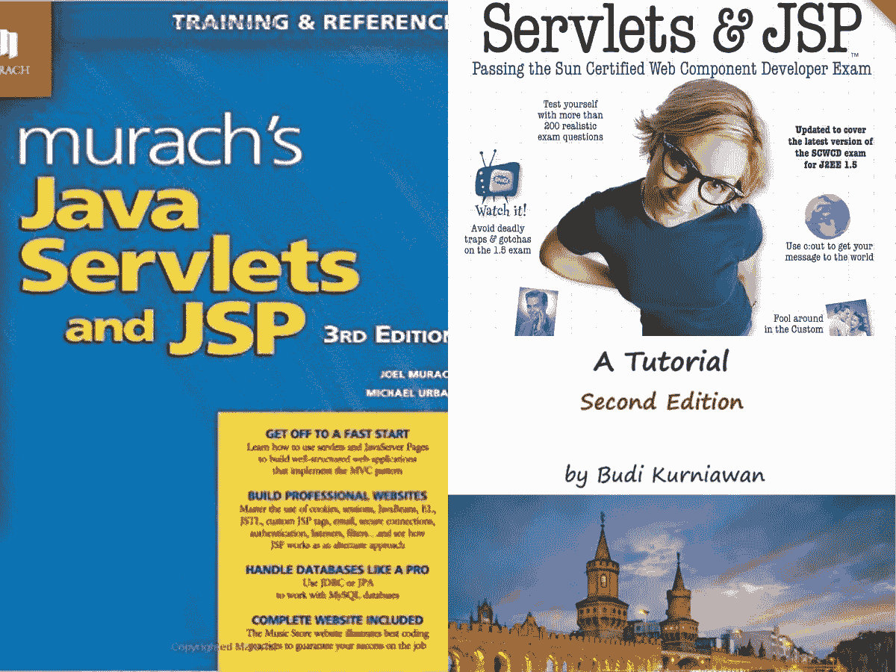
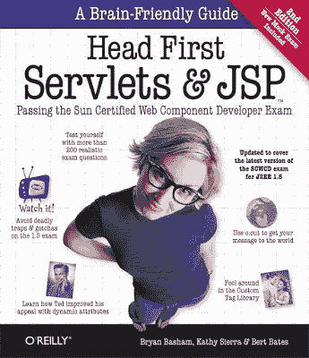
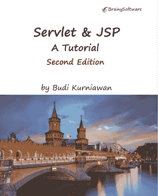

# 2023 年 Java 程序员学习 Servlet 和 JSP 的 3 本书

> 原文：<https://medium.com/javarevisited/my-favorite-books-to-learn-servlet-and-jsp-for-java-programmers-f14fdfe5a151?source=collection_archive---------0----------------------->

## 这些是我最喜欢的为 Fullstack Java web 开发者学习 Servlet 和 JSP 的书籍。

你好，伙计们，如果你是一名 Java 程序员，想学习 Servlet 和 JSP，并寻找最好的资源，如书籍和在线课程，那么你来对地方了。之前，我已经分享了 [**2023 Java 开发者路线图**](/javarevisited/the-java-programmer-roadmap-f9db163ef2c2) 和 [**最佳 Servlet 和 JSP 课程**](/javarevisited/10-best-servlet-and-jsp-online-courses-for-java-developers-d23cf6902360) 在这篇文章中，我将分享我最喜欢的学习 Servlet 和 JSP 的书籍。

作为一个 Java 博客的作者，我经常收到读者和 Java 开发人员的来信，询问学习 Servlet 和 JSP 的书籍推荐，这是用 Java 进行服务器端 web 开发的两项关键技术。

可惜 Java web 开发人员学习 [Servlet 和 JSP](http://www.java67.com/2018/02/5-free-servlet-jsp-and-jdbc-online-courses-for-java-developers.html) 的好书不多。尽管是最流行的 Java Web 技术，但是学习 Servlet 和 JSP 的好书却很少。

每个人都会向你推荐的一本书是 [**Head First Servlet 和 JSP**](http://www.amazon.com/Head-First-Servlets-JSP-Certified/dp/0596516681?tag=javamysqlanta-20) ，这的确是最好的书之一，但是现在已经过时了。

它没有涵盖 Servlet API 的最新发展，尤其是 Servlet 3.0，并且在过去的 7 到 8 年中也没有更新，但是考虑到其他方面，它仍然是一本学习 Servlet 和 JSP 的极好的书。

这本书最主要的优点就是头头式本身，对于初学者来说是极好的。通过大量的重复，要点，炉边谈话，Head First book，确保你理解事情，而不仅仅是阅读它们。

既然很多读者让我推荐学习 Servlet 和 JSP 的好书，那我就分享几本我最喜欢的书，我认为是相关的，可以帮助你更好地学习 Servlet 和 JSP。

为了更快地学习，你也可以将这些书与一些好的在线课程结合起来，如 Udemy 上的 Chad Darby 的 [J **SP、Servlet 和《JDBC:构建数据库应用程序**](https://click.linksynergy.com/deeplink?id=CuIbQrBnhiw&mid=39197&murl=https%3A%2F%2Fwww.udemy.com%2Fcourse%2Fjsp-tutorial%2F) 》以更积极的方式学习 Servlet 和 JSP。

 [## 面向初学者的 JSP、Servlets 和 JDBC:构建数据库应用程序

### 加入已经注册的 34，000 多名学生！超过 7000+评论！(对任何 JSP/Servlet 课程的最多评论…

udemy.com](https://click.linksynergy.com/deeplink?id=CuIbQrBnhiw&mid=39197&murl=https%3A%2F%2Fwww.udemy.com%2Fcourse%2Fjsp-tutorial%2F) 

# 深入学习 Servlet 和 JSP 的 3 本最佳书籍

现在我们知道了 Servlet 和 JSP 是服务器端 Java 开发的重要技术，对于任何认真的 Java 后端开发人员来说都是至关重要的，让我们看看您可以阅读哪本书来从头开始学习 Servlet 和 JSP。

事不宜迟，这里有一些从 Java web 开发角度学习 Servlet 和 JSP 的最佳书籍。

## 1.[穆拉希的 Java Servlets 和 JSP，第三版](http://www.amazon.com/Murachs-Java-Servlets-Edition-Murach/dp/1890774782?tag=javamysqlanta-20)

一般来说，穆拉希的书对于初学者来说是很棒的书，而穆拉希的 Java Servlets 和 JSP，第三版满足了这种期望。这是目前**从零开始学习 Servlet 和 JSP 的最佳书籍**。它不仅教你 Servlet 和 JSP，还教你其他相关的 web 技术，如 JSF、HTML5、CSS3 等。

它还有几个示例 web 应用程序，对于初学者来说是一个很好的项目。您将在构建该应用程序时学习实际的编程。

它还讲述了网络应用程序的安全问题，这对于现实世界中的东西是必不可少的，比如跨站点脚本或者 T4SQL 注入 T5。总的来说，这是一本快速学习 Servlet 和 JSP 的好书。

它给出了文本和示例，并解释了如何使用 NetBeans、Tomcat 和 MySQL 开发基于 JSP-Servlet 的应用程序

**这里是获得这本书的链接—** [穆拉希的 Java Servlets 和 JSP，第三版](http://www.amazon.com/Murachs-Java-Servlets-Edition-Murach/dp/1890774782?tag=javamysqlanta-20)

而且，如果你需要一门课程来补充这本书，我建议你去看看 Udemy 上的 [**JSP、Servlets 和 JDBC:构建数据库应用**](https://click.linksynergy.com/deeplink?id=CuIbQrBnhiw&mid=39197&murl=https%3A%2F%2Fwww.udemy.com%2Fcourse%2Fjsp-tutorial%2F) 课程。这是一门基于项目的课程，我强烈建议你做一个项目来应用你在书中学到的知识。本课程将帮助您构建该项目。

## 2. [Head First Servlet 和 JSP](http://www.amazon.com/Head-First-Servlets-JSP-Certified/dp/0596516681?tag=javamysqlanta-20)

即使这本书没有涵盖 Servlet 3.0 API 和异步 Servlet，但它仍然是学习 Servlet 和 JSP 的第二好的书。

它曾经是*学习 Servlet 和 JSP* 的最佳书籍，因为它独特的风格和优秀的内容，但由于它已经很久没有更新了，所以它将这个头衔输给了这个列表中的第一本书。

对于一个完全的初学者，我的意思是，从未听说过 Servlet 或 JSP 的人来说，这仍然是一本很好的入门书。您可以从这本书开始学习，然后阅读 Servlet 规范和 Java 文档，用最新的 Servlet 开发来更新自己。

这里是购买这本书的链接— [Head First Servlet 和 JSP](http://www.amazon.com/Head-First-Servlets-JSP-Certified/dp/0596516681?tag=javamysqlanta-20)

此外，为了获得最佳效果，你也可以将这本书与凯文·琼斯的[**Java Web Fundamentals**](https://pluralsight.pxf.io/c/1193463/424552/7490?u=https%3A%2F%2Fwww.pluralsight.com%2Fcourses%2Fjava-web-fundamentals)课程结合起来。我通常发现从课程和书本中学习是学习任何新技术的最好方法。

 [## Java Web 基础

### 要用 Java 构建 web 应用程序，您需要理解更高层次的库和概念…

pluralsight.pxf.io](https://pluralsight.pxf.io/c/1193463/424552/7490?u=https%3A%2F%2Fwww.pluralsight.com%2Fcourses%2Fjava-web-fundamentals) 

## 2. [Servlet & JSP:一个教程，第二版](https://www.amazon.com/Servlet-JSP-Tutorial-Budi-Kurniawan/dp/1771970278?tag=javamysqlanta-20)

这是目前最新的学习 Servlet 和 JSP 的书。它涵盖了 Servlet 3.1 规范和 JSP 2.3，这是开发 Java Web 应用程序所需要的。

像穆拉希的书一样，这本书也包括了广泛的主题，包括基本的 Servlet，如 [ServletContext](http://javarevisited.blogspot.sg/2012/03/how-to-get-servletcontext-in-servlet.html) 、 [Filter](https://www.java67.com/2021/07/servlet-and-filter-interview-questions-answers-java-.html) 、会话管理、 [FileUpload](http://javarevisited.blogspot.sg/2013/07/ile-upload-example-in-servlet-and-jsp-java-web-tutorial-example.html) 、必要 JSP 的监听器、JSTL、表达式语言和定制标签。还介绍了如何使用 Struts 2 和 Spring MVC 等 MVC 框架开发 web 应用程序。它还介绍了基本的 J2EE 技术，如 Java 邮件、Java 持久性 API ( [JPA](/javarevisited/top-5-hibernate-online-training-courses-for-beginners-and-advance-java-programmers-469460596b2b) )和 Java 数据库连接( [JDBC](/javarevisited/top-5-courses-to-learn-jdbc-and-database-connectivity-for-java-developers-free-and-best-of-lot-7945156fcc3?source=---------9------------------) )。

总的来说，这是一本优秀的、完整的、最重要的学习 Servlet 和 JSP 的最新书籍。

这里是了解这本书更多信息的链接。 [Servlet & JSP:一个教程](https://www.amazon.com/Servlet-JSP-Tutorial-Budi-Kurniawan/dp/1771970278?tag=javamysqlanta-20)

此外，如果你需要其他课程来配合这本书，你也可以在 Udemy 上查看巴拉特·蒂皮瑞迪的 [**JDBC 小服务程序和 JSP——Java Web 开发基础**](https://click.linksynergy.com/deeplink?id=CuIbQrBnhiw&mid=39197&murl=https%3A%2F%2Fwww.udemy.com%2Fcourse%2Fjdbcservletsandjsp%2F) 课程。这个 9 小时的课程非常适合在线学习 Servlet 和 JSP 基础知识。

以上是关于学习 Servlet 和 JSP 的三本**最佳书籍。正如我所说的，Head First Servlet JSP 很优秀，但不是最新的，因此你应该看看*穆拉希的书*或者 Budi Kurniawan 的 *Servlet 和 JSP，*这本书涵盖了 Servlet 3.1 和 JSP 2.3 以及其他基本的 Java EE 技术。**

而且，如果您遇到任何学习 Servlet 和 JSP 的好书，也可以随意推荐，很乐意包括在这个列表中。

其他**推荐给 Java Web 开发者的书籍和课程**:

*   [学习 Java 微服务的 5 大课程](/javarevisited/top-5-courses-to-learn-microservices-in-java-and-spring-framework-e9fed1ba804d)
*   [学习 Spring 框架的 5 本书](http://www.java67.com/2016/12/5-spring-framework-books-for-java-programmers.html)
*   [2023 年学习 Hibernate 和 JPA 的前 5 门课程](https://javarevisited.blogspot.com/2018/01/top-5-hibernate-and-jpa-courses-for-java-programmers-learn-online.html)
*   [面向 Java 开发者的 10 门高级 Spring Boot 课程](/javarevisited/10-advanced-spring-boot-courses-for-experienced-java-developers-5e57606816bd)
*   【Java 程序员学习 Hibernate 的前 5 本书
*   [深入学习 Spring 框架的前 5 门课程](https://javarevisited.blogspot.com/2018/06/top-6-spring-framework-online-courses-Java-programmers.html)
*   [准备 Java JEE 面试的 5 本书](http://javarevisited.blogspot.sg/2015/12/5-good-books-for-java-jee-programming.html)
*   [学习 Spring Boot 和春云的前 5 门课程](https://javarevisited.blogspot.com/2018/02/top-5-spring-microservices-courses-with-spring-boot-and-spring-cloud.html)
*   [如何破解弹簧专业认证](https://javarevisited.blogspot.com/2018/08/how-to-crack-spring-core-professional-certification-exam-java-latest.html#axzz5j90KOik7)
*   [面向有经验程序员的 5 大 Java 设计模式书籍](http://www.java67.com/2016/10/top-5-object-oriented-analysis-and-design-patterns-book-java.html)
*   [我最喜欢的学习软件架构的课程](/javarevisited/top-5-courses-to-learn-software-architecture-in-2020-best-of-lot-5d34ebc52e9)

感谢阅读这篇文章，如果你喜欢我的书籍推荐，那么请与你的朋友和同事分享，它会带来很大的不同。如果你有任何建议，反馈或者你认为有一本很棒的书需要列入这个列表，那么请随意发表评论。

**P. S. —** 如果你正在寻找一些免费资源，比如学习 Servlet 和 JSP 的在线课程，那么我也建议你加入 Udemy 上的[**Java Servlet 和 JSP——用 25 个步骤构建 Java EE(JEE)应用程序**](https://click.linksynergy.com/fs-bin/click?id=JVFxdTr9V80&subid=0&offerid=323058.1&type=10&tmpid=14538&RD_PARM1=https%3A%2F%2Fwww.udemy.com%2Flearn-java-servlets-and-jsp-web-application-in-25-steps%2F) 课程。这是一门完全免费的课程，你只需要创建一个 Udemy 帐户就可以学习这门课程。

 [## 免费 Servlet 教程-Java Servlet 和 JSP -用 25 个步骤构建 Java EE(JEE)应用程序

### Ranga 是经认证的谷歌云助理云工程师、AWS 认证解决方案架构师助理、AWS 认证…

udemy.com](https://click.linksynergy.com/fs-bin/click?id=JVFxdTr9V80&subid=0&offerid=323058.1&type=10&tmpid=14538&RD_PARM1=https%3A%2F%2Fwww.udemy.com%2Flearn-java-servlets-and-jsp-web-application-in-25-steps%2F)