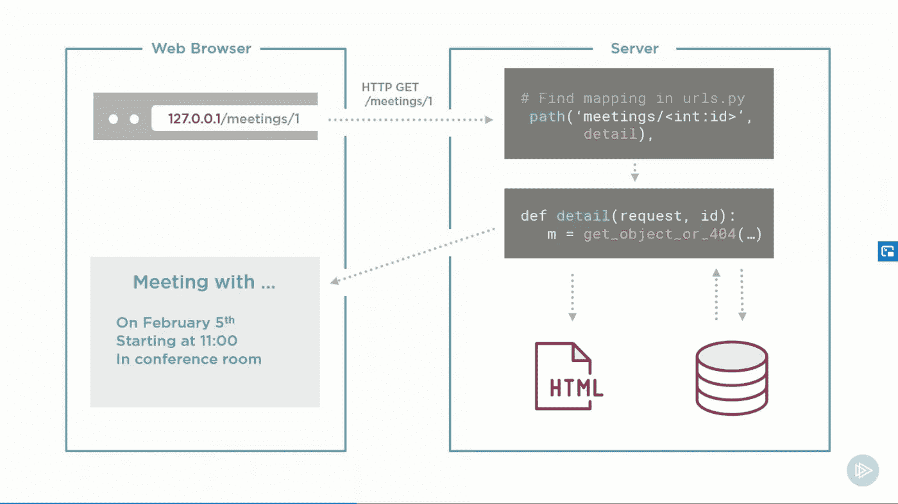
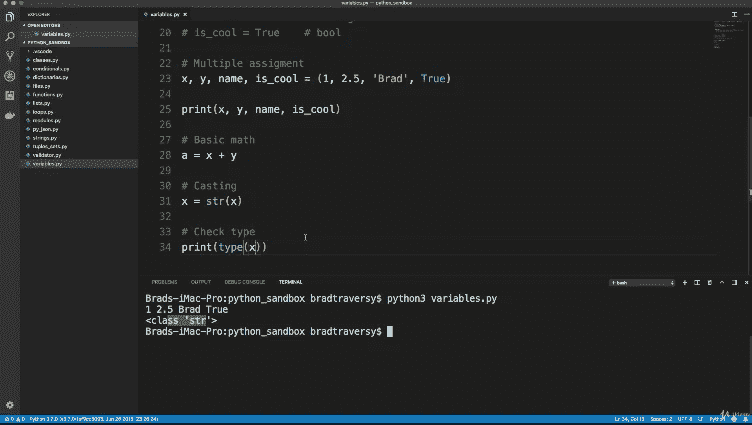
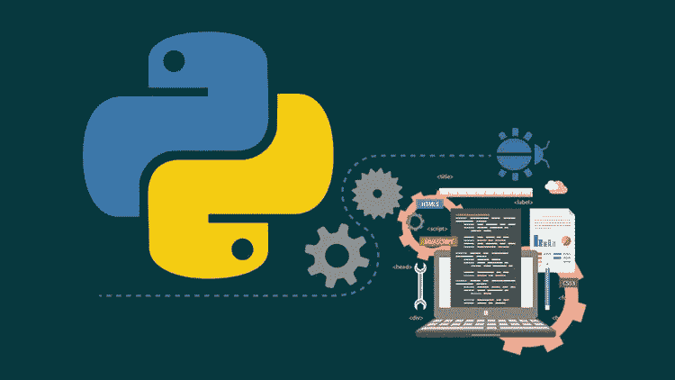
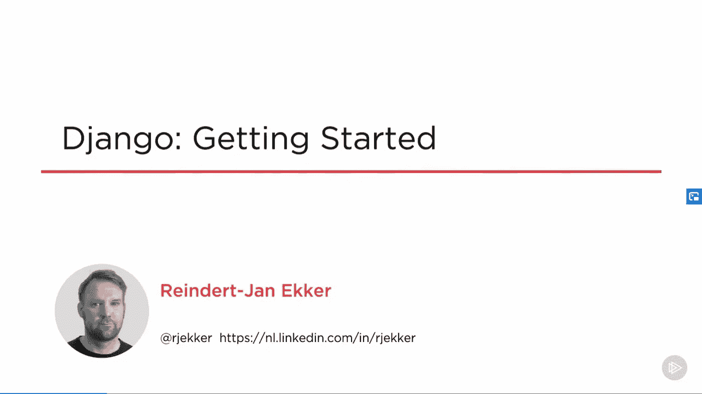
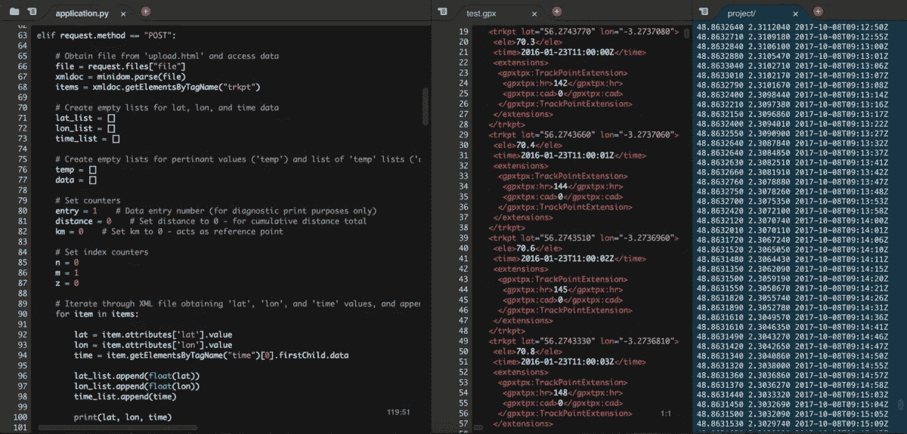
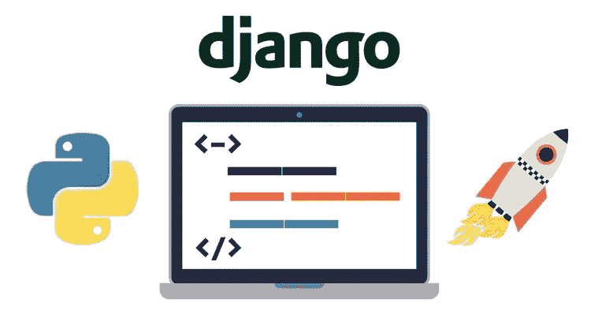

# 2023 年初学者学习 Django 我最喜欢的课程

> 原文：<https://medium.com/javarevisited/my-favorite-courses-to-learn-django-for-beginners-2020-ac172e2ab920?source=collection_archive---------0----------------------->

大家好，你可能知道 [Python](/better-programming/top-5-courses-to-learn-python-in-2018-best-of-lot-26644a99e7ec) 是一种多用途编程语言，这意味着你可以在不同的领域使用它，比如 GUI 应用、[人工智能](/javarevisited/7-best-courses-to-learn-artificial-intelligence-in-2020-26d59d62f6fe)和 [web 应用](/javarevisited/top-10-courses-to-learn-python-for-web-development-in-2020-best-of-lot-efe11fb6d212)等等，仅举几个例子。

除了[数据科学](https://www.java67.com/2018/10/top-10-data-science-and-machine-learning-courses.html)，Web 开发是 [Python](https://www.java67.com/2018/02/5-free-python-online-courses-for-beginners.html) 真正大放异彩的另一个领域，因为它有令人敬畏的工具、库和框架。而且，当我们谈论 web 应用程序时，最受欢迎的 python 框架之一是 [Django 框架](https://www.djangoproject.com/)，它允许您非常快速和容易地创建 Python web 应用程序。

Django 是一个功能强大的 Python 框架，用于创建 web 应用程序，该工具被认为是最好的 [web 开发框架之一](https://javarevisited.blogspot.com/2019/04/top-5-python-web-development-frameworks.html)，用于开发使用内容管理系统(CMS)、客户关系管理(CRM)、对象关系映射(ORM)等数据库的网站。

如果您正在开始使用[*Python 进行 web 开发*](https://www.java67.com/2020/06/top-5-courses-to-learn-django-and-python-for-web-development.html) 或者想要成为一名 Python web 开发人员，并且正在寻找一些在线培训课程来**学习 Django** ，那么您来对地方了。在这篇博文中，我们将会看到一些 Django 的最佳课程，这些课程旨在帮助你提高如何使用这个框架来创建你自己的 web 应用程序。

# 学习 Django 进行 Web 开发的 6 个最佳 Udemy 和 Coursera 在线课程

不要再浪费你的时间了，这里有最好的 Django 网页开发课程。该列表包含来自 Udemy 和 T2 的基于项目的在线培训课程，以学习 Django web 开发框架。

## 1. [Python Django 开发到部署](https://click.linksynergy.com/deeplink?id=JVFxdTr9V80&mid=39197&murl=https%3A%2F%2Fwww.udemy.com%2Fcourse%2Fpython-django-dev-to-deployment%2F)

如果你想通过实践练习来学习 Django 和 web 开发，那么这个课程正适合你。本课程旨在带您进入 web 开发的高级阶段，从 python 编程语言基本语法开始，一直到 web 应用程序的部署。

以下是您将在本课程中学到的主要内容:

*   如何使用 [Python](/swlh/5-free-python-courses-for-beginners-to-learn-online-e1ca90687caf) 即使是初学者？
*   用 Django 和 [PostgreSQL](https://javarevisited.blogspot.com/2020/02/top-5-courses-to-learn-postgresql-in.html) 搭建一个房地产网站。
*   构建虚拟环境和部署 web 应用程序。

由我最喜欢的 Udemy 导师之一的 Brad Traversy 创建的这个 Python 和 Django 课程有超过 11 个小时的实践视频和一堆例子，比如创建一个房地产网站。

**这里是加入本课程的链接** — [Python Django 开发到部署](https://click.linksynergy.com/deeplink?id=JVFxdTr9V80&mid=39197&murl=https%3A%2F%2Fwww.udemy.com%2Fcourse%2Fpython-django-dev-to-deployment%2F)

## 2.[姜戈为大家](https://coursera.pxf.io/c/3294490/1164545/14726?u=https%3A%2F%2Fwww.coursera.org%2Fspecializations%2Fdjango)【Coursera】

如果你想在 Coursera 上学习 Django，那么这是另一个学习使用 Django 开发 web 应用程序的好课程。本课程由密歇根大学提供，面向了解 python 基础知识的有经验的 Python 开发人员。

在 Couesra 的 Django 课程中，您将学习 Django 如何与数据库(如 T2 SQL T3)交互，以及如何使用 Django 库创建 web 应用程序并添加一些功能。

如果你想深入学习 Django，从入门到精通，你应该加入这个 Coursera 课程；这对初学者和有经验的 Django 开发者来说是完美的，因为你将有机会填补你学习中的空白。即使我知道 Django，我也从这个课程中学到了很多。

已经有超过 60，000 人加入了这个课程来深入学习 Django，你也可以加入。

**这里是大家参加这个课程**-[Django](https://coursera.pxf.io/c/3294490/1164545/14726?u=https%3A%2F%2Fwww.coursera.org%2Fspecializations%2Fdjango)的链接

顺便说一下，除了单独加入这些课程和专业，你还可以加入 [**Coursera Plus**](https://coursera.pxf.io/c/3294490/1164545/14726?u=https%3A%2F%2Fwww.coursera.org%2Fcourseraplus) ，这是 Coursera 的一个订阅计划，让你可以无限制地访问他们最受欢迎的课程、专业、专业证书和指导项目。

 [## Coursera Plus |无限制访问 7，000 多门在线课程

### 在 Coursera 上可以无限制地访问 90%以上的课程、项目、专业和专业证书

coursera.pxf.io](https://coursera.pxf.io/c/3294490/1164545/14726?u=https%3A%2F%2Fwww.coursera.org%2Fcourseraplus) 

## 3. [Django 和 Python:完整捆绑包+ Django 真实项目 2023](https://click.linksynergy.com/deeplink?id=JVFxdTr9V80&mid=39197&murl=https%3A%2F%2Fwww.udemy.com%2Fcourse%2Fpython-django-tkinter-complete-bundle-advance%2F)

在这个关于 Django 的完整课程中，您将首先看到如何从头开始使用 Python，然后作为一名专业开发人员使用 Django，并学习如何设计一个良好的用户界面、发送电子邮件、web 报废、安全性、高级搜索以及更多您可以探索的内容。以下是您将在本课程中学到的主要内容:

*   如何在 Python Django 中创建真实的网站？
*   如何创建和运行真实世界的基于文本的 RPG 游戏？
*   如何使用 Django 和 [Bootstrap](/javarevisited/7-free-courses-to-learn-bootstrap-for-web-designers-and-developers-5135215648f1) 框架。

如果你想获得一个关于如何掌握 Django 框架的完整课程，那么这个完整的包就是适合你的。

**这里是加入本课程的链接**——[Django 和 Python:完整捆绑包+ Django 真实项目 2023](https://click.linksynergy.com/deeplink?id=JVFxdTr9V80&mid=39197&murl=https%3A%2F%2Fwww.udemy.com%2Fcourse%2Fpython-django-tkinter-complete-bundle-advance%2F)

## 4.[姜戈:入门](https://pluralsight.pxf.io/c/1193463/424552/7490?u=https%3A%2F%2Fwww.pluralsight.com%2Fcourses%2Fdjango-getting-started)【复数视线】

如果你最近完成了一门 python 课程，并且想学习一些 web 应用程序开发的入门知识，那么我会向你推荐这个在 [Pluralsight](/javarevisited/7000-free-pluralsight-courses-to-build-in-demand-tech-skills-without-leaving-your-house-40edb50a8cf2) 中提供的 Django 基础课程。

顾名思义，它向您展示了如何在了解这个框架的基础知识之后创建和构建一个完整的 web 应用程序。之后，您将看到如何使用 Django 模板来设计页面样式，如何向这些页面添加 URL，如何处理用户交互，等等。

以下是您将在本课程中学到的主要内容:

*   Django 框架的基础。
*   使用 Django 模板创建有吸引力的页面。
*   使用 API 和用户界面存储和操作数据。

完成本课程后，您将知道如何使用 Django 框架构建自己完整的 web 应用程序。

**这是参加本课程的链接**——[Django:入门](https://pluralsight.pxf.io/c/1193463/424552/7490?u=https%3A%2F%2Fwww.pluralsight.com%2Fcourses%2Fdjango-getting-started)

顺便说一句，你需要一个 [**Pluralsight 会员**](https://pluralsight.pxf.io/c/1193463/424552/7490?u=https%3A%2F%2Fwww.pluralsight.com%2Fpricing) 才能加入这个课程，这个课程的费用大约是每月 29 美元，每年 299 美元(14%的折扣)，但是完全值得。另类。你也可以使用他们的 [**10 天免费试用**](https://pluralsight.pxf.io/c/1193463/424552/7490?u=https%3A%2F%2Fwww.pluralsight.com%2Flearn) 来免费观看这个课程。

## 5. [CS 50 用 Python 和 JavaScript 的 Web 编程](https://www.awin1.com/cread.php?awinmid=6798&awinaffid=631878&clickref=&p=%5B%5Bhttps%3A%2F%2Fwww.edx.org%2Fcourse%2Fcs50s-web-programming-with-python-and-javascript)【edX】

学习 Django web 编程的最佳在线课程之一是哈佛大学提供的 CS50 的 edX 平台上的 Python 和 JavaScript 编程课程。

这也是一门**免费课程，你可以在线学习 Django**。需要证书的时候才需要交钱。

本课程继承了经典的 [CS50 课程](https://www.awin1.com/cread.php?awinmid=6798&awinaffid=631878&clickref=&p=%5B%5Bhttps%3A%2F%2Fwww.edx.org%2Fcourse%2Fcs50s-introduction-to-computer-science)(最受欢迎的在线计算机科学课程)的成果，使用像 [Flask](https://javarevisited.blogspot.com/2020/01/top-5-courses-to-learn-flask-for-web-development-with-python.html) 、Django 和 [Bootstrap](https://javarevisited.blogspot.com/2020/07/top-5-courses-to-learn-bootstrap-in.html) 这样的框架，通过 [Python](/javarevisited/10-free-python-tutorials-and-courses-from-google-microsoft-and-coursera-for-beginners-96b9ad20b4e6) 、 [JavaScript](/javarevisited/10-best-online-courses-to-learn-javascript-in-2020-af5ed0801645) 和 [SQL](/javarevisited/7-free-courses-to-learn-database-and-sql-for-programmers-and-data-scientist-e7ae19514ed2) 更深入地研究 web 应用的设计和实现。以下是您将在本课程中学到的主要内容:

*   如何为您的 web 应用程序设计和创建数据库？
*   如何使用 Django 创建自己的 web 应用程序？
*   如何在互联网上部署您的 web 应用程序？

本课程向您展示了如何为您的 web 应用程序创建数据库，以及可伸缩性、安全性、用户体验等其他主题。通过他们的实践练习，你将学到一些令人兴奋的项目，如编写、使用 API、创建交互式 UI。

**这里是加入本课程的链接**——[CS 50 用 Python 和 JavaScript 进行 Web 编程](https://www.awin1.com/cread.php?awinmid=6798&awinaffid=631878&clickref=&p=%5B%5Bhttps%3A%2F%2Fwww.edx.org%2Fcourse%2Fcs50s-web-programming-with-python-and-javascript)

## 6. [Python 和 Django 全栈 Web 开发者训练营](https://click.linksynergy.com/deeplink?id=JVFxdTr9V80&mid=39197&murl=https%3A%2F%2Fwww.udemy.com%2Fcourse%2Fpython-and-django-full-stack-web-developer-bootcamp%2F)【Udemy】

在 Udemy，很多课程都在讲 Django 框架，但是如果你想多练习增强知识，那么可以考虑看一看这个课程。在本课程中，您将使用 Django 框架构建几个现实世界的项目，如博客和社交媒体克隆。

以下是您将在本课程中学到的主要内容:

*   学习 Django web 框架。
*   学习 web 开发。
*   开发几个项目来掌握姜戈

此外，本课程将向您展示一些 [HTML](/javarevisited/5-free-html-and-css-courses-to-learn-front-end-web-development-online-8b04517c6ecb) 、 [CSS](https://hackernoon.com/top-5-free-online-courses-to-learn-html-css-web-development-in-2020-ae8e7466dfa7) 、 [JavaScript](/javarevisited/12-free-courses-to-learn-javascript-and-es6-for-beginners-and-experienced-developers-aa35874c9a32) 和 [jQuery](https://www.java67.com/2018/04/top-5-free-jquery-courses-for-web-developers.html) ，面向初级和中级 python 程序员。

本课程由何塞·波尔蒂利亚创建，他是 Udemy 上最好的 Python 讲师之一，也是 Udemy 上最受欢迎的 Python 课程 [Python 3 Bootcamp](http://bit.ly/2BY5LJC) 课程的作者，该课程拥有近 100 万学生。

**这里是加入本课程的链接** — [Python 和 Django 全栈 Web 开发者训练营](https://click.linksynergy.com/deeplink?id=JVFxdTr9V80&mid=39197&murl=https%3A%2F%2Fwww.udemy.com%2Fcourse%2Fpython-and-django-full-stack-web-developer-bootcamp%2F)

以上是为 Python 开发人员**或任何想学习使用 Django 和 Python 框架进行 web 开发的人提供的学习 Django 的最佳课程。你不需要经历所有这些课程，你可以选择一门你和老师联系更好的课程。**

我强烈建议你观看这些课程的预演，如果你没有跳过预演，那么这是一个很好的迹象，表明你正在与课程和教师建立联系。

其他 **Python** **编程文章**你可能喜欢

*   [深入学习 Python 的五大课程](https://www.java67.com/2020/05/top-5-courses-to-learn-python-in-depth.html)
*   [2023 年学习 Python 的 10 个理由](https://javarevisited.blogspot.com/2018/05/10-reasons-to-learn-python-programming.html)
*   [面向初学者和中级开发人员的 8 个 Python 项目](/@javinpaul/8-projects-you-can-buil-to-learn-python-in-2020-251dd5350d56)
*   [2023 年学习 Python 的前 5 本书](https://www.java67.com/2019/08/top-5-books-to-learn-python-for-beginners.html)
*   [哈佛和 IBM 的 9 门数据科学课程](https://becominghuman.ai/9-data-science-and-machine-learning-courses-by-harvard-ibm-udemy-and-others-12a0c7c23ec1)
*   [Python vs Java——从](/javarevisited/python-or-java-which-programming-language-beginners-should-learn-in-2020-de992b2650ec)开始哪个更好
*   [学习数据科学 Python 的 5 本书](https://javarevisited.blogspot.com/2019/08/top-5-python-books-for-data-science-and-machine-learning.html)
*   【Coursera 颁发的 10 个最佳 Python 专业和证书
*   [8 个用于机器学习的 Python 库](https://javarevisited.blogspot.com/2018/10/top-8-python-libraries-for-data-science-machine-learning.html)
*   [Web 开发可以学习的 5 个 Python 框架](https://javarevisited.blogspot.com/2019/04/top-5-python-web-development-frameworks.html)

感谢您阅读本文。如果你觉得这些 Python 和 Django 课程有用，那么请与你的朋友和同事分享。如果您有任何问题或反馈，请留言。

**附言——**如果你想学习 Python 编程，但负担不起这些在线培训课程的费用，或者想寻找免费资源开始学习 Python 编程，那么我也建议你看看 Udemy 上的这个[**Python 编程简介**](http://bit.ly/2D5vvnV) 课程。它是完全免费的，受到来自世界各地的 49 万多名学生的信任。

 [## 免费 Python 教程——Python 编程介绍

### Avinash Jain 目前是加州大学伯克利分校电气工程和计算机科学专业的大二学生。他是…

bit.ly](http://bit.ly/2D5vvnV)