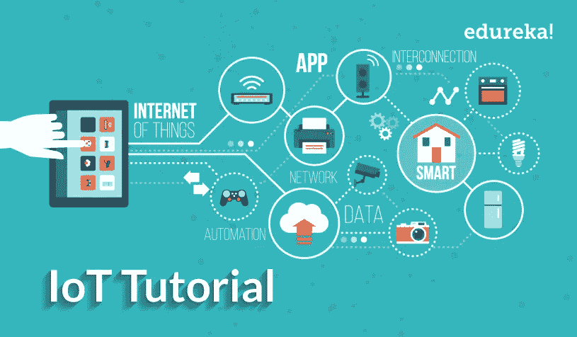
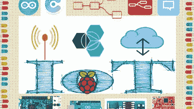
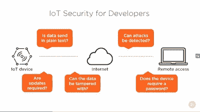
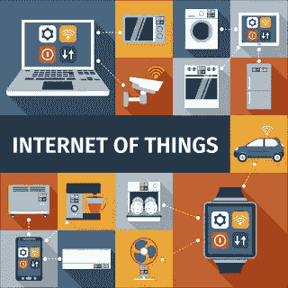

# 2023 年学习物联网的 5 门最佳 Arduino、IoT 和 Raspberry PI 课程

> 原文：<https://medium.com/javarevisited/my-favorite-courses-to-learn-internet-of-things-iot-in-2020-best-of-lot-8517aa9fc838?source=collection_archive---------2----------------------->

image_credit — Edureka 物联网培训认证

你好，你可能听说过 IoT 或物联网，因为它正在慢慢改变世界。但如果你不确定物联网是什么意思，为什么你应该在 2023 年学习这项技能，那么让我给你一个简单的概述。

物联网(Internet of Things)是指除了日常生活中使用的普通计算机或电话之外的任何具有互联网连接的材料或机器，它必须具有一些计算能力和一些智能，才能被视为物联网设备，如相机和智能冰箱。

我们这个世界的技术发展速度比以前更快，因此对物联网(IoT)设备的需求在过去几年里大幅增长。

对物联网工程师的需求增长过快，美国的平均年薪超过了**10 万美元，有些公司的平均年薪是这个数字的两倍多。

我们将看到在线课程和物联网培训课程，这些课程将让您深入了解更多关于物联网的知识，以及如何利用多种编程语言(如 [Python](https://www.java67.com/2020/05/top-5-courses-to-learn-python-in-depth.html) 、 [C/C++](/javarevisited/top-10-courses-to-learn-c-for-beginners-best-and-free-4afc262a544e) )编写代码并为自己构建一个物联网，方法是使用 [Arduino](https://www.amazon.com/Arduino-A000066-ARDUINO-UNO-R3/dp/B008GRTSV6/?tag=javamysqlanta-20) 和 [raspberry pi](https://www.amazon.com/Raspberry-Model-2019-Quad-Bluetooth/dp/B07TC2BK1X/?tag=javamysqlanta-20) 设备来制作自己的项目。**

顺便说一下，如果你赶时间，那么你可以从 Coursera 上的 [**物联网(IOT)编程入门**](https://coursera.pxf.io/c/3294490/1164545/14726?u=https%3A%2F%2Fwww.coursera.org%2Fspecializations%2Fiot) 开始，这是 2023 年学习物联网最结构化的方式。

 [## 物联网编程介绍(IOT)

### 创建自己的物联网(IoT)设备。只需六门课程，即可设计并创建一个简单的物联网设备。设计…

coursera.pxf.io](https://coursera.pxf.io/c/3294490/1164545/14726?u=https%3A%2F%2Fwww.coursera.org%2Fspecializations%2Fiot) 

# 2023 年学习物联网(IoT)的 5 门最佳在线课程

在不浪费你更多时间的情况下，这里列出了学习物联网的最佳在线课程。您可以在舒适的办公室或家中参加这些在线课程，并根据您的时间表和便利条件进行学习。

## 1.[构建物联网的完整指南](https://click.linksynergy.com/deeplink?id=JVFxdTr9V80&mid=39197&murl=https%3A%2F%2Fwww.udemy.com%2Fcourse%2Fcomplete-guide-to-build-iot-things-from-scratch-to-market%2F)

这是学习 IoT 或物联网最好的 Udemy 课程之一。顾名思义，该课程是一个全面的计划，将带你从初学者到高级水平，了解如何使用 Arduino 构建自己的物联网设备，以及如何使用[C/c++编程语言](https://javarevisited.blogspot.com/2020/03/top-5-cpp-programming-books-must-read.html)和 Arduino IDE 进行编码。

你将在本课程中学到:

*   了解如何编写 Arduino 程序。
*   了解一些物联网硬件及其作用。
*   建立一些有趣的项目。

您将了解物联网设备使用的不同硬件，例如传感器、继电器、 [Arduino](https://www.amazon.com/Arduino-A000066-ARDUINO-UNO-R3/dp/B008GRTSV6/?tag=javamysqlanta-20) 等等。在整个课程中，您将构建许多项目，如智能灯(家庭自动化)、带电子邮件通知的运动探测器和恐慌报警器。

**以下是加入本课程的链接—** [**构建物联网的完整指南**](https://click.linksynergy.com/deeplink?id=JVFxdTr9V80&mid=39197&murl=https%3A%2F%2Fwww.udemy.com%2Fcourse%2Fcomplete-guide-to-build-iot-things-from-scratch-to-market%2F)

## 2.[物联网—巨型课程](https://click.linksynergy.com/deeplink?id=JVFxdTr9V80&mid=39197&murl=https%3A%2F%2Fwww.udemy.com%2Fcourse%2Finternet-of-things-the-mega-course%2F)【Udemy】

如果你有一些编程语言的基础知识，比如 Python 或 C/C++，你可以满怀信心地学习这门大型课程，它将教你如何使用 Raspberry Pi 和 Arduino 构建 4 个有趣的项目。

在本课程中，您将学到:

*   如何使用 [Python 编程](https://javarevisited.blogspot.com/2020/05/top-10-udemy-courses-to-learn-python-programming.html)与树莓派？
*   如何使用 Arduino Uno？
*   使用 Raspberry Pi 和 Arduino Uno 创建许多项目。

您将使用 Arduino Uno 创建一个气象站，该项目使用 [Raspberry Pi](https://www.youtube.com/watch?v=QVkSSeoW8QI) 和 [Python 编程语言](/javarevisited/my-favorite-books-to-learn-python-in-depth-77465633b46e)测量水位并通过电子邮件通知您，这是一个可以通过手机在全球任何地方控制的智能灯泡，等等。

**Hre 是加入本课程的纽带——**[物联网(IoT)——巨型课程](https://click.linksynergy.com/deeplink?id=JVFxdTr9V80&mid=39197&murl=https%3A%2F%2Fwww.udemy.com%2Fcourse%2Finternet-of-things-the-mega-course%2F)

## 3.[物联网安全](https://pluralsight.pxf.io/c/1193463/424552/7490?u=https%3A%2F%2Fwww.pluralsight.com%2Fcourses%2Fsecurity-internet-of-things-big-picture)【plural sight 课程】

除了设计和构建物联网设备，本课程还将向您介绍该行业最重要的一个方面，即安全问题，本课程旨在面向没有物联网安全经验的初学者。

在本课程中，您将学到:

*   物联网设备的定义。
*   嵌入式设备的定义。
*   物联网设备的安全问题。

顺便说一句，你需要一个 [Pluralsight 会员](https://pluralsight.pxf.io/c/1193463/424552/7490?u=https%3A%2F%2Fwww.pluralsight.com%2Fpricing)才能进入这个不免费的课程。它的费用大约是每月 29 美元或每年 299 美元，虽然这种会员资格完全值得你的时间和金钱，因为它提供了 7000 多门关于最新技术的在线课程，你也可以使用他们的 [**10 天免费试用**](https://pluralsight.pxf.io/c/1193463/424552/7490?u=https%3A%2F%2Fwww.pluralsight.com%2Flearn) 来免费访问这门课程。

## 4.[物联网编程入门](https://coursera.pxf.io/c/3294490/1164545/14726?u=https%3A%2F%2Fwww.coursera.org%2Fspecializations%2Fiot)【Coursera】

Coursera 的这个专业可能是互联网上最全面的程序，从头开始教你如何使用 [Python](/javarevisited/top-10-courses-to-learn-python-for-web-development-in-2020-best-of-lot-efe11fb6d212) 和 C 编写代码，使用 Raspberry Pi 和 Arduino Uno 编写许多项目。

你将在本课程中学到:

*   用 Python 和 c 编程。
*   如何使用 [Arduino Uno](https://www.amazon.com/Arduino-A000066-ARDUINO-UNO-R3/dp/B008GRTSV6/?tag=javamysqlanta-20) 和[树莓 Pi](https://www.amazon.com/Raspberry-Model-2019-Quad-Bluetooth/dp/B07TC2BK1X/?tag=javamysqlanta-20) 。
*   创建许多项目。

它由六个部分组成，首先从简单的概述向您介绍什么是物联网，然后您将学习 C 编程语言以及如何使用 Arduino Uno 实现它等技术内容，之后您将开始学习 python 并使用它在 raspberry pi 中编写程序，并通过一个顶点项目完成专业化。

**以下是加入本课程的链接—** [物联网编程简介](https://coursera.pxf.io/c/3294490/1164545/14726?u=https%3A%2F%2Fwww.coursera.org%2Fspecializations%2Fiot)

顺便说一下，如果你打算参加多个 Coursera 课程或专业，那么考虑参加 [**Coursera Plus 订阅**](https://coursera.pxf.io/c/3294490/1164545/14726?u=https%3A%2F%2Fwww.coursera.org%2Fcourseraplus) n，它可以让你无限制地访问他们最受欢迎的课程、专业、专业证书和指导项目。它每年花费大约 399 美元，但它完全值得你的钱，因为你可以获得无限的证书。

 [## Coursera Plus |无限制访问 7，000 多门在线课程

### 用 Coursera Plus 投资你的职业目标。无限制访问 90%以上的课程、项目…

coursera.pxf.io](https://coursera.pxf.io/c/3294490/1164545/14726?u=https%3A%2F%2Fwww.coursera.org%2Fcourseraplus) 

## 5.[物联网:从硬件到实践](https://www.awin1.com/cread.php?awinmid=6798&awinaffid=631878&clickref=&p=%5B%5Bhttps%3A%2F%2Fwww.edx.org%2Fcourse%2Fitmox-iot-from-hardware-to-practice)【edX 课程】

另一个有趣的专业证书在 [edX](/javarevisited/10-free-best-edx-certifications-and-courses-to-learn-online-3473d466f968) 上，是关于如何使用 [Python](https://javarevisited.blogspot.com/2020/02/10-best-coursera-courses--for-python.html) 、 [C++](https://dev.to/javinpaul/top-10-courses-to-learn-c-in-depth-best-of-lot-1k7) / [C#、](/@javinpaul?source=follow_footer--------------------------follow_footer-)和 Python 语言，用 Arduino 和 Raspberry Pi 对物联网设备进行编程。

您将学习高级技能，如 IPv4 和 IPv6、蓝牙技术、物联网设备之间的蜂窝通信、Raspberry Pi 中使用的操作系统以及如何使用其 GPIO 等。

在本课程中，您将学到:

*   物联网使用不同的操作系统。
*   物联网中的先进技术。
*   如何编程树莓 Pi 和 Arduino？

**以下是加入本课程的链接—** [物联网:从硬件到实践](https://www.awin1.com/cread.php?awinmid=6798&awinaffid=631878&clickref=&p=%5B%5Bhttps%3A%2F%2Fwww.edx.org%2Fcourse%2Fitmox-iot-from-hardware-to-practice)

以上就是**了解物联网(IoT)** 的最佳在线课程，为你已经很强大的简历增加一项抢手的技能。我们已经列出了一系列课程，这些课程将使你成为物联网行业领域的专家，并为你制作自己的项目做好准备，所以现在你只需要选择一些课程，开始你在这个行业的旅程。

其他**科技文章**你可能喜欢:

*   [2023 年学习区块链的 6 门免费课程](https://www.java67.com/2018/02/5-free-blockchain-technology-courses.html)
*   [开始你科技职业生涯的 10 个最佳 Coursera 认证](/javarevisited/top-10-coursera-certificates-to-start-your-career-in-cloud-data-science-ai-mainframe-and-it-558690c83587)
*   你可以在线获得的前 5 个计算机科学学位
*   [十大数据科学和机器学习认证](https://javarevisited.blogspot.com/2018/10/data-science-and-machine-learning-courses-using-python-and-R-programming.html)
*   [从零开始学习云计算的 5 门最佳课程](https://javarevisited.blogspot.com/2019/07/top-5-online-courses-to-learn-cloud-computing-aws.html)
*   [您可以在线加入的 5 个数据科学学位项目](/@javinpaul/5-data-science-and-machine-learning-degree-programs-you-can-join-online-on-coursera-dba26823f5db)
*   [2023 年学习 Python 编码的前 8 名](https://dev.to/javinpaul/top-5-places-to-learn-python-programming-for-free-m4c)
*   成为网页设计师和开发者的 7 门免费课程
*   [成为 Python 开发者可以做的 8 个项目](/javarevisited/8-projects-you-can-buil-to-learn-python-in-2020-251dd5350d56)
*   [初学者学习数据库和 SQL 的 7 门免费课程](/javarevisited/7-free-courses-to-learn-database-and-sql-for-programmers-and-data-scientist-e7ae19514ed2)
*   [2023 年你可以瞄准的 10 个薪酬最高的技术工作](https://javarevisited.blogspot.com/2018/02/top-10-highest-paying-technical-jobs-programmers-software-developers.html)
*   [如何在 2023 年成为 DevOps 工程师](https://javarevisited.blogspot.com/2018/09/the-2018-devops-roadmap-your-guide-to-become-DevOps-Engineer.html#axzz61d5FPRru)

感谢您阅读本文。如果您发现这些物联网课程对学习物联网有用，请与您的朋友和同事分享。如果您有任何问题或反馈，请留言。

**P. S. —** 如果你对学习物联网或物联网感兴趣，但正在寻找免费的在线培训课程来启动你的旅程，那么你也可以在 Udemy 上查看这个— [**物联网和云简介**](https://click.linksynergy.com/deeplink?id=JVFxdTr9V80&mid=39197&murl=https%3A%2F%2Fwww.udemy.com%2Fcourse%2Fa4iot-intro-iot-cloud%2F) 课程。这是完全免费的，你只需要一个 Udemy 帐户就可以注册这门课程。

 [## 免费物联网教程-物联网和云介绍

### 未来技术实验室是一家 R&D 公司，将客户的传统业务流程、运营和资产转变为…

udemy.com](https://click.linksynergy.com/deeplink?id=JVFxdTr9V80&mid=39197&murl=https%3A%2F%2Fwww.udemy.com%2Fcourse%2Fa4iot-intro-iot-cloud%2F)