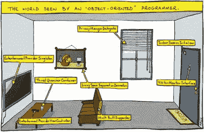
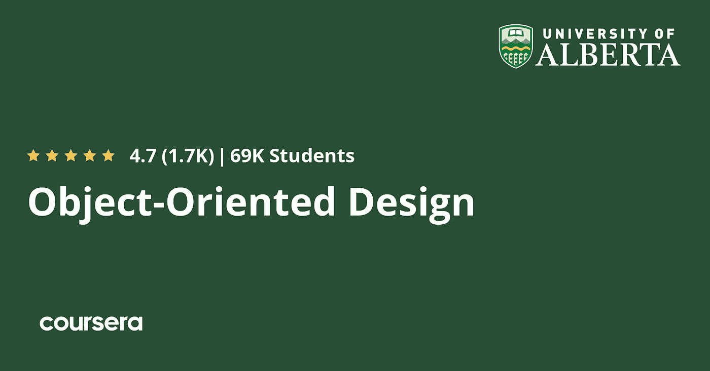
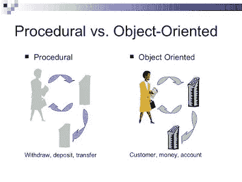
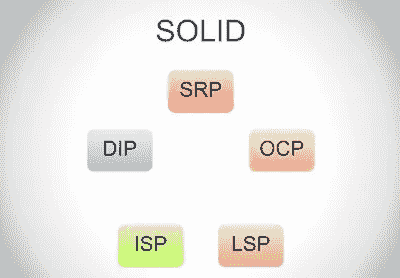
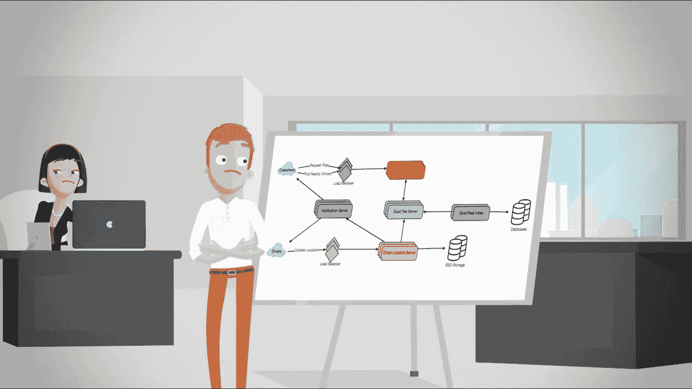
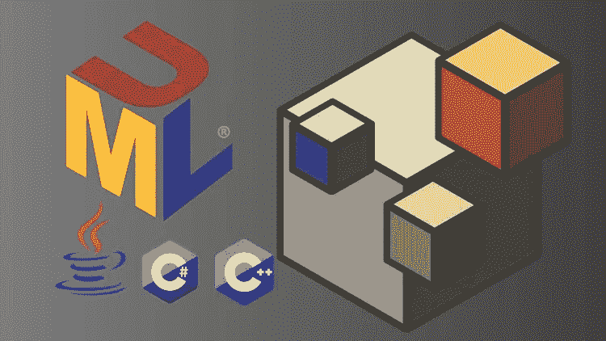

# 2023 年 10 门最佳面向对象分析、设计和编程课程

> 原文：<https://medium.com/javarevisited/my-favorite-courses-to-learn-object-oriented-programming-and-design-in-2019-197bab351733?source=collection_archive---------0----------------------->

## 你知道学习面向对象编程可以让你成为更好的开发人员吗？

你好，伙计们，如果你想学习面向对象的设计、分析和编程，并寻找最好的资源，如书籍和在线课程，那么你来对地方了。

以前我分享过 [**最好的系统设计课程**](/javarevisited/10-best-system-design-courses-for-coding-interviews-949fd029ce65) s，[书籍](/javarevisited/6-best-object-oriented-programming-books-and-courses-for-beginners-d46235cbda49)，还有一些[免费的 OOP 编程课程](/swlh/5-free-object-oriented-programming-online-courses-for-programmers-156afd0a3a73)，而在这篇文章中，我打算将最好的 OOP 设计、分析、编程课程一文。

毫无疑问**面向对象编程**是软件开发的支柱，也是 Java 取得巨大成功的原因之一。扎实的面向对象编程知识有助于您创建更好的软件。

这也有助于你更好地向你的团队和同事交流你的想法。尽管这是一项如此重要的技术，但是很难找到很好理解 OOP 的优秀程序员。

很多程序员只是认为 OOP 无非是[抽象](http://www.java67.com/2015/05/difference-between-abstraction-and.html)、[继承](http://www.java67.com/2012/08/what-is-inheritance-in-java-oops-programming-example.html)、[封装](https://javarevisited.blogspot.com/2012/03/what-is-encapsulation-in-java-and-oops.html)、[多态](http://www.java67.com/2015/05/difference-between-abstraction-and.html)，没有真正理解和掌握这些概念。

毫无疑问，它们是面向对象编程的四大支柱，但 OOP 远不止于此。OOP 是关于类和对象方面的思考，通过遵循最佳实践来组织你的代码，比如使用[可靠设计原则](https://javarevisited.blogspot.com/2018/07/10-object-oriented-design-principles.html)和[设计模式](https://javarevisited.blogspot.com/2018/02/top-5-java-design-pattern-courses-for-developers.html)。

它最终帮助你写出更好的软件，更容易修改和支持。这就是程序员和软件开发人员理解 OOP 非常重要的原因。

以前我分享过几本[书](https://javarevisited.blogspot.com/2017/04/top-5-books-to-learn-object-oriented-programming.html)和[免费课程学习面向对象编程](http://www.java67.com/2018/02/5-free-object-oriented-programming-online-courses.html)。然而，关于一般的反馈，我收到了一些建议，关于分享更彻底和完整的课程来学习基本和高级的 [OOP 概念](http://www.java67.com/2015/12/top-30-oops-concept-interview-questions-answers-java.html)。

在这篇文章中，我将尝试回应这些反馈，并提供一个更广泛、更全面的初级和高级课程列表。

在这篇文章中，我将分享一些最好的课程，可以帮助你从头开始学习更多的面向对象编程和设计。我还包括了初级课程[和高级课程](/swlh/5-free-python-courses-for-beginners-to-learn-online-e1ca90687caf)以迎合不同经验水平的 Java 程序员。

# 面向 Java 开发人员的 10 门最佳面向对象设计和编程课程

事不宜迟，下面是我为 Java 程序员列出的一些最好的面向对象和设计课程。这个列表包括初学者和有几年经验的 Java 程序员的课程。不管你懂不懂 [Java](https://javarevisited.blogspot.com/2018/08/top-5-free-java-8-and-9-courses-for-programmers.html) 和 [OOP](http://www.java67.com/2015/12/top-30-oops-concept-interview-questions-answers-java.html) ，加入这些课程你都会学到一二。

## [1。掌握 Java 面向对象设计](https://click.linksynergy.com/fs-bin/click?id=JVFxdTr9V80&subid=0&offerid=323058.1&type=10&tmpid=14538&RD_PARM1=https%3A%2F%2Fwww.udemy.com%2Fmastering-object-oriented-design-in-java%2F)【Udemy 最佳课程】

学习 Java 很容易，但编写生产质量的面向对象代码同样很难——这正是本课程将帮助你的地方。

你在网上找到的大多数面向对象课程只会解释 OOP 的基础知识，比如四大支柱——抽象、[封装](https://javarevisited.blogspot.com/2017/04/difference-between-abstraction-and-encapsulation-in-java-oop.html)等等。但是，他们中很少有人详细讲述如何将它们应用到现实世界中。

抽象解决什么问题？为什么重要？*如果你没有使用正确的抽象层次会发生什么？*或者，你如何培养从不同的抽象层次看待事物的技能，等等？

这门[课程](https://click.linksynergy.com/fs-bin/click?id=JVFxdTr9V80&subid=0&offerid=323058.1&type=10&tmpid=14538&RD_PARM1=https%3A%2F%2Fwww.udemy.com%2Fmastering-object-oriented-design-in-java%2F)试图通过解释专业 Java 开发人员应该知道的所有面向对象编程的重要工具和概念来弥合这一鸿沟。

**这里是报名本课程的链接—** [**掌握 Java 面向对象设计**](https://click.linksynergy.com/fs-bin/click?id=JVFxdTr9V80&subid=0&offerid=323058.1&type=10&tmpid=14538&RD_PARM1=https%3A%2F%2Fwww.udemy.com%2Fmastering-object-oriented-design-in-java%2F)

你将像任何其他 Java 课程一样从 OOP 基础开始，但是慢慢地，你将学会使用面向对象编程中的最佳实践来设计和开发软件。

您将了解坚实的原则，并看到使用它们来编写更好的代码的例子。您还将了解几种面向对象的设计模式，如模板、[工厂](http://javarevisited.blogspot.sg/2011/12/factory-design-pattern-java-example.html#axzz51cvxH5kW)、[策略](http://javarevisited.blogspot.sg/2015/07/strategy-design-pattern-and-open-closed-principle-java-example.html)、[观察者](http://javarevisited.blogspot.sg/2011/12/observer-design-pattern-java-example.html)、[构建器](http://javarevisited.blogspot.sg/2012/06/builder-design-pattern-in-java-example.html)等。

该课程还涵盖了高级概念，如[依赖注入](https://javarevisited.blogspot.sg/2015/06/difference-between-dependency-injection.html)和 [UML](https://javarevisited.blogspot.com/2017/07/top-5-books-to-learn-uml-unified-modelling-language-java.html) ，并向您展示如何在实际项目中使用它们。

总的来说，这是一门学习更多面向对象编程和设计的好课程，我强烈推荐给有几年经验的初级和中级 Java 开发人员。

## 2.[王信明的面向对象设计](https://coursera.pxf.io/c/3294490/1164545/14726?u=https%3A%2F%2Fwww.coursera.org%2Flearn%2Fobject-oriented-design)【最佳 Coursera 课程】

这是 2023 年学习面向对象设计最好的 Coursera 课程。这门课程由阿尔伯塔大学提供，授课老师不是别人，正是 Coursera 的顶级讲师之一王信明。

这门课最好是学习使用 Java 编程语言的面向对象分析与设计。您将发现如何通过应用面向对象的设计原则和指南来创建模块化、灵活且可重用的软件。

你不仅会学到面向对象的设计方法和技术，还会学到一个叫做 [UML](/javarevisited/5-best-uml-books-and-courses-for-java-programmers-13c551a9235d) 的有用工具，它可以让你可视化地将你的面向对象设计决策传达给其他开发人员和利益相关者。

本课程是 [**软件设计和架构专业化**](https://coursera.pxf.io/c/3294490/1164545/14726?u=https%3A%2F%2Fwww.coursera.org%2Fspecializations%2Fsoftware-design-architecture) 的一部分，本课程最大的优点是顶点项目，它为您提供了一个应用面向对象设计知识的机会，通过开发和记录 Android 应用程序的 Java 代码库以及相应的 UML 文档。

谈到社会证明，已经有近 7 万名学生加入了这门课程，在近 1700 名参与者中，这门课程获得了惊人的 4.7 分。如果你热衷于学习面向对象的设计技巧，那么我强烈推荐这门课程

**这里是加入本课程** — [面向对象设计](https://coursera.pxf.io/c/3294490/1164545/14726?u=https%3A%2F%2Fwww.coursera.org%2Flearn%2Fobject-oriented-design)的链接

我说过，本课程也是[**软件设计与架构专业化**](https://coursera.pxf.io/c/3294490/1164545/14726?u=https%3A%2F%2Fwww.coursera.org%2Fspecializations%2Fsoftware-design-architecture) 的一部分，对于有经验的开发人员学习软件架构，拓展软件和解决方案架构师的职业生涯是一个很大的专业化。

顺便说一下，除了单独加入这些课程和专业，您还可以加入 Coursera Plus 课程，这是 Coursera 的一个订阅计划，让您可以无限制地访问他们最受欢迎的课程、专业、专业证书和指导项目。

<https://coursera.pxf.io/c/3294490/1164545/14726?u=https%3A%2F%2Fwww.coursera.org%2Fcourseraplus>  

## [3。探寻面向对象设计面试](https://www.educative.io/courses/grokking-the-object-oriented-design-interview?affiliate_id=5073518643380224)【教育性】

我们大多数人学习面向对象的面试设计，然后将这些知识应用到现实世界中。面向对象的设计一直是软件工程面试过程的关键部分。

大多数工程师都在与面向对象设计面试(OODI)作斗争，部分原因是他们缺乏制定复杂系统设计的经验，部分原因是 OODI 的非结构化本质。

本课程由谷歌、脸书、微软和亚马逊的招聘经理设计。它不仅有一组精心挑选的案例研究，如停车场问题，这些问题在顶级技术公司中被反复询问，而且还提供了处理不同面向对象设计场景的全面体验。

如果你想提高你的面向对象的分析和设计技巧，我强烈推荐这门课程

**这里是报名参加本课程的链接—** [寻找面向对象设计面试](https://www.educative.io/courses/grokking-the-object-oriented-design-interview?affiliate_id=5073518643380224)

而且，如果你找到了教育平台和他们的探索课程，比如探索系统设计面试，那么考虑购买 [**教育订阅**](https://www.educative.io/subscription?affiliate_id=5073518643380224) ，每月只需 14.9 美元就可以访问他们的 100 多门课程。这非常

<https://www.educative.io/subscription?affiliate_id=5073518643380224>  

## [4。Java 面向对象编程绝对入门](https://click.linksynergy.com/fs-bin/click?id=JVFxdTr9V80&subid=0&offerid=323058.1&type=10&tmpid=14538&RD_PARM1=https%3A%2F%2Fwww.udemy.com%2Fabsolute-introduction-to-object-oriented-programming-in-java%2F)

这是上一门课作者的另一门课。这门课程实际上更多的是初级水平，如果你在加入之前的课程之前参加这个课程会更好——如果你之前没有任何关于 [OOP](http://www.java67.com/2016/09/oops-concept-tutorial-in-java-object-oriented-programming.html) 的背景。

本课程节奏缓慢、简单，非常适合希望理解类和对象以及它们如何帮助您编写更有组织的代码的初学者。

您将了解对象是何时创建的，以及当您运行 Java 程序时，它如何使用属性和方法。

本课程结束时，你将理解类和对象的区别以及重要的面向对象技术，如[继承](http://www.java67.com/2017/08/default-methods-in-interface-multiple.html)和[多态](http://javarevisited.blogspot.sg/2011/08/what-is-polymorphism-in-java-example.html)。

总的来说，对于想要理解面向对象编程的初学者来说，这是一门很棒的课程。

**这里是注册本课程的链接—**[Java 面向对象编程绝对入门](https://click.linksynergy.com/fs-bin/click?id=JVFxdTr9V80&subid=0&offerid=323058.1&type=10&tmpid=14538&RD_PARM1=https%3A%2F%2Fwww.udemy.com%2Fabsolute-introduction-to-object-oriented-programming-in-java%2F)

## [5。Java —面向对象编程【绝对初学者】](https://click.linksynergy.com/fs-bin/click?id=JVFxdTr9V80&subid=0&offerid=323058.1&type=10&tmpid=14538&RD_PARM1=https%3A%2F%2Fwww.udemy.com%2Fjava-object-oriented-programming-for-absolute-beginners%2F)

这是另一门[课程](https://click.linksynergy.com/fs-bin/click?id=JVFxdTr9V80&subid=0&offerid=323058.1&type=10&tmpid=14538&RD_PARM1=https%3A%2F%2Fwww.udemy.com%2Fjava-object-oriented-programming-for-absolute-beginners%2F)，更侧重于 Java，但它很好地涵盖了面向对象编程。您可以将课程分为两个部分——第一部分是第 1 章，专门介绍 OOP，第二部分重点介绍不同的 Java 特性，如线程、IO、流、Java 垃圾收集和异常处理。

在第一部分中，你将学习 OOP 基础知识，比如类和对象、构造函数、[重载](http://www.java67.com/2015/08/top-10-method-overloading-overriding-interview-questions-answers-java.html)和[重写](http://javarevisited.blogspot.sg/2011/12/method-overloading-vs-method-overriding.html#axzz5BcfNzgOe)方法，比如[数据抽象](http://javarevisited.blogspot.sg/2010/10/abstraction-in-java.html)、[封装](http://javarevisited.blogspot.sg/2012/03/what-is-encapsulation-in-java-and-oops.html#axzz4vlf582rN)和[继承](http://www.java67.com/2012/08/what-is-inheritance-in-java-oops-programming-example.html)。

好的一面是，它用一个演示来解释每个概念，使其易于理解和记忆。本课程还关注静态变量，这是 OOP 不推荐的，并使用抽象类和接口。

**这里是报名本课程的链接—** [Java —面向对象编程【绝对初学者】](https://click.linksynergy.com/fs-bin/click?id=JVFxdTr9V80&subid=0&offerid=323058.1&type=10&tmpid=14538&RD_PARM1=https%3A%2F%2Fwww.udemy.com%2Fjava-object-oriented-programming-for-absolute-beginners%2F)

## [6。Java 面向对象编程:从头开始](https://click.linksynergy.com/fs-bin/click?id=JVFxdTr9V80&subid=0&offerid=323058.1&type=10&tmpid=14538&RD_PARM1=https%3A%2F%2Fwww.udemy.com%2Fobject-oriented-programming-in-java-from-the-beginning%2F)

你会发现大多数关于 Java 面向对象编程的课程更多地关注 Java，而较少关注 OOP，但是这个课程是不同的。

的确，面向对象编程课程倾向于侧重于 OOP，并使用 Java 作为例子。

在这门[课程](https://click.linksynergy.com/fs-bin/click?id=JVFxdTr9V80&subid=0&offerid=323058.1&type=10&tmpid=14538&RD_PARM1=https%3A%2F%2Fwww.udemy.com%2Fobject-oriented-programming-in-java-from-the-beginning%2F)中，你将学习面向对象编程的基础知识，比如 OOP 和过程化语言的区别，比如 Java 和 C，以及抽象、封装、[继承](http://www.java67.com/2016/03/top-21-java-inheritance-interview-Questions-Answer-Programming.html)、[多态](http://www.java67.com/2012/10/difference-between-polymorphism-overloading-overriding-java.html)、[组合](http://javarevisited.blogspot.sg/2013/06/why-favor-composition-over-inheritance-java-oops-design.html#axzz57Kv4wGXe)和[聚合](http://javarevisited.blogspot.sg/2014/02/ifference-between-association-vs-composition-vs-aggregation.html)等东西。

您还将了解抽象类接口以及如何使用 OOP 创建对象。

**这里是报名本课程的链接—**[Java 面向对象编程:从头开始](https://click.linksynergy.com/fs-bin/click?id=JVFxdTr9V80&subid=0&offerid=323058.1&type=10&tmpid=14538&RD_PARM1=https%3A%2F%2Fwww.udemy.com%2Fobject-oriented-programming-in-java-from-the-beginning%2F)

本课程现在关注 Java 如何支持 OOP，例如 getters 和 setters、访问修饰符、接口的使用、组合、[重载](http://www.java67.com/2012/09/difference-between-overloading-vs-overriding-in-java.html)、[静态成员](http://www.java67.com/2016/05/difference-between-static-and-nonstatic-member-variable-in-java.html)等。

最后，本课程还介绍了 Java 中的一些设计模式，并解释了它们如何帮助你用 Java 编写更好的 OOP 代码。

简而言之，这是一个很好的学习 Java 面向对象编程和设计的短期课程。也就是说，对于软件工程师和工作中的 Java 专业人员来说，这都是一个不错的选择。

## [6。用 250 个步骤学习面向对象的 Java 编程](https://click.linksynergy.com/fs-bin/click?id=JVFxdTr9V80&subid=0&offerid=323058.1&type=10&tmpid=14538&RD_PARM1=https%3A%2F%2Fwww.udemy.com%2Fjava-programming-tutorial-for-beginners%2F)

这是学习 Java 面向对象编程的一门优秀的最新[课程](https://click.linksynergy.com/fs-bin/click?id=JVFxdTr9V80&subid=0&offerid=323058.1&type=10&tmpid=14538&RD_PARM1=https%3A%2F%2Fwww.udemy.com%2Fjava-programming-tutorial-for-beginners%2F)。

这门课程教你使用 [Java 9](http://www.java67.com/2018/01/top-10-java-9-tutorials-and-courses.html) 进行面向对象编程——它使用最新最棒的工具，比如 JShell、 [Eclipse IDE](http://www.java67.com/2018/02/5-free-eclipse-and-junit-online-courses-java-developers.html) 等等。你将学习编程的基础知识，如循环、条件、函数等。

该课程还解释了面向对象编程的基础知识，包括抽象类、接口、构造函数、覆盖、重载以及 OOP 的四大支柱。

这门课程最棒的地方在于它非常实用，你可以通过实践来学习，这是学习新技术的最好方式。

这门课程的另一个好处是它是免费的，但我不确定它会免费多久。

**这里是注册本课程的链接—** [用 Java 的 250 个步骤学习面向对象编程](https://click.linksynergy.com/fs-bin/click?id=JVFxdTr9V80&subid=0&offerid=323058.1&type=10&tmpid=14538&RD_PARM1=https%3A%2F%2Fwww.udemy.com%2Fjava-programming-tutorial-for-beginners%2F)

## [7。钻研系统设计面试](https://www.educative.io/collection/5668639101419520/5649050225344512?affiliate_id=5073518643380224)

这是教育团队和 Fahim ul Haq 的另一门课程，对你的设计技巧有很大帮助。大多数工程师都在系统设计面试(SDI)中挣扎，部分原因是他们缺乏开发大规模系统的经验，部分原因是 SDI 的非结构化性质。

这门课程不仅会帮助你解决那些可怕的系统设计问题，还会给你经验、工具和技巧，你需要用这些知识来解决你自己的现实世界的问题。

**这里是报名本课程的链接——**[摸底系统设计面试](https://www.educative.io/collection/5668639101419520/5649050225344512?affiliate_id=5073518643380224)

## 8.[面向对象分析，设计&用 UML 编程](https://click.linksynergy.com/deeplink?id=CuIbQrBnhiw&mid=39197&murl=https%3A%2F%2Fwww.udemy.com%2Fcourse%2Foo-analysis-design-programming%2F)

这是 Udemy 的另一门非常棒的 OOP 设计课程，它涵盖了面向对象分析、编程和 UML，所有这些都在一门课程中。本课程的讲师 Umar Lone 在简化本课程中的 OOAD 方面做了令人惊叹的工作。

这也是一门课程，不仅适合 Java 开发人员，也适合任何想用 C++、Java 或 C#开始 OO 编程的人

以下是您将在本课程中学到的重要内容:

*   学习如何使用 [UML](/javarevisited/5-best-uml-books-and-courses-for-java-programmers-13c551a9235d) 进行 OOP 设计和开发。
*   了解什么是面向对象的分析、设计和编程
*   学习如何使用面向对象的分析来分析问题

关于社会证明，这是关于 OOP 设计类别的最畅销的 udemy 课程，在接近 500 个评分中，它的平均评分为 4.5。如果你正在寻找一个深入的 OOP 设计课程，那么这个 10.5 小时的课程就是为你准备的。

**这里是加入本课程** — [面向对象分析，设计&用 UML 编程](https://click.linksynergy.com/deeplink?id=CuIbQrBnhiw&mid=39197&murl=https%3A%2F%2Fwww.udemy.com%2Fcourse%2Foo-analysis-design-programming%2F)的链接

## 面向初学者的奖金 OOP 设计课程

除了这 8 门，还有 3 门面向对象编程课程值得一看:

1.  [**面向对象编程中的 Java 特殊化**](https://coursera.pxf.io/c/3294490/1164545/14726?u=https%3A%2F%2Fwww.coursera.org%2Fspecializations%2Fobject-oriented-programming)**【Coursera】**

<https://coursera.pxf.io/c/3294490/1164545/14726?u=https%3A%2F%2Fwww.coursera.org%2Fspecializations%2Fjava-object-oriented>  

**2。** [**面向对象的 Java 编程:数据结构与超越专门化**](https://coursera.pxf.io/c/3294490/1164545/14726?u=https%3A%2F%2Fwww.coursera.org%2Fspecializations%2Fjava-object-oriented)**【Coursera】**

<https://coursera.pxf.io/c/3294490/1164545/14726?u=https%3A%2F%2Fwww.coursera.org%2Fspecializations%2Fjava-object-oriented>  

**3** 。 [**JavaScript:高级概念**](https://academy.zerotomastery.io/p/advanced-javascript-concepts?affcode=441520_zytgk2dn)**【ZTM 学院】**

<https://academy.zerotomastery.io/p/advanced-javascript-concepts?affcode=441520_zytgk2dn>  

根据你是喜欢 Java 还是 JavaScript，你可以选择这些课程来学习你最喜欢的编程语言的面向对象编程。

以上是学习 Java 面向对象编程和设计的一些**最佳课程。这些课程对于第一次接触 Java 和面向对象编程的人来说非常有用。**

它不仅会教你 OOP 基础，还会向你展示如何使用 OOP 和基本的面向对象设计原则来设计程序，比如接口编码和创建更好的 Java 应用程序的坚实原则。

面向程序员和开发人员的其他 **Java 和 OOP 资源**

[面向 Java 开发者的 5 门免费 Spring 框架课程](http://www.java67.com/2017/11/top-5-free-core-spring-mvc-courses-learn-online.html)
[2023 年学习 Spring Boot 的前 5 门课程](https://javarevisited.blogspot.com/2018/05/top-5-courses-to-learn-spring-boot-in.html)
[我最喜欢的 2023 年学习 Java 的免费课程](/javarevisited/10-free-courses-to-learn-java-in-2019-22d1f33a3915)
[2023 年学习 Python 的 10 门课程](/better-programming/top-5-courses-to-learn-python-in-2018-best-of-lot-26644a99e7ec)
[5 门免费数据结构和算法课程](https://javarevisited.blogspot.com/2018/01/top-5-free-data-structure-and-algorithm-courses-java--c-programmers.html)
[5 门面向程序员和开发者的免费 Linux 课程](http://www.java67.com/2018/02/5-free-linux-unix-courses-for-programmers-learn-online.html)
[5 门免费学习 React JS 框架](http://www.java67.com/2018/02/5-free-react-courses-for-web-developers.html) 2023 年学数据结构
[2023 年学 Web 开发的前 5 门课程](https://javarevisited.blogspot.com/2018/02/top-5-online-courses-to-learn-web-development.html)
[2023 年学 Kubernetes 的 7 门免费课程](/javarevisited/7-free-online-courses-to-learn-kubernetes-in-2020-3b8a68ec7abc)
[2023 年学 FullStack 开发的 10 门 JavaScript 在线课程](/javarevisited/10-best-online-courses-to-learn-javascript-in-2020-af5ed0801645)
[2023 年学 Spring Boot 的 10 门免费课程](/javarevisited/10-free-spring-boot-tutorials-and-courses-for-java-developers-53dfe084587e?source=collection_home---4------7-----------------------)

感谢阅读这篇文章。如果你觉得这些 OOP 课程有用，那么请分享给你的朋友和同事。如果您有任何问题或反馈，请在下面留言！

如果你正在寻找一些免费的面向对象建模和设计课程，你应该看看 Udemy 上的 [**面向对象建模简介&设计**](https://click.linksynergy.com/deeplink?id=CuIbQrBnhiw&mid=39197&murl=https%3A%2F%2Fwww.udemy.com%2Fcourse%2Fintroduction-to-object-oriented-modelling-design%2F) 课程。这个课程是完全免费的，你只需要一个 Udemy 帐户就可以加入这个课程。

<https://click.linksynergy.com/deeplink?id=CuIbQrBnhiw&mid=39197&murl=https%3A%2F%2Fwww.udemy.com%2Fcourse%2Fintroduction-to-object-oriented-modelling-design%2F> 