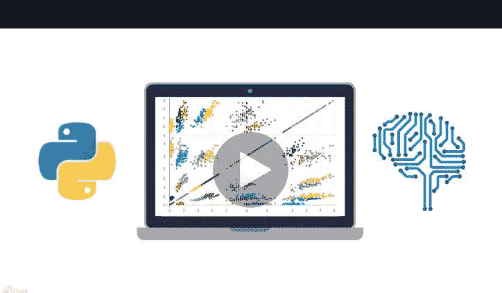
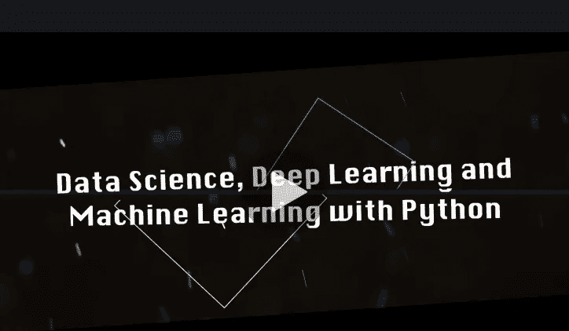
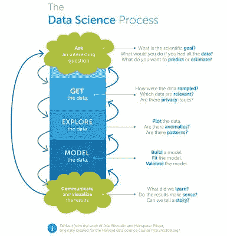
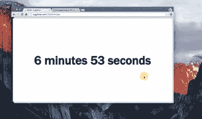
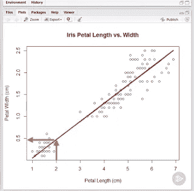
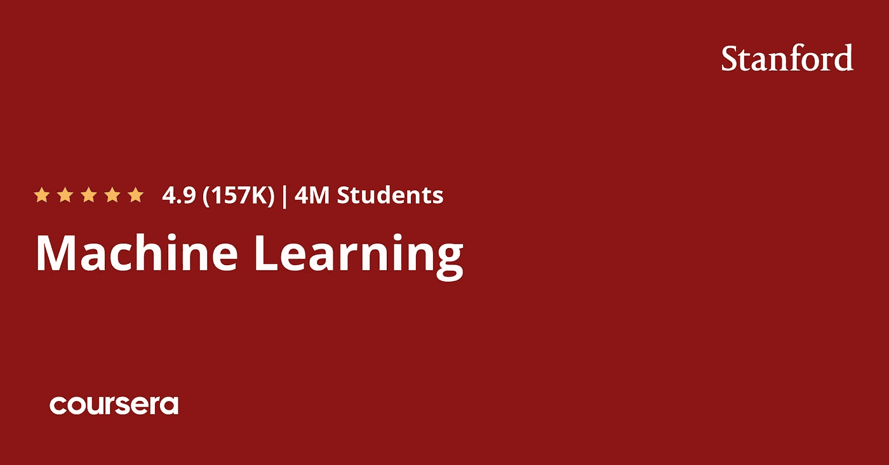
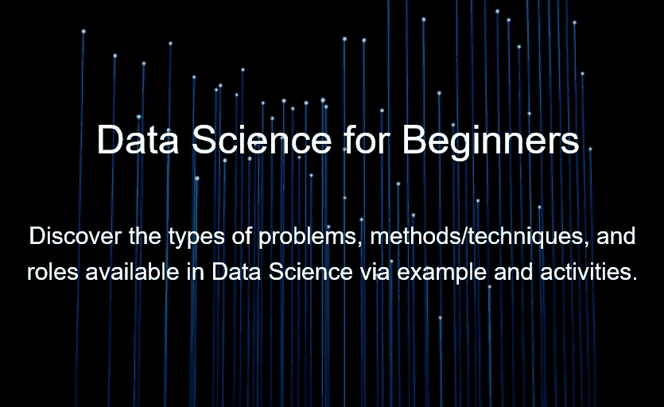
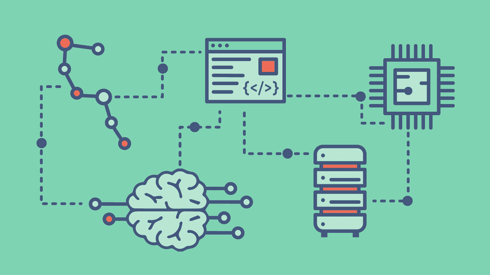
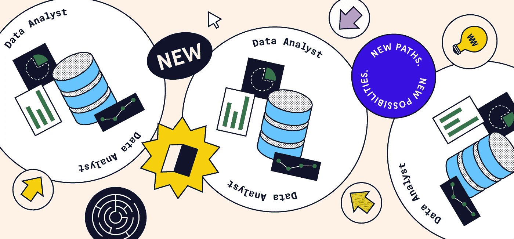

# 2023 年在线学习的 10 门最佳数据科学课程和认证

> 原文：<https://medium.com/javarevisited/my-favorite-data-science-and-machine-learning-courses-from-coursera-udemy-and-pluralsight-eafc73acc73f?source=collection_archive---------0----------------------->

## 我最喜欢的学习数据科学的在线资源来自 Udemy、Coursera、Pluralsight、CodeCademy、Educative、edX 等热门网站。

美国宇航局在 [Unsplash](https://unsplash.com?utm_source=medium&utm_medium=referral) 拍摄的照片

你们好，这个时候你们过得怎么样？我希望你会做得很好，并保持安全。你可能听说过许多程序员正在转向数据科学和机器学习，希望获得更好的薪酬和职业机会，这是有原因的。

在过去几年里，数据科学家在 Glassdoor 上一直被列为**的头号工作，根据 Indeed 的数据，在美国，数据科学家的平均工资超过 12 万美元。**

数据科学不仅在金钱方面是一个有回报的职业，而且**还为你提供了解决一些世界上最有趣的问题的机会**。依我看，这是许多优秀程序员走向[数据科学](https://javarevisited.blogspot.sg/2018/03/top-5-data-science-and-machine-learning-online-courses-to-learn-online.html)、[机器学习](https://javarevisited.blogspot.com/2018/08/top-5-tensorflow-and-machine-learning-courses-online-programmers.html)和[人工智能](https://javarevisited.blogspot.com/2019/10/top-5-courses-to-learn-artificial-intelligence-AI.html)的主要动机。

如果你也在同一条船上，想着在 2023 年成为一名数据科学家，那么你来对地方了。之前我已经分享过[免费数据科学课程](/javarevisited/10-free-data-science-online-courses-for-beginners-a5fe78c2cb7b)和[免费机器学习课程](/javarevisited/10-free-machine-learning-courses-for-beginners-181f83b4c816)给初学者。

在这篇文章中，我将分享一些最好的数据科学和机器学习在线课程，这些课程来自[**【Udemy】**](https://click.linksynergy.com/fs-bin/click?id=JVFxdTr9V80&offerid=323058.9409&type=3&subid=0)[**Coursera**](https://coursera.pxf.io/c/3294490/1164545/14726?u=https%3A%2F%2Fwww.coursera.org%2F)和 [**Pluralsight**](https://pluralsight.pxf.io/c/1193463/424552/7490?u=https%3A%2F%2Fwww.pluralsight.com%2Flearn) 通过学习数据科学、机器学习和人工智能，你可以在 2023 年成为一名数据科学家。

说到编程语言和库， [Python](http://javarevisited.blogspot.sg/2018/03/top-5-courses-to-learn-python-in-2018.html) 和 [R](http://www.java67.com/2017/12/10-programming-languages-to-learn-in.html) 显然是机器学习、数据分析和人工智能领域的两种领先编程语言。这些语言正在发生许多令人兴奋的发展，而且它们已经有了一些有用的库。

如果你有一些编程或脚本编写经验，这些课程将教你科技行业中真正的数据科学家和机器学习从业者使用的技术，并为你进入这一热门而有利可图的职业道路做准备。

# 2023 年 10 大最佳数据科学课程和初学者认证

以下是我列出的六大在线课程，你可以参加这些课程来学习数据科学和机器学习，并成为一名数据科学家。这些是我最喜欢和最好的数据科学和机器学习课程，来自网站，如 [Udemy](/javarevisited/10-best-python-3-courses-on-udemy-ddd4e3ec5dbf) 、 [Coursera](/javarevisited/11-best-coursera-certifications-and-courses-for-data-science-and-analysis-in-2021-65ce1ac810a5) 和 [Pluralsight](/javarevisited/pluralsight-or-udemy-d9a94d2e8ee) 。

这些课程将为您提供宝贵的见解、建议、技巧和推荐，让您的数据科学职业生涯更上一层楼。

它包含了关于 Python 和 T2 的课程，这两种语言是数据科学家最流行的编程语言。

## [1。用于数据科学和机器学习的 Python 训练营](https://click.linksynergy.com/fs-bin/click?id=JVFxdTr9V80&subid=0&offerid=323058.1&type=10&tmpid=14538&RD_PARM1=https%3A%2F%2Fwww.udemy.com%2Fpython-for-data-science-and-machine-learning-bootcamp%2F) -Udemy

我的许多已经转向数据科学的朋友和同事已经选择 Python 作为他们的语言选择。一个原因是 Python 可能是最流行的语言，它提供了一切。

他们已经在使用 [Python](http://www.java67.com/2018/02/5-free-python-online-courses-for-beginners.html) 编写脚本和[面向对象编程](http://www.java67.com/2018/02/5-free-object-oriented-programming-online-courses.html)，如果你已经知道这门语言，学习数据科学会比学习像 r 这样的新语言更容易。

这是掌握数据科学和机器学习 python 库的最佳课程之一。

您将学习如何使用大多数流行的 Python 机器学习和深度学习库，如 [NumPy](http://bit.ly/2CwoE3b) 、 [Pandas](http://bit.ly/2Ml6Kpa) 、Seaborn、Matplotlib、Plotly、 [Scikit-learn](http://bit.ly/2CwoOYl) 、 [Meeshkan](http://bit.ly/2CxzExs) 、 [TensorFlow](https://hackernoon.com/top-5-tensorflow-and-ml-courses-for-programmers-8b30111cad2c) 、 [Keras](http://bit.ly/2CwDyXt) 等等！

本课程是为有一些编程经验的初学者和希望向数据科学迈进的有经验的开发人员设计的！

**这是加入本课程的链接**—[Python for Data Science and Machine Learning boot camp](https://click.linksynergy.com/fs-bin/click?id=JVFxdTr9V80&subid=0&offerid=323058.1&type=10&tmpid=14538&RD_PARM1=https%3A%2F%2Fwww.udemy.com%2Fpython-for-data-science-and-machine-learning-bootcamp%2F)

[用于数据科学和机器学习的 Python 训练营](https://click.linksynergy.com/fs-bin/click?id=JVFxdTr9V80&subid=0&offerid=323058.1&type=10&tmpid=14538&RD_PARM1=https%3A%2F%2Fwww.udemy.com%2Fpython-for-data-science-and-machine-learning-bootcamp%2F):

它可以与通常花费数千美元的其他数据科学训练营相媲美，但现在，如果你幸运地在 Udemy 的闪购期间买到它，你只需** 9.99 美元* *的一小部分成本就可以了解所有信息。

## [2。用 Python 实现数据科学、深度学习和机器学习](https://click.linksynergy.com/fs-bin/click?id=JVFxdTr9V80&subid=0&offerid=323058.1&type=10&tmpid=14538&RD_PARM1=https%3A%2F%2Fwww.udemy.com%2Fdata-science-and-machine-learning-with-python-hands-on%2F)

这是一门难得的实践课程，学习雇主正在寻求的神经网络、人工智能和机器学习技术。

这门课程是通过分析最大的科技雇主对数据科学家职位清单的真实要求而设计的，这意味着它涵盖了真实雇主正在寻找的机器学习和数据挖掘技术。

**这里是加入本课程的链接** — [数据科学、深度学习和使用 Python 的机器学习](https://click.linksynergy.com/fs-bin/click?id=JVFxdTr9V80&subid=0&offerid=323058.1&type=10&tmpid=14538&RD_PARM1=https%3A%2F%2Fwww.udemy.com%2Fdata-science-and-machine-learning-with-python-hands-on%2F)

## [3。数据科学职业 A-Z](https://click.linksynergy.com/fs-bin/click?id=JVFxdTr9V80&subid=0&offerid=323058.1&type=10&tmpid=14538&RD_PARM1=https%3A%2F%2Fwww.udemy.com%2Fcareers-in-data-science-a-ztm%2F)【Udemy 课程】

如果你对数据分析和机器学习感兴趣，并想知道如何成为顶级数据科学家，那么这是适合你的课程。

在本课程中，您不仅将学习如何成为一名数据科学家的基本步骤，还将学习让您的数据科学职业生涯更上一层楼的实际技巧和诀窍。

**这是参加本课程的链接** — [数据科学领域的职业 A-Z](https://click.linksynergy.com/fs-bin/click?id=JVFxdTr9V80&subid=0&offerid=323058.1&type=10&tmpid=14538&RD_PARM1=https%3A%2F%2Fwww.udemy.com%2Fcareers-in-data-science-a-ztm%2F)

## [4。Tableau 10 A-Z:数据科学实践 Tableau 培训！](https://click.linksynergy.com/fs-bin/click?id=JVFxdTr9V80&subid=0&offerid=323058.1&type=10&tmpid=14538&RD_PARM1=https%3A%2F%2Fwww.udemy.com%2Ftableau10%2F)

Tableau 是数据科学家中最受欢迎的工具之一，这是因为对了解 Tableau 的数据科学家有很大的需求。

本课程将循序渐进地教你 Tableau 10 for data science。**它包含现实生活中的数据分析练习和测验，给你 Tableau** 的第一手经验。

您将学习 Tableau 中的所有功能，这些功能允许您轻松、快速、漂亮地探索、试验、修复、准备和呈现数据。

**这里是参加本课程** — [Tableau 数据科学培训的链接！](https://click.linksynergy.com/fs-bin/click?id=JVFxdTr9V80&subid=0&offerid=323058.1&type=10&tmpid=14538&RD_PARM1=https%3A%2F%2Fwww.udemy.com%2Ftableau10%2F)

## [5。R 编程 A-Z: R 为数据科学配真实练习！](https://click.linksynergy.com/fs-bin/click?id=JVFxdTr9V80&subid=0&offerid=323058.1&type=10&tmpid=14538&RD_PARM1=https%3A%2F%2Fwww.udemy.com%2Fr-programming%2F)

R 是另一种流行的数据科学编程语言，本课程从数据科学的角度对 R 进行了很好的概述。那里有很多课程和讲座。

然而， **R 有一个非常陡峭的学习曲线**，学生们经常会不知所措。

这门课程确实是循序渐进的。在每一个新的教程中，我们都在已经学过的基础上又向前迈了一步。

**以下是加入本课程的链接—** [R 为数据科学提供真实练习！](https://click.linksynergy.com/fs-bin/click?id=JVFxdTr9V80&subid=0&offerid=323058.1&type=10&tmpid=14538&RD_PARM1=https%3A%2F%2Fwww.udemy.com%2Fr-programming%2F)

## **6。** [**数据科学用 R by 复数 sight**](https://pluralsight.pxf.io/c/1193463/424552/7490?u=https%3A%2F%2Fwww.pluralsight.com%2Fcourses%2Fr-data-science)

数据科学是将数据转化为知识的实践，而 [R](https://hackernoon.com/5-free-r-programming-courses-for-data-scientists-and-ml-programmers-5732cb9e10) 是数据科学家使用的最流行的编程语言之一。

在本[课程](https://pluralsight.pxf.io/c/1193463/424552/7490?u=https%3A%2F%2Fwww.pluralsight.com%2Fcourses%2Fr-data-science)中，您将首先了解数据科学的实践、R 编程语言，以及如何使用它们将数据转化为可操作的洞察力。

接下来，您将学习如何转换和清理数据，创建和解释描述性统计数据、数据可视化和统计模型。

最后，您将学习如何处理[大数据](http://www.java67.com/2018/05/top-5-free-big-data-courses-to-learn-Hadoop-Apache-Spark.html)，使用机器学习算法进行预测，并将 R 部署到生产中。

**这是加入本课程** — [数据科学与 R by Pluralsight](https://pluralsight.pxf.io/c/1193463/424552/7490?u=https%3A%2F%2Fwww.pluralsight.com%2Fcourses%2Fr-data-science) 的链接

顺便说一下，你需要一个 [Pluralsight 会员](https://pluralsight.pxf.io/c/1193463/424552/7490?u=https%3A%2F%2Fwww.pluralsight.com%2Fpricing)才能加入这个课程，费用大约是每月 29 美元或每年 299 美元(14%的折扣)。我向所有程序员强烈推荐这个订阅，因为它提供了超过 7000 个在线课程的即时访问，以学习任何技术技能。或者，你也可以使用他们的 [**10 天免费通行证**](https://pluralsight.pxf.io/c/1193463/424552/7490?u=https%3A%2F%2Fwww.pluralsight.com%2Flearn) 免费观看本课程。

 [## 个人技术技能|多视角

### 培养你在职业生涯中更快发展所需的技术技能。掌握最新的技术与数以千计的…

pluralsight.pxf.io](https://pluralsight.pxf.io/c/1193463/424552/7490?u=https%3A%2F%2Fwww.pluralsight.com%2Flearn) 

## **7。** [**吴恩达的机器学习**](https://coursera.pxf.io/c/3294490/1164545/14726?u=https%3A%2F%2Fwww.coursera.org%2Flearn%2Fmachine-learning)

这可能是斯坦福大学和 Coursera 提供的最受欢迎的学习机器学习的课程，Coursera 也提供认证。您将在本课程中学习的每一个主题上接受测试，根据完成情况和您获得的最终分数，您还将获得证书。

这门课程是免费的，但是如果你想获得证书，你需要付费。尽管如此，它确实为你作为开发者提供了价值，让你很好地理解了你提出的所有机器学习[算法](https://hackernoon.com/10-data-structure-algorithms-and-programming-courses-to-crack-any-coding-interview-e1c50b30b927)背后的数学原理。

我个人真的很喜欢这个。[吴恩达](https://coursera.pxf.io/c/3294490/1164545/14726?u=https%3A%2F%2Fwww.coursera.org%2Finstructor%2Fandrewng)用 Octave 带你完成整个课程，Octave 是一个很好的工具，可以在你的项目上线之前测试你的算法。

**这里是加入本课程的链接**——[吴恩达的机器学习](https://coursera.pxf.io/c/3294490/1164545/14726?u=https%3A%2F%2Fwww.coursera.org%2Flearn%2Fmachine-learning)

顺便说一句，如果你觉得 Coursera 的课程有用，因为它们是由知名公司如**谷歌**、 **IBM** 、**亚马逊**和世界上最好的大学创建的，我建议你加入 Coursera 的年度订阅计划 [**Coursera Plus**](https://coursera.pxf.io/c/3294490/1164545/14726?u=https%3A%2F%2Fwww.coursera.org%2Fcourseraplus) 。

 [## Coursera Plus |无限制访问 7，000 多门在线课程

### 用 Coursera Plus 投资你的职业目标。无限制访问 90%以上的课程、项目…

coursera.pxf.io](https://coursera.pxf.io/c/3294490/1164545/14726?u=https%3A%2F%2Fwww.coursera.org%2Fcourseraplus) 

这种单次订阅可以让你无限制地访问他们最受欢迎的**课程**、**专业化**、**专业证书**和**指导项目**。

## 8.[初学者数据科学](https://courses.mydatacareer.com/p/data-science-for-beginners?affcode=470327_fwunct1o)【mydata career】

这是另一个从零开始学习数据科学的奇妙课程。如果你想在数据科学领域开始你的职业生涯，那么这个课程非常适合你。在本课程中，您将通过示例和活动发现数据科学中可用的问题类型、方法/技术和角色。

没有先决条件，这意味着即使您是第一次听到数据科学，您也可以开始。***‘数据科学初学者’***的目标是让你熟悉数据科学方法论、数据科学概念、编程语言等。

它让你看到了机器学习如何工作的顶峰，并最终向你展示了像 GitHub 这样的数据科学工具，让你与同事合作。

**这是加入本课程**——[初学者数据科学](https://courses.mydatacareer.com/p/data-science-for-beginners?affcode=470327_fwunct1o)的链接

## 9.[钻研数据科学](https://www.educative.io/courses/grokking-data-science?affiliate_id=5073518643380224)【教育性最佳课程】

对于想从数据科学入手的人来说，这又是一门有趣的课程。本课程与以前的课程不同，因为它是 Educative 的一门基于文本的交互式课程，Educative 是一个新的在线学习平台，允许您在浏览器中运行代码。

您将在本数据科学课程中学到以下内容:

1.  数据科学的 Python 基础库
2.  数据科学统计学基础
3.  数据科学的机器学习基础
4.  如何解决一个端到端的机器学习项目
5.  如何获得薪酬最高的数据科学工作

没有必要浪费时间从一篇文章浏览到另一篇文章，把你需要掌握的重要信息拼凑在一起。现在就加入这个课程，学习那些即使你逃课也能让你拿到 10 万美元以上薪水的技能。

以下是加入本课程的链接— [探索数据科学](https://www.educative.io/courses/grokking-data-science?affiliate_id=5073518643380224)

## 10.[通过 Codecademy 了解数据科学](https://www.pjtra.com/t/TUJGR0lLR0JHRklJSkhCR0ZISk1N?url=https%3A%2F%2Fwww.codecademy.com%2Fcatalog%2Fsubject%2Fdata-science)

如果你喜欢互动、短时间的学习，那么你可能知道 Codecademy，这是我最喜欢的互动学习网站之一。我过去曾使用这个网站学习 Python、JavaScript 和 Bash，我真的很喜欢他们的课程和平台。

最近，他们增加了许多关于新技术(包括数据科学)的现有课程、职业道路和技能道路，我必须说他们的数据科学图书馆是世界上最好的图书馆之一。

如果你想从零到高级学习数据科学，我强烈推荐你从 Codecademy 开始。他们对初学者友好的课程将在短时间内教你基本的数据科学概念、工具和技术。

**以下是参加本课程的链接—** [数据科学家职业道路](https://www.pjatr.com/t/TUJGR0lLR0JHRklJSkhCR0ZISk1N?url=https%3A%2F%2Fwww.codecademy.com%2Flearn%2Fpaths%2Fdata-science)

顺便说一句，你需要一个 [**CodeCademy PRO**](https://bit.ly/codecademypro) 才能加入这个课程。它的年费大约是每月 15.99 美元，提供所有 Codecademy 的内容、课程、测验和项目。你可以用这个来赚取、练习&
应用现成的技能。

 [## 学习编码最简单的方法:PRO | Codecademy

### 您学习编码所需的一切都由我们内部的专家团队设计。这意味着我们所有的独家…

bit.ly](https://bit.ly/codecademypro) 

以上是 2023 年成为数据科学家的一些最佳课程**。正如我在第一段中所说的，数据科学是一个非常赚钱的职业，有很多令人兴奋的机会来解决世界上一些最有趣的问题。**

**如果你对数据分析和解决问题有热情，并希望在你的职业生涯和世界上有所作为，这是你行动的正确时机。**

**随着我在这些领域知识的增长，我将为 [Python](https://hackernoon.com/top-5-courses-to-learn-python-in-2018-best-of-lot-26644a99e7ec) 和 [Java](https://javarevisited.blogspot.com/2017/12/10-things-java-programmers-should-learn.html#axzz53ENLS1RB) 开发人员写更多关于数据科学和机器学习的文章。**

**我的许多读者询问了关于用于机器学习的 Java 和 Python 的库、框架和书籍，这也是我今年要做的事情。这些在线课程是一个很好的起点。**

**顺便说一下，这里有一些你可能想在 2023 年探索的其他编程和开发课程:**

*   **[2023 年学习 Python 的 5 门课程](http://javarevisited.blogspot.sg/2018/03/top-5-courses-to-learn-python-in-2018.html)**
*   **[成为 Python 高手可以构建的 8 个项目](/javarevisited/8-projects-you-can-buil-to-learn-python-in-2020-251dd5350d56)**
*   **[面向初学者和有经验的程序员的 15 门免费 Python 课程](/swlh/5-free-python-courses-for-beginners-to-learn-online-e1ca90687caf)**
*   **[2023 年学习 Python 编程的前 5 本书](https://javarevisited.blogspot.com/2019/07/top-5-books-to-learn-python-in-2019.html)**
*   **[8 个免费学习 Python 的网站](https://dev.to/javinpaul/top-5-places-to-learn-python-programming-for-free-m4c)**
*   **[每个数据科学家都应该知道的 8 个 Python 库](https://javarevisited.blogspot.com/2018/10/top-8-python-libraries-for-data-science-machine-learning.html)**
*   **[2023 年学习 Tableau 的前 5 门课程](https://javarevisited.blogspot.com/2019/07/top-5-tableau-online-courses-and-certifications-for-data-science-engineers.html)**
*   **[学习熊猫和 Python 进行数据分析的 5 大课程](https://javarevisited.blogspot.com/2019/10/top-5-courses-to-learn-pandas-for-data-analysis-python.html)**
*   **[学习数据科学 Python 的前 5 本书](https://javarevisited.blogspot.com/2019/08/top-5-python-books-for-data-science-and-machine-learning.html)**

## **结束语**

**谢谢，你坚持到了文章的结尾…祝你的数据科学和机器学习之旅好运！这当然不容易，但是通过遵循这个路线图和指南，你离成为一名[数据科学家](http://bit.ly/2CJb3pv)更近了一步。**

**如果你喜欢这些数据科学和机器学习课程，那么请分享给你的朋友和同事，别忘了在 Twitter 上关注 [javinpaul](https://twitter.com/javinpaul) ！**

**此外，请注意，如果您使用本文中的链接购买任何课程，我会向您支付额外费用，但您应该只购买可以连接到讲师的课程。**

**建议你先查看一下这些课程的预习，再给你选一两门。每个人都有不同的口味，即使这些是最好的课程，你也需要选择最适合你的课程。**

## **p . s——如果你需要一些免费资源，可以查看[深度学习先决条件:Python 中的 Numpy 栈](http://bit.ly/2CwoE3b)开始你的旅程。**

** [## 深度学习先决条件:Python 中的 Numpy 堆栈(V2+)

### 欢迎光临！这是深度学习、机器学习、数据科学的先决条件:Python 中的 Numpy 栈。一…

bit.ly](http://bit.ly/2CwoE3b)**