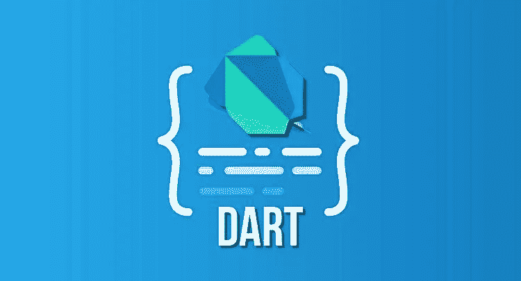
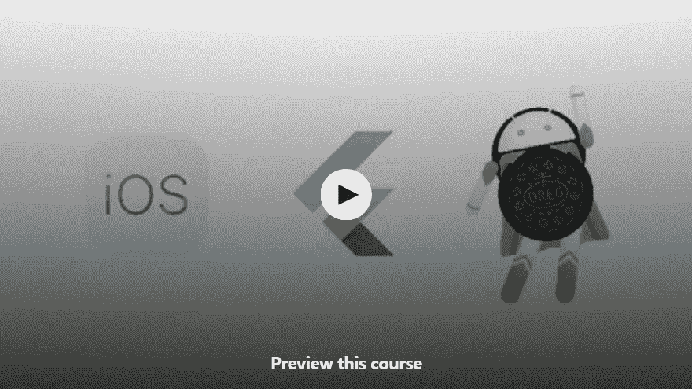

# 2023 年初学者学习的 10 个最佳颤振课程

> 原文：<https://medium.com/javarevisited/my-favorite-flutter-and-dart-programming-courses-for-beginners-9e8355710d78?source=collection_archive---------0----------------------->

## 2023 年学习 Flutter 的最佳和少数免费课程的精选列表

各位好，如果你和我一样，认为 **Flutter 是移动发展的未来**并且打算在 2023 年真正腾飞，并且在 2023 年寻找一些优秀的在线课程学习 Flutter，那么你来对地方了。

在这篇文章中，我将分享一些来自 [Udemy](https://click.linksynergy.com/fs-bin/click?id=JVFxdTr9V80&offerid=323058.9410&type=3&subid=0) 、 [Pluralsight](https://pluralsight.pxf.io/c/1193463/424552/7490?u=https%3A%2F%2Fwww.pluralsight.com%2Flearn) 、 [Educative](https://www.educative.io/subscription?affiliate_id=5073518643380224) 和 Udacity 的**2023 年学习 Flutter**的最佳在线课程，但在此之前，让我们看看*什么是 Flutter*和*为什么每个人都对它如此兴奋*。

嗯，总的来说，每当谷歌有什么东西出来，都会让很多开发者兴奋不已，比如 [Angular](https://javarevisited.blogspot.com/2018/06/5-best-courses-to-learn-angular.html) 、 [Dart](https://javarevisited.blogspot.com/2020/01/top-5-courses-to-learn-dart-programming.html) ，现在 [Flutter](https://javarevisited.blogspot.com/2019/07/top-5-online-training-courses-to-learn-flutter.html) 。过去，我曾使用 Java 和 Objective-C 在 Android 和 iOS 中摸爬滚打，但在工作了一段时间后，我决定继续前进。

我从来没有真正进入过移动应用程序开发的世界，但最近，我了解了 Flutter，并决定再试一次移动应用程序开发，我立即爱上了 Flutter。

与 [Android](https://javarevisited.blogspot.com/2017/12/top-5-android-online-training-courses-for-Java-developers.html) 和 [iOS](/javarevisited/my-favorite-free-courses-to-learn-ios-app-development-f172e7d3ba5d) 不同，你只能用它们的平台来创建应用，Flutter 可以用单一代码库轻松创建跨平台的应用，这就是鼓励我学习 Flutter 的原因。

开发移动应用程序可能需要很多时间，而为不同的平台(如 [Android](https://itnext.io/top-5-intellijidea-and-android-studio-courses-for-java-and-android-programmers-afcc27309b60) 和 [iOS](https://javarevisited.blogspot.com/2019/01/top-5-ios-developer-course-to-learn-ios.html) )提供不同的代码库只会让事情变得更加复杂，而 Flutter 有望在不损害自然外观和感觉的情况下解决这个问题，这是大多数应用程序开发人员想要的。

Flutter 使用原生 UI 组件，这意味着像滚动和导航这样的事情就像它们应该为原生应用程序所做的那样。简单来说，Flutter 也让开发变得更加自然，因为你只需要一个模拟器来构建和测试你的应用。

对于那些仍然想知道 Flutter 是什么的人来说，它只不过是谷歌的一个便携式 UI 工具包，用于从单一代码库为移动、网络和桌面精心制作漂亮的本地编译应用程序。

换句话说，Flutter 是谷歌创建的一个开源[移动应用开发](/@javinpaul/10-frameworks-and-libraries-mobile-application-developers-can-learn-in-2020-e0b91391cade)框架。用于为 [Android](https://hackernoon.com/top-5-courses-to-learn-android-for-java-programmers-667e03d995b4) 和 [iOS](/javarevisited/top-5-online-courses-to-learn-ios-12-swift-in-2019-a35ae1be7b2b) 设备开发应用。

Flutter 还搭载了来自 Google 的编程语言 [**Dart**](https://javarevisited.blogspot.com/2020/01/top-5-courses-to-learn-dart-programming.html) ，该语言对异步操作的支持非常出色，这对于当今的 IO 和数据密集型应用非常重要。

# 2023 年初学者学习的 10 门最佳扑镖在线课程

如果您确信 Flutter 将成为移动应用程序开发的未来，并且想要尝试一下，那么这里有几门 Flutter 课程可以让您学习这项非凡的技术。

这些课程特别适合那些对移动应用开发领域知之甚少或一无所知的初学者，这些课程的特色来自一些最好的在线门户网站，如 [Udemy](/javarevisited/top-15-java-and-spring-framework-courses-from-udemy-best-of-lot-d7b965b62a9f) 、 [Coursera](https://coursera.pxf.io/c/3294490/1164545/14726?u=https%3A%2F%2Fwww.coursera.org%2F) 和 [Pluralsight](/javarevisited/pluralsight-free-weekend-2020-3e0ff26e7a31) 。

## 1.[学习 Flutter 和 Dart 构建 iOS 和 Android 应用](https://click.linksynergy.com/deeplink?id=JVFxdTr9V80&mid=39197&murl=https%3A%2F%2Fwww.udemy.com%2Fcourse%2Flearn-flutter-dart-to-build-ios-android-apps%2F)

如果你以前去过，那么你可能知道我是马克西米连·施瓦兹缪勒教学的忠实粉丝。本课程提供了 Google 的 Flutter SDK 和 Flutter 框架的完整指南，用于构建原生 iOS 和 Android 应用。

谈到社交证明，已经有超过 27，970 名学生注册了这门课程，近 6，913 名参与者对这门课程的平均评分为 4.6，这充分说明了这门课程的质量和参与度。

参加了 Max 的[**React**](https://click.linksynergy.com/deeplink?id=JVFxdTr9V80&mid=39197&murl=https%3A%2F%2Fwww.udemy.com%2Freact-the-complete-guide-incl-redux%2F)**和[**Angular**](https://click.linksynergy.com/deeplink?id=JVFxdTr9V80&mid=39197&murl=https%3A%2F%2Fwww.udemy.com%2Fthe-complete-guide-to-angular-2%2F)**课程后，我毫不犹豫地选择了这门课程，我没有失望，这是在线学习 Flutter 的最佳课程之一。****

****以下是加入本课程的链接— [**学习旋舞飞镖搭建 iOS 和 Android 应用**](https://click.linksynergy.com/deeplink?id=JVFxdTr9V80&mid=39197&murl=https%3A%2F%2Fwww.udemy.com%2Fcourse%2Flearn-flutter-dart-to-build-ios-android-apps%2F)****

********

****除了英语，课程还有印度尼西亚语、意大利语、波兰语和罗马尼亚语，如果你来自那些地方，你也可以享受用你的母语学习的乐趣。****

## ****2.[带 Dart 的完整颤振研发训练营](https://click.linksynergy.com/deeplink?id=JVFxdTr9V80&mid=39197&murl=https%3A%2F%2Fwww.udemy.com%2Fflutter-bootcamp-with-dart%2F)****

****这是另一个奇妙的课程，由另一个奇妙的导师余。如果你以前在这里听过，那么你知道她是为教学而生的，她作为 Bootcamp 教师的经历确实使她的课程与众不同。****

****参加过她的[网页开发](https://click.linksynergy.com/deeplink?id=JVFxdTr9V80&mid=39197&murl=https%3A%2F%2Fwww.udemy.com%2Fcourse%2Fthe-complete-web-development-bootcamp%2F)和 [iOS 开发](https://click.linksynergy.com/deeplink?id=JVFxdTr9V80&mid=39197&murl=https%3A%2F%2Fwww.udemy.com%2Fios-12-app-development-bootcamp%2F)课程后，我保证课程的质量，这门课程也不例外，除了它是与谷歌 Flutter 团队合作创建的，这使得它更好。****

****谈到社会证明，已经有超过 7412 名学生注册了这门课程，并且在 1470 名参与者中获得了 4.8 分的高分。我强烈推荐这个课程给任何想在 2023 年学习 Flutter 的初学者。****

****以下是加入本课程的链接— [**带 Dart 的完整颤振开发训练营**](https://click.linksynergy.com/deeplink?id=JVFxdTr9V80&mid=39197&murl=https%3A%2F%2Fwww.udemy.com%2Fflutter-bootcamp-with-dart%2F)****

********

## ****3.[飞镖和颤振:完整的开发者指南](https://click.linksynergy.com/deeplink?id=JVFxdTr9V80&mid=39197&murl=https%3A%2F%2Fwww.udemy.com%2Fcourse%2Fdart-and-flutter-the-complete-developers-guide%2F)****

****这是另一位出色的讲师 Stephen Grider 教授的另一门精彩课程。你可能想知道为什么我如此强调教师，从我自己的经验来看，一门课程和它的教师一样好。****

****对于一门课程来说，这可能是最重要的事情，因为如果没有很好地讲授，即使是一门结构良好、经过深思熟虑的课程也是毫无意义的，而这正是教师发挥关键作用的地方。****

****Stephen Grider 是和 Max、Colt_Steele、Angela Yu、Rob Percival 这些最优秀的 Udemy 导师在同一个联盟的导师之一，我能这么说是因为我之前参加过 [**Stephen 的 React 课程**](/@javinpaul/top-5-courses-to-learn-react-js-in-2019-best-of-lot-fa02cd96cdf0) ，学到了很多东西。****

****以下是加入本课程的链接— [**飞镖与飘动:完整的开发者指南**](https://click.linksynergy.com/deeplink?id=JVFxdTr9V80&mid=39197&murl=https%3A%2F%2Fwww.udemy.com%2Fcourse%2Fdart-and-flutter-the-complete-developers-guide%2F)****

********

****在本课程中，你不仅要学习 Flutter，还要学习 Flutter 背后的编程语言 Dart。您将了解到使用 Flutter 和 Dart 构建移动应用程序所需的一切，包括 RxDart 和动画！****

****谈到社会证明，超过 11，191 名学生已经从这门课程中受益，超过 2154 名参与者对这门课程的平均评分为 4.6，这表明了这门课程的质量。除英语外，该课程还提供印尼语、波兰语、意大利语和罗马尼亚语版本。****

## ****4.[Flutter:Simone Alessandria 的入门](https://pluralsight.pxf.io/c/1193463/424552/7490?u=https%3A%2F%2Fwww.pluralsight.com%2Fcourses%2Fflutter-getting-started)****

****为移动平台开发可能会令人沮丧，而 Flutter 是谷歌让移动开发变得更好的解决方案。本课程将向您传授 Flutter 的基础知识，包括构建 UI、使用动画和创建数据库应用程序。****

****除了 [Udemy](https://pluralsight.pxf.io/c/1193463/424552/7490?u=https%3A%2F%2Fwww.pluralsight.com%2Flearn) 和 [Coursera](https://coursera.pxf.io/c/3294490/1164545/14726?u=https%3A%2F%2Fwww.coursera.org%2F) ， [Pluralsight](https://pluralsight.pxf.io/c/1193463/424552/7490?u=https%3A%2F%2Fwww.pluralsight.com%2Flearn) 是我上网学习的另一个地方。我有他们的年度会员资格，是在他们最近的促销活动中以 199 美元购买的，这让我可以访问他们 5000 多门关于最新和成熟技术的高质量在线课程，就像这一门。****

****即使你不是会员，你仍然可以通过注册他们的 [**10 天免费试用**](http://pluralsight.pxf.io/c/1193463/424552/7490?u=https%3A%2F%2Fwww.pluralsight.com%2Flearn) 来免费访问这门课程，这允许免费访问他们的所有课程，但仅限于 200 分钟的观看时间，这对这门课程来说足够了。****

****以下是加入本课程的链接— [**扑动:Simone Alessandria 的入门**](https://pluralsight.pxf.io/c/1193463/424552/7490?u=https%3A%2F%2Fwww.pluralsight.com%2Fcourses%2Fflutter-getting-started)****

********

> ****而且，如果你不知道 Pluralsight 已经把他们 7000+的课程全部免费了一个月。如果你想免费访问，你可以使用这个链接加入他们的[免费四月优惠](https://pluralsight.pxf.io/c/1193463/796093/7490)。不需要信用卡，也没有观看限制****

****</javarevisited/7000-free-pluralsight-courses-to-build-in-demand-tech-skills-without-leaving-your-house-40edb50a8cf2> **** 

## ****5.[用 Flutter 构建原生移动应用](https://www.udacity.com/course/build-native-mobile-apps-with-flutter--ud905)(免费)****

****这是另一个关于用 Flutter 构建原生应用的优秀在线课程。在本课程中，您将学习如何使用 Flutter 为 iOS 和 Android 设备快速开发高质量的交互式移动应用程序。****

****该课程最精彩的部分是，你将与谷歌的指导老师合作，一步一步地为 [iOS](https://dzone.com/articles/5-free-courses-to-learn-iphone-and-ipad-ios-app-de) 和 [Android](https://dzone.com/articles/top-5-courses-to-learn-android-for-java-developers) 使用一个单一的代码库来构建类似原生的移动应用。****

****您还将学习如何利用 Flutter 的反应式框架、有状态热重装和集成工具进行快速开发。使用丰富的可组合微件、内置动画和分层可扩展架构定制您的应用。****

****非常感谢指导老师夏玛丽、马特·沙利文和詹姆斯·威廉姆斯创建了这个在线课程来教授 Flutter。****

> ****以下是加入本课程的链接— [用 Flutter 构建原生移动应用](https://www.udacity.com/course/build-native-mobile-apps-with-flutter--ud905)****

********

## ****6.[学镖:扑(免)的第一步](https://www.educative.io/courses/learn-dart-first-step-to-flutter?affiliate_id=5073518643380224)【educative . io】****

****这是学习 Dart 的一个很棒的免费课程，你需要学习这种语言来从一个叫做 [Educative](https://javarevisited.blogspot.com/2020/05/top-10-educative-courses-for-programmers.html) 的在线学习、互动、基于文本的平台创建 Flutter 应用程序。****

****在使用 [Flutter](https://hackernoon.com/top-7-flutter-courses-and-tutorials-for-beginners-ejhf3yo4) 开始应用程序之前，您需要学习 Dart。本课程将帮助您学习 Dart 的基础知识，并帮助您开始学习 Flutter。****

****您现在就可以通过这个互动课程免费学习 Dart。****

> ****以下是免费加入本课程的链接— [学习飞镖:舞动的第一步](https://www.educative.io/courses/learn-dart-first-step-to-flutter?affiliate_id=5073518643380224)****

********

****顺便说一句，如果你不知道的话，Educative 是另一个在线学习平台，它基于文本的交互式学习课程获得了很大的吸引力。阅读通常比观看更快，如果你更喜欢阅读文本而不是观看视频，那么这就是结账的平台。****

****它有一些为编码面试做准备的最好的课程，像 [**寻找编码面试:编码问题的模式**](https://www.educative.io/collection/5668639101419520/5671464854355968?affiliate_id=5073518643380224) 和 [**寻找系统设计面试**](https://www.educative.io/collection/5668639101419520/5649050225344512?affiliate_id=5073518643380224) 。它还有很多免费的资源，比如这个免费的 JavaScript 教程，用来学习基本的技术。****

****你可以免费注册这门课程，但如果你喜欢充分利用这个平台，我建议你购买 [**教育订阅**](https://www.educative.io/subscription?affiliate_id=5073518643380224) ，每月花费 18 美元(现在有 50%的折扣)，对于需要持续学习的程序员和软件工程师来说完全值得。****

****<https://www.educative.io/subscription?affiliate_id=5073518643380224> **** 

## ****7.[学习 Flutter —初学者课程(免费 Udemy 课程)](https://click.linksynergy.com/deeplink?id=JVFxdTr9V80&mid=39197&murl=https%3A%2F%2Fwww.udemy.com%2Fcourse%2Flearn-flutter-beginners-course%2F)****

****这是另一个从 Udemy 学习 Flutter 的免费课程。在本课程中，您将学习如何使用 flutter 框架构建 Android 和 iOS 应用程序。这不是一个全面的课程，但有 2 个小时的学习材料，这是一个体面的课程[免费开始使用 Flutter](https://www.java67.com/2020/06/5-free-courses-to-learn-flutter-in-2020.html)。****

****该课程的好处在于解释简单明了，并且对 Flutter 中的基本部件和一般的 Flutter 开发方法给出了一个很好的概述，这对于初学者课程来说是很好的，特别是对于免费教程来说。****

****如果你正在寻找学习扑和寻找一个免费的课程，那么你会喜欢这个。****

> ****以下是免费加入本课程的链接— [学习 Flutter —初学者课程](https://click.linksynergy.com/deeplink?id=JVFxdTr9V80&mid=39197&murl=https%3A%2F%2Fwww.udemy.com%2Fcourse%2Flearn-flutter-beginners-course%2F)****

********

## ****8.*安吉拉·于的颤振发展介绍(免费)*****

****来自谷歌 flutter 团队的 Martin Aguinis 刚刚宣布，如果在未来三个月内激活，他们将免费提供[Flutter 开发简介](https://www.appbrewery.co/courses/intro-to-flutter) 课程。****

****该课程涵盖了 Flutter 开发的一些基本概念，教你如何使用 Dart 编码，并带你构建九个运行在 [iOS](/javarevisited/my-favorite-free-courses-to-learn-ios-app-development-f172e7d3ba5d) 和 [Android](https://javarevisited.blogspot.com/2017/12/top-5-android-online-training-courses-for-Java-developers.html) 上的真实应用，即使你没有编程经验。****

****课程讲师 Angela Yu 将带您一步一步地学习引人入胜的在线课程，为您提供实践经验，让您成为一名成功的 Flutter 开发人员。参加过她的 [***iOS 和 Swift Bootcamp 课程***](https://click.linksynergy.com/deeplink?id=JVFxdTr9V80&mid=39197&murl=https%3A%2F%2Fwww.udemy.com%2Fcourse%2Fios-13-app-development-bootcamp%2F) 后，我可以肯定地说，Angela 有教授和简化事情的诀窍。****

****该课程包括 10 多个小时的视频教程和实验，在此期间，您将积累编程知识并制作真实世界的应用程序，如选择自己的冒险游戏和测验应用程序。你甚至可以制作一件乐器！****

****你可以在下面关于媒介本身的文章中阅读更多关于本课程的内容:****

****</flutter/learn-flutter-for-free-c9bc3b898c4d>  

另外一个好消息，我想分享的是，现在 [CodePen](http://codepen.io/) ，这个面向百万前端开发者和设计师的领先社交开发环境，正在增加[对 Flutter](https://codepen.io/flutter) 的支持！。你可以在 Flutter 自己的刊物上阅读更多关于佐伊粉丝的故事:

</flutter/announcing-codepen-support-for-flutter-bb346406fe50>  

以上就是针对初学者和中级程序员学习 Flutter 和 Dart 的一些**最佳课程。我还为寻找免费资源学习 Flutter 和开发 [iOS](/javarevisited/top-5-online-courses-to-learn-ios-12-swift-in-2019-a35ae1be7b2b?source=---------22------------------) 和 [Android](/hackernoon/top-5-courses-to-learn-android-for-java-programmers-667e03d995b4) 应用的程序员提供了一些免费的 Flutter 课程。**

正如我所说的， [Flutter](https://dev.to/javinpaul/top-5-courses-to-learn-flutter-and-dart-in-2020-3bkm) 变得越来越受欢迎，现在使用 Flutter 的创业公司比 Cordova 或 [Firebase](https://javarevisited.blogspot.com/2020/03/top-5-courses-to-learn-firebase-in-2020.html) 还多。学习 Flutter 不仅可以帮助你为你的项目创建一个很好的前端，还可以让你得到你一直想要的 web 开发工作。

您可能想探索的其他**有用的编程资源**

*   [2023 年学习 Python 的 5 大课程](http://javarevisited.blogspot.sg/2018/03/top-5-courses-to-learn-python-in-2018.html)
*   [学习 iOS 应用开发的 5 大课程](https://javarevisited.blogspot.com/2019/01/top-5-ios-developer-course-to-learn-ios.html)
*   [2023 年学习 Dart 编程的前 5 门课程](https://javarevisited.blogspot.com/2020/01/top-5-courses-to-learn-dart-programming.html)
*   [学习微服务开发的 5 门课程](https://javarevisited.blogspot.sg/2018/02/top-5-spring-microservices-courses-with-spring-boot-and-spring-cloud.html)
*   程序员的 10 门 DevOps 课程
*   [学习 Java 编程与开发的 5 门课程](http://www.java67.com/2018/02/5-online-courses-to-learn-java-9-better.html)
*   [2023 年网络开发者路线图](https://hackernoon.com/the-2019-web-developer-roadmap-ab89ac3c380e)
*   [2023 年学习区块链的五大免费课程](http://www.java67.com/2018/02/5-free-blockchain-technology-courses.html)
*   [2023 年学习 Angular 的 5 门免费课程](http://www.java67.com/2018/01/top-5-free-angular-js-online-courses-for-web-developers.html)
*   [2023 年 5 门机器学习和数据科学课程](http://javarevisited.blogspot.sg/2018/03/top-5-data-science-and-machine-learning-online-courses-to-learn-online.html)
*   [学习大数据、Hadoop 和 Spark 的 5 门免费课程](http://www.java67.com/2018/05/top-5-free-big-data-courses-to-learn-Hadoop-Apache-Spark.html)
*   [面向开发者的 10 门免费 Docker 课程](https://hackernoon.com/10-free-courses-to-learn-docker-for-programmers-and-devops-engineers-7ff2781fd6e0)
*   [面向 Java 开发人员的 5 大 Android 在线培训课程](https://javarevisited.blogspot.com/2017/12/top-5-android-online-training-courses-for-Java-developers.html)

感谢您阅读本文。如果你喜欢这些最好的扑镖课程，那么请分享给你的朋友和同事。如果您有任何问题或反馈，请留言。

**P. S.** —如果你想学习 Android 应用程序开发，但又在寻找一些免费的东西，那么我也建议你看看这些面向程序员的 [**免费 Android 课程**](https://www.java67.com/2019/01/top-5-free-android-app-development-courses-for-programmers.html) 。

</javarevisited/5-free-courses-to-become-an-android-developer-d4d207f53675> ****