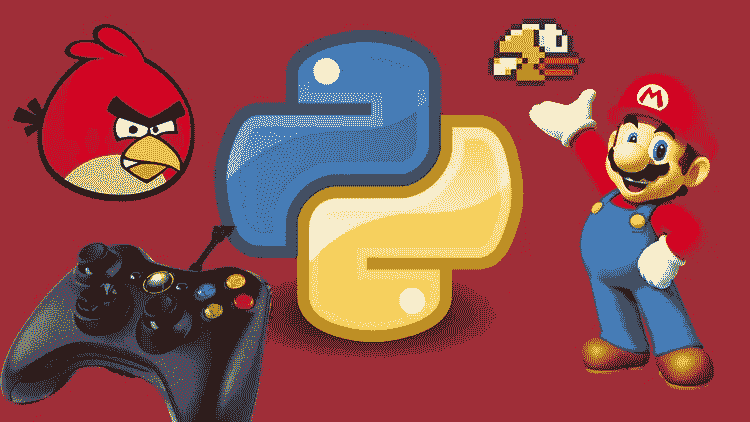
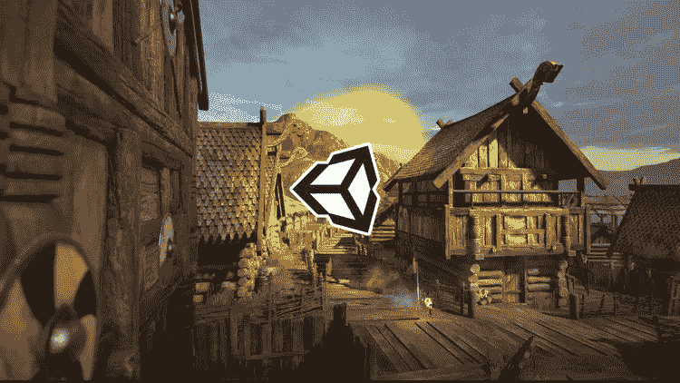
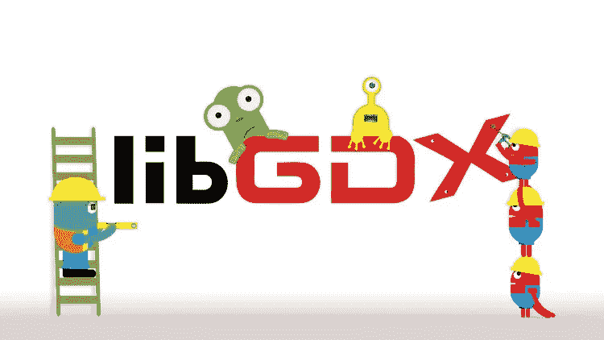
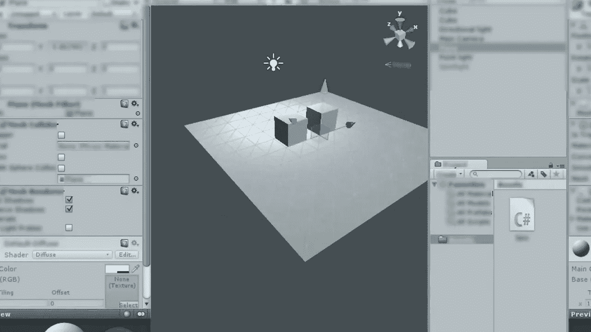
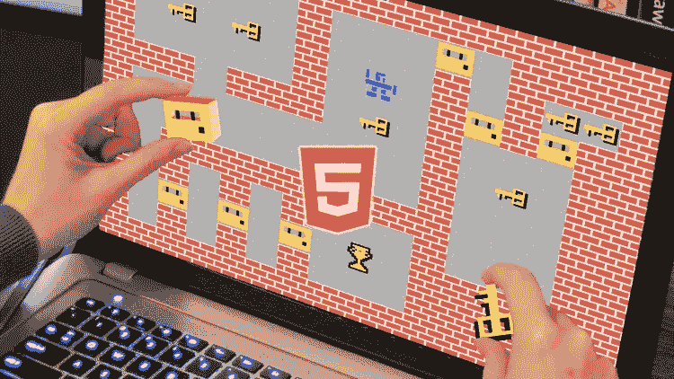
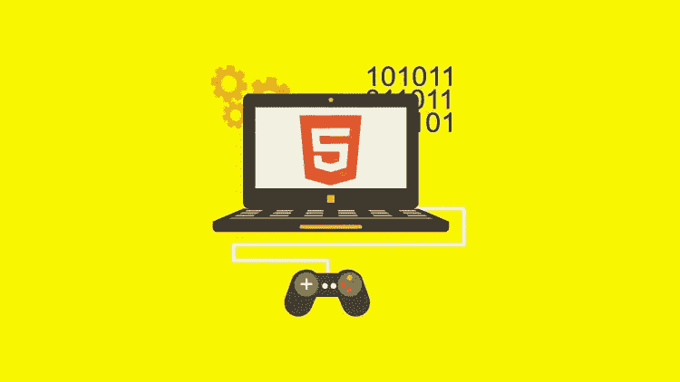
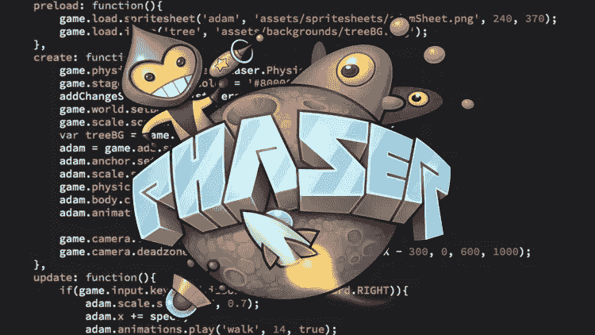
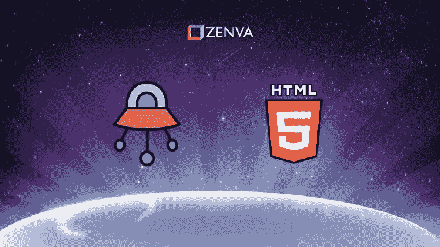

# 2023 年初学游戏开发我最喜欢的免费课程

> 原文：<https://medium.com/javarevisited/my-favorite-free-courses-to-learn-game-development-for-beginners-f7615e26f675?source=collection_archive---------0----------------------->

## 免费 Udemy 在线课程，学习使用 Unity、HTML 5、JavaScript、Phaser、libGDX 和 MIT Scratch 进行游戏开发。

如果你是一名对游戏开发充满热情的程序员或计算机科学毕业生，想要成为一名游戏机、 [Android](https://javarevisited.blogspot.com/2017/12/top-5-android-online-training-courses-for-Java-developers.html) 或 [iOS](https://javarevisited.blogspot.com/2019/01/top-5-ios-developer-course-to-learn-ios.html) 设备的游戏开发人员，并正在寻找一些优秀的课程开始，那么你来对地方了。

在这篇文章中，我将分享一些最好的游戏开发课程，这些课程完全免费使用 [Unity](/javarevisited/7-best-courses-to-learn-unity-for-game-development-in-2020-99f870d88e5e) 、Corona 和 LibGDX 这三个最受程序员和游戏开发者欢迎的游戏引擎。

而 LibGDX 是基于 Java 的，Unity 是基于 T2 的，但可能是目前最流行的游戏引擎。Unity 游戏引擎既强大又免费，非常适合用于游戏开发。如果你不知道，Unity 是用来创建 Pokemon Go 和许多其他畅销手机游戏的同一款软件！

这些课程将教你如何在你的机器上下载并安装 Unity，并按照你自己的进度开始开发。由于我是一个 [Java 开发者](https://javarevisited.blogspot.com/2017/12/10-things-java-programmers-should-learn.html#axzz5atl0BngO)，所以我也收录了一个 LibGDX 课程，这是 Java 开发者的另一个优秀的游戏引擎。

如果你针对的是 [Android](/hackernoon/top-5-courses-to-learn-android-for-java-programmers-667e03d995b4) 和 [iOS](/javarevisited/top-5-online-courses-to-learn-ios-12-swift-in-2019-a35ae1be7b2b?source=---------22------------------) 设备，也可以使用 Corona 游戏引擎。我还在这个列表中加入了一门免费的课程，学习使用 Corona 进行游戏开发。将热门游戏发布到 iOS 应用商店或 Google Play 商店时，游戏开发既有趣又有回报。尽管如此，最重要的是，它还教会你如何编程，这就是为什么我建议任何学习编码或编程的人开始开发游戏。它在过去对我构建编码和算法技能帮助很大，也将对你有所帮助。

顺便说一句，如果你是游戏开发领域的新手，想要学习游戏开发人员应该了解的关于 C#和 Unity 的一切，没有比 [**本·特里斯特姆**](https://click.linksynergy.com/deeplink?id=JVFxdTr9V80&mid=39197&murl=https%3A%2F%2Fwww.udemy.com%2Funitycourse%2F)**[和里克·戴维森](https://medium.com/u/3f039b8ef61f?source=post_page-----f7615e26f675--------------------------------)[撰写的《C# Unity 开发人员指南》](https://medium.com/u/faedc4a0f5d7?source=post_page-----f7615e26f675--------------------------------)** 更好的课程了。它不是免费的，但是完全值得你花时间和金钱，已经有超过 35 万人加入了这个课程

<https://click.linksynergy.com/deeplink?id=JVFxdTr9V80&mid=39197&murl=https%3A%2F%2Fwww.udemy.com%2Funitycourse%2F>  

# 2023 年学习游戏开发的 10 门 Udemy 免费课程

反正事不宜迟，下面列出 2023 年学习游戏开发的部分免费课程。正如我在第一段所说的，它包括 Unity、Corona 和 LibGDX 框架的课程。

## 1.【Unity 游戏开发简介

这是在线学习单元游戏开发最好的课程之一，最棒的是它是免费的。在本课程中，您不仅将学习如何安装和设置 Unity 软件，还将学习如何创建项目、场景和导航。

你将学习如何使用相机和灯光，添加 2D 和 3D 游戏对象，操纵场景，以及使用对象颜色和材质来创建真实世界的游戏。

课程的另一个美好之处在于，授课老师非常热情，这让这门课程更加精彩，更加明亮。

简而言之，了解 Unity 不同特性的绝佳课程，从 Unity 游戏引擎开始。

**这里是加入本课程**—[Unity 游戏开发简介](https://click.linksynergy.com/deeplink?id=JVFxdTr9V80&mid=39197&murl=https%3A%2F%2Fwww.udemy.com%2Fintroduction-to-game-development-with-unity%2F)的链接

## 2.[游戏开发速成班 w/Corona SDK:你能行！](https://click.linksynergy.com/deeplink?id=JVFxdTr9V80&mid=39197&murl=https%3A%2F%2Fwww.udemy.com%2Fgame-development-crash-course%2F)

如果你对 Android 和 iOS 的 2D 移动游戏开发感兴趣，那么你可能听说过 Corona SDK 框架。如果没有，它是另一个流行的游戏引擎。在本课程中，您将首先深入学习并创建一个简单的游戏。在这个过程中，您将神奇地学会如何使用 Corona SDK 的核心概念，如动画、点击和触摸事件以及播放音频。这个课程不长，只有一个小时的内容，但它给了你足够的想法去更进一步。简而言之，这是一个优秀的在线游戏开发速成班，面向对使用 Corona SDK 为 [Android](http://www.java67.com/2019/01/top-5-free-android-app-development-courses-for-programmers.html) 和 [iOS](https://javarevisited.blogspot.com/2018/11/5-free-ios-app-development-courses-for.html) 开发 2D 移动游戏感兴趣的程序员。

**这里是加入本课程的链接**——[游戏开发速成班 w/Corona SDK:你能行！](https://click.linksynergy.com/deeplink?id=JVFxdTr9V80&mid=39197&murl=https%3A%2F%2Fwww.udemy.com%2Fgame-development-crash-course%2F)

## 3. [Pygame 初学者教程— Python 游戏开发教程](https://www.youtube.com/watch?v=FfWpgLFMI7w)

这是另一个学习使用 Python 进行游戏开发的最好的免费在线课程，由 [freeCodeCamp](https://medium.com/u/8b318225c16a?source=post_page-----f7615e26f675--------------------------------) 提供，你可以在他们的 Youtube 频道免费观看。

在这个 2.15 小时的在线课程中，你将学习如何使用 Pygame 用 Python 编写游戏代码。在这个完整的教程中，你将通过构建一个太空入侵者游戏来学习 Pygame。

该课程将帮助你理解主要的游戏开发概念，如移动角色、射击子弹等。

以下是 Youtube 上参加本课程的链接:

## 4.[用 libGDX 和 Java 从头开始简单的游戏编程](https://click.linksynergy.com/deeplink?id=JVFxdTr9V80&mid=39197&murl=https%3A%2F%2Fwww.udemy.com%2Fgame-programming-with-libgdx-and-java%2F)

这是另一个使用 LibGDX 学习 Java 游戏开发的短期课程，LibGDX 是 Java 中最流行的游戏开发库之一。

在本课程中，你将学习如何用 libGDX 和 [Java](/javarevisited/top-5-java-online-courses-for-beginners-best-of-lot-1e1e240a758) 从头开始开发一款“flappy bird-like”游戏，并在此过程中学习编程和游戏开发的基础知识。我唯一不喜欢这门课的地方是，老师有点慢，有点低，如果有点热情，这门课会好得多。不幸的是，用 [Java](http://www.java67.com/2018/08/top-10-free-java-courses-for-beginners-experienced-developers.html) + [LibGDX，](https://javarevisited.blogspot.com/2018/01/top-20-libraries-and-apis-for-java-programmers.html)的免费课程并不多，所以你不得不与此抗衡。

这是加入本课程的链接。[用 libGDX 和 Java 从头开始简单的游戏编程](https://click.linksynergy.com/deeplink?id=JVFxdTr9V80&mid=39197&murl=https%3A%2F%2Fwww.udemy.com%2Fgame-programming-with-libgdx-and-java%2F)

## 5. [Unity 游戏开发——打造一款篮球游戏](https://click.linksynergy.com/deeplink?id=JVFxdTr9V80&mid=39197&murl=https%3A%2F%2Fwww.udemy.com%2Fcourse%2Funity-game-developer%2F)

对于想学习游戏开发但没有编程经验的人来说，这是一门完美的课程。

在本课程中，将从头开始开发一款篮球游戏，您将在此过程中学习游戏开发的基础知识。

这不是一个很长的课程，但包含了 4.5 小时的强大材料，在这里你将学习游戏开发的许多重要方面，如一键启动、具有不同行为的角色、碰撞检测、动画等等。

简而言之，一门用 Unity 学习游戏开发的优秀小课程，非常适合新手，新手，以及任何想开发游戏而没有[编程经验的人](https://javarevisited.blogspot.com/2019/03/top-5-online-courses-to-learn-to-code.html)。

这里是加入本课程的链接。 [Unity 游戏开发——打造一款篮球游戏](https://click.linksynergy.com/deeplink?id=JVFxdTr9V80&mid=39197&murl=https%3A%2F%2Fwww.udemy.com%2Fcourse%2Funity-game-developer%2F)

## 6.【Unity 游戏开发简介

这是一个很棒的在线课程，学习如何使用 Unity 为 web、PC、Mac 甚至是 Linux 开发高质量的 3D 游戏。

在本课程中，您将首先学习如何创建、获取、修改和整合 AAA 级质量资产，如声音、音乐和 3D 模型。

你还将学习面向 [Unity3D](/javarevisited/7-best-courses-to-learn-unity-for-game-development-in-2020-99f870d88e5e) 和[的敏捷游戏开发设计原则和实践。网](https://javarevisited.blogspot.com/2019/10/top-5-courses-to-learn-asp-net-in-2019.html)。

本课程结束时，你将拥有一款生存游戏，你可以发布并与你的朋友和家人一起玩，或者继续开发成你自己的定制创作。

这里是参加本课程的链接。 [Unity 游戏开发——打造一款篮球游戏](https://click.linksynergy.com/deeplink?id=JVFxdTr9V80&mid=39197&murl=https%3A%2F%2Fwww.udemy.com%2Fcourse%2Funity-game-developer%2F)

顺便说一句，你需要一个 [Pluralsight 会员](http://pluralsight.pxf.io/c/1193463/424552/7490?u=https%3A%2F%2Fwww.pluralsight.com%2Flearn)才能进入这个课程，这个课程的费用大约是每月 29 美元或每年 299 美元，提供了 5000 多个关于最新技术的在线课程。如果你能在学习上投入那么多钱，那么无论如何你都是值得的。

但是，如果你没有会员资格，你仍然可以利用他们的 [**10 天免费通行证**](http://pluralsight.pxf.io/c/1193463/424552/7490?u=https%3A%2F%2Fwww.pluralsight.com%2Flearn) **，**免费参加他们所有的课程 200 分钟。

简而言之，利用 Unity3D 学习游戏开发的一门很棒的课程，但是有些 [C#](/javarevisited/9-free-c-c-sharp-courses-and-tutorials-for-beginners-and-intermediate-programmers-best-of-lot-dc8c793aab31) 和[。这门课程需要网络经验。](/javarevisited/7-best-online-courses-to-learn-asp-net-core-and-mvc-in-depth-a68c1b728090)

## 7.【JavaScript 游戏开发入门——完整教程

这是另一个很棒的免费在线学习游戏开发的教程和课程，但是用的是 Javascript。这个课程也是由 freeCodeCamp 创建的，你可以在他们的 Youtube 频道上免费观看。

在这个 1.16 小时的课程中，你将学习如何使用普通 JavaScript 和 HTML5 canvas 创建游戏开发。在学习游戏开发基础知识的同时，构建一个完整的砖块游戏。

这是在 Youtube 或这里加入本课程的链接。

## 8.[用画布上的 JavaScript 编写你的第一个游戏:街机经典](https://click.linksynergy.com/deeplink?id=JVFxdTr9V80&mid=39197&murl=https%3A%2F%2Fwww.udemy.com%2Fcourse%2Fcode-your-first-game%2F)

这是 Udemy 上的一门免费在线课程，将教你如何使用 JavaScript 创建街机游戏。这个课程是完全免费的，你只需要一个免费的 Udemy 帐户就可以参加这个课程。

以下是您将在本课程中学到的重要内容:

1.  如何显示、定位和移动复古和原型游戏的填充形状
2.  如何在游戏空间中移动球，使其从边界反弹
3.  如何处理实时鼠标输入
4.  如何检测和响应简单的碰撞
5.  如何编写非常基础的人工智能程序
6.  如何在比赛中保持和显示分数

这个课程还会教你一些东西，比如这种风格的经典游戏和不好玩的游戏之间的区别

**这是加入本课程的链接**——[用画布上的 JavaScript 编写你的第一个游戏:街机经典](https://click.linksynergy.com/deeplink?id=JVFxdTr9V80&mid=39197&murl=https%3A%2F%2Fwww.udemy.com%2Fcourse%2Fcode-your-first-game%2F)

## 9. [HTML5 简单游戏编程准备](https://click.linksynergy.com/deeplink?id=JVFxdTr9V80&mid=39197&murl=https%3A%2F%2Fwww.udemy.com%2Fcourse%2Ffree-prep-for-html5-game-development%2F)

这个免费的 HTML5 游戏开发课程从 HTML 5 中的 web 开发的快速概述开始，并向您展示所有现代页面中使用的基本 web 框架。

以下是你将在这门免费课程中学到的关键技能:

1.  如何用 HTML 建立一个基本的网页
2.  如何使用 CSS 为你的页面添加必要的样式
3.  理解使用 JavaScript 编程的主要概念(变量、条件、循环、分支、函数和数组)
4.  如何使用 JavaScript 和文档对象模型构建一个基本的交互式网页

该课程还将教你如何使用免费的 simpleGame.js 游戏库，并使用在线练习工具开始在线构建自己的游戏！

**这里是加入本课程的链接** — [HTML5 简单游戏编程准备](https://click.linksynergy.com/deeplink?id=JVFxdTr9V80&mid=39197&murl=https%3A%2F%2Fwww.udemy.com%2Fcourse%2Ffree-prep-for-html5-game-development%2F)

## 10.[用 Phaser 2 制作游戏。X](https://click.linksynergy.com/deeplink?id=JVFxdTr9V80&mid=39197&murl=https%3A%2F%2Fwww.udemy.com%2Fcourse%2Fmaking-games-with-phaser%2F)

这是另一个免费的 Udemy 课程，涵盖了 JavaScript 和 Phaser 的基础知识。**你不需要有任何编码经验！你需要的只是一台电脑、决心和求知欲。**

以下是您将在这个免费游戏开发课程中学到的主要内容:

1.  学习 JavaScript 和 Phaser 的基础知识！
2.  理解 JavaScript 的基础知识
3.  了解使用 Github 的基础知识
4.  如何用 Phaser 创建游戏

课程结束时，你将能够创建自己的视频游戏！

**这里是加入本课程的链接**——[用 Phaser 2 制作游戏。X](https://click.linksynergy.com/deeplink?id=JVFxdTr9V80&mid=39197&murl=https%3A%2F%2Fwww.udemy.com%2Fcourse%2Fmaking-games-with-phaser%2F)

## 11.[html 5 游戏开发简介](https://click.linksynergy.com/deeplink?id=JVFxdTr9V80&mid=39197&murl=https%3A%2F%2Fwww.udemy.com%2Fcourse%2Fintro-to-html5-game-development%2F)

这是另一个免费学习 HTML 5 进行游戏开发的课程。你不需要任何编程经验，因为本课程将教你如何用 HTML5 编写手机游戏，并将其发布到亚马逊应用商店

在这个免费的在线培训课程中，您将通过创建您的第一个超级马里奥风格的平台游戏来学习 **HTML5 游戏开发**的基础知识。所有这些都使用 100%免费的工具和框架！

以下是您将在本课程中学到的重要内容:

1.  了解如何使用 Quinus HTML5 框架创建简单的 2D 游戏
2.  了解如何使用平铺创建级别
3.  了解如何将 HTML5 游戏发布到亚马逊应用商店

该课程使用沈煜伦 HTML5 游戏框架，这是一个轻量级但功能强大的 JavaScript 库，用于创建专业的 2D 游戏。这个课程是由 HTML5 开发者和 ZENVA 创始人 Pablo Farias Navarro 创建的。

**这里是加入本课程的链接**—[html 5 游戏开发简介](https://click.linksynergy.com/deeplink?id=JVFxdTr9V80&mid=39197&murl=https%3A%2F%2Fwww.udemy.com%2Fcourse%2Fintro-to-html5-game-development%2F)

## 12.[面向年轻人的刮刮乐游戏编程](https://click.linksynergy.com/deeplink?id=JVFxdTr9V80&mid=39197&murl=https%3A%2F%2Fwww.udemy.com%2Fcourse%2Fscratch-game-programming%2F)

如果你不知道，麻省理工学院创造了一种特殊的编程语言来教授编码，它被称为 Scratch，它在创建游戏方面非常受欢迎。

这个课程为想要帮助孩子学习编程的孩子&青少年或成年人提供了一个有趣的编程指南。Scratch 是当今最好的儿童教育编程软件。使用 Scratch，您可以创建游戏和交互式艺术项目，同时获得许多乐趣！

这个免费课程(和补充书籍)涵盖了几个经典游戏的创作，如碎砖，蛇，水果忍者。你不再需要记忆一系列编程概念，而是在制作这些游戏的过程中学会编程概念。

讲座跟随 6 个游戏和计算机艺术项目，以及关于调试和实验 Scratch 的附加内容。

**这里是加入本课程的链接**——[面向年轻人的刮刮乐游戏编程](https://click.linksynergy.com/deeplink?id=JVFxdTr9V80&mid=39197&murl=https%3A%2F%2Fwww.udemy.com%2Fcourse%2Fscratch-game-programming%2F)

以上就是 2023 年学习游戏开发的一些**最好的免费 Unity 课程。**我还加入了另一个流行游戏引擎 Corona 的游戏开发课程，它将教你如何为 [Android](/javarevisited/5-free-courses-to-become-an-android-developer-d4d207f53675) 和 [iOS](/javarevisited/7-free-courses-to-learn-swift-programming-language-in-2020-f40ac9d3ee53) 平台开发游戏。

虽然，如果你想用 Java 为桌面和 Android 平台创建游戏，你也可以加入 Android LibGDX 游戏开发大师班，用 LibGDX 游戏开发框架用 Java 创建游戏。当你的游戏在 iOS 商店、Google Play 商店或像脸书这样的网络上大受欢迎时，游戏开发既有趣又有回报。

其他**编程课程**你可能喜欢的
[10 门免费数据结构和算法课程](http://www.java67.com/2019/02/top-10-free-algorithms-and-data.html)
[2023 年 Web 开发者路线图](https://javarevisited.blogspot.com/2019/02/the-2019-web-developer-roadmap.html#axzz5gY01iIcw)
[2023 年 DevOps 程序员路线图](https://javarevisited.blogspot.com/2018/09/the-2018-devops-roadmap-your-guide-to-become-DevOps-Engineer.html)
[10 门框架 Java 和 Web 开发者应该学习的](https://javarevisited.blogspot.com/2018/01/10-frameworks-java-and-web-developers-should-learn.html)
[10 门免费 Java 课程](http://www.java67.com/2018/08/top-10-free-java-courses-for-beginners-experienced-developers.html)
[5 门免费课程 2023 年](http://www.java67.com/2017/11/top-5-free-core-spring-mvc-courses-learn-online.html)
[2023 年学习 Scala 的 5 门免费课程](https://javarevisited.blogspot.com/2019/01/5-free-scala-programming-courses-for-java-programmers-learn-online.html)
[2023 年 React JS 开发者路线图](https://javarevisited.blogspot.com/2018/10/the-2018-react-developer-roadmap.html)
[devo PS 工程师前 5 名免费 Kubernetes 课程](https://javarevisited.blogspot.com/2019/01/top-5-free-kubernetes-courses-for-DevOps-Engineer.html#axzz5d2bEyYmv)
[2023 年学习 Maven 和 Jenkins 的 5 门免费课程](http://www.java67.com/2018/02/6-free-maven-and-jenkins-online-courses-for-java-developers.html)

感谢阅读本文至今。 如果你喜欢这些免费的游戏开发课程，那么请分享给你的朋友和同事。如果您有任何问题或反馈，请留言。

**p . s .**——如果你是游戏开发领域的新手，并且想学习游戏开发人员应该了解的关于 C#和 Unity 的所有知识，没有比 Ben Tristem 和 Rick Davidson 的《C# Unity 开发人员指南》 更好的课程了。你也应该检查一下。

<https://click.linksynergy.com/deeplink?id=JVFxdTr9V80&mid=39197&murl=https%3A%2F%2Fwww.udemy.com%2Funitycourse%2F> 