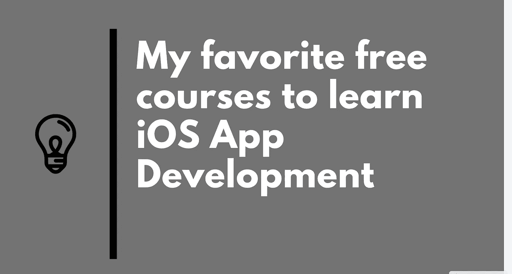
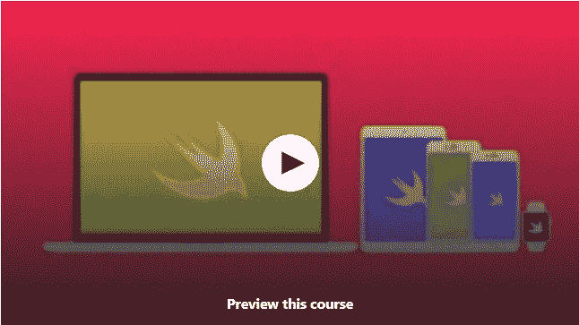
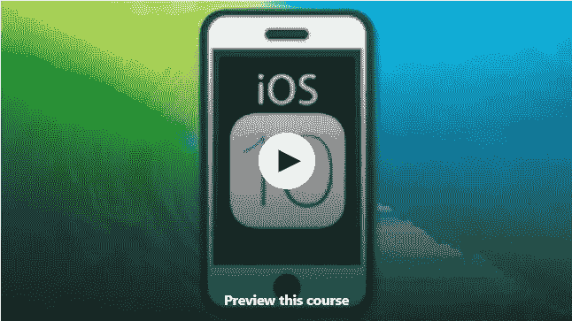
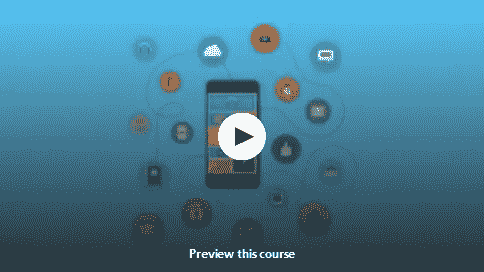
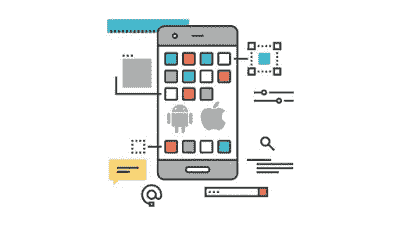
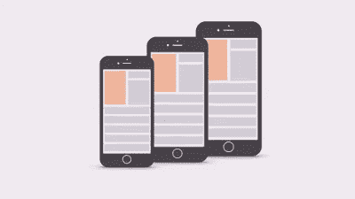
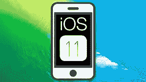
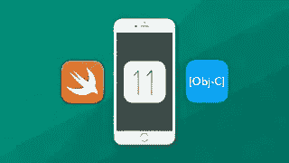

# 2023 年学习 iOS 应用开发的 8 门最佳免费课程

> 原文：<https://medium.com/javarevisited/my-favorite-free-courses-to-learn-ios-app-development-f172e7d3ba5d?source=collection_archive---------0----------------------->

## 以上是 Udemy 和 Pluralsight 为初学者提供的 2023 年学习 iOS app 开发的最佳在线免费课程。

如果你想学习 iOS 应用程序开发，例如为苹果的 iOS 设备(如 iPhone 和 iPad)开发游戏和应用程序，并寻找一些免费课程，那么你来对地方了。在这篇文章中，我将分享学习 iOS App 开发的 8 门*最佳免费课程*。

这是我关于学习 iOS 和冒险进入应用程序开发系列文章中的另一篇文章。前面我已经分享过 [**最佳 iOS app 开发课程**](/javarevisited/top-5-online-courses-to-learn-ios-12-swift-in-2019-a35ae1be7b2b) 、 [**最佳 iOS 项目初学者**](/javarevisited/my-favorite-ios-app-project-ideas-for-beginners-a873e7e6f88a) 、[学习 Swift 编程语言](https://javarevisited.blogspot.com/2019/01/top-5-ios-developer-course-to-learn-ios.html)、苹果自己的语言创建 iOS 应用的最佳课程。它还允许你为 macOS 和 Linux 创建应用程序。

顺便说一下，苹果的 iOS 是一个令人惊叹的平台，它不仅允许你创建应用程序和游戏，还提供了一个发布和销售你的作品的平台。你可以将你的应用或游戏上传到 AppStore，通过出售或选择在游戏上显示广告来赚取一些钱。

有很多程序员成了 app 创业者，赚了几千块钱。尽管这并不容易，需要很多努力、运气和坚持，但它确实提供了一个机会。

它也激励其他地区的人学习编程和谋生。事实上，世界各地有许多训练营，教你如何在 iOS 上为 iPhone 和 iPad 开发游戏和应用程序，但大多数都非常昂贵，有时位置也是一个问题。

这就是在线课程发挥作用的地方。也可以像[**iOS&Swift——完整的 iOS App 开发 Bootcamp**](https://click.linksynergy.com/fs-bin/click?id=JVFxdTr9V80&subid=0&offerid=634352.1&type=10&tmpid=14538&RD_PARM1=https%3A%2F%2Fwww.udemy.com%2Fios-12-app-development-bootcamp%2F) 一样购买低至 10 美元的课程，随时随地学习。如果你有智能手机和互联网连接，那么你就可以在旅行时、在家里或者在你的办公室里，在空闲时间观看它们。

 [## iOS & Swift -完整的 iOS 应用程序开发训练营

### 欢迎来到完整的 iOS 应用程序开发训练营。凭借超过 23，000 的评分和 4.8 的平均分，我的 iOS 课程是…

udemy.com](https://click.linksynergy.com/fs-bin/click?id=JVFxdTr9V80&subid=0&offerid=634352.1&type=10&tmpid=14538&RD_PARM1=https%3A%2F%2Fwww.udemy.com%2Fios-12-app-development-bootcamp%2F) 

# 2023 年新手在线学习的 8 门最佳免费 iOS App 开发课程

如果你不想花钱，也有一些免费的课程可以开始。这些课程会给你提供足够的背景和知识来决定 iOS 开发是否适合你。

事不宜迟，下面是我列出的一些学习 iOS 和 iPhone 和 iPad 应用程序开发的最好的免费在线课程。

## 1.[打造出色的 IOS 应用(Swift)](https://click.linksynergy.com/deeplink?id=CuIbQrBnhiw&mid=39197&murl=https%3A%2F%2Fwww.udemy.com%2Fcourse%2Fbuild-great-ios-apps-with-swift%2F) 【免费 Udemy 课程】

这是在 Udemy 上学习 Swift 和 iOS 应用程序开发的 epic 免费课程之一。不像其他免费的 Udemy 课程，时间很短，从 30 分钟到 1 小时不等，这门课有相当多的内容，差不多 4 个小时的教程。

在这个免费的 iOS 和 Swift 课程中，您将首先学习使用新的 Swift 编程语言创建自己的简单 iOS 应用程序所需的所有基础知识。

在学习了所有关于编程的基础知识之后，你将为 UIKit 框架构建简单的代码，你将使用它来创建令人敬畏的应用程序。

这门课程最棒的一点是导师 Hamad Fouad 的教学风格，他将帮助你通过使用 [Swift 编程语言](/javarevisited/7-free-courses-to-learn-swift-programming-language-in-2020-f40ac9d3ee53)构建出色的 iOS 应用程序来快速学习。

他自己在 Swift 上开发了一个名为 Yuppi 的应用程序，提供了最简单的即时分享照片和视频的方式，其他人也可以合作，同时所有者可以设置隐私组。所以，你将会向一个已经做了大量 iOS 应用程序开发的人学习。

**这里是加入这个免费课程的链接** — [构建优秀的 IOS 应用(Swift)](https://click.linksynergy.com/deeplink?id=CuIbQrBnhiw&mid=39197&murl=https%3A%2F%2Fwww.udemy.com%2Fcourse%2Fbuild-great-ios-apps-with-swift%2F)

在此过程中，您还将学习推送通知、检索数据、上传数据、更新数据和应用内购买等强大功能，并且您将构建一个现实生活中的示例，帮助您将所有新获得的知识联系起来。总之 2023 年学习 iOS app 开发的最佳免费课程。

## 2.[完整的 Swift iOS 开发者—在 Swift 中创建真正的应用](https://click.linksynergy.com/deeplink?id=JVFxdTr9V80&mid=39197&murl=https%3A%2F%2Fwww.udemy.com%2Fcourse%2Fthe-complete-ios-10-developer-course%2F)

这个 49 小时的免费 Udemy 课程是我在网上找到的最好的 iOS 和 Swift 课程。它与 Udemy 上的许多付费 iOS 课程一样好，鉴于这个庞大的 49 小时课程所涵盖的内容和主题数量，免费获取它绝对是显而易见的。

在这个免费的 iOS 课程中，您将学到以下内容:

*   如何创建 ***有用的 iOS*** 应用
*   制作 GPS 地图
*   制作时钟应用程序
*   转录应用
*   计算器应用程序
*   转换器应用
*   RESTful 和 JSON 应用
*   Firebase 应用程序
*   Instagram 克隆(但是更好；)
*   让用户惊叹的精美动画
*   创建 ***引人注目的*** 应用程序
*   如何开始自己的创业从想法到融资到销售

在这个免费的 iOS 课程中，你不仅会学习 iOS 和 Swift，成为一名 app 创业者。它还包括免费的 AWS 服务、Swift tvOS 和素描培训。

**以下是参加本课程的链接**—[Swift iOS 开发人员—在 Swift 中创建真正的应用](https://click.linksynergy.com/deeplink?id=JVFxdTr9V80&mid=39197&murl=https%3A%2F%2Fwww.udemy.com%2Fcourse%2Fthe-complete-ios-10-developer-course%2F)

## 3.[这就是你如何制作 iPhone 应用程序——iOS 开发课程](https://click.linksynergy.com/deeplink?id=JVFxdTr9V80&mid=39197&murl=https%3A%2F%2Fwww.udemy.com%2Fcourse%2Fiosdevelopment%2F)

这是 Udemy 上最适合初学者学习 iOS 应用开发的免费在线课程之一。在这个动手操作、基于项目的课程中，您将学习如何从头开始制作 iPhone 应用程序。

您将通过 iOS 应用开发教程了解 iOS 应用开发的每个步骤，从创建到提交到应用商店。没有先决条件，即使你没有编程经验也可以加入。

您将在第 2 课中创建我们的第一个应用程序，而无需编写任何代码。然后在本 iOS 应用开发教程的第 3 课**中，**我们将学习如何用苹果的 Objective-C 编程语言编写代码。

**这里是加入这个免费课程的链接—** [这是你如何制作 iPhone 应用程序— iOS 开发课程](https://click.linksynergy.com/deeplink?id=JVFxdTr9V80&mid=39197&murl=https%3A%2F%2Fwww.udemy.com%2Fcourse%2Fiosdevelopment%2F)

## **4。** [**iOS 应用开发初学者**](https://click.linksynergy.com/fs-bin/click?id=JVFxdTr9V80&subid=0&offerid=634352.1&type=10&tmpid=14538&RD_PARM1=https%3A%2F%2Fwww.udemy.com%2Fios-app-development-for-beginners%2F)

为 iOS 开发是一项很受欢迎的技能，也很有价值，但如果你以前没有在苹果世界开发过任何东西，这可能会令人生畏，这就是像本课程这样的好课程可以帮助你的地方。

本课程将教你如何在 iOS 11 和 Xcode 9(苹果为 Swift 开发的 IDE)中不用写一行代码就能开发出完整的 iOS 应用。

简而言之，对于初学者和任何想从 iOS11 和 Xcode 9 开始的人来说，这是一门优秀的课程。

你也不需要有 Swift 编程技能来使用这个课程，尽管我建议你学习 Swift，因为它在未来会对你有很大帮助。

以下是免费加入本课程的链接— [**iOS 应用开发初学者**](https://click.linksynergy.com/fs-bin/click?id=JVFxdTr9V80&subid=0&offerid=634352.1&type=10&tmpid=14538&RD_PARM1=https%3A%2F%2Fwww.udemy.com%2Fios-app-development-for-beginners%2F)

## **5。** [**iOS 基础**](https://pluralsight.pxf.io/c/1193463/424552/7490?u=https%3A%2F%2Fwww.pluralsight.com%2Fcourses%2Fios-11-fundamentals)

在本课程中，您将快速学会使用 Xcode 9 和 Swift 4 构建出色的 iOS 应用程序，并了解 iOS 11 的最新功能。

这是一门综合性的课程，将教会你一个 iOS 开发者应该知道的所有事情。您将首先了解这些工具，以及如何创建具有自适应用户界面的 iOS 应用程序，这些应用程序可以在多种设备上运行(包括 iPhone X)。

之后，您将学习如何管理 iOS 项目并定义您自己的 iOS 应用程序的构建模块。您还将学习如何使用数据驱动控件并理解导航选项。

完成本课程后，你应该了解当前的最佳实践、iOS 架构，并有足够的信心开始构建自己的 iPhone 应用程序。

点击 [**此处**](https://pluralsight.pxf.io/c/1193463/424552/7490?u=https%3A%2F%2Fwww.pluralsight.com%2Fcourses%2Fios-11-fundamentals) 了解本课程更多信息。

顺便说一句，你需要一个 Pluralsight 会员才能参加这个课程，费用大约是每月 29 美元或者每年 199 美元(现在有 33%的折扣)。我有一个，我也建议所有的开发者都有这个计划，因为 Pluralsight 就像软件开发者的网飞。

它有 5000 多门高质量的课程，涵盖所有最新的主题。因为我们程序员每天都要学习新的东西，所以 299 美元的投资是不错的。

顺便说一句，它还提供了 10 天的免费试用期，允许你观看 200 小时的内容。你可以通过报名参加那个试验来免费观看这个课程。

 [## 对个人来说

### Pluralsight 帮助个人学习者获得掌握最新软件开发所需的技术技能…

pluralsight.pxf.io](https://pluralsight.pxf.io/c/1193463/424552/7490?u=https%3A%2F%2Fwww.pluralsight.com%2Flearn) 

## **6。** [**如何给初学者做一个 App**](https://click.linksynergy.com/fs-bin/click?id=JVFxdTr9V80&subid=0&offerid=634352.1&type=10&tmpid=14538&RD_PARM1=https%3A%2F%2Fwww.udemy.com%2Fhow-to-make-an-app-2018%2F)

这是初学者开始学习 iOS 开发的又一个很棒的课程。到目前为止，它也是完全免费的。

该课程专为完全初学者设计，您将逐步学习如何使用 Swift 4、Xcode 9 和 iOS 11 构建 iPhone 应用程序。

免费加入本课程— [**如何制作一个适合初学者的 iOS app？**](https://click.linksynergy.com/fs-bin/click?id=JVFxdTr9V80&subid=0&offerid=634352.1&type=10&tmpid=14538&RD_PARM1=https%3A%2F%2Fwww.udemy.com%2Fhow-to-make-an-app-2018%2F)

该课程既不短也不长，值得观看 3 个小时，因此您可以在一天内完成课程，包括代码练习，并为 [iOS 应用程序构建](https://javarevisited.blogspot.com/2018/11/5-free-ios-app-development-courses-for.html)打下一些基础。

## **7。** [**基础 Swift 4 和 iOS 11 —免费预览**](https://click.linksynergy.com/fs-bin/click?id=JVFxdTr9V80&subid=0&offerid=634352.1&type=10&tmpid=14538&RD_PARM1=https%3A%2F%2Fwww.udemy.com%2Fthe-complete-ios-developer-course%2F)

这是学习 Swift 4 和 iOS 11 成为 app 创业者的又一门好课程。

讲师 Grant Klimaytys 非常热情，不仅教你 Swift 4 和 iOS 11，还教你如何构建自己的应用并发布到苹果的应用商店。

简而言之，本课程提供了一个免费向资深人士学习编程并从其丰富经验中学习的独特机会。

**这里是** [**的链接报名**](https://click.linksynergy.com/fs-bin/click?id=JVFxdTr9V80&subid=0&offerid=634352.1&type=10&tmpid=14538&RD_PARM1=https%3A%2F%2Fwww.udemy.com%2Fthe-complete-ios-developer-course%2F) 免费上这门课

## **8。**[**iOS 11 开发简介:Swift 4 和 Xcode 9**](https://click.linksynergy.com/fs-bin/click?id=JVFxdTr9V80&subid=0&offerid=634352.1&type=10&tmpid=14538&RD_PARM1=https%3A%2F%2Fwww.udemy.com%2Fios11development%2F)

另一个免费学习 Swift、Xcode 和 iOS11 的好课程。如果你不知道 Swift，它是苹果公司用于构建 iOS 应用程序的编程语言，早先它曾是对初学者来说稍难学习的 Objective C。

Swift 旨在将教育铭记于心，因此，它也是一种学习编程的好语言。还有一个名为 Swift Playground 的免费 iPad 游戏，你可以用它免费学习 Swift 编程。

这也是一门实践课程，因此，你不仅会学到 iOS 11 开发的基础知识，还会开发 2 个完整的 iOS 应用程序！

**点击** [**此处**](https://click.linksynergy.com/fs-bin/click?id=JVFxdTr9V80&subid=0&offerid=634352.1&type=10&tmpid=14538&RD_PARM1=https%3A%2F%2Fwww.udemy.com%2Fios11development%2F) **了解更多关于这个免费的 iOS 和 iPhone 课程的**

以上就是学习 iPhone 和 iPad iOS 应用开发的一些**最佳免费课程**。正如我所说的，iOS 和 Swift 是开始你编程生涯的最佳方式，因为它们不仅让你做好了就业准备，还让你通过为自己创作游戏和应用程序来赚取一些收入。

如果你有很好的创造力和编程技能，你可能会成为像愤怒的小鸟或软盘鸟的创造者那样的应用程序企业家。

## 您可能喜欢的其他在线编程资源

1.  [devo PS 程序员路线图](https://javarevisited.blogspot.com/2018/09/the-2018-devops-roadmap-your-guide-to-become-DevOps-Engineer.html)
2.  Java 和 Web 开发人员应该学习的 10 个框架
3.  [为有经验的开发人员提供的 10 门免费 Java 课程](http://www.java67.com/2018/08/top-10-free-java-courses-for-beginners-experienced-developers.html)
4.  [深入学习 Docker 的 10 门免费课程](http://www.java67.com/2018/02/5-free-docker-courses-for-java-and-DevOps-engineers.html)
5.  [面向初学者的 10 门数据科学和机器学习课程](https://dev.to/javinpaul/10-data-science-and-machine-learning-courses-for-programmers-looking-to-switch-career-57kd)
6.  [2023 年 React JS 开发者路线图](https://javarevisited.blogspot.com/2018/10/the-2018-react-developer-roadmap.html)
7.  [学习数据结构和算法的 10 门免费课程](https://hackernoon.com/10-free-data-structure-and-algorithm-courses-junior-developers-should-explore-978b72871af5)
8.  [深入学习 Node JS 的前 5 门课程](http://javarevisited.blogspot.sg/2018/01/top-5-nodejs-and-express-js-online-courses-for-web-developers.html)
9.  [深入学习 React JS 的 5 大课程](https://javarevisited.blogspot.com/2018/08/top-5-react-js-and-redux-courses-to-learn-online.html)
10.  [面向 Java 开发人员的 5 门 Android 在线培训课程](https://javarevisited.blogspot.com/2017/12/top-5-android-online-training-courses-for-Java-developers.html)

## 结束语

感谢您阅读本文。你可能会想，有这么多东西要学，有这么多课程要参加，但你不需要担心。

很有可能你已经知道了大部分的东西，也有很多有用的免费资源供你使用，我也在这里和那里链接了它们以及最好的资源，它们当然不是免费的，但是很值钱。

我是 Udemy 课程的特别粉丝，因为这些课程非常实惠，并且以很少的金额提供了很多价值，但是你可以自由选择你想要的课程。

说到底，你应该对这里提到的事情有足够的知识和经验。

祝您的 iOS 应用程序开发之旅好运！当然**不会很容易**，但是通过遵循这个路线图和指南，你离成为你一直想成为的 iOS 应用开发者又近了一步

> **附言——**如果你不介意支付少量费用来学习像 iOS 应用程序开发技能这样有价值的东西，那么你也可以看看由 Angela Yu 教授的[**iOS&Swift——完整的 iOS 应用程序开发训练营**](https://click.linksynergy.com/fs-bin/click?id=JVFxdTr9V80&subid=0&offerid=634352.1&type=10&tmpid=14538&RD_PARM1=https%3A%2F%2Fwww.udemy.com%2Fios-12-app-development-bootcamp%2F) ，这是我最喜欢的深入学习 iOS 和 iPhone 应用程序开发的课程之一。

 [## iOS & Swift -完整的 iOS 应用程序开发训练营

### 欢迎来到完整的 iOS 应用程序开发训练营。凭借超过 23，000 的评分和 4.8 的平均分，我的 iOS 课程是…

udemy.com](https://click.linksynergy.com/fs-bin/click?id=JVFxdTr9V80&subid=0&offerid=634352.1&type=10&tmpid=14538&RD_PARM1=https%3A%2F%2Fwww.udemy.com%2Fios-12-app-development-bootcamp%2F)