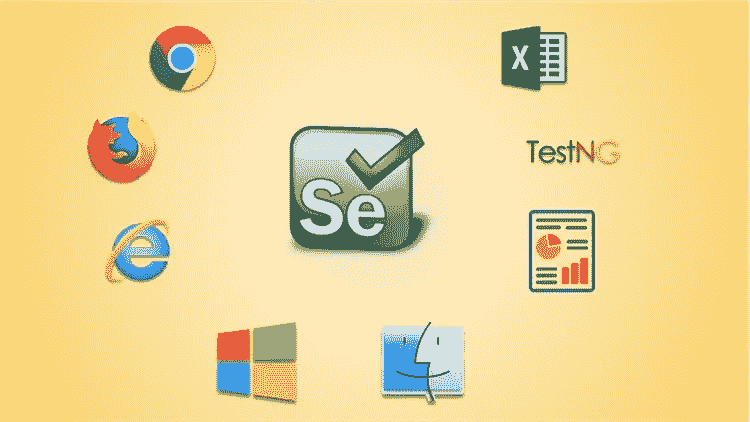
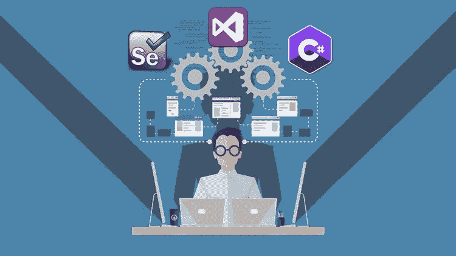
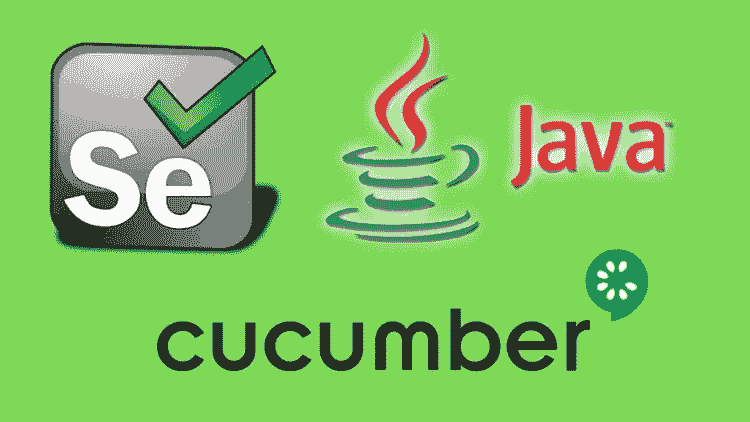
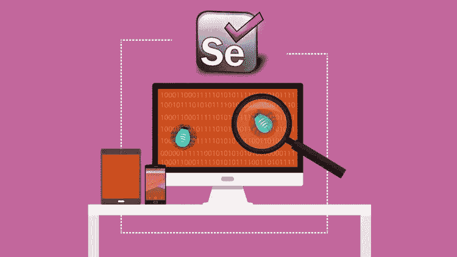
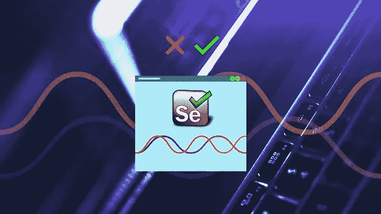
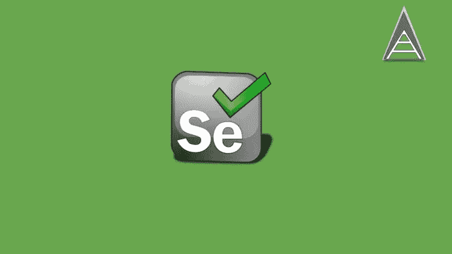

# 2023 年学习自动化测试 Selenium Webdriver 的 7 门免费课程

> 原文：<https://medium.com/javarevisited/my-favorite-free-courses-to-learn-selenium-web-drive-for-automation-testing-2f248c8fe6aa?source=collection_archive---------1----------------------->

## 我最喜欢的免费硒课程学习自动化测试在 2023 年

测试是软件开发不可或缺的一部分，我们长期以来一直依赖测试人员和 QA 专业人员的手动测试来交付高质量的软件和发现 bug，但这种方式已经不可持续了。

如今，自动化测试越来越受到关注，Selenium 的 web 驱动程序正处于领先地位。

如果你不知道 selenium 是什么，它是一个针对 [web 应用](/better-programming/my-5-favorite-courses-to-learn-web-development-in-2019-a5e74167f8b2)的免费自动化测试工具。它可以与 Chrome、Firefox、Internet Explorer、Opera 等不同的网络浏览器一起工作，并模拟类似人类的行为。通过使用 Selenium，您可以以编程方式与网页上的所有不同元素进行交互。你可以点击它们，输入文本，提取文本，等等。

Selenium 也完全不同于 QTP、Win Runner、Load Runner 等其他 QA 自动化工具。，它允许您为自动化测试进行记录和重放。

Selenium 提供了一个 API，可以让你自动化网页上的一切。您可以检查某个元素是否存在，或者某个元素有什么值。Selenium 允许你测试用任何语言编写的任何类型的网站，比如 [PHP](http://www.java67.com/2018/02/5-free-php-and-mysql-courses-for-web-developers.html) ， [Perl](http://javarevisited.blogspot.sg/2015/03/top-10-popular-programming-languages-and-creators.html#axzz52GIQrL9E) ， [Python](http://www.java67.com/2018/02/5-free-python-online-courses-for-beginners.html) ， [Java](http://www.java67.com/2018/08/top-10-free-java-courses-for-beginners-experienced-developers.html) ， [C#](https://www.java67.com/2019/03/5-free-c-net-courses-to-learn-online.html) 等等。它还支持多种浏览器，如 Chrome、Firefox、Internet Explorer、Safari 和 Opera，这意味着您不仅可以在各种浏览器中自动测试您的应用程序。

Selenium 也允许你在任何语言上编写自动化测试，比如 [Java](/javarevisited/10-free-courses-to-learn-java-in-2019-22d1f33a3915) 、 [C#](https://javarevisited.blogspot.com/2019/11/top-5-courses-to-learn-c-sharp-in.html) 、Perl、 [Python](https://javarevisited.blogspot.com/2018/12/10-free-python-courses-for-programmers.html) 等等。但是 90%的公司使用 [Selenium 搭配 Java](/javarevisited/top-7-courses-to-learn-selenium-for-java-and-c-developers-to-learn-automation-testing-free-and-e91637cd9622) ，这意味着愿意学习 Selenium 进行自动化测试的手工测试人员也应该学习 Java。虽然你只需要知道核心的 Java 基础知识，但是你不需要成为 Java 专家来编写 selenium 测试。不过，如果你认为你的 Java 技能不一般，你也可以查看 Udemy 上的 [**完整 Java 大师班**](https://click.linksynergy.com/fs-bin/click?id=JVFxdTr9V80&subid=0&offerid=323058.1&type=10&tmpid=14538&RD_PARM1=https%3A%2F%2Fwww.udemy.com%2Fjava-the-complete-java-developer-course%2F) 课程。课程很棒，但不是免费的，但也不是很贵。我去年只买了 10 美元，相当于现在一顿午餐的费用。

 [## 完整的 Java 软件开发人员大师班(针对 Java 10)

### 你刚刚在网上偶然发现了最完整、最深入的 Java 编程课程。拥有超过 480，000 名学生…

udemy.com](https://click.linksynergy.com/fs-bin/click?id=JVFxdTr9V80&subid=0&offerid=323058.1&type=10&tmpid=14538&RD_PARM1=https%3A%2F%2Fwww.udemy.com%2Fjava-the-complete-java-developer-course%2F) 

# 与 Java 和 C#开发人员一起学习 Selenium 的 7 门免费在线课程

在这篇文章中，我将分享一些免费的在线课程，你可以用 Java 和 C#来学习 Selenium web driver。你不需要学习两种语言，但是你可以选择你觉得舒服的语言。

例如，如果你是一名[的 Java 开发人员](https://javarevisited.blogspot.com/2018/05/10-tips-to-become-better-java-developer.html)，想要为你的项目学习自动化测试，你可以参加用 Java 教授 **Selenium webdriver 的课程。**

同样，如果你是用 C#编写 GUI 的 GUI 开发人员，那么你可以参加用 [C#](/javarevisited/top-7-courses-to-learn-selenium-for-java-and-c-developers-to-learn-automation-testing-free-and-e91637cd9622) 教授 Selenium 的课程，进行自动化测试。

这些主要是初级课程，会向你解释什么是 Selenium，它是如何工作的，它给开发者提供了什么好处。一些课程也是高级的，教授一些高级的主题，比如用 Selenium 进行并行测试。

事不宜迟，这里是我为 Java 和 C#开发者提供的免费 Selenium 课程列表。

## 1. [Selenium Java 框架从无到有](https://click.linksynergy.com/deeplink?id=JVFxdTr9V80&mid=39197&murl=https%3A%2F%2Fwww.udemy.com%2Fcourse%2Fselenium-java-framework-from-scratch%2F)【免费】

这是最全面的免费在线课程之一，可以帮助您入门 Selenium automation 并学习其他集成测试库的基础知识，如 [JUnit](http://www.java67.com/2018/02/5-free-eclipse-and-junit-online-courses-java-developers.html) 、 [TestNG](https://javarevisited.blogspot.com/2018/01/10-unit-testing-and-integration-tools-for-java-programmers.html) 等。在这个 11 小时的免费课程中，你将首先学习使用 Selenium 编写自动化测试所需的 Java 基础知识。然后作者继续解释 selenium 的关键概念，比如什么是 Selenium，它与 QTP 和其他 QA 自动化工具有何不同，以及如何使用 Selenium web 驱动程序测试 GUI。

课程还涉及数据库测试、Selenium 网格、Selenium 2.0 webdriver、 [Appium 安装](https://javarevisited.blogspot.com/2020/08/top-5-courses-to-learn-appium-for-automation-testing.html#axzz6Wli6KlSW)。简而言之，对于自动化环境中的初学者来说，这是一个很好的起点。

**这里是免费加入本课程的链接**—[Selenium Java Framework 从头开始](https://click.linksynergy.com/deeplink?id=JVFxdTr9V80&mid=39197&murl=https%3A%2F%2Fwww.udemy.com%2Fcourse%2Fselenium-java-framework-from-scratch%2F)

## 2.[硒与 C#和 Java 花絮](https://click.linksynergy.com/fs-bin/click?id=JVFxdTr9V80&subid=0&offerid=323058.1&type=10&tmpid=14538&RD_PARM1=https%3A%2F%2Fwww.udemy.com%2Fselenium-csharp-and-java-titbits%2F)【免费】

这是 Selenium 的另一个免费课程，用简短的例子解释了 Java 和 C#中的一些 Selenium 概念。大部分主题都来源于 StackOverflow 中提出的问题，但我发现这门课程足够好，可以学到一些有价值的东西，最重要的是，它是免费的。

**这里是免费加入本课程的链接**——[Selenium 与 C#和 Java 花絮](https://click.linksynergy.com/fs-bin/click?id=JVFxdTr9V80&subid=0&offerid=323058.1&type=10&tmpid=14538&RD_PARM1=https%3A%2F%2Fwww.udemy.com%2Fselenium-csharp-and-java-titbits%2F)

您还将学习如何使用 selenium 进行拖放，如何悬停鼠标，如何使用 selenium 进行点击，以及如何使用弹出窗口和 [XPath](http://javarevisited.blogspot.sg/2012/12/xpath-tutorial-example-how-to-select-elements.html#axzz5B6EWE6M7) 。本课程还解释了如何使用 Java 配置 Selenium 网格和设置并行执行。

总的来说，这是一门很好的实践课程，可以用 [Java](https://javarevisited.blogspot.com/2018/08/top-5-free-java-8-and-9-courses-for-programmers.html) 和 [C#](https://javarevisited.blogspot.com/2018/08/5-programming-language-every-programmer-learn.html#axzz5cs99FGXq) 来学习 Selenium。尽管这门课程更侧重于 Java 而不是 C#。

## 3.[黄瓜加硒渣(基础)](https://click.linksynergy.com/fs-bin/click?id=JVFxdTr9V80&subid=0&offerid=323058.1&type=10&tmpid=14538&RD_PARM1=https%3A%2F%2Fwww.udemy.com%2Fcucumber-with-selenium%2F)【免费】

这是 Udemy 上的另一个免费硒课程，由创建前一个课程的同一作者卡蒂克·KK 提供。在本课程中，他解释了黄瓜和行为驱动发展以及硒，但更详细。

本课程分为两个部分，在第一部分，您将从头开始学习[黄瓜](https://dzone.com/articles/10-essential-testing-tools-for-java-developers)，以及 BDD 或行为驱动开发的基础知识。

第二部分重点介绍 Selenium with cumber，在这里您将学习如何为 Selenium with cumber 编写一个简单的代码，并学习如何与页面对象模型进行交互。

**这里是免费加入本课程的链接** — [硒渣黄瓜(基础)](https://click.linksynergy.com/fs-bin/click?id=JVFxdTr9V80&subid=0&offerid=323058.1&type=10&tmpid=14538&RD_PARM1=https%3A%2F%2Fwww.udemy.com%2Fcucumber-with-selenium%2F)

您还将通过 [Maven](http://www.java67.com/2018/02/6-free-maven-and-jenkins-online-courses-for-java-developers.html) 学习如何使用黄瓜运行 Selenium，并使用 TestNG 运行黄瓜测试。本课程还涉及到黄瓜中硒含量的报告。

总之是一门快速学习 bot 黄瓜和硒的绝佳课程。

## 4. [Selenium WebDriver 用 C#为初学者+现场测试站点](https://click.linksynergy.com/fs-bin/click?id=JVFxdTr9V80&subid=0&offerid=323058.1&type=10&tmpid=14538&RD_PARM1=https%3A%2F%2Fwww.udemy.com%2Fselenium-qa%2F)

这是另一个免费的 selenium，侧重于现场演示和动手实践。对于没有 Selenium 经验的手工测试人员、QA 实习生和 QA 专业人员来说，这是一门非常好的课程。在本课程中，您将学习图形用户界面和功能测试，以及如何使用 Selenium 提供的各种选择器，如名称选择器、 [ID 选择器](http://javarevisited.blogspot.sg/2014/05/jquery-class-and-id-selector-example.html#axzz4skcM1VYj)、类名选择器、CSS 路径选择器和 XPath 选择器。

之后，您将学习如何使用一些常见的 HTML 元素，如输入文本框、[复选框](http://javarevisited.blogspot.sg/2017/07/how-to-checkuncheck-checkbox-using-jQuery-example.html#axzz5D4gR4y2f)、单选按钮、下拉菜单和 JavaScript 警告框。

**这里是免费加入本课程的链接** — [面向初学者的 Selenium WebDriver with 现场测试站点](https://click.linksynergy.com/fs-bin/click?id=JVFxdTr9V80&subid=0&offerid=323058.1&type=10&tmpid=14538&RD_PARM1=https%3A%2F%2Fwww.udemy.com%2Fselenium-qa%2F)

我们还会有一些理论讲座，在这些讲座中，我会解释什么时候应该使用这些选择器，如何检查元素，什么是自动化测试框架，以及为什么我们需要学习如何创建一个自动化测试框架。

## 5.[黄瓜，硒&Java——2.5 小时开发一个框架！](https://click.linksynergy.com/fs-bin/click?id=JVFxdTr9V80&subid=0&offerid=323058.1&type=10&tmpid=14538&RD_PARM1=https%3A%2F%2Fwww.udemy.com%2Fcucumber-selenium-java-develop-a-framework-in-25-hours%2F)

你是一个自动化测试人员，想要在你的简历中加入行为驱动开发(BDD)或者黄瓜吗？或者，有人经常听说黄瓜或 BDD，但对它们是什么以及它们解决了什么问题有一点点概念，那么这就是适合你的课程。在本课程中，您将使用 Selenium WebDriver 和 Java 从初级水平一直学习 Cucumber BDD，直至达到相当高级的水平。

如果你学习这门课程，你还可以学习如何为 BDD 开发一个小而健壮的黄瓜框架。

课程还会教你小黄瓜、 [Maven](http://javarevisited.blogspot.sg/2016/08/top-10-maven-plugins-every-java-developer-know.html#axzz5E2uHdG3w) 、 [Eclipse](http://www.java67.com/2018/01/how-to-remote-debug-java-application-in-Eclipse.html) ，以及其他你需要用 Selenium 和 cumber 工作的相关工具，成为一名成功的自动化 QA 工程师。

**这里是免费加入本课程的链接**——[黄瓜，硒&Java——2.5 小时开发一个框架！](https://click.linksynergy.com/fs-bin/click?id=JVFxdTr9V80&subid=0&offerid=323058.1&type=10&tmpid=14538&RD_PARM1=https%3A%2F%2Fwww.udemy.com%2Fcucumber-selenium-java-develop-a-framework-in-25-hours%2F)

## 6.[使用 Selenium 开始测试自动化](https://click.linksynergy.com/deeplink?id=JVFxdTr9V80&mid=39197&murl=https%3A%2F%2Fwww.udemy.com%2Fcourse%2Fgetting-started-with-test-automation-using-selenium%2F)【免费】

这是另一个关于 Selenium WebDriver 的初级免费 Udemy 课程。它旨在通过教你如何使你的自动化测试更快、更健壮，将你的软件测试技能提升到一个新的水平。

以下是您将在本课程中学到的重要知识:

1.  理解完整的测试流程和测试自动化的角色
2.  测试自动化是什么，为什么和如何
3.  了解 Selenium IDE 并使用它
4.  Selenium WebDriver 和网格入门
5.  如何在 Selenium 技能发展的道路上更进一步

**这里是免费加入本课程的链接** — [使用 Selenium 开始测试自动化](https://click.linksynergy.com/deeplink?id=JVFxdTr9V80&mid=39197&murl=https%3A%2F%2Fwww.udemy.com%2Fcourse%2Fgetting-started-with-test-automation-using-selenium%2F)

## 7.[硒基础知识——初学者的循序渐进](https://click.linksynergy.com/deeplink?id=JVFxdTr9V80&mid=39197&murl=https%3A%2F%2Fwww.udemy.com%2Fcourse%2Fselenium-basics-step-by-step-for-beginners%2F)[免费]

这是 Udemy 上的另一个初级免费课程，从零开始学习 Selenium。

以下是您将在本课程中学到的重要内容:

1.  了解硒的基本知识
2.  在项目中使用硒
3.  使用 [Selenium Web 驱动](https://javarevisited.blogspot.com/2018/02/top-5-selenium-webdriver-with-java-courses-for-testers.html)创建自动化测试

如果您对 Selenium 不熟悉，或者想了解基本知识，那么本课程适合您。每个视频在描述中都有注释，以便于理解和操作。

**这里是免费加入本课程的链接** — [使用 Selenium 开始测试自动化](https://click.linksynergy.com/deeplink?id=JVFxdTr9V80&mid=39197&murl=https%3A%2F%2Fwww.udemy.com%2Fcourse%2Fgetting-started-with-test-automation-using-selenium%2F)

以上是关于使用 Java 或 C#学习 Selenium Webdriver 进行自动化测试的一些免费课程。如果您是手工测试人员、QA 工程师或者 Java 开发人员，学习自动化测试会有很大的价值。

如果你在考虑 2023 年学什么，那么用 Selenium 进行自动化测试是一个不错的选择。这不仅会让你成为一个更好的 QA 或开发者，还会给你的职业生涯一个推动。

其他**免费在线课程**您可能喜欢探索
[2023 年 Java 开发者路线图](https://javarevisited.blogspot.com/2019/10/the-java-developer-roadmap.html#123)
[5 个面向 Java 和 DevOps 工程师的免费 Docker 课程](http://www.java67.com/2018/02/5-free-docker-courses-for-java-and-DevOps-engineers.html)
[5 个免费学习 Angular 的在线培训课程](http://www.java67.com/2018/01/top-5-free-angular-js-online-courses-for-web-developers.html)
[5 个面向应用开发者和系统管理员的免费 Linux 课程](http://www.java67.com/2018/02/5-free-linux-unix-courses-for-programmers-learn-online.html)
[Udemy](http://javarevisited.blogspot.sg/2018/01/top-10-udemy-courses-for-java-and-web-developers.html#axzz56TUKbQgM)
[Top](http://javarevisited.blogspot.sg/2017/12/top-10-pluralsight-courses-java-and-web-developers.html)
[用 Java 学习 RESTful Web Services 的 3 本书和课程](http://www.java67.com/2018/02/3-books-and-courses-to-learn-restful-web-services-with-spring.html)
[学习 Docker、Maven 和 Jenkins 的 10 门免费课程](/javarevisited/top-10-free-courses-to-learn-maven-jenkins-and-docker-for-java-developers-51fa7a1e66f6)
[Java 和 Web 开发人员应该学习的 10 门框架](https://javarevisited.blogspot.com/2018/01/10-frameworks-java-and-web-developers-should-learn.html)
[面向有经验开发人员的 10 门免费 Java 课程](http://www.java67.com/2018/08/top-10-free-java-courses-for-beginners-experienced-developers.html) |
[学习 Core Spring 和 Spring Boot 的 5 门免费课程](http://www.java67.com/2017/11/top-5-free-core-spring-mvc-courses-learn-online.html)
[2020 年学习 Docker 的 10 门免费课程](http://www.java67.com/2018/02/5-free-docker-courses-for-java-and-DevOps-engineers.html)

感谢您阅读本文。如果你喜欢这些免费的 Selenium Webdriver 课程，那么请分享给你的朋友和同事。如果您有任何问题或反馈，请留言。

**p . s .**——如果你不介意花 10 美元这样的几块钱上一门优秀的课程来学习 Selenium 这样有价值的高薪技能，那么[**Selenium web driver with Java-Basics to Advanced+Frameworks**](https://click.linksynergy.com/fs-bin/click?id=JVFxdTr9V80&subid=0&offerid=634352.1&type=10&tmpid=14538&RD_PARM1=https%3A%2F%2Fwww.udemy.com%2Fselenium-real-time-examplesinterview-questions%2F)是 2023 年学习 Selenium with Java 的最佳课程。

 [## Selenium WebDriver 与 Java+框架教程

### 教学是我的爱好。这是我的职业。

udemy.com](https://click.linksynergy.com/fs-bin/click?id=JVFxdTr9V80&subid=0&offerid=634352.1&type=10&tmpid=14538&RD_PARM1=https%3A%2F%2Fwww.udemy.com%2Fselenium-real-time-examplesinterview-questions%2F)