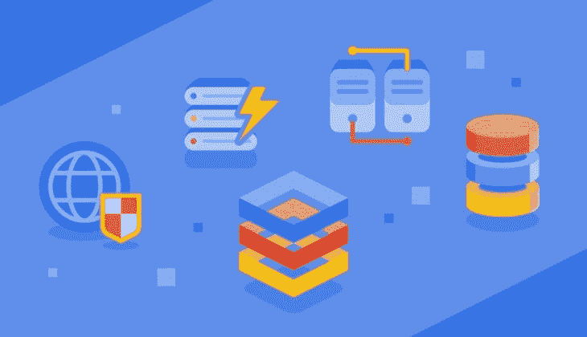
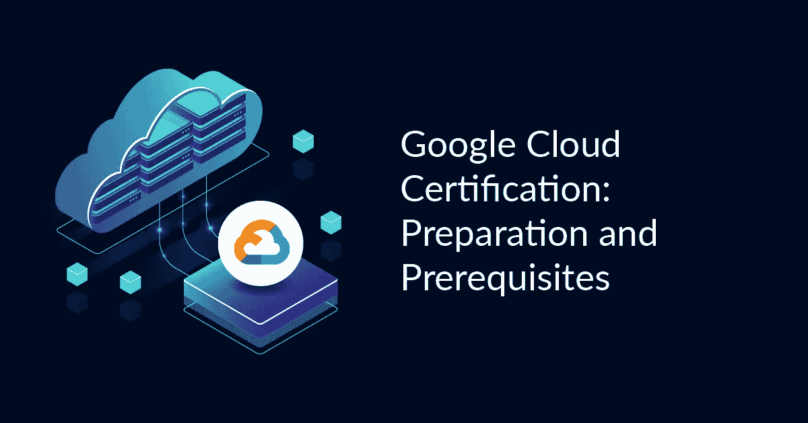

# 2023 年 7 个最佳免费谷歌云开发者认证课程和实践测试

> 原文：<https://medium.com/javarevisited/my-favorite-free-google-cloud-platform-gcp-professional-cloud-developer-certification-courses-856ef69a56bb?source=collection_archive---------0----------------------->

## 2023 年谷歌云平台专业云开发者认证免费在线培训课程集合。

大家好，如果你正在准备 2023 年的 Google cloud 专业云开发者认证，并在寻找免费的在线 Google Cloud 课程，那么你来对地方了。

过去，我已经分享了学习谷歌云平台 的 [**最佳课程，以及通过**](/javarevisited/5-best-courses-to-learn-google-cloud-platform-gcp-in-2021-169093a3771a)**[云工程师](https://javarevisited.blogspot.com/2020/05/top-5-course-to-crack-google-cloud-associate-cloud-engineer-certification-exam.html)、[数据工程师](https://javarevisited.blogspot.com/2020/06/top-5-course-to-crack-google-cloud-professional-data-engineer-certification.html)和[云架构师](https://javarevisited.blogspot.com/2020/07/top-5-courses-to-become-google-cloud-professional-architect.html)认证的认证课程，今天，我将为初学者和有经验的云专业人士分享免费的 GCP 云开发者认证课程。**

这是最难和最负盛名的考试之一，类似于 [AWS 开发人员助理](https://javarevisited.blogspot.com/2020/05/top-5-courses-to-crack-aws-certified-developer-associate-certification-exam.html)和 [Azure 开发人员(AZ-200)考试](https://javarevisited.blogspot.com/2020/06/top-5-course-to-crack-Microsoft-Azure-Developer-Certification-Exam-AZ-203.html)，一旦你通过这个考试，你将拥有足够的知识和技能来提出基于谷歌云的解决方案，这是一项非常受欢迎的技能。

成为[认证云开发者](https://cloud.google.com/certification/cloud-developer)可以帮助你在职业生涯中获得更多成功。这个时代，基础证书都不行；你需要有专业证书。如今，公司本身会向应聘者颁发证书，但作为回报，学生必须通过各自的考试。

正如我所说的，在本指南中，我将分享五门免费课程来通过 **GCP 专业云开发人员考试**。您可能会发现一些课程只在高级平台上提供，但它们被包含在内，因为此类平台提供试用期。经过研究，我得出的结论是，试用期对于完成那些课程是绰绰有余的。

顺便说一句，如果你需要更全面和更有针对性的认证课程，那么我也强烈推荐你参加 Udemy 上的 [**终极谷歌云认证:全包(4)**](https://click.linksynergy.com/deeplink?id=JVFxdTr9V80&mid=39197&murl=https%3A%2F%2Fwww.udemy.com%2Fcourse%2Fgoogle-certified-architect-developer-engineer-data-devops%2F) 课程。

 [## 终极谷歌云认证:一切尽在一个捆绑包中(4)

### 嗨，云专家们，我们有 405，000 多名学生和 280，000 名独立学生获得了谷歌云平台认证…

udemy.com](https://click.linksynergy.com/deeplink?id=JVFxdTr9V80&mid=39197&murl=https%3A%2F%2Fwww.udemy.com%2Fcourse%2Fgoogle-certified-architect-developer-engineer-data-devops%2F) 

这不是免费的，而是最全面的谷歌云认证在线课程，为所有四种谷歌云认证提供学习材料，如[助理云工程师](/javarevisited/7-free-online-courses-to-crack-google-cloud-associate-cloud-engineer-ace-certification-exam-in-2cf0b297aed)、[云架构师](/javarevisited/10-best-free-google-cloud-professional-architect-certification-courses-practice-tests-943e75f03929)、[云开发人员](https://www.java67.com/2020/09/5-free-courses-to-pass-google-cloud-developer-certification.html)、网络工程师。它还包含 500+练习题，磨练你的速度和准确性技能。

# 2023 年谷歌云开发者认证考试的 7 门最佳免费在线课程

为了不浪费你更多的时间，这里列出了准备 Google Cloud Professional Developer Associate 考试的最佳免费在线课程。

这些在线培训课程由专家创建，出于教育目的免费提供。成千上万的开发人员已经加入了这些免费的谷歌云课程，你也可以这样做，并通过这一享有盛誉的云认证。

## 1.[谷歌云基础 101:学习 GCP 的快速指南](https://click.linksynergy.com/deeplink?id=JVFxdTr9V80&mid=39197&murl=https%3A%2F%2Fwww.udemy.com%2Fcourse%2Fgoogle-cloud-fundamentals-101-a-quick-guide-to-learn-gcp%2F)

这是另一个免费的 Udemy 课程，你可以用它来准备谷歌云开发者认证考试。本课程也将帮助你计划建立或改变你的职业生涯到 GCP。

这是谷歌云平台(GCP)入门课程。在本课程中，您将了解什么是云计算，什么是不同的云计算模型，重要的 GCP 服务，以及

你也可以用这些来准备其他高价值的谷歌认证，如“[谷歌助理云工程师](/javarevisited/5-best-gcp-associate-cloud-engineer-certification-courses-in-2021-c93d7e35228a)”、“[专业云架构师](https://javarevisited.blogspot.com/2020/07/top-5-courses-to-become-google-cloud-professional-architect.html?utm_source=dlvr.it&utm_medium=twitter#axzz6kZHuJeAZ)等。

简而言之，这是一个非常棒的免费在线课程，适合对 GCP 感兴趣、计划开始学习谷歌云认证的谷歌云初学者。

**这里是加入免费 GCP 课程的链接**——[谷歌云基础 101:学习 GCP 的快速指南](https://click.linksynergy.com/deeplink?id=JVFxdTr9V80&mid=39197&murl=https%3A%2F%2Fwww.udemy.com%2Fcourse%2Fgoogle-cloud-fundamentals-101-a-quick-guide-to-learn-gcp%2F)

## 2.[云计算简介](https://click.linksynergy.com/deeplink?id=JVFxdTr9V80&mid=39197&murl=https%3A%2F%2Fwww.udemy.com%2Fcourse%2Fintroduction-to-cloud-computing%2F)(免费)

这张单子上接下来的三门课程是相互联系的。如果你不想学习上述两门课程，你可以报读这三门课程。

这些课程是为绝对的初学者设计的，如果你想在云计算方面打下坚实的基础，你可以报名参加这些课程。

这第一个课程是由 Xavier Corbett 创建的，到目前为止，已经有超过 20 万学生注册了。本课程仅讲述[云计算](/javarevisited/5-best-cloud-computing-courses-to-learn-in-2020-f5f091159401)的基础知识，涵盖以下主题:

*   什么是云计算
*   云计算的未来范围
*   为什么 IT 专业人员需要云计算平台
*   云计算有多重要？

如上所述，在整个课程中，只涉及基础知识，讲师已经详细介绍了云计算的每个方面，并使用图形和适当的插图解释了一切。

如果您刚刚开始学习云计算，本课程将是一个完美的开始。超过 20 万名学生已经加入了这门课程。

**这里是加入本课程** — [云计算简介](https://click.linksynergy.com/deeplink?id=JVFxdTr9V80&mid=39197&murl=https%3A%2F%2Fwww.udemy.com%2Fcourse%2Fintroduction-to-cloud-computing%2F)的链接

 [## 免费云计算教程-云计算介绍

### 我把视频看了一遍又一遍，直到我非常清楚地了解了大部分概念。该课程以一种非常…

udemy.com](https://click.linksynergy.com/deeplink?id=JVFxdTr9V80&mid=39197&murl=https%3A%2F%2Fwww.udemy.com%2Fcourse%2Fintroduction-to-cloud-computing%2F) 

## 3.[GCP——谷歌云平台概念](https://click.linksynergy.com/deeplink?id=JVFxdTr9V80&mid=39197&murl=https%3A%2F%2Fwww.udemy.com%2Fcourse%2Fgcp-google-cloud-platform-concepts%2F)(免费)

一旦你完成了云计算的基础课程，你就会明白云计算是如何被使用的，以及 GCP 提供了什么。现在，您已经准备好开始特定于平台的学习了。

本课程将向您介绍各种 GCP 概念，帮助您顺利通过 **GCP 专业云开发者考试**。

这个课程是由达纳吉·穆萨勒和[谷歌云平台大师们创建的！](https://click.linksynergy.com/deeplink?id=JVFxdTr9V80&mid=39197&murl=https%3A%2F%2Fwww.udemy.com%2Fuser%2Fujjwala-musale%2F)，他撰写了一些谷歌云平台上最受欢迎和最全面的课程，如[终极谷歌认证专业云开发者 2023](https://click.linksynergy.com/deeplink?id=JVFxdTr9V80&mid=39197&murl=https%3A%2F%2Fwww.udemy.com%2Fcourse%2Fgoogle-cloud-platform-professional-cloud-developer-certification%2F) 。

到目前为止，已经有超过 4 万名学生注册了这门课程。这是一个 6 小时长的视频课程，将涵盖以下主题:

1.  GCP 简介
2.  GCP 的安全问题
3.  GCP 数据库
4.  建立工作关系网
5.  大数据解决方案
6.  人工智能和机器学习解决方案

除此之外，导师们还会分享一个小技巧，通过它你可以在你的谷歌云平台中获得 300 美元的奖励。通过这个奖励，你可以练习。在整个课程中，图形和视觉被广泛使用，从视频中理解概念是非常容易的。

**这是免费的谷歌云课程**——[谷歌云平台概念](https://click.linksynergy.com/deeplink?id=JVFxdTr9V80&mid=39197&murl=https%3A%2F%2Fwww.udemy.com%2Fcourse%2Fgcp-google-cloud-platform-concepts%2F)的链接

 [## 免费谷歌云教程- GCP -谷歌云平台概念

### 拥有 20 年的 IT 经验和在各种 IT 利益相关方的工作经验。与商业/CXO 组织合作…

udemy.com](https://click.linksynergy.com/deeplink?id=JVFxdTr9V80&mid=39197&murl=https%3A%2F%2Fwww.udemy.com%2Fcourse%2Fgcp-google-cloud-platform-concepts%2F) 

## 4. [Google 专业云开发者考试备考](https://cloudacademy.com/learning-paths/google-professional-cloud-developer-exam-preparation-1-1335/)(免费)

CloudAcademy.com 上有这门课。这是 GCP 专业云开发人员考试网上最新、最受欢迎的课程之一。到目前为止，已经有超过 187 名学生注册了这门课程。

本课程总共有 13 个视频，12 个作业。这是一个长达 18 小时的视频课程，将教你了解 GCP 平台的每一个细节。这门课程最令人兴奋的一点是，每一个话题都有专家授课。

例如，在本课程中，共有 5 位讲师将授课。除此之外，在课程结束时，还会为您创建一个示例考试。你可以通过这次考试来检验你的知识。

本课程还包括三个实验，你需要在这些实验中进行实践，比如在 GCP 上创建一个 [Linux 虚拟机](/javarevisited/7-best-linux-courses-for-developers-cloud-engineers-and-devops-in-2021-7415314087e1)等等。

如果你正在寻找一门既能教授理论又能教授实践的课程，这门课程是最适合你的。

## 5.[谷歌云概念](https://click.linksynergy.com/deeplink?id=JVFxdTr9V80&mid=39197&murl=https%3A%2F%2Fwww.udemy.com%2Fcourse%2Flinux-academy-google-cloud-concepts%2F)

上面的课程是 6 个小时，但是如果你时间不够，需要快速复习，那么这个课程适合你。在本课程中，Linux Academy 已经深入介绍了主要主题，并简要介绍了不太重要的主题。

这是一个 1 小时长的视频课程，超过 17，000 名学生注册了该课程。根据 621 名学生的评论，这门课程在 [Udemy](/javarevisited/15-best-udemy-courses-programmers-can-buy-on-black-friday-and-cyber-monday-2020-a803874f41d9) 上的评分为 4.4 分(满分 5 分)。

本课程充满了视觉和图形，这也是为什么讲师在有限的时间内涉及了广泛的主题。

图形和视觉使学习过程变得非常简单快捷。如果你正在寻找一个能给你简单介绍 GCP 的短期课程，这个课程对你来说是一个完美的选择。它会在一小时内提供最好的信息。

**这里是加入免费 GCP 课程**——[谷歌云概念](https://click.linksynergy.com/deeplink?id=JVFxdTr9V80&mid=39197&murl=https%3A%2F%2Fwww.udemy.com%2Fcourse%2Flinux-academy-google-cloud-concepts%2F)的链接

## 6.[如何通过谷歌云认证考试](https://click.linksynergy.com/deeplink?id=JVFxdTr9V80&mid=39197&murl=https%3A%2F%2Fwww.udemy.com%2Fcourse%2Fhow-to-pass-google-cloud-certification-exams%2F)

这是一门关于谷歌云专业认证的元课程，因为它将为你提供在 2023 年破解谷歌云认证的策略和技巧。

本课程的 USP 是由 [Dan Sullivan](https://click.linksynergy.com/deeplink?id=JVFxdTr9V80&mid=39197&murl=https%3A%2F%2Fwww.udemy.com%2Fuser%2Fdan-sullivan-3%2F) 编写的，他是云架构师、系统开发人员，也是*官方谷歌云专业数据工程师学习指南*的作者。他是一名经验丰富的培训师，他的在线培训课程已被浏览超过 100 万次。

本课程首先回顾谷歌云认证主题，然后详细讨论认证考试的结构。之后，您将探索认证考试的局限性，以及即使某人对该主题非常了解，他也无法通过考试。

课程的最后三堂课集中在[副云工程师](/javarevisited/7-free-online-courses-to-crack-google-cloud-associate-cloud-engineer-ace-certification-exam-in-2cf0b297aed)、[专业数据工程师](/javarevisited/7-best-google-cloud-professional-data-engineer-certification-exam-courses-in-2021-dd15631a6ebd)、[专业架构师考试](https://www.java67.com/2020/09/5-free-courses-to-pass-google-cloud-professional-architect-certification.html)。在每堂课中，你将分析例题，考虑识别关键信息的策略和消除错误选项的技巧。总的来说，这是一门非常棒的免费课程，适合准备谷歌云平台认证考试的人。

**以下是参加本课程的链接**——[如何通过谷歌云认证考试](https://click.linksynergy.com/deeplink?id=JVFxdTr9V80&mid=39197&murl=https%3A%2F%2Fwww.udemy.com%2Fcourse%2Fhow-to-pass-google-cloud-certification-exams%2F)

## 7.[终极谷歌认证专业云开发者 2023](https://click.linksynergy.com/deeplink?id=CuIbQrBnhiw&mid=39197&murl=https%3A%2F%2Fwww.udemy.com%2Fcourse%2Fgoogle-cloud-platform-professional-cloud-developer-certification%2F)

这是一门非常好的课程，满分为 5 分，评分为 4.3 分。这是一门关于 GCP 专业云开发者考试的详细课程。它是由谷歌云平台大师们创造的！在本课程的每一个视频中，图形都被巧妙地用来简化考生的理解过程。

在这个 **16 小时的视频课程**中，GCP 的方方面面都得到了详细的解释。例如，本课程涵盖以下主题:

*   在 GCP 上部署应用程序
*   GCP 的网络与安全
*   云存储库和不同的开发工具
*   不同的数据库编程语言

到目前为止，超过 72，000 名学生注册了该课程，如果您正在寻找一门涵盖 GCP 方方面面的课程，甚至超出了 GCP 专业云开发人员考试的课程，那么这门课程就是为您准备的。

**这里是加入这个免费课程的链接**——[2023 年谷歌认证专家云开发者终极课程](https://click.linksynergy.com/deeplink?id=CuIbQrBnhiw&mid=39197&murl=https%3A%2F%2Fwww.udemy.com%2Fcourse%2Fgoogle-cloud-platform-professional-cloud-developer-certification%2F)

以上是为准备 Google Cloud Professional Cloud developr 认证考试的**免费在线课程。在本指南中，我分享了 5 门免费课程，可以帮助您准备 GCP 专业云开发人员考试。**

如果你认为我错过了一门有价值的课程，请告诉我。我会检查它，如果它符合我的标准，那么毫无疑问，你会在这个列表中找到它。

您可能喜欢的其他 **IT 和云认证文章**:

*   [破解 AWS DevOps 工程师考试的前 5 门课程](https://javarevisited.blogspot.com/2020/04/top-5-course-to-crack-aws-certified-devops-engineer-professional-exam-certification.html)
*   [通过 AWS 认证开发人员考试的前 5 门课程](https://javarevisited.blogspot.com/2020/05/top-5-courses-to-crack-aws-certified-developer-associate-certification-exam.html)
*   [如何成为 Azure 认证管理员助理？](https://javarevisited.blogspot.com/2020/04/how-to-crack-microsoft-az-103-azure-administrator-associate-exam-certification.html)
*   [程序员前 5 名 AZ-900 模拟测试](https://javarevisited.blogspot.com/2020/02/top-5-AZ-900-exam-Azure-Fundamentals-certification-practice-tests-and-mock-exams-to.html)
*   [如何成为 DevOps 工程师？](https://hackernoon.com/the-2018-devops-roadmap-31588d8670cb?gi=8829080e6d7d)
*   [破解 AWS 解决方案架构师专业考试的前 5 门课程](https://javarevisited.blogspot.com/2020/04/top-5-course-to-crack-aws-solution-architect-professional-sap-c01-certification-exam.html)
*   [如何通过 Spring Core Professional 5.0 认证](/javarevisited/spring-professional-certification-vmware-edu-1202-the-ultimate-guide-to-pass-spring-11dab8d311c3)
*   [破解 Azure 云架构师(AZ-300)考试的前 5 门课程](https://javarevisited.blogspot.com/2019/07/top-5-courses-to-crack-azure-architecture-technologies-certification-az-300-exam.html#axzz6E6VuRMsx)
*   [如何破解 Azure Fundamentals (AZ-900)认证](https://javarevisited.blogspot.com/2020/04/how-to-crack-microsoft-azure-fundamentals-certification-az-900-exam.html)
*   [学习 Docker 和 Kubernetes 的十大课程](/javarevisited/top-15-online-courses-to-learn-docker-kubernetes-and-aws-for-fullstack-developers-and-devops-d8cc4f16e773)
*   [如何通过 AZ-300 Azure 解决方案架构师考试？](https://javarevisited.blogspot.com/2020/04/how-to-crack-microsoft-azure-solution-architect-exam-az-300.html)
*   [如何准备 AWS 解决方案架构师助理考试](/javarevisited/how-to-prepare-for-aws-solution-architect-associate-certification-saa-c01-saa-c02-exam-in-2021-a6e7e7e771fc)
*   [通过 AWS 云从业者认证的前 5 门课程](https://javarevisited.blogspot.com/2020/02/top-5-courses-to-crack-aws-certified-cloud-practitioner-exam-certification-clf-c01.html)

感谢您阅读本文。如果你觉得这些**最佳免费谷歌云平台专业云开发者认证**课程有用，那么请与你的朋友和同事分享。如果您有任何问题或反馈，请留言。

**附言** —如果你需要更全面、更集中的认证课程，那么我也强烈推荐你参加 Udemy 上的 [**终极谷歌云认证:全包(4)**](https://click.linksynergy.com/deeplink?id=JVFxdTr9V80&mid=39197&murl=https%3A%2F%2Fwww.udemy.com%2Fcourse%2Fgoogle-certified-architect-developer-engineer-data-devops%2F) 课程。这不是免费的，而是最全面的谷歌云认证在线课程，为包括云开发者在内的所有四种谷歌云认证提供学习材料。

 [## 终极谷歌云认证:一切尽在一个捆绑包中(4)

### 嗨，云专家们，我们有 405，000 多名学生和 280，000 名独立学生获得了谷歌云平台认证…

udemy.com](https://click.linksynergy.com/deeplink?id=JVFxdTr9V80&mid=39197&murl=https%3A%2F%2Fwww.udemy.com%2Fcourse%2Fgoogle-certified-architect-developer-engineer-data-devops%2F)