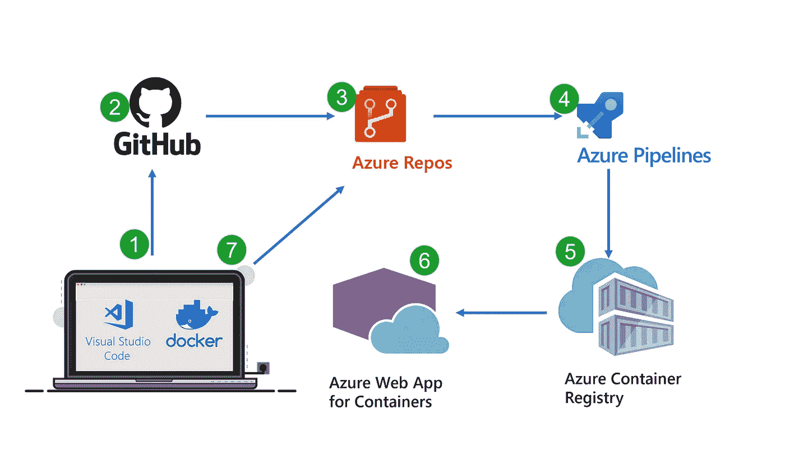
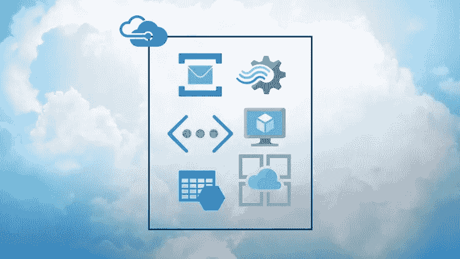
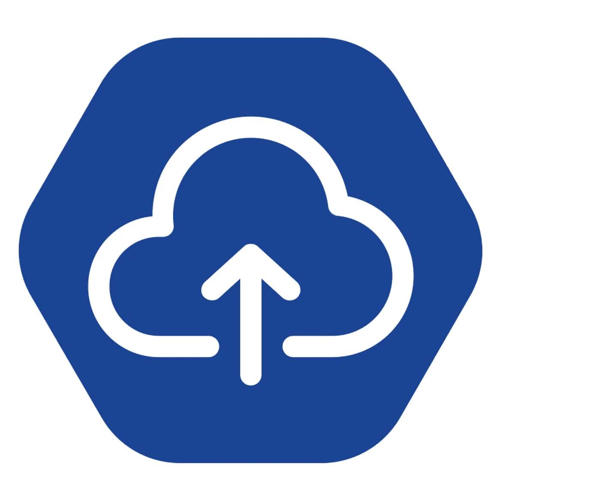

# 2023 年我最喜欢的免费微软 Azure 云课程初学者学习

> 原文：<https://medium.com/javarevisited/my-favorite-free-microsoft-azure-cloud-courses-for-beginners-to-learn-in-2020-3418524bb531?source=collection_archive---------0----------------------->

## 2023 年从零开始学习微软 Azure，成为 Azure 认证开发者和架构师的最佳免费课程。

大家好，[云计算](/javarevisited/5-best-cloud-computing-courses-to-learn-in-2020-f5f091159401)是软件开发人员急需的技能，也是必不可少的，但云计算也带来了疑问。其中， [AWS](https://www.java67.com/2018/05/top-5-amazon-web-services-or-aws-courses-to-learn-online.html) ， [Google Cloud](https://www.java67.com/2020/07/5-free-courses-to-learn-google-cloud-platform-and-concepts.html) ，[微软 Azure](https://javarevisited.blogspot.com/2019/07/top-5-courses-to-crack-azure-architecture-technologies-certification-az-300-exam.html) ，你应该先学哪个？

鉴于 AWS 是最受欢迎的公共云平台，学习 Azure 有意义吗？嗯，我认为学习 Azure cloud 非常有意义，特别是如果你正在寻找技术和金融领域的工作，因为微软在企业界拥有最大的市场份额。

微软的云服务做得很好；他们已经成功创建了服务，例如通过数据中心测试、部署、构建和管理应用程序。

微软正在改变云计算的不同元素，通过所有这些数据中心和高速互联网，我们正在探索新的边界。事情的进展真是不可思议，但我们需要跟上新技术。

如果你想学习微软 Azure 的概念和服务，并寻找免费的在线培训课程和班级，那么你来对地方了。过去，我曾分享过免费和付费课程来学习[micro fot Azure](https://javarevisited.blogspot.com/2020/09/top-5-courses-to-learn-microsoft-azure.html)、 [AWS](https://javarevisited.blogspot.com/2020/05/top-5-amazon-web-services-aws-courses-for-beginners-and-experienced-programmers.html) 和[谷歌云平台](https://javarevisited.blogspot.com/2019/07/top-5-google-cloud-platform-gcp-courses-certifications-online.html)，今天，我将分享免费课程来学习微软 Azure 平台。

我们从 [Udemy](https://javarevisited.blogspot.com/2019/08/top-10-udemy-courses-and-certifications-for-programmers.html) 、Coursera、YouTube、 [Pluralsight](https://javarevisited.blogspot.com/2017/12/top-10-pluralsight-courses-java-and-web-developers.html) 等地方整理并精选了最好的免费微软 Azure 在线课程。这些课程将为你提供关于微软 Azure 云服务和功能的深刻见解。每门课程都专注于某个学习领域，所以你亲自看一看所有这些课程是非常重要的。我们将为您提供一个简短的课程描述，当然，它可以为您提供课程的概要、内容以及课程背后的愿景。

顺便说一下，如果你不介意花几美元学习像微软 Azure 平台这样的有用技能，并寻找更全面和深入的课程来学习 Azure 服务，那么我也建议你在 Udemy 上查看 Scott Duffy 的[**AZ-300/AZ-303 Azure Architecture Technologies Exam Prep 2023**](https://click.linksynergy.com/deeplink?id=JVFxdTr9V80&mid=39197&murl=https%3A%2F%2Fwww.udemy.com%2Fcourse%2F70534-azure%2F)课程。是学习 Azure 云平台最全面的课程之一。

<https://click.linksynergy.com/deeplink?id=JVFxdTr9V80&mid=39197&murl=https%3A%2F%2Fwww.udemy.com%2Fcourse%2F70534-azure%2F>  

# 2023 年学习微软 Azure 云的 6 门最佳免费在线课程

在不浪费你更多时间的情况下，她是学习微软 Azure 云平台的最好的免费在线课程，来自 Udemy、T2、YouTube 和其他流行的在线学习网站。我们已经从所有的免费课程中挑选出了最好的，下面是我们的清单:

## 1.[使用微软 Azure 开始使用云计算](https://click.linksynergy.com/deeplink?id=JVFxdTr9V80&mid=39197&murl=https%3A%2F%2Fwww.udemy.com%2Fcourse%2Fcloud-computing-using-microsoft-azure%2F) (Udemy)

本课程是为云计算领域的新手设计的。要开始学习本课程，你需要了解 IT 行业的基本知识，你不需要成为 IT 行业的一员。通过与业内人士交谈，你可以在互联网上轻松获得这些知识。

课程内容:

*   关于云
*   核心服务
*   定价、性能和安全性
*   蔚蓝阅读等。

这门课程将成为愿意学习的人的起步点。希望从事销售的人也可以从本课程中受益，本课程重点解释工作的技术概念，这样销售人员就可以看起来像一个拥有所有可用信息的老手。

**这里是加入本课程的链接** — [使用 Microsoft Azure 开始使用云计算](https://click.linksynergy.com/deeplink?id=JVFxdTr9V80&mid=39197&murl=https%3A%2F%2Fwww.udemy.com%2Fcourse%2Fcloud-computing-using-microsoft-azure%2F)

## 2.[微软 Azure 概念](https://click.linksynergy.com/deeplink?id=JVFxdTr9V80&mid=39197&murl=https%3A%2F%2Fwww.udemy.com%2Fcourse%2Flinux-academy-microsoft-azure-concepts%2F) (Udemy 免费教程)

本课程旨在为爱好者提供基本的概念学习。它没有任何先决条件，如果你想，现在就可以开始。

本课程从基本概念开始，例如，什么是云？从这里开始，它着重于一点一点地解释你如何在 azure 等上工作。

这个课程是严格的视觉化和概念化。您将获得云及其服务的概念性知识，这将有助于您进一步学习高级功能。

内容理所当然:

*   云简介
*   蔚蓝色和云
*   azure 服务简介
*   应用和解释

这个课程为你提供了一个非常有效的学习框架，帮助你解决高级 azure 学习中的复杂问题。此外，它还提供额外的功能和**动手实验室**的准入卡，以增强学习效果。课程会定期更新，因此您的所有疑问都会得到解答。

**这里是 FRE 参加这个课程的链接—** [**微软 Azure 概念**](https://click.linksynergy.com/deeplink?id=JVFxdTr9V80&mid=39197&murl=https%3A%2F%2Fwww.udemy.com%2Fcourse%2Flinux-academy-microsoft-azure-concepts%2F)

## 3.【Azure 入门 (Coursera 免费课程)

这是一个免费的 Coursera 课程，用于在线学习微软 Azure 平台的基础知识。在这门入门课程中，您将了解与计算、存储、网络和内存相关的基本 Microsoft Azure 服务。

您还将熟悉核心 Azure 主题，并练习基础设施组件的实现。以下是你将在本课程中学到的主要内容

*   如何使用 Azure 门户和创建自定义仪表板
*   如何创建和部署虚拟机
*   云安全的基础知识，包括网络安全组、防火墙和资源策略
*   Azure 云资源组和存储选项的基础知识

总的来说，Coursera 提供了一个很好的免费在线课程，学习云计算、云平台、微软 Azure 和云数据库等关键技能。该课程由 Learn2Quest 提供，由讲师 Kenny Mobley 讲授。

**这里是免费加入本课程的链接—**[**Azure 入门**](https://coursera.pxf.io/c/3294490/1164545/14726?u=https%3A%2F%2Fwww.coursera.org%2Flearn%2Fcloud-azure-intro)

除此之外，Coursera 还有微软的免费课程来学习 Azure 云平台，如 [**微软 Azure 云服务介绍**](https://coursera.pxf.io/c/3294490/1164545/14726?u=https%3A%2F%2Fwww.coursera.org%2Flearn%2Fmicrosoft-azure-cloud-services) 和 [**微软 Azure 服务和生命周期**](https://coursera.pxf.io/c/3294490/1164545/14726?u=https%3A%2F%2Fwww.coursera.org%2Flearn%2Fmicrosoft-azure-services-lifecycles) ，它们都是免费的，你可以在那里免费学习 Azure 的关键概念。

<https://coursera.pxf.io/c/3294490/1164545/14726?u=https%3A%2F%2Fwww.coursera.org%2Flearn%2Fmicrosoft-azure-services-lifecycles>  

这两个课程都是 [**微软 Azure 基础 AZ-900 考试准备专业**](https://coursera.pxf.io/c/3294490/1164545/14726?u=https%3A%2F%2Fwww.coursera.org%2Fspecializations%2Fmicrosoft-azure-fundamentals-az-900) 的一部分，是 Coursera 上最受欢迎的 Azure 专业之一，也是准备 AZ-900 或 Azure 基础考试的最佳计划。

<https://coursera.pxf.io/c/3294490/1164545/14726?u=https%3A%2F%2Fwww.coursera.org%2Fspecializations%2Fmicrosoft-azure-fundamentals-az-900>  

而且，如果你觉得 Coursera 的课程和认证有用，那么我也建议你加入 [**Coursera Plus**](https://coursera.pxf.io/c/3294490/1164545/14726?u=https%3A%2F%2Fwww.coursera.org%2Fcourseraplus) ，这是 Coursera 的一个订阅计划，让你可以无限制地访问他们最受欢迎的课程、专业、专业证书和指导项目。它每年花费大约 399 美元，但是它完全值得你的钱，因为你得到了无限的证书。

<https://coursera.pxf.io/c/3294490/1164545/14726?u=https%3A%2F%2Fwww.coursera.org%2Fcourseraplus>  

## 4. [AZ — 900 微软 Azure 基础](https://click.linksynergy.com/deeplink?id=JVFxdTr9V80&mid=39197&murl=https%3A%2F%2Fwww.udemy.com%2Fcourse%2Faz-900-azure-tutorial%2F) (Udemy 免费课程)

课程以纯学习为主，配以短视频授课。理论部分不是主要的重点，在这里你将应用你的知识。如果你有. net 技术和 C.

的知识，这个课程会更有意义。这个课程的目标受众是希望在云计算和 web 开发领域发展的人。

课程内容:

*   云概念和资源管理器
*   Azure 门户和活动目录
*   网络服务和创建虚拟机
*   无服务器计算
*   Azure 服务(数据库)

本课程将为你提供学习的便利，让你最终将 azure 用于你的日常目的。你将从一位在 IT 行业工作了很长时间的认证老师那里学到编程的感觉。本课程分为 13 节课，主要侧重于视觉学习。

**这里是免费报名这个课程的链接** — [AZ — 900 微软 Azure 基础](https://click.linksynergy.com/deeplink?id=JVFxdTr9V80&mid=39197&murl=https%3A%2F%2Fwww.udemy.com%2Fcourse%2Faz-900-azure-tutorial%2F)

## 5.[云游侠网](https://www.youtube.com/c/CloudrangerNetwork/) (Youtube 免费频道)

youtube 上的 Cloud ranger network 专门为您提供了 azure cloud 的课程。他们有从初学者到高级玩家的所有播放列表。

专注于视觉学习和实现。您将能够从实时实现中学到很多东西。

对于初学者，我们建议观看探索系列，它将为您提供一个良好的开端，让您在整个课程中从基础知识和服务学习到高级知识。它会给你一种课堂体验，因为你可以和来自不同行业的用户保持联系。他们不针对任何受众，而是专注于深度学习，希望你觉得有用。这是一门从初学者到进阶的引导课程，你将会学到这项技术的所有最新成果。

## 6.[微软 Azure:大图](https://pluralsight.pxf.io/c/1193463/424552/7490?u=https%3A%2F%2Fwww.pluralsight.com%2Fcourses%2Fmicrosoft-azure-the-big-picture)【plural sight 免费试用】

在本课程中，您将了解您的解决方案中可以使用的所有服务以及业务目标。这个课程对于那些想用自己的想法做大的网络开发者和商业爱好者来说非常有帮助。微软的云服务做得非常好，了解这些服务可以帮助你解决任何现代问题。这门课程将为初学者提供一个良好的开端，因为它涵盖了许多主题。

课程内容:

*   云计算和应用代码
*   数据存储和处理
*   创建网络和进一步操作
*   安全性

这些视觉演示会给你一个更大的画面和一个参考点，帮助你正确看待事物。本课程取自 Pluralsight，它通常只提供高级课程，请在免费试用期内学习。

**这里是加入本课程的链接**——[微软 Azure:大图](https://pluralsight.pxf.io/c/1193463/424552/7490?u=https%3A%2F%2Fwww.pluralsight.com%2Fcourses%2Fmicrosoft-azure-the-big-picture)

顺便说一句，你需要一个 Pluralsight 会员才能观看这个课程，费用大约是每月 29 美元或每年 299 美元。如果你能负担得起，那么我向你强烈推荐这份订阅，因为它不仅提供了这门课程，还提供了 7000 多门其他课程。或者，你也可以使用他们的 [**10 天免费试用**](https://pluralsight.pxf.io/c/1193463/424552/7490?u=https%3A%2F%2Fwww.pluralsight.com%2Flearn) 免费观看本课程。

<https://pluralsight.pxf.io/c/1193463/424552/7490?u=https%3A%2F%2Fwww.pluralsight.com%2Flearn>  

以上就是**学习微软 Azure** 并在 2023 年成为微软 Azure 认证云开发者的最佳免费在线课程。所有的课程都是在听取了一大群学习者和技术爱好者的反馈后选择的。

我们试图通过为您提供最好的课程来涵盖学习者的所有兴趣领域。希望您觉得它们有用，我们建议您亲自打开它们，以便更好地了解课程。

顺便说一下，如果你不介意花几块钱学习像微软 Azure 平台这样有用的技能，并寻找更全面和深入的课程来学习 Azure 服务，那么我也建议你在 Udemy 上查看 [**微软 Azure-初学者指南+AZ-900-更新的 2023**](https://click.linksynergy.com/deeplink?id=JVFxdTr9V80&mid=39197&murl=https%3A%2F%2Fwww.udemy.com%2Fcourse%2Fmicrosoft-azure-beginners-guide%2F) 课程。

<https://click.linksynergy.com/deeplink?id=JVFxdTr9V80&mid=39197&murl=https%3A%2F%2Fwww.udemy.com%2Fcourse%2Fmicrosoft-azure-beginners-guide%2F>  

这门课程不仅会帮助你学习 Azure 基础知识和核心服务，还会帮助你准备 Azure 基础知识——AZ 900 考试，这是标志你进入云计算世界的一个很好的方式。你也可以在 Udemy sales 上以 10 美元的价格购买这门课程，这种情况时有发生。

面向 IT 专业人员和 Java 程序员的其他 **Azure** **认证资源**

*   [破解 Azure 开发者助理考试的前 5 门课程](https://javarevisited.blogspot.com/2020/06/top-5-course-to-crack-Microsoft-Azure-Developer-Certification-Exam-AZ-203.html)
*   [如何破解 AWS 解决方案架构师考试](https://javarevisited.blogspot.com/2019/08/how-to-crack-aws-certified-solution-architect-exam.html)
*   [学习微软 Azure 概念的 5 门免费课程](https://www.java67.com/2020/07/5-free-courses-to-learn-microsoft-azure-cloud.html)
*   [如何破解 2023 年 AZ-103 Azure 行政考试](https://javarevisited.blogspot.com/2020/04/how-to-crack-microsoft-az-103-azure-administrator-associate-exam-certification.html)
*   [如何在 2023 年成为 Azure 解决方案架构师助理](https://javarevisited.blogspot.com/2020/04/how-to-crack-microsoft-azure-solution-architect-exam-az-300.html)
*   [通过 Azure 云架构考试的前 5 门课程](https://javarevisited.blogspot.com/2019/07/top-5-courses-to-crack-azure-architecture-technologies-certification-az-300-exam.html)
*   [2023 年通过 AZ-900 认证的前 5 名课程](https://javarevisited.blogspot.com/2020/02/top-5-courses-to-crack-az-900-microsoft-azure-fundamentals-certification-exam.html)
*   [学习 Docker 和 Kubernetes 的十大课程](https://dev.to/javinpaul/top-10-courses-to-learn-docker-and-kubernetes-for-programmers-4lg0)
*   [如何破解甲骨文 2023 年 Java 认证？](https://medium.freecodecamp.org/how-to-pass-oracles-java-certifications-a-practical-guide-for-developers-e9b607ba6173)
*   [10 门数据科学和机器学习认证课程](https://dev.to/javinpaul/10-data-science-and-machine-learning-courses-for-programmers-looking-to-switch-career-57kd)
*   [Pivotal 的 Spring 认证对工作和职业生涯有帮助吗？](https://javarevisited.blogspot.com/2017/07/does-spring-certification-help-in-job-and-career.html)
*   [微软 Azure 基础知识前 5 名模拟测试](https://javarevisited.blogspot.com/2020/02/top-5-AZ-900-exam-Azure-Fundamentals-certification-practice-tests-and-mock-exams-to.html)
*   [破解 Azure 云架构师(AZ-300)考试的前 5 门课程](https://javarevisited.blogspot.com/2019/07/top-5-courses-to-crack-azure-architecture-technologies-certification-az-300-exam.html#axzz6E6VuRMsx)
*   [通过 Azure 开发人员助理认证(AZ-203)的 5 门在线课程](https://javarevisited.blogspot.com/2020/06/top-5-course-to-crack-Microsoft-Azure-Developer-Certification-Exam-AZ-203.html)
*   [破解 AWS 解决方案架构师认证的 5 大课程](https://javarevisited.blogspot.com/2019/05/top-5-courses-to-crack-aws-solutions-architect-associate-certification-exam-SAA-C01.html#axzz5rHwAwycj)
*   [程序员前 5 名 AZ-900 模拟测试](https://javarevisited.blogspot.com/2020/02/top-5-AZ-900-exam-Azure-Fundamentals-certification-practice-tests-and-mock-exams-to.html)
*   [通过谷歌助理云工程师认证的前 5 门课程](https://javarevisited.blogspot.com/2019/07/top-5-google-cloud-platform-gcp-courses-certifications-online.html)
*   [如何通过 Spring Core Professional 5.0 认证](https://javarevisited.blogspot.com/2018/08/how-to-crack-spring-core-professional-certification-exam-java-latest.html)
*   [10 门学习数据结构和算法的免费课程](http://www.java67.com/2019/02/top-10-free-algorithms-and-data.html)
*   [如何成为 DevOps 工程师？](https://javarevisited.blogspot.com/2018/09/the-2018-devops-roadmap-your-guide-to-become-DevOps-Engineer.html)
*   [如何破解 Azure Fundamentals (AZ-900)认证](https://javarevisited.blogspot.com/2020/04/how-to-crack-microsoft-azure-fundamentals-certification-az-900-exam.html)
*   [OCAJP 和 OCPJP 考试 10 道免费样题](http://www.java67.com/2017/05/10-free-java-8-certification-sample-questions-OCAJP8-OCPJP8-Mock-Exams.html)

感谢您阅读本文。如果你觉得这些最好的免费微软 Azure 课程很有用，那么，请与你的朋友和同事分享。如果您有任何问题或反馈，请留言。

**附言** —如果你认真学习微软 Azure 平台，并寻找更全面、更深入的课程来学习 Azure 服务，那么我也建议你查看 Udemy 上的 [**微软 Azure —初学者指南+ AZ-900 —更新的 2023**](https://click.linksynergy.com/deeplink?id=JVFxdTr9V80&mid=39197&murl=https%3A%2F%2Fwww.udemy.com%2Fcourse%2Fmicrosoft-azure-beginners-guide%2F) 课程。

<https://click.linksynergy.com/deeplink?id=JVFxdTr9V80&mid=39197&murl=https%3A%2F%2Fwww.udemy.com%2Fcourse%2Fmicrosoft-azure-beginners-guide%2F> 