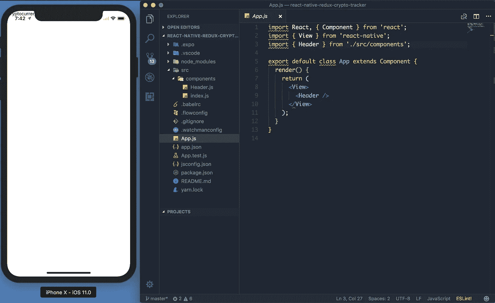
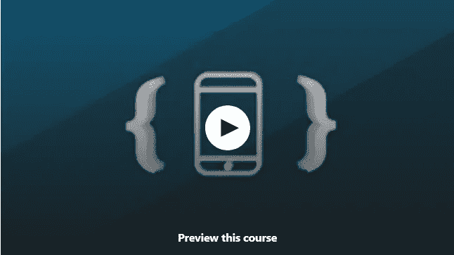

# 2023 年初学者学习的 8 门最佳免费 React 原生课程

> 原文：<https://medium.com/javarevisited/my-favorite-free-react-native-courses-for-beginners-in-2020-4629f5274eb6?source=collection_archive---------0----------------------->

## 这些是从 Udemy、Coursera 和 React Native 本身免费学习 React Native 的最佳在线课程。

对跨平台应用程序框架有巨大的需求，如 **React Native** 和 **Flutter** ，它们允许你用相同的代码库创建看起来像本地的 iOS 和 Android 应用程序。

许多人在 [Flutter](https://www.java67.com/2020/06/5-free-courses-to-learn-flutter-in-2020.html) 和 [React Native](/@javinpaul/top-5-react-native-courses-for-mobile-application-developers-b82febdf8a46) 之间感到困惑，但对我来说，选择是绝对明确的，因为 JavaScript。

React Native 允许您使用 JavaScript 创建[跨平台应用](/javarevisited/top-5-frameworks-to-create-cross-platform-android-and-ios-apps-in-2020-d02edf3d01f1)，这意味着您不需要学习像 [Dart](https://javarevisited.blogspot.com/2020/01/top-5-courses-to-learn-dart-programming.html) 这样的新编程语言，并且您可以使用您现有的 [JavaScript](https://www.java67.com/2019/01/best-websites-to-learn-javascript-online.html) 知识来使用 React Native 创建漂亮的原生应用。如果您现在想学习 React Native 并寻找最好的在线课程、培训材料、教程和课程，那么您来对地方了。

过去，我已经分享了最好的 React Native 课程 ，今天我将分享学习 React Native 的最好的免费在线培训课程。清单包括*既有 React Native 速成班*也有*深入学习 React Native*的综合课程。

[【React Native】](https://www.java67.com/2020/07/5-free-courses-to-learn-react-native-in.html)如果你愿意在世界上大多数设备上运行的开源软件上工作，这是一个惊人的选择。

如果你正在寻找开发商业应用或编码技能，React Native 可以提供一个接触可能塑造未来的惊人技术的机会。我们已经挑选出了可以帮助你获得技能的最佳课程。顺便说一句，如果你想深入学习 React Native 并寻找更全面的在线课程，我还建议你查看 Stephen Grider 的 React Native 指南。

这个 38 小时的课程将教你所有你需要学习的关于 React Native 的知识，包括 Hooks。它不是免费的，但是完全值得你花时间和金钱。我花了 10 美元买了这门课，现在还在看。

 [## 完整的 React Native + Hooks 课程[2023 版]

### 了解 React Native v0.62.2 的钩子、上下文和 React 导航。

udemy.com](https://click.linksynergy.com/deeplink?id=JVFxdTr9V80&mid=39197&murl=https%3A%2F%2Fwww.udemy.com%2Fcourse%2Fthe-complete-react-native-and-redux-course%2F) 

# 2023 年学习 React Native 的 8 门最佳免费在线课程

以下列表包括学习 React Native 的最佳精选课程。这些是最好的免费课程，来自像 Udemy T21、Coursera、哈佛、red 这样的网站，由像斯潘塞卡利这样的专家创建，受到全世界成千上万开发者的信任。它们也是完全免费的，你可以按照自己的时间表在家里在线学习 React Native。

## 1.[React Native 简介——构建加密货币追踪器应用](https://click.linksynergy.com/deeplink?id=JVFxdTr9V80&mid=39197&murl=https%3A%2F%2Fwww.udemy.com%2Fcourse%2Fultimate-react-native-with-firebase%2F) (Udemy)

这是免费学习 React native 的最佳 Udemy 课程之一。要开始这门课程，你只需要一台苹果电脑或视窗操作系统，以及学习的意愿。

本课程是专门为那些试图开发商业应用程序或获取库知识以改善应用程序外观的初级爱好者设计的。

您将在本课程中学到的内容:

*   在火基上操作
*   证明
*   用于样式的 [HTML](https://www.java67.com/2020/08/5-best-online-courses-to-learn-html-5.html) 和 [CSS](/javarevisited/top-5-advanced-css-courses-to-learn-flexbox-grid-and-sass-da8e37b09b1d)
*   将应用程序部署到大众

本课程每周更新，因此你在学习的同时也将获得其他人的观点。每个讲座将带你一步一步地通过应用程序开发的过程。

**此处是加入本课程的链接**—[React Native 简介—构建加密货币追踪器应用](https://click.linksynergy.com/deeplink?id=JVFxdTr9V80&mid=39197&murl=https%3A%2F%2Fwww.udemy.com%2Fcourse%2Fultimate-react-native-with-firebase%2F)

## 3. [React 原生教程—搭建聊天 App](https://click.linksynergy.com/deeplink?id=JVFxdTr9V80&mid=39197&murl=https%3A%2F%2Fwww.udemy.com%2Fcourse%2Flearn-react-native-by-building-a-chat-app%2F) (Udemy)

这门课也可以在 Udemy 上找到，这门课是在阅读了数百篇学生评论后选出来的。本课程分为讲座，讲座又分为特定主题的小视频。

这种学习也将为你提供概念实施的实时体验。

课程内容:

*   react 如何让应用变得快速和有吸引力
*   用于身份验证的 Mlab
*   提供外观和样式的库
*   操作[数据库](/javarevisited/7-free-courses-to-learn-database-and-sql-for-programmers-and-data-scientist-e7ae19514ed2)

在查询区，您可以轻松地与来自世界各地的人们提出的数千个问题进行互动。所有重要的问题都由导师亲自解答。

**这里是免费加入本课程的链接—** [**React 原生教程—搭建聊天 App**](https://click.linksynergy.com/deeplink?id=JVFxdTr9V80&mid=39197&murl=https%3A%2F%2Fwww.udemy.com%2Fcourse%2Flearn-react-native-by-building-a-chat-app%2F)

## 5. [CS50 的 React Native 移动应用开发](https://www.awin1.com/cread.php?awinmid=6798&awinaffid=631878&clickref=&p=%5B%5Bhttps%3A%2F%2Fwww.edx.org%2Fcourse%2Fcs50s-mobile-app-development-with-react-native)(哈佛— edX)

在 edX 和 [Youtube](https://www.youtube.com/channel/UC-SMdnyK2MBhLzw8zJXIWmQ) 上可以找到最好的免费 React Native 在线课程之一。本课程关注主题的实时覆盖和应用程序的开发。

以下是您将在本课程中学到的重要知识:

*   React native 的基础
*   数据与博览会
*   Redux
*   性能、部署和测试

如果你在学习的过程中不断开发应用程序，你可以通过这种方式学得更快。导师共享一个屏幕，在这个屏幕上他正在处理应用程序，而其他时候可以看到他用例子解释事情。

以下是参加本课程的链接— [CS50 使用 React Native 开发移动应用](https://www.awin1.com/cread.php?awinmid=6798&awinaffid=631878&clickref=&p=%5B%5Bhttps%3A%2F%2Fwww.edx.org%2Fcourse%2Fcs50s-mobile-app-development-with-react-native)

感谢掌握 JavaScript 的知识，因为这将有助于学习应用程序的设计部分。本课程分为 6 个主要部分，并在视频中进一步划分。你可以通过评论区进行互动，如果你幸运的话，其他学习者会互动并回答你。

## 4.[React 原生简介](https://reactnative.dev/docs/getting-started.html)(React 原生官方文档)

这是一个初学者级别的课程，有其他概念的例子。您将从为您提供关于库的深入细节的示例中学到很多东西。

本课程也侧重于设计部分，对框架进行完整的学习。从基础到应用程序的部署，您将全面了解 [React native](/javarevisited/top-5-react-native-courses-for-mobile-application-developers-b82febdf8a46?source=---------112------------------) 。

课程内容:

*   基本和设置
*   设计、互动和包容
*   连通性和指南

本课程没有分发视频讲座或主题来帮助你；你将被要求自己阅读和实现这些东西。评论家向初学者强烈推荐这门课程。

**这里是加入本课程的链接**——[React Native 简介](https://reactnative.dev/docs/getting-started.html)

## 5.反应本土基础知识(斯潘塞·卡利)

这可能是我在网上遇到的最好的 React Native 课程。斯潘塞·卡利实际上为初学者和高级 React 本地开发人员提供了几门课程，他的网站也提供了高级和免费的 React 本地课程。

整个网站旨在为学习者提供学习和实施事物的有益体验。这门课程将证明对初学者很有帮助。

这是学习者最推荐的课程之一，因为他们花了很大力气去理解这门课程的每一个细节。个人问题也会得到优先回答；高级账户优先。

以下是加入本课程的链接— [React Native Basics](https://www.reactnativebasics.com/)

免费课程足够好，可以从 React Native 开始，一旦你完成了，如果你喜欢斯潘塞·卡利的教学风格和课程材料，你可以升级到高级课程。非常感谢斯潘塞·卡利创造了这个令人敬畏的课程。

## 6.[使用 React Native 开发多平台移动应用](https://click.linksynergy.com/deeplink?id=JVFxdTr9V80&mid=40328&murl=https%3A%2F%2Fwww.coursera.org%2Flearn%2Freact-native)

这是从 Coursera 学习 React Native 的最好的免费课程之一，Coursera 是我最喜欢的在线学习门户之一。这门课程完全免费学习，除非你需要认证，否则你不需要支付任何费用。

本课程也是 Coursera 最受欢迎的[**React 专业化全栈 Web 开发的一部分**](https://click.linksynergy.com/deeplink?id=JVFxdTr9V80&mid=40328&murl=https%3A%2F%2Fwww.coursera.org%2Fspecializations%2Ffull-stack-react) ，它将教你如何使用 React Native 开发真正跨平台的原生 iOS 和 Android 应用

以下是您将在本课程中学到的重要内容:

1.  如何使用单一代码库创建面向多个平台的移动应用程序
2.  如何使用你的 [React](/@javinpaul?source=post_page-----fa02cd96cdf0----------------------) 和 [JavaScript 技能](/javarevisited/my-favorite-free-tutorials-and-courses-to-learn-javascript-8f4d0a71faf2)创建移动应用。
3.  如何利用 React Native 和 Expo SDK 的各种特性来构建真正跨平台的移动应用，
4.  使用 Redux 设计 React-Redux 应用程序的架构

这也是一门改变人生的课程，因为超过 25%完成这门课程的人已经开始了新的职业生涯，超过 *50%的人获得了实实在在的好处*比如升职和加薪。总的来说，2023 年学习 React Native 是一个很棒的免费课程。

**这里是加入本课程的链接**——[使用 React Native 开发多平台移动应用](https://click.linksynergy.com/deeplink?id=JVFxdTr9V80&mid=40328&murl=https%3A%2F%2Fwww.coursera.org%2Flearn%2Freact-native)

## 7.[反应原生导航](https://click.linksynergy.com/deeplink?id=JVFxdTr9V80&mid=39197&murl=https%3A%2F%2Fwww.udemy.com%2Fcourse%2Freact-native-complete-navigation%2F)【免费】

这是另一个学习 React Native 的有用的免费 Udemy 课程。本课程侧重于 React 本机导航，您将学习在 React 本机应用程序中构建不同类型的导航。

以下是您将在本课程中学到的重要内容:

1.  反应本地基础
2.  在 React 本机应用程序的屏幕之间导航
3.  构建菜单和堆栈导航器

在本课程中，您将通过内置 React 原生应用程序学习几种不同类型的导航选项。您将构建并查看菜单和导航在 [Android](/hackernoon/top-5-courses-to-learn-android-for-java-programmers-667e03d995b4) 和 [iOS](/javarevisited/top-5-online-courses-to-learn-ios-12-swift-in-2019-a35ae1be7b2b?source=---------22------------------) 平台上如何工作。

**以下是加入本课程的链接:——**[**React 原生导航**](https://click.linksynergy.com/deeplink?id=JVFxdTr9V80&mid=39197&murl=https%3A%2F%2Fwww.udemy.com%2Fcourse%2Freact-native-complete-navigation%2F)

## 8.[用 React Native 创建一个微型应用](https://click.linksynergy.com/deeplink?id=JVFxdTr9V80&mid=39197&murl=https%3A%2F%2Fwww.udemy.com%2Fcourse%2Fcreate-a-tiny-app-with-react-native%2F)【免费】

这是另一个学习 React Native 的免费项目课程。在这个 1 小时 40 分钟的免费课程中，您将学习如何从头开始创建一个小型 React 原生应用程序。

这款应用名为“**谁买单？”**在这个应用程序中，用户可以创建一个玩家名单，最后我们会随机挑选一个，并显示输家。

一路上你会学到**验证**、**祝酒**、状态与**上下文**，我们会使用**库**，安装**字体**等等。

这个免费的 React 本地课程是由一个有着 13 年经验的专业 React 开发人员教授的，他全职做 React 开发人员，兼职做教学工作。他为花旗、迪士尼、福克斯等大小公司开发了应用程序。

总的来说，从 React Native 开始是一个不错的免费小课程。

**这是加入这个免费课程的链接**——[用 React Native 创建一个小应用](https://click.linksynergy.com/deeplink?id=JVFxdTr9V80&mid=39197&murl=https%3A%2F%2Fwww.udemy.com%2Fcourse%2Fcreate-a-tiny-app-with-react-native%2F)

以上是关于 2023 年学习 React Native 的**最佳免费课程。正如我所说，React native 是应用程序开发的最佳框架之一。React Native 可以帮助您开发操作和访问现代技术网站和应用程序所需的技能。**

我们已经为你挑选了最好的课程，希望你能亲自检查一下，选择最适合你需要的课程。

其他**您可能想探索的有用编程资源**

*   [2023 年学习 Angular 的 5 门免费课程](http://www.java67.com/2018/01/top-5-free-angular-js-online-courses-for-web-developers.html)
*   [2023 年 5 门机器学习和数据科学课程](http://javarevisited.blogspot.sg/2018/03/top-5-data-science-and-machine-learning-online-courses-to-learn-online.html)
*   [学习大数据、Hadoop 和 Spark 的 5 门免费课程](http://www.java67.com/2018/05/top-5-free-big-data-courses-to-learn-Hadoop-Apache-Spark.html)
*   [2023 年 7 门免费学习 Bootstrap 的课程](/javarevisited/7-free-courses-to-learn-bootstrap-for-web-designers-and-developers-5135215648f1?source=extreme_sidebar---------0-2----------------------)
*   [2023 年网络开发者路线图](https://hackernoon.com/the-2019-web-developer-roadmap-ab89ac3c380e)
*   [我最喜欢的免费课程学棱角反应](/javarevisited/10-free-angular-and-react-js-courses-from-udemy-and-coursera-best-of-lot-e67f7d811e6b)
*   [2023 年我最喜欢学的书 react . js](/javarevisited/5-best-react-js-books-for-beginners-and-experienced-web-developers-e7b90b1ab9d2)
*   [面向开发者的 10 门免费 Docker 课程](https://hackernoon.com/10-free-courses-to-learn-docker-for-programmers-and-devops-engineers-7ff2781fd6e0)
*   [2023 年学习 React.js 的 10 门免费课程](/javarevisited/top-10-free-courses-to-learn-react-js-c14edbd3b35f)
*   [2023 年学习区块链的 5 大免费课程](http://www.java67.com/2018/02/5-free-blockchain-technology-courses.html)
*   [2023 年 7 门免费课程学习 Nodejs](/javarevisited/7-free-courses-to-learn-node-js-in-2020-2f1dd6722b49)
*   [2023 年 App 开发者应该学会的 10 项技能](/javarevisited/10-frameworks-and-libraries-mobile-application-developers-can-learn-in-2020-e0b91391cade)
*   [2023 年学习打字稿的 10 门免费课程](/javarevisited/top-10-free-typescript-courses-to-learn-online-best-of-lot-44bce9da41d1)
*   [我最喜欢的学习 iOS app 开发的免费课程](/javarevisited/my-favorite-free-courses-to-learn-ios-app-development-f172e7d3ba5d)
*   [初学者学习 Python 的 15 门免费课程](/swlh/5-free-python-courses-for-beginners-to-learn-online-e1ca90687caf)
*   [2023 年学习 Kubernetes 的 7 门免费在线课程](/javarevisited/7-free-online-courses-to-learn-kubernetes-in-2020-3b8a68ec7abc)

感谢您阅读本文。如果你喜欢这些免费的 React Native 在线课程，那么请分享给你的朋友和同事。如果您有任何问题或反馈，请留言。

如果你想深入学习 React Native 并寻找更全面的在线课程，那么我也推荐你去看看 Stephen Grider 的 React Native 指南。

 [## 完整的 React Native + Hooks 课程[2023 版]

### 了解 React Native v0.62.2 的钩子、上下文和 React 导航。

udemy.com](https://click.linksynergy.com/deeplink?id=JVFxdTr9V80&mid=39197&murl=https%3A%2F%2Fwww.udemy.com%2Fcourse%2Fthe-complete-react-native-and-redux-course%2F)