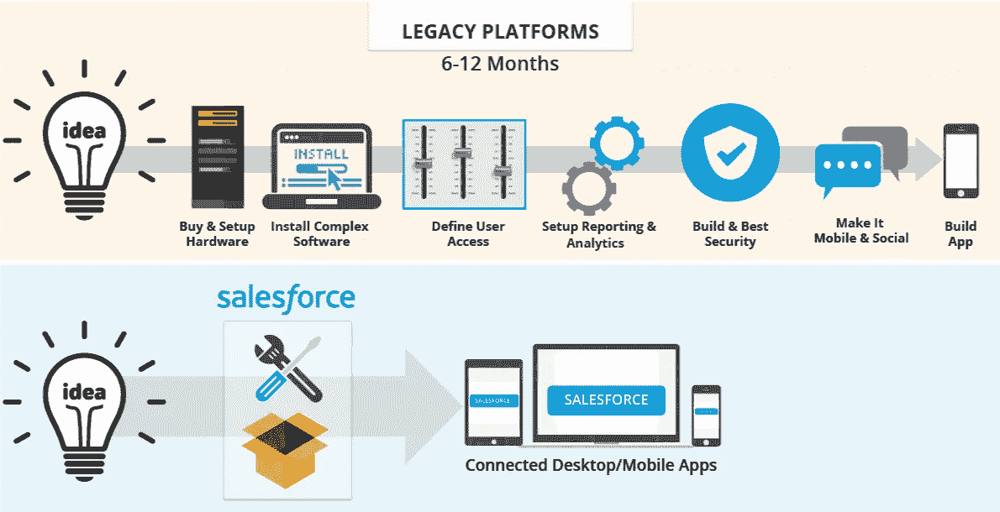
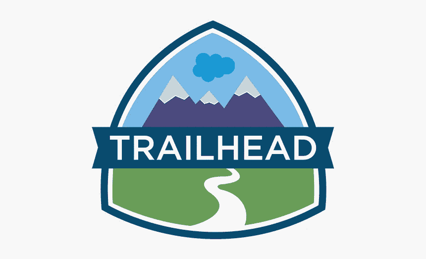

# 2023 年我最喜欢的免费 SalesForce 新手培训课程

> 原文：<https://medium.com/javarevisited/my-favorite-free-salesforce-training-courses-for-beginners-in-2021-3b6d5836605d?source=collection_archive---------0----------------------->

## Udemy 和 Trailhead 的免费在线课程，2023 年学习 Salesforce 云平台的初学者

image_credit — Edureka

大家好，如果你想学习 Salesforce 云平台并寻找免费培训课程，那么你来对地方了。早些时候，我已经分享了[最佳 Salesforce 发展课程](/javarevisited/7-best-courses-to-learn-salesforce-development-in-2021-1f861a0c2fff)，在这篇文章中，我将分享从头开始学习 Salesforce 的免费培训课程。

如果您不知道，Salesforce 平台是一个用于定制应用程序设计、分析功能和新功能的独特平台。在人们看来，一个没有背景的人也能在 Salesforce 工作。

如果引导得当，难怪他们能很快获得成功。牢记这一点，我们挑选了许多免费的在线培训课程，为您提供学习 Salesforce 所需的所有指导和实践。

如果您从我们的列表中选择课程并诚实地遵循程序，您可以轻松获得 Salesforce 开发人员认证。清单上的所有课程都是免费的，是在考虑了专家和学习者的评论后选择的。

如果您是因为改变职业选择而来到这里，我们也为您提供课程；一定要亲自去检查清单上的每一门课。

过去，我曾分享过在线培训课程以通过 [Salesforce 开发人员](https://javarevisited.blogspot.com/2020/06/top-5-salesforce-development-certification-training-courses.html)、[管理员](https://javarevisited.blogspot.com/2020/06/top-5-courses-to-crack-salesforce-administrator-certification.html)和 [App Builder](https://javarevisited.blogspot.com/2020/06/top-5-courses-to-crack-salesforce-platform-app-builder-certification-exam.html) 认证，你们中的许多人要求免费在线课程以学习 Salesforce 基础知识，这就是我在本文中分享的内容。

顺便说一句，如果你不介意花点钱学习像 Salesforce 这样有价值的技能并寻找更全面的课程，那么我也建议你看看 Udemy 上的 [**Salesforce 初学者发展培训**](https://click.linksynergy.com/deeplink?id=JVFxdTr9V80&mid=39197&murl=https%3A%2F%2Fwww.udemy.com%2Fcourse%2Flearn-salesforce-apex-basic-to-advance%2F) 课程。

<https://click.linksynergy.com/deeplink?id=JVFxdTr9V80&mid=39197&murl=https%3A%2F%2Fwww.udemy.com%2Fcourse%2Flearn-salesforce-apex-basic-to-advance%2F>  

# 2023 年学习 Salesforce 的 7 个最佳免费在线课程和网站

这里是我们的最佳课程列表，可以帮助您免费学习 Salesforce。该列表包括来自 Udemy 和 Trailhead 等网站的课程，这些网站是 Salesforce 为初学者和高级 Salesforce 用户提供的免费在线培训平台。我还打算不断地向此列表添加更多免费的 Salesforce 培训资源，因此如果您遇到任何好的免费 Salesforce 课程，请随时提出建议。

## 1.[通过简单的步骤学习 sales force](https://click.linksynergy.com/deeplink?id=JVFxdTr9V80&mid=39197&murl=https%3A%2F%2Fwww.udemy.com%2Fcourse%2Flearn-salesforce-in-easy-steps-and-get-certified%2F)

开始学习这门课程，没有特别的要求，虽然 HTML 的基础知识可以帮助你学习。所有的学习材料和练习材料将由导师提供；你不需要去别的地方练习你所学的东西。

加上所有那些资料和源代码都是可以下载的。

您将在本课程中学到以下内容:

*   Salesforce 简介
*   构建数据模型
*   导入记录
*   设置
*   建筑逻辑
*   安全性和共享
*   审计和监控
*   报告
*   仪表板
*   数据管理

课程分为小步骤，你需要通过小讲座和更小的视频一步步学习。本课程分为 46 节课。本课程不涉及任何进阶学习，如果你想进阶学习，转到其他课程会很有帮助。

**这里是加入这个免费在线课程的链接** — [通过简单的步骤学习 sales force](https://click.linksynergy.com/deeplink?id=JVFxdTr9V80&mid=39197&murl=https%3A%2F%2Fwww.udemy.com%2Fcourse%2Flearn-salesforce-in-easy-steps-and-get-certified%2F)

## 2. [Salesforce 入门课程和职业规划](https://click.linksynergy.com/deeplink?id=JVFxdTr9V80&mid=39197&murl=https%3A%2F%2Fwww.udemy.com%2Fcourse%2Fsalesforce-certification1%2F)

要注册这门课程，你需要有一个互联网连接，没有其他先决条件。本课程将为您提供使用 Salesforce 的视角。如果你想转行，我们推荐这门课程。在整个课程中，你将被彻底地引导去了解你的选择。

课程内容:

*   Salesforce 简介
*   认证指南
*   工作机会
*   额外内容

Salesforce 是您可以用来开发定制应用程序的最佳工具之一。为什么不获取知识，并将其用于我们自己的利益。此外，这是专家推荐的，因为它是一个值得学习的工具，可以帮助你挣更多的钱。

**这是加入免费 Salesforce 课程**——[sales force 入门课程](https://click.linksynergy.com/deeplink?id=JVFxdTr9V80&mid=39197&murl=https%3A%2F%2Fwww.udemy.com%2Fcourse%2Fsalesforce-certification1%2F)的链接

## 3.[面向初学者的 Salesforce 开发](https://click.linksynergy.com/deeplink?id=JVFxdTr9V80&mid=39197&murl=https%3A%2F%2Fwww.udemy.com%2Fcourse%2Fsalesforce-development-for-beginners%2F)

要开始这门课程，有几个先决条件，如有编程的基本知识；你不需要有编程经验，但至少你必须处于初级阶段。

如果你选择学习本课程，你可以很快成为 Salesforce 的程序员。

他们会教你关于 Apex 编程的知识，并指导你如何提高和应用他们课程中学到的知识。

课程内容:

*   编程入门
*   顶点和变量
*   Apex 原始数据类型
*   奖金部分

虽然这不是一个基于项目的学习课程，但是您仍然可以获得足够的经验来开始开发人员的旅程。

**以下是加入免费 Salesforce 课程的链接** — [Salesforce 初学者开发](https://click.linksynergy.com/deeplink?id=JVFxdTr9V80&mid=39197&murl=https%3A%2F%2Fwww.udemy.com%2Fcourse%2Fsalesforce-development-for-beginners%2F)

## 4. [Trailhead Salesforce 培训课程](https://trailhead.salesforce.com/en/home)

Trailhead 是 Salesforce 的免费在线学习平台，教人们如何使用 Salesforce。通过使用 Trailhead，初学者可以发展 Salesforce 技能，高级用户可以成为 Salesforce 专家。

您还可以从他们的网站上获得与 Salesforce 相关的不同证书，甚至包括付费证书。你所要做的就是在他们的网站上注册课程，你会得到所有的练习和学习材料。你可以从这个网站获得有价值的简历证书。这个网站不仅为你提供学习，你还可以抓住来自世界各地的机会。你可以带着你的疑问和专业人士联系，看看其他人在做什么。他们有完整的计划，你可以用它来启动你的职业生涯。虽然没有太多基于项目的学习，但是你会获得足够深入的知识，你可以自己开发应用程序。除了课程相关的问题，你可以联系职业指导和机会的专业人士。

## 5.[sales force 简介](https://click.linksynergy.com/deeplink?id=JVFxdTr9V80&mid=39197&murl=https%3A%2F%2Fwww.udemy.com%2Fcourse%2Fsalesforcecertification%2F)

如果您是初学者，本课程将对您有所帮助，因为它涵盖了 Salesforce 和云计算。开始这门课程不需要有任何编程经验。这是将指导你学习过程的课程之一。导师是从业多年的专业人士，他的经验会在很多方面让你受益。

本次免费 Salesforce 课程的内容:

*   Salesforce 简介
*   云概念
*   后续步骤
*   Salesforce 资源

本课程分为讲座和主题视频。你可能不会获得基于项目的学习，但你会在整个学习过程中获得专业的洞察力，这也是有益的。现有开发者不应该上这门课，这门课是专为初学者设计的。

**这里是加入这个免费课程**—[sales force 简介](https://click.linksynergy.com/deeplink?id=JVFxdTr9V80&mid=39197&murl=https%3A%2F%2Fwww.udemy.com%2Fcourse%2Fsalesforcecertification%2F)的链接

## 结论

市场需要 Salesforce 技能，学习 salesforce 就是学习使用一种工具。如果您想要一个安全的选项来获得认证以供将来使用，您应该选择 Salesforce。

这些课程是由专业人士推荐的，我们根据学习者的经验进行了审核，然后为您列出了一个清单。我们希望你在这篇文章中找到了你想要的东西。

其他**认证资源**面向 **IT 专业人员**和 Java 程序员

*   [如何成为 Azure 认证管理员助理？](https://javarevisited.blogspot.com/2020/04/how-to-crack-microsoft-az-103-azure-administrator-associate-exam-certification.html)
*   [如何破解 Azure Fundamentals (AZ-900)认证](https://javarevisited.blogspot.com/2020/04/how-to-crack-microsoft-azure-fundamentals-certification-az-900-exam.html)
*   [程序员前 5 名 AZ-900 模拟测试](https://javarevisited.blogspot.com/2020/02/top-5-AZ-900-exam-Azure-Fundamentals-certification-practice-tests-and-mock-exams-to.html)
*   [学习 Docker 和 Kubernetes 的十大课程](https://dev.to/javinpaul/top-10-courses-to-learn-docker-and-kubernetes-for-programmers-4lg0)
*   [准备 AWS 系统管理员认证的前 5 门课程](https://javarevisited.blogspot.com/2020/06/top-5-aws-certified-sysops-admin-associate-certification-exam.html)
*   [成为 GCP 云工程师助理的前 5 门课程](https://javarevisited.blogspot.com/2020/05/top-5-course-to-crack-google-cloud-associate-cloud-engineer-certification-exam.html)
*   [破解 AWS 解决方案架构师专业考试前 5 门课程](https://javarevisited.blogspot.com/2020/04/top-5-course-to-crack-aws-solution-architect-professional-sap-c01-certification-exam.html)
*   [如何通过 AZ-300 Azure 解决方案架构师考试？](https://javarevisited.blogspot.com/2020/04/how-to-crack-microsoft-azure-solution-architect-exam-az-300.html)
*   [5 次免费的 AWS 解决方案架构师实践测试](https://javarevisited.blogspot.com/2019/08/top-5-free-aws-solution-architect-Associate-certification-dumps-practice-questions.html)
*   [学习 Docker 和 Kubernetes 的十大课程](https://dev.to/javinpaul/top-10-courses-to-learn-docker-and-kubernetes-for-programmers-4lg0)
*   [通过谷歌助理云工程师认证的前 5 门课程](https://javarevisited.blogspot.com/2019/07/top-5-google-cloud-platform-gcp-courses-certifications-online.html)
*   [通过 AWS 云从业者认证的前 5 门课程](https://javarevisited.blogspot.com/2020/02/top-5-courses-to-crack-aws-certified-cloud-practitioner-exam-certification-clf-c01.html)

感谢您到目前为止阅读本课程。如果您认为这些*免费的 Salesforce 在线培训课程*有用，请与您的朋友和同事分享。如果您有任何问题或反馈，请留言。

**P. S.** —如果你不介意花几个钱学习像 Salesforce 这样有价值的技能，并寻找更全面的课程，那么我也建议你看看 Udemy 上的 [**Salesforce 初学者发展培训**](https://click.linksynergy.com/deeplink?id=JVFxdTr9V80&mid=39197&murl=https%3A%2F%2Fwww.udemy.com%2Fcourse%2Flearn-salesforce-apex-basic-to-advance%2F) 课程。它包含 14 个小时的高质量课程，你只需花 10 美元就可以在每月举行的 Udemy 销售上购买。

<https://click.linksynergy.com/deeplink?id=JVFxdTr9V80&mid=39197&murl=https%3A%2F%2Fwww.udemy.com%2Fcourse%2Flearn-salesforce-apex-basic-to-advance%2F> 