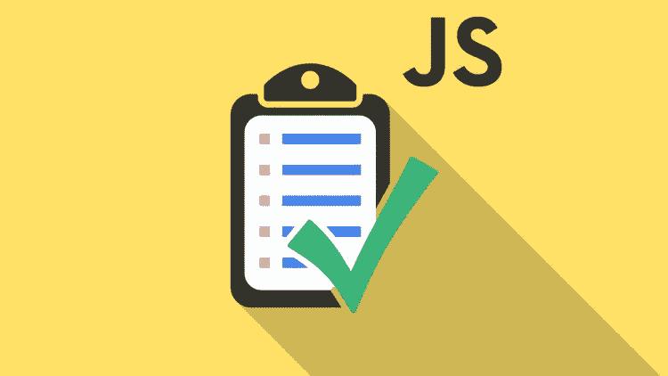
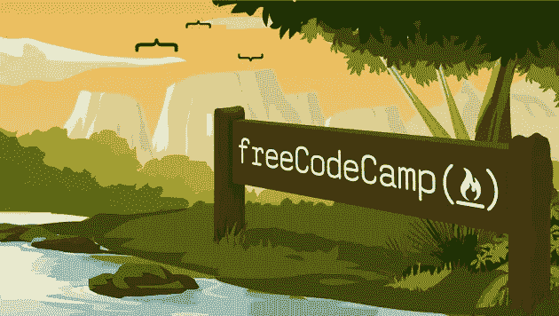
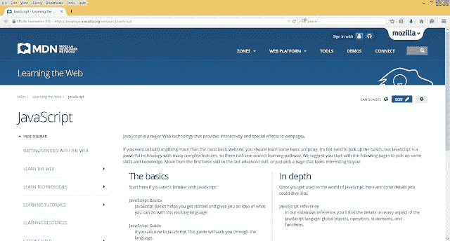
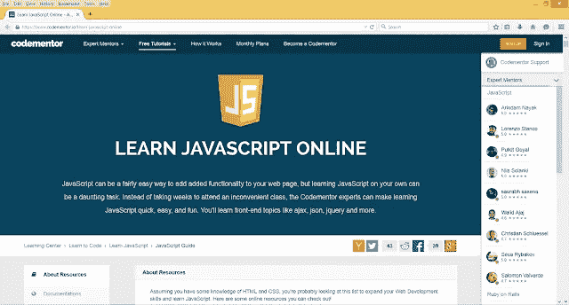

# 免费学习 JavaScript 编码的 10 个最佳网站——最好的

> 原文：<https://medium.com/javarevisited/my-favorite-free-tutorials-and-courses-to-learn-javascript-8f4d0a71faf2?source=collection_archive---------0----------------------->

## 这些都是最好的免费在线学习 JavaScript 编程的网站、平台和地方。

大家好，我们很幸运地生活在一个科技的世界里，在这里你可以获得很多资源，比如免费的教程、书籍和课程来学习我们想要的任何东西，这都要感谢互联网。

你可以真正地学习任何你想学的东西，而不需要花太多的钱，比如编码、T2、网络开发、移动开发、T4、数据库、云计算、机器学习或任何你想学的东西。

但是，如果你对 Web 开发的美好世界感兴趣，如果你想学习 JavaScript，有很多网站提供免费的 JavaScript 教程，你可以免费在线学习 JavaScript。

你不需要支付任何费用，但你必须有一个良好的互联网连接，以充分利用这些在线资源。

在这么多提供免费教程、文章、博客、视频和播客的网站中，我选择了这十个网站和免费教程推荐给任何想学习 JavaScript 的人。我主要是一名 Java 开发人员，但我也通过这些网站学习了 JavaScript。

如果你在想，我为什么需要学习 JavaScript？因为我通常必须开发基于 Java 的 web 应用程序，它使用 [Servlet 和 JSP](http://java67.blogspot.com/2012/10/servlet-jsp-interview-questions-answer-faq-experience.html) 进行服务器端脚本编写，但是我们总是使用 [JavaScript](http://www.java67.com/2017/12/10-programming-languages-to-learn-in.html) 和 [jQuery](http://www.java67.com/2018/04/top-5-free-jquery-courses-for-web-developers.html) 进行客户端脚本编写。

我首先承认我的 JavaScript 技能不如 Java，这就是为什么我总是在寻找一些好的资源，通过跟随视频教程和这些互动网站来不断学习和更新我在 JavaScript 上在线学习的东西。

# 免费在线学习 JavaScript 的 10 个最佳地点

这里是我整理的六个免费在线学习 JavaScript 的网站列表。它包括互动网站、官方资源、好书和其他资源。

## 1.免费 JavaScript 课程和教程@ Udemy

这是在线学习的最佳场所之一。你将获得所有最新技术和编程语言的免费在线课程和教程，如 [Java](https://medium.freecodecamp.org/these-are-the-best-free-courses-to-help-you-learn-java-8-and-java-9-a7615c8644ab) 、 [Spring](https://javarevisited.blogspot.com/2016/12/top-5-spring-and-hibernate-training-courses-java-jee-programmers.html) 、[数据结构和算法](http://www.java67.com/2019/02/top-10-free-algorithms-and-data.html)、Selenium、REST 等。它提供免费和付费资源。

这里有一些有用的课程和 JavaScript 教程，可以帮助您了解一些有趣的技术:

1.  **完整的 JavaScript 课程 2023:构建真实的项目！(** [**链接**](https://click.linksynergy.com/deeplink?id=JVFxdTr9V80&mid=39197&murl=https%3A%2F%2Fwww.udemy.com%2Fthe-complete-javascript-course%2F) **)**
2.  **Web 开发者训练营(** [**链接**](https://click.linksynergy.com/deeplink?id=JVFxdTr9V80&mid=39197&murl=https%3A%2F%2Fwww.udemy.com%2Fthe-web-developer-bootcamp%2F) **)**
3.  **JavaScript Bootcamp —构建真实世界应用(** [**链接**](https://click.linksynergy.com/deeplink?id=JVFxdTr9V80&mid=39197&murl=https%3A%2F%2Fwww.udemy.com%2Fthe-ultimate-javascript-course-build-real-world-apps2018%2F) **)**
4.  **JavaScript Essentials(免费)(** [**链接**](https://click.linksynergy.com/deeplink?id=JVFxdTr9V80&mid=39197&murl=https%3A%2F%2Fwww.udemy.com%2Fjavascript-essentials%2F) **)**

付费资源也非常便宜，你可以在他们经常发生的闪购期间以 9.99 美元的价格购买。它充满了一些伟大的老师，如科尔特-斯蒂尔，罗伯-帕西瓦尔，斯蒂芬-格里德，何塞-马西亚尔-波尔蒂利亚，约翰-珀塞尔等。

## 2.JavaScript、HTML 和 CSS @ Coursera 编程基础

这是另一个很棒的在线学习网站，有很多免费的 JavaScript 教程和课程。它由斯坦福大学教授吴恩达和达芙妮·柯勒创建，提供课程、专业和在线学位。

Coursera 最好的部分是它提供了斯坦福大学、伦敦大学、密歇根大学、科罗拉多大学、伦敦帝国理工学院等大学的在线课程。

它提供免费和付费的在线课程和专业课程。许多 Coursera 课程是免费审核的，这意味着如果你不需要认证，你可以免费观看。

以下是我最喜欢的免费 JavaScript 课程和教程:

1.  [**JavaScript、HTML 和 CSS 编程基础**](https://coursera.pxf.io/c/3294490/1164545/14726?u=https%3A%2F%2Fwww.coursera.org%2Flearn%2Fduke-programming-web)
2.  [**面向 Web 开发者的 HTML、CSS、JavaScript**](https://coursera.pxf.io/c/3294490/1164545/14726?u=https%3A%2F%2Fwww.coursera.org%2Flearn%2Fhtml-css-javascript-for-web-developers)
3.  [**与 JavaScript 的交互性**](https://coursera.pxf.io/c/3294490/1164545/14726?u=https%3A%2F%2Fwww.coursera.org%2Flearn%2Fjavascript)

Coursera 还为你提供认证，你可以在你的 LinkedIn 个人资料中展示，但你需要付费。

如果你觉得 Coursera 的课程很有用，因为它们是由知名公司如**谷歌**、 **IBM** 、**亚马逊**和世界上最好的大学创建的，我建议你加入 Coursera 的订阅计划 [**Coursera Plus**](https://coursera.pxf.io/c/3294490/1164545/14726?u=https%3A%2F%2Fwww.coursera.org%2Fcourseraplus)

这种单次订阅可以让你无限制地访问他们最受欢迎的**课程**、**专业化**、**专业证书**和**指导项目**。它每年花费大约 399 美元，但是它完全物有所值，因为你可以获得无限的证书。

## 3.[JavaScript @ Codecademy 简介](https://bit.ly/learnjavascriptwithcodecademy)

总之，这是最好的免费 JavaScript 教程之一，我就是从这个网站学的 JavaScript。它也是在线学习新技术的最佳平台之一，但可能是在线学习 JavaScript 的最佳网站。

尽管目前，[**CodeCademy**](https://www.pjatr.com/t/TUJGR0lLR0JHRklJSkhCR0ZISk1N?url=https%3A%2F%2Fwww.codecademy.com%2Fpro%2Fmembership)**提供了 [Java](http://www.java67.com/2018/08/top-10-free-java-courses-for-beginners-experienced-developers.html) 、 [Git](https://hackernoon.com/top-5-free-courses-to-learn-git-and-github-best-of-lot-2f394c6533b0) 、 [UNIX 命令行](https://hackernoon.com/top-5-free-linux-courses-for-programmers-4a433b4edade)和其他几门课程，但它因一门交互式 JavaScript 课程而出名，可以根据自己的进度在线学习。**

**你可以通过查看注册的学生人数来衡量这门课程的受欢迎程度，目前， **5M+** ，这对于任何在线免费课程来说都是一个非常高的数字。**

**你可以在这里注册这个免费的 JavaScript 教程。**

****

**简而言之，CodeCademy 是在线学习 JavaScript 的最佳网站之一，你应该利用这一点。**

**顺便说一句，如果你喜欢 CodeCademy 平台，那么你也可以加入 CodeCademy PRO ，这是一个面向程序员的高级订阅。它的年费大约是每月 15.99 美元，提供所有 CodeCademy 的内容、课程、测验和项目。你可以用这个来赚，练习&**

** [## 学习编码最简单的方法:Pro | Codecademy

### 文件锁图标通过独家课程、测验和额外练习内容了解更多信息。体验图标构建真实…

bit.ly](https://bit.ly/codecademypro)** 

## **4.JavaScript 30**

**这是免费学习 JavaScript 的最佳网站之一。它包含许多免费的 JavaScript 教程和课程。由 Wes Bos 创建，这是 JavaScript 开发人员的一个很好的免费资源。查看 [JavaScript 30](https://javascript30.com/) ，用有趣的小项目升级你的 JavaScript 游戏。**

**我最喜欢的免费 JavaScript 教程的一些亮点是:**

**30 天普通 JS 编码挑战**

**用 30 个教程在 30 天内建造 30 件东西**

**没有框架×没有编译器×没有库×没有样板文件**

** [## JavaScript 30

### 用香草 JS 在 30 天内用 30 个教程构建 30 个东西

javascript30.com](https://javascript30.com/)** 

## **5.Pluralsight JavaScript 课程**

**学习任何技术最好的网站之一，像 Web 开发、移动开发这样的技能，还有像 [Java](http://www.java67.com/2018/08/top-10-free-java-courses-for-beginners-experienced-developers.html) 这样的编程语言，像 [Angular](https://javarevisited.blogspot.com/2018/06/top-10-angular-tutorials-and-courses-for-web-developers.html) 、 [React](https://javarevisited.blogspot.com/2018/10/the-2018-react-developer-roadmap.html) 、 [Spring Framework](https://javarevisited.blogspot.com/2018/06/top-6-spring-framework-online-courses-Java-programmers.html) 、 [Hibernate](https://javarevisited.blogspot.com/2018/01/top-5-hibernate-and-jpa-courses-for-java-programmers-learn-online.html) 等 Web 开发框架。**

**该网站还有很多从初学者角度学习 JavaScript 的有用课程，比如:**

1.  **[**利亚姆·麦克伦南的 JavaScript 基础**](http://pluralsight.pxf.io/c/1193463/424552/7490?u=https%3A%2F%2Fwww.pluralsight.com%2Fcourses%2Fjscript-fundamentals)**
2.  **[**杰西·利伯蒂**](http://pluralsight.pxf.io/c/1193463/424552/7490?u=https%3A%2F%2Fwww.pluralsight.com%2Fcourses%2Fjavascript-from-scratch) 从头开始写 JavaScript**
3.  **[**凯尔·辛普森《JavaScript 编程基础》**](http://pluralsight.pxf.io/c/1193463/424552/7490?u=https%3A%2F%2Fwww.pluralsight.com%2Fcourses%2Fjavascript-programming-basics)**

**它现在也收购了 CodeSchool，早期它允许你通过做来学习网络技术。我用这个网站很快就学到了很多很酷的东西。**

**顺便说一句，你需要一个 [**Pluralsight 会员**](https://pluralsight.pxf.io/c/1193463/424552/7490?u=https%3A%2F%2Fwww.pluralsight.com%2Fpricing) 才能加入这个课程，费用大约是每月 29 美元，每年 299 美元(14%的折扣)，但它完全值得。另类。你也可以使用他们的 [**10 天免费试用**](https://pluralsight.pxf.io/c/1193463/424552/7490?u=https%3A%2F%2Fwww.pluralsight.com%2Flearn) 免费观看本课程。**

****

## **6.JavaScript 指南@ freecodecamp.org**

**这是最棒的社区网站之一，它将帮助你免费学习编码，构建真实世界的项目，并获得一份开发人员的工作。**

**它有大量的互动教程和练习，可以学习 [JavaScript](https://www.freecodecamp.org/) 、[数据结构](https://hackernoon.com/10-data-structure-algorithms-and-programming-courses-to-crack-any-coding-interview-e1c50b30b927)和[算法](https://medium.freecodecamp.org/these-are-the-best-free-courses-to-learn-data-structures-and-algorithms-in-depth-4d52f0d6b35a)、[前端开发](https://hackernoon.com/the-2019-web-developer-roadmap-ab89ac3c380e)等等。**

**由 Quincy Larson 创建，这是开始您的编码之旅的一个非常好的地方。他们甚至有一个很大的脸书群( [freecodecampearth](https://www.facebook.com/groups/freeCodeCampEarth/) )，你可以在那里提问并分享你的学习经验，他们的[媒体](https://medium.com/u/504c7870fdb6?source=post_page-----31e13bbdbb5c----------------------)出版物 [freeCodeCamp](https://medium.com/u/8b318225c16a?source=post_page-----31e13bbdbb5c----------------------) 是最重要的编程文章媒体出版物。**

**正如昆西·拉森(Quincy Larson)在评论中指出的，freeCodeCamp 也有一个 T2 的 YouTube 频道，有数百门免费课程，主题包括 Python、Git、GraphQL、SQL、数据库模式设计和许多高级主题。其中许多长达 10 多个小时——在一个没有广告的视频中。完美开始你的旅程。**

****

## **7.Mozilla 开发者网络上的 JavaScript 教程**

**Mozilla 是一个认真的学习者，一个喜欢做自己的事情的程序员，只想阅读理论并在自己的系统中尝试例子。**

**不像[代码学院](/javarevisited/10-best-free-codecademy-courses-for-beginners-to-learn-programming-and-software-development-in-2022-a354e9a2c43e?source=user_profile---------17----------------------------)和教育团队，这不是互动的，但你会找到详细的信息。Mozilla 也是所有 JavaScript 信息的官方来源。**

****

**我使用这个网站作为许多 JavaScript 的参考文档，它包含了丰富的信息，你也可以这样做。**

## **8.卡塔斯@代码战斗**

**JavaScript 可能是向网页添加附加功能的一种相当简单的方法，但是自学 JavaScript 可能是一项艰巨的任务。CodeCombat 是一个让学生在玩真实游戏的同时学习计算机科学的平台。**

**课程已经过专门的测试，在课堂上表现出色，甚至由以前很少或没有编程经验的老师来完成。它有一些[网络开发课程](https://javarevisited.blogspot.com/2018/02/top-5-online-courses-to-learn-web-development.html)学习 JavaScript 的基础知识。**

****

**总之，一个更适合初学者和学生的网站。通过遵循 JavaScript 独特的风格，您可以很快学会 JavaScript 的基础知识。**

## **9.在线学习 JavaScript—code mentor**

**另一个提供交互式 JavaScript 教程的伟大网站。这个网站提供了一个为期 4 周的学习 JavaScript 的课程，事实上，正如课程所声称的那样，是为了掌握 JavaScript。您不仅将了解核心 JavaScript，还将了解其他著名的 JavaScript 库和相关概念，如 ajax、 [json](https://javarevisited.blogspot.com/2017/02/how-to-consume-json-from-restful-web-services-Spring-RESTTemplate-Example.html) 、 [jQuery](https://hackernoon.com/top-5-free-jquery-courses-for-web-developers-best-of-lot-9f65a1ff25b6) 、 [angular js](https://hackernoon.com/top-10-angular-courses-tutorials-and-books-for-web-developers-e8a8e2c490c2) 等等。**

****

**以上就是这些**在线学习 JavaScript 的最佳网站**。如果你真的想学习 JavaScript，那么你不能只是高枕无忧，而是要开始开发一些现实世界的项目，开始使用流行的 JavaScript 库，如 [jQuery](http://www.java67.com/2018/04/top-5-free-jquery-courses-for-web-developers.html) 、 [Angular](https://javarevisited.blogspot.com/2018/06/5-best-courses-to-learn-angular.html) 、 [React](https://javarevisited.blogspot.com/2018/10/the-2018-react-developer-roadmap.html) 和 [Node JS](http://javarevisited.blogspot.sg/2018/01/top-5-nodejs-and-express-js-online-courses-for-web-developers.html) ，以精通业界对 JavaScript 开发人员的期望。**

**如果你喜欢看书甚于网站，那么你也从阅读[**Head First JavaScript**](https://www.amazon.com/Head-First-JavaScript-Programming-Brain-Friendly/dp/144934013X?tag=javamysqlanta-20)开始，从头开始学习 JavaScript 的最佳书籍之一。**

**

[**头 JavaScript**](https://www.amazon.com/Head-First-JavaScript-Programming-Brain-Friendly/dp/144934013X?tag=javamysqlanta-20) ，** 

## **10.JavaScript 简介:Educative.io 的第一步**

**如果你不知道， [**Educative.io**](https://www.educative.io?affiliate_id=5073518643380224) 是另一个在线学习平台，因其基于文本的交互式学习课程而获得了很大的吸引力。阅读一般比观看快，如果你更喜欢阅读文本而不是观看视频，那么这就是结账的平台。**

**它有一些为编码面试做准备的最好的课程，像[寻找编码面试:编码问题的模式](https://www.educative.io/collection/5668639101419520/5671464854355968?affiliate_id=5073518643380224)和[寻找系统设计面试](https://www.educative.io/collection/5668639101419520/5649050225344512?affiliate_id=5073518643380224)。**

** [## 系统设计面试

### 系统设计问题已经成为软件工程面试过程的标准部分。在这些方面的表现…

www.educative.io](https://www.educative.io/collection/5668639101419520/5649050225344512?affiliate_id=5073518643380224) 

它还有很多像这样的免费资源 [**免费 JavaScript 教程**](https://www.educative.io/courses/introduction-to-javascript-first-steps?affiliate_id=5073518643380224) 学习必备技术。

你可以免费注册这门课程，但如果你喜欢充分利用平台，我建议你购买 [*Educative 无限会员*](https://www.educative.io/subscription?affiliate_id=5073518643380224) ，每月 14.90 美元(现在打五折)，对于一个需要不断学习的程序员和软件工程师来说，完全值得。

这是一篇 [**介绍 JavaScript 的文章，完全面向初学者**](https://www.educative.io/courses/introduction-to-javascript-first-steps?affiliate_id=5073518643380224) **。**它将提供语言的基础。主题包括变量、运算符、函数、数组、对象和循环。学完本课程后，您应该准备好通过高级课程或其他资源进一步学习。本课程不需要安装。

代码可以直接从课程中查看和运行。该课程由全栈工程师 Arnav Agarwal 创建。Arnav 参加过一个编码训练营，并在另一个训练营教过书。

**以下是免费参加本课程(教程)的链接**:

 [## JavaScript 简介:第一步

### 这是给完全初学者的 JavaScript 介绍。它将提供语言的基础。主题…

www.educative.io](https://www.educative.io/courses/introduction-to-javascript-first-steps?affiliate_id=5073518643380224) 

## 11.零到掌握学院(ZTM)

这是 2023 年学习 JavaScript 和 Web 开发的另一个好地方。 [**ZTM 学院**](https://academy.zerotomastery.io/a/aff_fvgz1fnn/external?affcode=441520_zytgk2dn) 由著名 Udemy 讲师、网络开发专家 Andrew Negaoie 创建。

ZTM 有一些最全面和最新的 JavaScript 和 web 开发培训材料，但不幸的是它们不是免费的。尽管如此，我还是在这里提到了它，以防万一，如果你想看一看。

以下是 2023 年**网站开发人员最好的零到精通课程**:

1.  JavaScript Web 项目:构建您的 Portfoli 的 20 个项目
2.  [**JavaScript:高级概念**](https://academy.zerotomastery.io/a/aff_szrvh5nm/external?affcode=441520_zytgk2dn)
3.  [**2023 年网络开发者全集:零到精通**](https://academy.zerotomastery.io/a/aff_r1613hhr/external?affcode=441520_zytgk2dn)

这个平台最好的一点是，你只需要一个会员就可以访问所有这些 JavaScript 课程，以及许多其他高质量的在线课程。

你所需要的是一个 ZTM 会员资格来观看这个课程，每月花费大约 39 美元，但也提供了许多像这样超级吸引人和有用的课程。你也可以使用优惠券代码 *FRIENDS10 在这门课程或你选择的任何订阅上获得 10%的折扣*。

 [## 学习需求技能。被录用。推进你的事业。|零到精通

### 最终你是唯一能控制它的人。呵呵......每个人学习的速度不同，但是学生…

academy.zerotomastery.io](https://academy.zerotomastery.io/a/aff_c0gnlvf7/external?affcode=441520_zytgk2dn) 

以上就是 2023 年**免费学习 JavaScript 的最佳地点**。根据 StackOverFlow 的调查，JavaScript 是学习编码的最佳和最受欢迎的编程语言，如果你想成为一名程序员，你应该学习 JavaScript 来编码，这些平台和课程是很好的起点。

如果你认为还有另外一个网站是在线免费学习 JavaScript 的好资源，那么请在评论区提出建议，我很乐意把它列入这个列表。

学习 JavaScript 和 jQuery 的更多在线资源

*   Web 开发者路线图([路线图](https://hackernoon.com/the-2019-web-developer-roadmap-ab89ac3c380e))
*   面向对象 JavaScript 的原理([书](https://www.amazon.com/Principles-Object-Oriented-JavaScript-Nicholas-Zakas/dp/1593275404?tag=javamysqlanta-20))
*   学习和掌握 JavaScript 的 5 本书([丛书](http://javarevisited.blogspot.sg/2017/02/top-5-javascript-books-to-learn-best-of-lot-must-read.html))
*   JavaScript 开发人员的五本 jQuery 书籍([书籍](http://javarevisited.blogspot.sg/2013/07/top-5-jquery-books-for-web-developers-learn.html))
*   2 个免费在线学习编码的网站([见此](http://javarevisited.blogspot.com/2015/06/2-websites-to-learn-coding-in-java-online-free.html))
*   5 个免费学习 SQL 的好网站([看这里](http://javarevisited.blogspot.com/2015/06/5-websites-to-learn-sql-online-for-free.html))
*   5 免费的 JavaScript 书籍和 PDF ( [下载](http://www.java67.com/2015/10/top-5-free-javascript-books-download-pdf-read-online.html))
*   更好地学习 JavaScript 的 10 门课程([门课程](https://javarevisited.blogspot.com/2018/06/top-10-courses-to-learn-javascript-in.html#axzz5mvsv6B1j)

感谢您读到这里，如果您有任何问题或反馈，请发表评论。如果你喜欢这篇文章和书，那么请分享给你的朋友和同事。

祝你有美好的一天，快乐学习 JavaScript:)

除了 JavaScript，如果你正在寻找关于如何成为一名 Web 开发者的完整指导，那么我建议你也去看看 [**Web 开发者路线图**](https://hackernoon.com/the-2019-web-developer-roadmap-ab89ac3c380e) ，这是一个学习 Web 开发的全面且必须知道的资源。

我几乎肯定错过了一些非常棒的教程和网站。欢迎在评论中建议更多有用的 JavaScript 网站。乐于在此补充。

## 你可能喜欢的其他文章

 [## 面向初学者和有经验的 Web 开发人员的 10 大有价值的书籍和课程——最好的

### 大家好，如果你对学习 Angular 框架感兴趣，这是最流行的 JavaScript 框架之一…

medium.com](/javarevisited/top-10-angular-books-and-courses-for-beginners-and-experienced-web-developers-best-of-lot-9a2dae87f04c)  [## 我最喜欢的初学者和有经验的开发人员的角度课程

### 如果你是一个网页开发人员或者想学习网页开发的 Angular，并且正在寻找一些优秀的…

medium.com](/javarevisited/10-courses-to-learn-angular-for-web-development-6da1bd2856dc)  [## 2023 年要学习的 10 个 JavaScript 框架和库——最好的

### 2023 年前端开发者能学到的最好的 JavaScript 框架，有相关课程的链接。

medium.com](/javarevisited/10-javascript-frameworks-and-libraries-to-learn-in-2020-best-of-lot-5f61f86c60b4)**