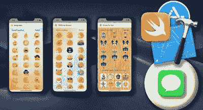
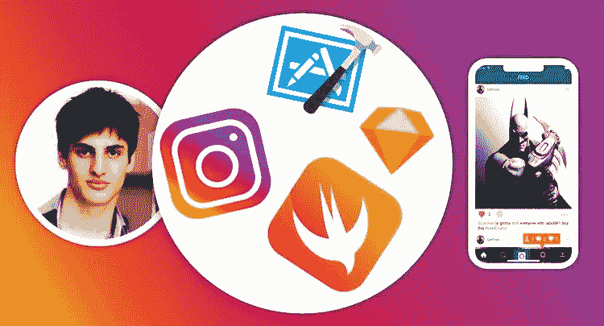

# 2023 年学习应用程序开发的 7 个最佳 iOS 和 Swift 项目

> 原文：<https://medium.com/javarevisited/my-favorite-ios-app-project-ideas-for-beginners-a873e7e6f88a?source=collection_archive---------0----------------------->

## 这些是我最喜欢的 iOS 项目，你可以在 2023 年建立这些项目来学习 iOS 应用程序开发，并提供相关资源的链接以供进一步学习。

大家好，如果你在 2023 年学习 iOS 应用程序开发，并寻找一些项目想法来更好地学习概念和应用现有知识，那么你来对地方了。

之前，我已经分享了 [**最佳 iOS 和 Swift 课程**](/javarevisited/top-5-online-courses-to-learn-ios-12-swift-in-2019-a35ae1be7b2b?source=---------56------------------) ，今天，我将谈论 5 个您可以用来学习 iOS app 开发并掌握几个关键概念的酷项目，如 UI、Core ML、Speech to ext 和其他 API。

由于人们在做项目时遇到困难是很常见的，我也包括了免费和付费的指导课程，你可以参加这些课程来一步一步地学习如何做这些项目。

对于那些试图创建 iOS 应用程序的人来说，有许多编程语言可以做到这一点，如 [React Native](https://www.java67.com/2020/07/5-free-courses-to-learn-react-native-in.html) 、 [Flutter](/javarevisited/my-favorite-flutter-and-dart-programming-courses-for-beginners-9e8355710d78) 、Objective-C，当然最著名的是 [Swift](/javarevisited/top-5-online-courses-to-learn-ios-12-swift-in-2019-a35ae1be7b2b?source=---------22------------------) 。这种编程语言是苹果公司用来创建 iOS 和 macOS 应用程序的官方语言，语法非常容易学习和实现。

学习 swift 或任何[编程语言](/javarevisited/top-5-programming-languages-for-mobile-app-development-in-2021-19a1778195b8)的更好方法是通过练习创建尽可能多的项目，而不仅仅是在 youtube 上观看课程或阅读书籍和文章，称自己为 iOS 开发者，除非你已经创建了许多应用程序，即使它们并不复杂。

在本文中，您将获得许多项目创意，开始使用 Swift 创建您自己的 iOS 应用程序，并通过项目丰富您的简历，以便您可以在以后向您的员工展示您的技能以获得一份工作，或者如果您想成为一名自由开发人员，拥有一个好的投资组合。

顺便说一句，如果你对 iOS 和 Swift 编程语言完全陌生，那么我强烈建议你参加一个全面的 iOS 课程，如 Udemy 上 Angela Yu 博士的[**iOS&Swift—**](https://click.linksynergy.com/deeplink?id=JVFxdTr9V80&mid=39197&murl=https%3A%2F%2Fwww.udemy.com%2Fcourse%2Fios-13-app-development-bootcamp%2F)完整的 iOS 训练营课程。该课程是学习 iOS 的最佳课程，受到超过 19 万学生的信赖。

 [## iOS & Swift -完整的 iOS 应用程序开发训练营

### 欢迎来到完整的 iOS 应用程序开发训练营。我的 iOS 课程获得了超过 39，000 个五星评级和 4.8 分的平均分…

udemy.com](https://click.linksynergy.com/deeplink?id=JVFxdTr9V80&mid=39197&murl=https%3A%2F%2Fwww.udemy.com%2Fcourse%2Fios-13-app-development-bootcamp%2F) 

# 2023 年 7 个最佳 iOS 和 Swift 初学者项目

在不浪费你更多时间的情况下，这里有一个面向初学者的 iOS 项目创意列表。你可以做这个项目来自学 [Swift](https://www.java67.com/2019/03/5-free-courses-to-learn-swift.html) 和 [iOS 开发](https://javarevisited.blogspot.com/2019/01/top-5-ios-developer-course-to-learn-ios.html)。我经常说，没有比做项目更好的学习方法了，但是大多数时候，我们在做项目的时候也会停滞不前。这就是为什么我也包含了免费和付费课程的链接，你可以加入这些课程来完成这些项目。

## 1.创建天气应用程序

对于想通过构建项目来学习 iOS 应用开发的初学者来说，这是我最喜欢的想法之一。在这个项目中，你必须创建一个天气应用程序，可以像 24 小时预报一样随时向你显示你所在位置的当前天气，并且能够选择任何位置，并通过一个漂亮的用户界面获得他们当时的天气。

这个项目已经创建，如果您在代码或获取数据并将其显示在应用程序屏幕上的 API 中遇到困难，或者在开发周期中遇到任何困难，您可以在名为 [**的 udemy 课程中参考它。**](https://click.linksynergy.com/deeplink?id=JVFxdTr9V80&mid=39197&murl=https%3A%2F%2Fwww.udemy.com%2Fcourse%2Fmake-weather-app-in-swift-5-ios-13-alamofire-swiftyjson%2F)

如果你喜欢看 Youtube 学习，那么你也可以看这个 Youtube 视频，学习如何使用 iOS 和 Swift 开发天气应用程序。

## 2.开发一个金融应用程序

对于初学者和中级程序员来说，这是另一个有趣的 iOS 项目想法。在这个项目中，你将建立一个财务应用程序，它有三个页面第一页是你的余额或信用卡中有多少钱，在屏幕底部有一些图表。

第二页有一个选项，可以添加你的信用卡交易，无论你花了钱还是收到了钱，第三页有日期和你花了多少钱。

该项目可能有点复杂，特别是添加图表，因为你需要使用第三方服务来实现这一点，所以如果你创建这个项目陷入困境，你可以参考本课程 [**学习在 udemy 上建立一个金融应用**](https://click.linksynergy.com/deeplink?id=JVFxdTr9V80&mid=39197&murl=https%3A%2F%2Fwww.udemy.com%2Fcourse%2Flearn-to-build-a-financial-app-in-ios%2F) 的解决方案和更多信息。

## 3.用 BERT 创建一个 iOS 问答应用

很多年前，我在学习 Java 小考，准备 Java 认证的时候，为了备考，我创建了一个小考 app。是的，这是一个精简版的 [Whizlabs 模拟器](https://shareasale.com/r.cfm?b=1551042&u=880419&m=43514&urllink=&afftrack=)，功能不丰富，但工作良好。

它不仅帮助我学习 Swing，还帮助我[准备 Java 认证](/javarevisited/java-certifications-how-to-crack-it-practical-tips-to-prepare-ocajp-and-ocpjp-exams-538f6fe36b37)，这也是我成功通过考试的原因之一，从那时起，我已经使用多种技术构建了同一个应用程序，你也可以这样做。

作为这个项目的一部分，你将使用来自苹果和 iOS SDK 的 BERT、Core ML 和 Speech API 开发一个问答应用程序。它从应用程序开发人员的角度探索了机器学习的世界。它解释了单词嵌入的世界，这是文本处理背后的基本技术。

该项目之前在 udemy 的一门课程中创建，名为 [**使用 BERT**](https://click.linksynergy.com/deeplink?id=JVFxdTr9V80&mid=39197&murl=https%3A%2F%2Fwww.udemy.com%2Fcourse%2Fbuilding-ios-question-answering-app-with-bert%2F) 构建 iOS 问答应用程序，并有逐步指导，因此如果您不能使用该应用程序，您可以将其作为您项目的参考。

如果你喜欢从 Youtube 视频中学习，这里有一个 Youtube 视频，你可以按照它来构建这个 iOS 项目

## 4.将脸书登录添加到您的应用程序

众所周知，脸书拥有超过 20 亿的活跃用户，这意味着在你的应用程序中添加一个社交登录按钮将使其更加专业，所以在这个项目中，你必须创建任何你喜欢的类型，然后将脸书登录按钮添加到该应用程序中，使其真正社交化。

这个项目应该很容易，一点也不复杂，但初学者可能会在实现这个选项方面有些困难，为此，你可以在 udemy 上观看这个名为 [**如何将脸书登录添加到你的应用程序**](https://click.linksynergy.com/deeplink?id=JVFxdTr9V80&mid=39197&murl=https%3A%2F%2Fwww.udemy.com%2Fcourse%2Fhow-to-add-facebook-login-to-your-app-spritekit-swift-ios%2F) 的课程，了解更多信息。

## 5.构建贴纸应用程序

这个项目非常简单，你所要做的就是创建一个底部有良好用户界面的贴纸选择应用程序，你需要创建一个部分，在那里你可以推广你之前在应用程序商店创建和发布的应用程序。

该项目应该简单明了，但出于某种原因，你发现实施这些东西有困难，那么你可能不得不观看这个名为 [**的课程，在 udemy 中为 iOS**](https://click.linksynergy.com/deeplink?id=JVFxdTr9V80&mid=39197&murl=https%3A%2F%2Fwww.udemy.com%2Fcourse%2Fbuild-a-customisable-sticker-app-for-ios-in-app-purchase%2F) 构建一个可定制的贴纸应用程序，以解决你的问题。

## 6.使用 AutoLayout 为 iOS 构建 Spotify 克隆

这是初学者学习 iOS 应用开发可以建立的另一个有趣的项目。如果你不知道，Spotify 是最受欢迎的音乐应用之一，全球有数百万用户在使用。

您将学习在 swift 5 和 Xcode 12 中构建 Spotify 应用程序。我们将深入到授权设置，让用户登录。

如果你被卡住了，那么你可以看看这个 Youtube 视频来寻找灵感。

## 7.构建 Instagram 克隆

这是学习 app 开发的又一个有趣的项目思路。因为我们都使用过 Instagram，所以我们熟悉它的核心功能，比如关注人物、新闻订阅、卷轴、上传照片和视频等。

当你建立一个你用过的项目时，你只需要关注技术部分，而不是功能项目，这使得任务简单了 50%,这就是我喜欢建立 Whatsapp clone、Instagram clone 或 Twitter clone 的原因。

虽然你不需要建立一个完整的 Instagram 应用程序，因为这将花费你数年的时间，但你应该尝试用最少的功能来建立第一个 cut，如上传照片、分享、关注他人和新闻订阅。

这本身并不是一项简单的任务，你会遇到很多障碍，比如如何保存数据，如何检索数据，如何让你的应用程序快速、安全、美观，这是你学习和获得应用程序开发经验的地方。

不过，如果你得到了一些东西或需要指导，你可以随时查看这个 Instagram Firestore 应用程序克隆课程 ，讲师会一步一步地教你如何使用 iOS 和 Swift 构建 Instagram 应用程序。我喜欢这种基于项目的课程，并强烈推荐给任何认真学习 app 开发的人。

这就是这篇关于**的文章的全部内容。对于初学者来说，学习使用 Swift 编程语言构建 iOS 应用程序开发**的最佳 iOS 和 Swift 项目。如果你想要创建更多的项目，那么这里有一个名为 [**的课程，在 Swift**](https://click.linksynergy.com/deeplink?id=CuIbQrBnhiw&mid=39197&murl=https%3A%2F%2Fwww.udemy.com%2Fcourse%2Fios-14-swift-chat-application-like-whatsapp-viber-telegram%2F) 中构建 64 个 iOS 项目。构建 50 个应用程序和 14 个游戏！对于以下项目:

*   1.计算器应用程序
*   2.口袋妖怪应用程序
*   3.井字游戏应用
*   4.餐厅菜单应用程序
*   5.动物园应用
*   6.Twitter 应用程序
*   7.核心 ML 应用程序
*   8.使用 Firebase 的 WhatApp

这个 30 小时的基于项目的 iOS 课程非常适合初学者。你不仅要构建这些类型的应用程序，还要学习如何将它们上传到 AppStore，以便其他人可以下载和使用它们。

 [## 在 Swift 中构建 64 个 iOS9 项目。构建 50 个应用程序和 14 个游戏！

### 建立 64 个 iOS 项目来提升你的职业生涯。将这些项目添加到你的 LinkedIn 或简历中。在…开始你的职业生涯

udemy.com](https://click.linksynergy.com/deeplink?id=CuIbQrBnhiw&mid=39197&murl=https%3A%2F%2Fwww.udemy.com%2Fcourse%2Fbuild-64-ios9-projects-in-swift-build-50-apps-and-14-games%2F) 

学习新技术和构建移动应用程序需要尽可能多地接触创建项目，以利用该语言的力量，增强您的知识和技能。

您可能喜欢的其他**应用开发编程资源**

*   [2023 年学习颤振的前 5 门课程](https://javarevisited.blogspot.com/2019/07/top-5-online-training-courses-to-learn-flutter.html)
*   [2023 年学习 React Native 的五大课程](/hackernoon/top-5-react-native-courses-for-mobile-application-developers-b82febdf8a46)
*   [面向初学者的 8 个 Python 项目思路](/javarevisited/8-projects-you-can-buil-to-learn-python-in-2020-251dd5350d56)
*   [应用开发者应该学习的 10 项技术](https://javarevisited.blogspot.com/2020/01/10-things-mobile-app-developers-can-learn.html)
*   Java 和 Web 开发人员应该学习的 10 个框架
*   [为有经验的开发者提供的 10 门免费 Java 课程](http://www.java67.com/2018/08/top-10-free-java-courses-for-beginners-experienced-developers.html)
*   [针对初学者的 10 门免费 React 本土课程](/javarevisited/my-favorite-free-react-native-courses-for-beginners-in-2020-4629f5274eb6)
*   [学习飞镖编程的前 5 门课程](https://javarevisited.blogspot.com/2020/01/top-5-courses-to-learn-dart-programming.html)
*   [2023 年学习 React JS 的 5 大课程](https://javarevisited.blogspot.com/2018/08/top-5-react-js-and-redux-courses-to-learn-online.html)
*   [面向 Java 开发人员的 5 门 Android 在线培训课程](https://javarevisited.blogspot.com/2017/12/top-5-android-online-training-courses-for-Java-developers.html)

感谢您阅读本文。如果你喜欢这些*面向初学者的 iOS 应用程序开发项目*，那么请与你的朋友和同事分享它们。如果您有任何问题或反馈，请留言。

**P. S.** —如果你此刻只想做一件事来启动你的 iOS 应用程序开发之旅，就去参加 Udemy 上 Angela Yu 博士的**[**iOS&Swift——完整的 iOS bootcamp**](https://click.linksynergy.com/deeplink?id=JVFxdTr9V80&mid=39197&murl=https%3A%2F%2Fwww.udemy.com%2Fcourse%2Fios-13-app-development-bootcamp%2F) 课程吧。该课程是学习 iOS 的最佳课程，受到超过 20 万学生的信赖。你会很快学会 iOS 和 Swift，永远不会后悔你的决定。**

** [## iOS & Swift -完整的 iOS 应用程序开发训练营

### 欢迎来到完整的 iOS 应用程序开发训练营。我的 iOS 课程获得了超过 39，000 个五星评级和 4.8 分的平均分…

udemy.com](https://click.linksynergy.com/deeplink?id=JVFxdTr9V80&mid=39197&murl=https%3A%2F%2Fwww.udemy.com%2Fcourse%2Fios-13-app-development-bootcamp%2F)**