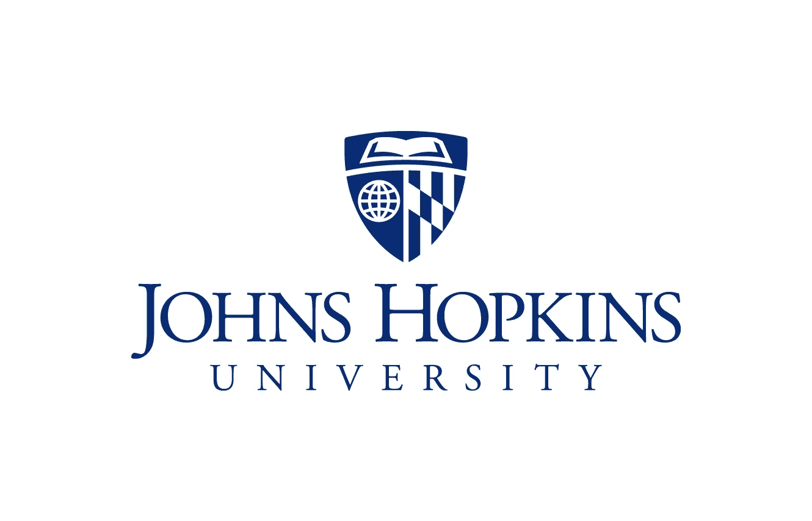
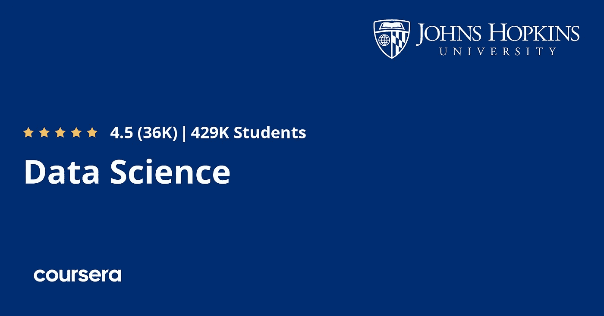
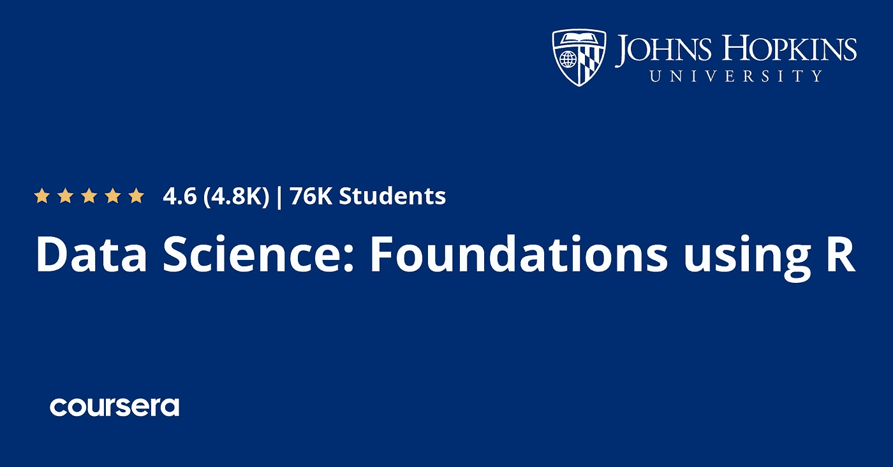
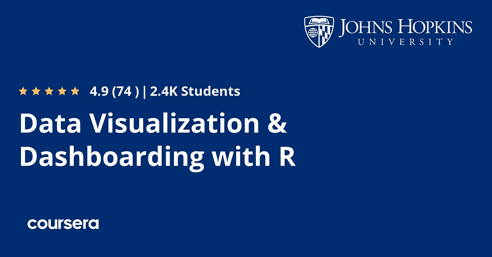
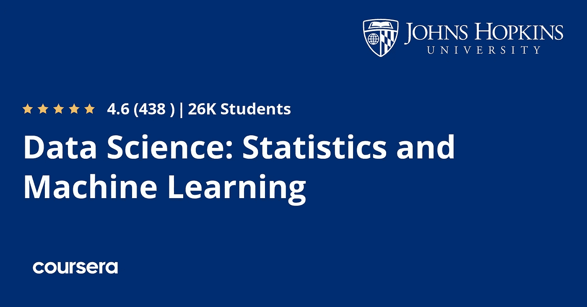
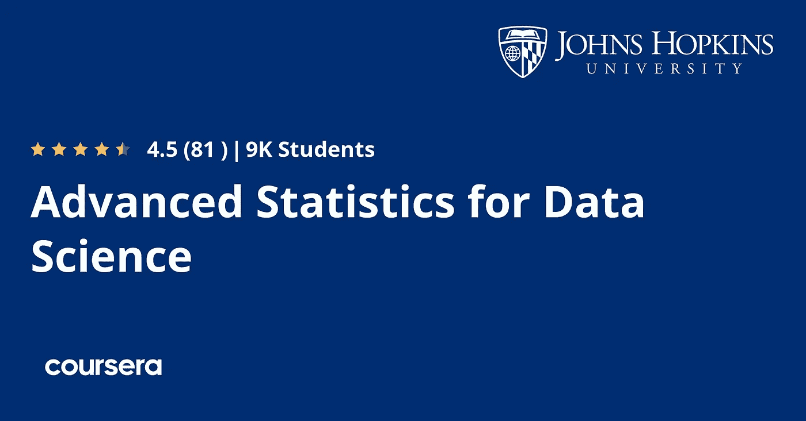

# 2022 年约翰霍普金斯大学在 Coursera 上的 7 门最佳数据科学、统计学和机器学习课程

> 原文：<https://medium.com/javarevisited/my-favorite-johns-hopkins-courses-to-learn-data-science-statistics-and-machine-learning-ed4b1f1f714a?source=collection_archive---------0----------------------->

## 约翰霍普金斯大学的最佳数据科学和统计课程、认证和专业列表，让您在 2022 年开始数据科学职业生涯

大家好，如果你想在 2022 年开始你的数据科学和机器学习职业生涯，并寻找最好的资源，如课程、认证和专业化计划，那么你来对地方了。

前面我已经分享了学习 [**软件开发**](/javarevisited/10-best-software-development-courses-certifications-from-coursera-4ccc59aae201)[**云计算**](/javarevisited/10-best-aws-google-cloud-and-azure-courses-and-certification-from-coursera-to-join-in-2021-5c5e2029a8e7)[**Web 开发**](/javarevisited/10-best-coursera-courses-for-web-development-and-web-design-9ec54ed92dd9) 的最好的 Coursera 课程，而在这篇文章中，我将分享最好的在线课程，以及约翰霍普金斯大学的认证，从零开始学习数据科学，同时使用 Python 和 r

[约翰·霍普斯金大学](https://www.jhu.edu/)是位于马里兰州巴尔的摩的世界一流大学之一。它成立于 1876 年，也是美国第一所研究型大学，是 9 个世界级学术部门作为一所大学共同工作的所在地。

现在，有了 [Coursera](https://coursera.pxf.io/c/3294490/1164545/14726?u=https%3A%2F%2Fwww.coursera.org%2F) ，你可以在家里学习像约翰霍普金斯大学这样的世界级大学，在这篇文章中，我将为初学者和有经验的 IT 专业人员分享约翰霍普金斯大学最好的数据科学项目。

事实上， [**Coursera**](https://coursera.pxf.io/c/3294490/1164545/14726?u=https%3A%2F%2Fwww.coursera.org%2F) 拥有许多在线课程、专业和来自约翰霍普金斯大学的认证，受到全世界数百万学习者的信赖。如果你想知道什么是 Coursera 专业化，那么让我给你一个简单的概述。

Coursera 专业化是帮助你掌握一项技能的一系列课程。它在专业结束时也有一个项目，让你有机会把你学到的东西应用到实践中。

完成专业化认证后，您还将获得一份证书。

此外，当您订阅属于某个专业的课程时，您将自动订阅整个专业。只完成一门课程是可以的，因为您可以随时暂停学习或终止订阅。您还可以使用学员仪表盘跟踪课程注册和进度。

# Coursera 上的 7 门最佳约翰霍普金斯数据科学和机器学习课程将于 2022 年推出

现在你已经对 Coursera 专业化和项目有了一些了解，让我们看看 2022 年约翰霍普金斯大学学习数据科学、统计学和机器学习的*最佳项目。你可以选择这些课程中的任何一门或者它们的组合来学习数据科学，并开始你的职业生涯。*

## 1.[约翰·霍普金斯大学数据科学专业](https://coursera.pxf.io/c/3294490/1164545/14726?u=https%3A%2F%2Fwww.coursera.org%2Fspecializations%2Fjhu-data-science)

这是约翰·霍普金斯大学最受欢迎的数据科学专业，可以完美地开启你的数据科学职业生涯。该专业包含 10 门课程的数据科学入门课程，这些课程由来自约翰·霍普金斯大学的领先教授
Jeff Leek、Roger D. Peng 和 Brian Caffo 教授精心组织、开发和讲授。

以下是您将在该数据科学专业中学习到的关键技能

*   如何使用 R 编程语言来清理、分析和可视化数据？
*   从数据采集到发布的整个数据科学管道。
*   如何使用 GitHub 管理数据科学项目并与其他数据科学家合作
*   如何使用回归模型进行回归分析、最小二乘法和推断。

谈到社会证明，已有超过 40 万人加入该计划开始他们的数据科学职业生涯，其中 38%的人在完成该专业后开始了新的职业生涯，19%的人获得了加薪或晋升。

**这是参加本课程的链接**—[JHU 的数据科学专业](https://coursera.pxf.io/c/3294490/1164545/14726?u=https%3A%2F%2Fwww.coursera.org%2Fspecializations%2Fjhu-data-science)

如果你想用 R 和 Python 学习数据科学，那么这个 JHU 课程非常适合你。你会学到很多抢手的技能，比如 R 编程、机器学习、数据分析、回归分析、数据操作、数据分析、聚类分析，以及 R Studio、 [Git](https://www.java67.com/2019/04/top-5-courses-to-learn-git-and-github.html) 、[正则表达式](https://javarevisited.blogspot.com/2020/04/top-5-courses-to-learn-regular-expression-regex.html#axzz6d6JZB400)等工具。

## 2.[数据科学:使用 R 的基础](https://coursera.pxf.io/c/3294490/1164545/14726?u=https%3A%2F%2Fwww.coursera.org%2Fspecializations%2Fdata-science-foundations-r)

这是来自约翰霍普金斯大学的另一个流行的数据科学项目，面向那些想用 R 编程语言学习数据科学的人。这个项目涵盖了基础数据科学工具和技术，包括检索、清理和探索数据，在 R 中进行[编程，以及进行可重复的研究。](/javarevisited/10-best-r-programming-courses-for-data-science-and-statistics-8f84ebec4974)

该专业适合希望先开始并完成课程的基础部分，然后再进入[数据科学](https://javarevisited.blogspot.com/2020/12/udemy-course-review-data-science-bootcamp-course.html#axzz6hL5FIXGv)、[统计学](https://javarevisited.blogspot.com/2019/09/top-5-statistics-and-mathematics-course-for-data-science.html)和[机器学习](https://javarevisited.blogspot.com/2018/03/top-5-data-science-and-machine-learning-online-courses-to-learn-online.html)的更高级主题的学习者。该计划中有 5 门课程，与数据科学专业前半部分的课程完全相同。

完成本专业后，您可以参加数据科学:统计和机器学习专业，在该专业中，您将有机会使用真实世界的数据构建数据产品。

**这是加入本课程的链接** — [数据科学:使用 R 的基础](https://coursera.pxf.io/c/3294490/1164545/14726?u=https%3A%2F%2Fwww.coursera.org%2Fspecializations%2Fdata-science-foundations-r)

## 3.[高管数据科学专业](https://coursera.pxf.io/c/3294490/1164545/14726?u=https%3A%2F%2Fwww.coursera.org%2Fspecializations%2Fexecutive-data-science)

如果您是负责领导数据科学团队的团队负责人、项目经理或高级经理，并且正在寻找数据科学速成课程，以便您能够更好地理解技术对话和数据科学术语以及流程，那么此计划适合您。

在这个[高管数据科学专业化](https://coursera.pxf.io/c/3294490/1164545/14726?u=https%3A%2F%2Fwww.coursera.org%2Fspecializations%2Fexecutive-data-science)中，你将获得数据科学的速成课程，这样你将精通该领域并了解你作为领导者的角色。

通过学习本课程，您将对数据科学管道的结构、每个阶段的目标以及如何让您的团队始终保持目标有一个大致的了解。

您还将学习如何招聘、组建、评估和发展具有互补技能组合和角色的团队。最后，您将学习一些实际的实用技能，这些技能将帮助您克服经常干扰数据科学项目的常见挑战。

**这是参加本课程** — [高管数据科学专业](https://coursera.pxf.io/c/3294490/1164545/14726?u=https%3A%2F%2Fwww.coursera.org%2Fspecializations%2Fexecutive-data-science)的链接

## 4.[数据可视化&带 R 的仪表板](https://coursera.pxf.io/c/3294490/1164545/14726?u=https%3A%2F%2Fwww.coursera.org%2Fspecializations%2Fjhu-data-visualization-dashboarding-with-r)

对于任何数据科学家来说，数据可视化都是最重要的技能之一，因为如果您不能以一种易于理解和可视化的方式呈现数据以获得洞察力，那么到目前为止您在获取数据、清理数据、转换数据和分析数据方面所做的所有工作都是无用的。

您经常需要将这些结果呈现给高级管理人员以及负责运营、增长和其他部门的人员，掌握好[数据可视化](https://javarevisited.blogspot.com/2020/08/top-10-coursera-certifications-to-learn-Data-Science-Visualization-and-Data-Analysis.html#axzz6lxG136PO)会让您的工作变得轻松。

这个程序是为那些想发展使用 r 可视化数据的能力的学习者设计的。假设你每周花 4 个小时，大约需要 4 个月的时间来完成。

在 Coursera 的这一数据可视化专业中，您将通过五门课程学习如何使用 R 创建静态和交互式数据可视化并将其发布到 web 上，这将使您为向多种类型的受众提供见解做好准备。

**这里是加入本课程** — [数据可视化&R 仪表板](https://coursera.pxf.io/c/3294490/1164545/14726?u=https%3A%2F%2Fwww.coursera.org%2Fspecializations%2Fjhu-data-visualization-dashboarding-with-r)的链接

## 5.[R 中的数据科学 Tidyverse 技能](https://coursera.pxf.io/c/3294490/1164545/14726?u=https%3A%2F%2Fwww.coursera.org%2Fspecializations%2Ftidyverse-data-science-r)

这是约翰·霍普金斯大学的另一个令人惊叹的项目，面向那些寻求用整洁的工具从数据中获得洞察力的人。Tidyverse 软件包提供了一种简单而强大的数据科学方法，从最基本的分析扩展到大规模数据部署，您将了解如何使用 Tidyverse R 软件包导入、讨论、可视化和建模数据。

这个程序是为熟悉 R 编程语言的数据科学家设计的，他们正在寻找使用 Tidyverse 系列包进行数据科学研究。

在这个项目中有五门课程，您将使用强大的 Tidyverse 框架来学习数据的导入、争论、可视化和建模。本课程涵盖了数据科学项目的整个生命周期，并为每个阶段提供了具体的工具。

按照 3 小时/周的安排，该课程将需要大约 7 个月的时间来完成。完成每门课程和动手项目后，您还将获得证书。

**这是参加本课程** — [的链接](https://coursera.pxf.io/c/3294490/1164545/14726?u=https%3A%2F%2Fwww.coursera.org%2Fspecializations%2Ftidyverse-data-science-r)

## 6.[数据科学:统计学和机器学习](https://coursera.pxf.io/c/3294490/1164545/14726?u=https%3A%2F%2Fwww.coursera.org%2Fspecializations%2Fdata-science-statistics-machine-learning)

这是约翰霍普金斯大学的高级数据科学专业，面向熟悉数据科学基础和 R 编程语言的人。这个项目在 [**数据科学:使用 R 专业化**](https://coursera.pxf.io/c/3294490/1164545/14726?u=https%3A%2F%2Fwww.coursera.org%2Fspecializations%2Fdata-science-foundations-r) 的基础上继续和发展。

在这个项目中，你将学习统计推断、回归模型、机器学习和数据产品的开发。在顶点项目中，您将应用通过使用真实世界的数据构建数据产品而学到的技能。

完成本课程后，您还将获得一份结业证书，以展示您新学到的技能。

这个专业中的五门课程与列表中第一个项目 [**数据科学专业**](https://coursera.pxf.io/c/3294490/1164545/14726?u=https%3A%2F%2Fwww.coursera.org%2Fspecializations%2Fjhu-data-science%3FranMID%3D40328%26ranEAID%3DJVFxdTr9V80%26ranSiteID%3DJVFxdTr9V80-X0DtZI2k.CJBThAwVpuELw%26siteID%3DJVFxdTr9V80-X0DtZI2k.CJBThAwVpuELw%26utm_content%3D10%26utm_medium%3Dpartners%26utm_source%3Dlinkshare%26utm_campaign%3DJVFxdTr9V80) 的第二部分课程完全相同。这种专业化适合于已经掌握了基础知识并想直接跳到更高级课程的学习者。

**以下是加入本课程** — [数据科学:统计和机器学习](https://coursera.pxf.io/c/3294490/1164545/14726?u=https%3A%2F%2Fwww.coursera.org%2Fspecializations%2Fdata-science-statistics-machine-learning)的链接

## 7.[数据科学专业高级统计](https://coursera.pxf.io/c/3294490/1164545/14726?u=https%3A%2F%2Fwww.coursera.org%2Fspecializations%2Fadvanced-statistics-data-science)

静力学对于数据科学家来说非常重要，这是一门学习数据科学统计学的极好课程。您可以参加本课程，熟悉概率和统计、数据分析和数据科学线性模型的基本概念。

本课程从 [**数理统计训练营**](https://coursera.pxf.io/c/3294490/1164545/14726?u=https%3A%2F%2Fwww.coursera.org%2Flearn%2Fbiostatistics) 开始，特别是生物统计学应用中使用的概念和方法。这些范围从概率、分布和可能性概念到假设检验和病例对照抽样。

以下是您将在本课程中学到的内容:

*   概率、预期、条件概率、分布、置信区间、自举、二项式比例等等。
*   线性模型的典型例子。
*   线性回归模型的矩阵代数。

这个项目有 4 门课程，它们将为学习者回归建模的线性代数处理打下坚实的基础，这将极大地增强应用数据科学家对回归模型的一般理解。

**这是参加本课程** — [数据科学专业高级统计](https://coursera.pxf.io/c/3294490/1164545/14726?u=https%3A%2F%2Fwww.coursera.org%2Fspecializations%2Fadvanced-statistics-data-science)的链接

顺便说一下，除了单独加入这些课程和专业，你还可以加入 Coursera Plus[**Coursera Plus**](https://coursera.pxf.io/c/3294490/1164545/14726?u=https%3A%2F%2Fwww.coursera.org%2Fcourseraplus)**，**Coursera 的订阅计划，让你无限制地访问他们最受欢迎的课程、专业、专业证书和指导项目。

 [## Coursera Plus |无限制访问 7，000 多门在线课程

### 用 Coursera Plus 投资你的职业目标。无限制访问 90%以上的课程、项目…

coursera.pxf.io](https://coursera.pxf.io/c/3294490/1164545/14726?u=https%3A%2F%2Fwww.coursera.org%2Fcourseraplus) 

以上就是 2022 年 Coursera 上**最好的约翰霍普金斯认证和学习数据科学和机器学习的课程**。JHU 有两个学习数据科学的课程，分别是 Python 和 R 编程语言，你可以选择符合你需求的课程。

约翰·霍普金斯大学不仅在美国，而且在世界上都是一所知名的大学，在学习数据科学等热门技能方面，他们有一些非常好的教授和教育工作者。

许多人努力想进入 JHU，但谢天谢地，你不需要跑到美国来向精英中的精英学习，你可以在家里或办公室参加这些课程和专业。Coursera 通过提供顶级大学课程材料和教师，让在线学习变得更加容易。

你可能喜欢的其他 **Coursera 资源文章**:

*   [2022 年 15 门免费 Coursera 课程供初学者加入](https://javarevisited.blogspot.com/2021/05/15-free-coursera-courses-to-learn-online.html)
*   [开始职业生涯的十大 Coursera 认证](/javarevisited/top-10-coursera-certificates-to-start-your-career-in-cloud-data-science-ai-mainframe-and-it-558690c83587)
*   [向谷歌和 IBM 学习的 18 门 Coursera 课程](/javarevisited/18-coursera-courses-you-can-join-in-2020-to-learn-from-the-worlds-top-tech-companies-google-74af46967d1e?source=collection_home---4------0-----------------------)
*   [面向程序员和开发者的 Coursera 十大项目](https://javarevisited.blogspot.com/2020/08/top-10-coursera-projects-to-learn-essential-programming-skills.html)
*   [Udemy vs CodeCademy vs OneMonth？](https://javarevisited.blogspot.com/2019/09/codecademy-vs-udemy-vs-onemonth-which-is-better-for-learning-code.html#axzz6VYKcmyZz)
*   [5 个最佳 Coursera 程序员专业证书](https://javarevisited.blogspot.com/2019/10/top-5-coursera-professional-certificates-for-programmers-IT-professionals.html)
*   Udemy vs Educative vs CodeCademy？新手用哪个比较好
*   [2022 年学习 Python 可以做的 8 个项目](/javarevisited/8-projects-you-can-buil-to-learn-python-in-2020-251dd5350d56)
*   [Udemy vs Coursera？学理工和编程哪个好](https://javarevisited.blogspot.com/2020/01/coursera-vs-udemy-which-is-better-for-programming-tech.html)
*   [Coursera 证书对工作和事业有帮助吗](https://javarevisited.blogspot.com/2020/02/does-udemy-coursera-edx-educative-or.html)？
*   [2022 年学习人工智能的 7 门最佳课程](/javarevisited/7-best-courses-to-learn-artificial-intelligence-in-2020-26d59d62f6fe)
*   Udemy vs 复数视线？哪个学习平台比较好？

感谢您阅读本文。如果你喜欢约翰霍普金斯大学 2022 年的这些*最好的数据科学和机器学习项目和课程*，那么请与你的朋友和同事分享。如果您有任何问题或反馈，请留言。

**P. S. —** 如果你喜欢 Udemy 的课程，那么你也可以在 Udemy 的 365 Careers 上查看 [**数据科学课程 2022:完成数据科学训练营**](https://click.linksynergy.com/deeplink?id=CuIbQrBnhiw&mid=39197&murl=https%3A%2F%2Fwww.udemy.com%2Fcourse%2Fthe-data-science-course-complete-data-science-bootcamp%2F) 课程。这是在 Udemy 上学习数据科学的最佳课程之一，你只需花 10 美元就可以在 Udemy 上买到，Udemy 上的销售时有发生。

 [## 数据科学培训课程:数据科学家训练营

### 数据科学家是本世纪最适合蓬勃发展的职业之一。它是数字化的，面向编程的，并且…

udemy.com](https://click.linksynergy.com/deeplink?id=CuIbQrBnhiw&mid=39197&murl=https%3A%2F%2Fwww.udemy.com%2Fcourse%2Fthe-data-science-course-complete-data-science-bootcamp%2F)