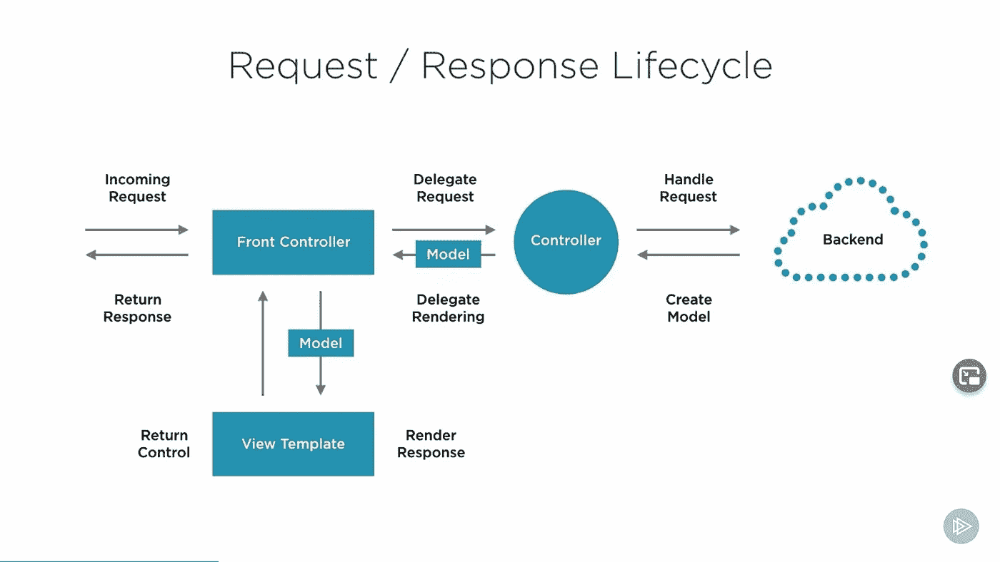
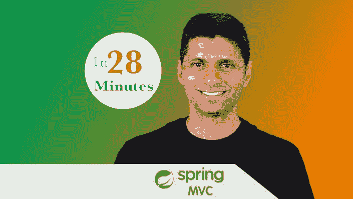
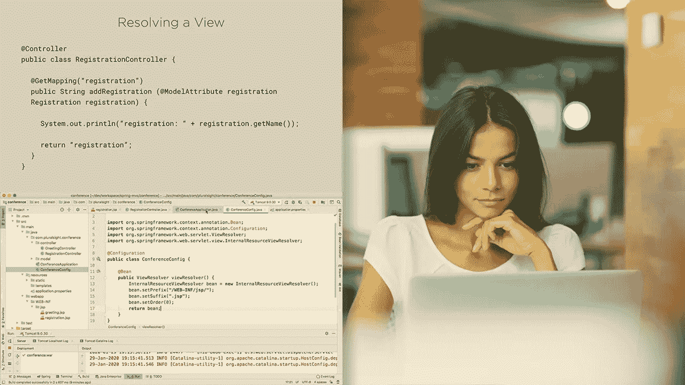
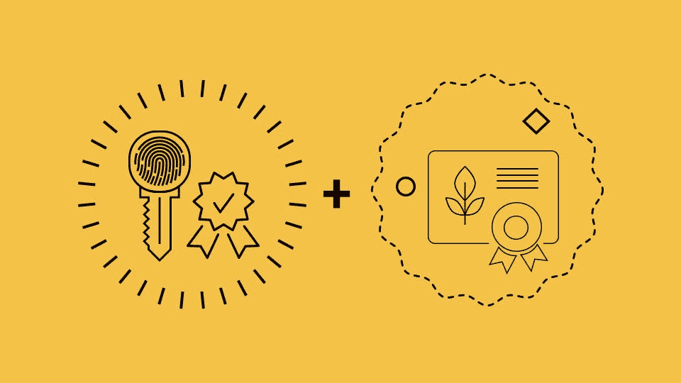
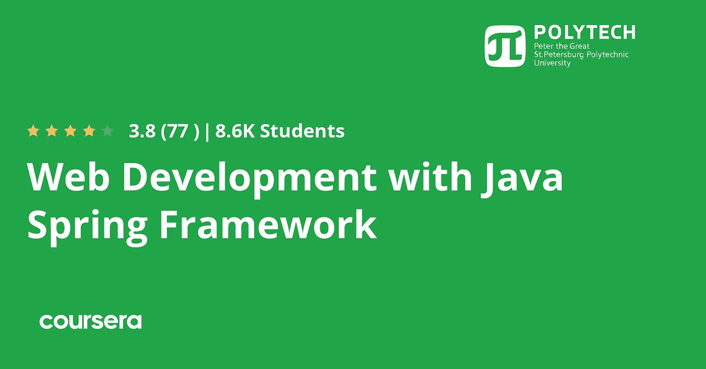

# 2023 年 Java 开发者学习的 9 门最佳春季 MVC 课程

> 原文：<https://medium.com/javarevisited/my-favorite-spring-mvc-courses-for-java-developers-5ede7f85dd88?source=collection_archive---------0----------------------->

## 这些是 Udemy、Coursera 等 2023 年初学者和有经验的 Java 开发者学习 Spring MVC 框架的最佳在线课程

image_credit — Pluralsight

你好，Java 程序员，你们中的许多人一直在问我学习反应式 Spring、Spring Boot 和 Spring MVC 的最佳在线课程。以前分享过 [**我最喜欢的 Spring Boot 课程**](/javarevisited/top-10-courses-to-learn-spring-boot-in-2020-best-of-lot-6ffce88a1b6e?source=---------39------------------) ，今天分享一下**最好的在线课程学习 Spring MVC** 。许多 Java 开发人员认为 Spring MVC 和 Spring Framework 是一样的，有些人把它们混淆了。

在本文中，我将尝试回答 than 问题，并分享一些 Java 开发人员学习 Spring MVC 的最佳课程。 [Spring Core](https://www.java67.com/2017/11/top-5-free-core-spring-mvc-courses-learn-online.html) 和 [Spring MVC](https://javarevisited.blogspot.com/2017/06/how-spring-mvc-framework-works-web-flow.html) 都是同一个保护伞的一部分，一个更大的 Spring 框架项目，但它们并不相同。

Spring Core 是框架的核心，它提供了依赖注入和 IOC 等特性，而 Spring MVC 是另一个项目，它提供了 MVC 设计模式的实现，让你可以轻松地用 Java 构建 web 应用。在二进制级别，它们也被分成不同的 JAR 文件和 maven 工件，这样你就可以包含一个而不包含其他的。一般来说，很多人将 Spring framework 与 Spring MVC 结合在一起，但你也可以使用 Spring Framework 开发核心 Java 应用程序，我指的是不包含 Spring MVC JAR 文件的 spring core。

虽然 Spring 框架的基础知识是所有 Java 开发者的必修课，但是 Spring MVC 是专门为[全栈 Java web 开发者](/javarevisited/top-10-online-courses-to-become-a-fullstack-web-developer-in-2020-d608a6b63232)准备的。也有像 Struts 2 这样的选择，但是 Spring MVC 现在或多或少是开发 web 应用程序的标准。

Spring MVC 也大量用于用 Java 开发 REST APIs 和 [RESTful Web 服务。](/javarevisited/10-best-java-web-services-rest-soap-and-api-courses-for-beginners-724a8f51298d)说到微服务，你还有更多选择，比如 [Spring Boot +春云](https://javarevisited.blogspot.com/2018/02/top-5-spring-microservices-courses-with-spring-boot-and-spring-cloud.html)、 [Eclipse 微档案](https://javarevisited.blogspot.com/2020/09/top-5-courses-to-learn-dropwizard-Micronaut-Quarkus-Java-Microservices.html)、 [Micronaut](/javarevisited/10-best-free-dropwizard-vert-x-micronaut-and-quarkus-online-courses-for-java-developers-9c2b4161f17) 和 [Quarkus](https://www.java67.com/2022/02/top-5-courses-to-learn-quarkus.html) 。

以前我分享过很多资源像[书籍](https://javarevisited.blogspot.com/2018/07/top-5-books-to-learn-spring-boot-and-spring-cloud-java.html)和[课程](/javarevisited/top-10-courses-to-learn-spring-boot-in-2020-best-of-lot-6ffce88a1b6e)学习 Core Spring、 [Spring Boot](https://javarevisited.blogspot.com/2022/03/spring-boot-redis-example-in-java.html) 和 [Spring Cloud](/javarevisited/7-best-courses-to-learn-spring-boot-with-aws-and-azure-cloud-platform-9f953d12bb93) 在这篇文章中，我将分享学习 Spring MVC 的最佳课程。如果你想从零开始学习 Spring MVC 或者只是想刷新和填补理解上的空白，你可以加入这些课程。

# 2023 年初学 9 门最佳春季 MVC 在线课程

下面是更好地学习 Spring MVC 的最佳在线课程列表。这个列表包含了 Spring MVC 课程，适用于初学者和正在使用 Spring MVC 但没有深入了解 Spring MVC 的有经验的 Java 开发人员。这些课程也是由像约翰·汤姆森、布莱恩·汉森、欧根·帕拉斯基夫这样的专家创建的，受到了全球成千上万 fo 开发者的信赖。它们也很实惠，尤其是 Udemy 课程，你只需花 10 美元就能在 Udemy 上买到，这种事情时有发生。

## 1.[初学者的 Spring MVC 用 25 个步骤构建 Java Web App](https://click.linksynergy.com/deeplink?id=JVFxdTr9V80&mid=39197&murl=https%3A%2F%2Fwww.udemy.com%2Fcourse%2Fspring-mvc-tutorial-for-beginners-step-by-step%2F)

这是以引导和动手的方式学习 Spring MVC 的最好的 Udemy 课程之一。顾名思义，您将通过构建一个 Todo 管理应用程序，以一种实用的、循序渐进的方式学习 Spring MVC 框架！

这门课程是由 Java 博主同行和 Udemy 顶级导师之一 [**Ranga Karnam**](https://click.linksynergy.com/deeplink?id=CuIbQrBnhiw&mid=39197&murl=https%3A%2F%2Fwww.udemy.com%2Fuser%2Fin28minutes%2F) 创建的。我真的很喜欢这种教学风格，他把重点放在教你 20%最重要的东西，而这 20%最重要的东西却用了 80%的时间，这门课也不例外。在本课程中，您将使用 Spring MVC、Bootstrap、Maven 和 Eclipse，通过 25 个步骤创建一个 TODO 管理应用程序。Ranga 会一步步指导你。

在此过程中，您还将学习 Spring MVC 基础和关键概念，如 [DispatcherServlet](https://www.java67.com/2019/08/how-dispatcherservlet-process-request-in-spring-mvc-application.html) 、[控制器](https://javarevisited.blogspot.com/2017/11/difference-between-component-service.html)、ModelMap、ModelAndView、Views (JSP)、JSTL、@RequestParam、@ PathVaraible 和@SessionAttributes。

谈到社交证明，这是 Udemy 上最受欢迎的春季 MVC 课程之一，有超过 15000 名学生，近 3300 名参与者的平均评分为 4.4。如果你正在寻找一个*动手课程来学习 Spring MVC* ，你应该加入这个课程。

这里是加入这个实践课程的链接— [Spring MVC For 初学者](https://click.linksynergy.com/deeplink?id=JVFxdTr9V80&mid=39197&murl=https%3A%2F%2Fwww.udemy.com%2Fcourse%2Fspring-mvc-tutorial-for-beginners-step-by-step%2F)

## 2. [RESTful Web 服务、Java、Spring Boot、Spring MVC 和 JPA](https://click.linksynergy.com/deeplink?id=JVFxdTr9V80&mid=39197&murl=https%3A%2F%2Fwww.udemy.com%2Fcourse%2Frestful-web-service-with-spring-boot-jpa-and-mysql%2F)

这是 Udemy 上的另一个学习 RESTful Web 服务的好课程。本课程由 Sergey Kargopolov 创建，面向初学 Java 的开发者，教他们如何用 Java、Spring MVC、Spring Boot 和 Spring Data JPA 构建他们的第一个 RESTful Web 服务应用。

在这个课程中，你会学到以下的东西:

*   如何用 Spring MVC 和 Spring Boot 创建 RESTful Web 服务
*   如何实现用户登录功能
*   如何实现用户注册功能
*   如何用 Spring 安全框架保护 RESTful Web 服务
*   如何实现基于令牌的身份验证
*   如何实现密码重置和电子邮件验证功能

简而言之，学习如何实现 API 调用的最佳在线课程之一:注册、登录、电子邮件验证、密码重置、更新、删除，以及如何将您的 Spring MVC 应用程序部署到[亚马逊 AWS 云](https://javarevisited.blogspot.com/2020/05/top-5-amazon-web-services-aws-courses-for-beginners-and-experienced-programmers.html)。

**这里是加入本课程的链接—** [RESTful Web 服务、Java、Spring Boot、Spring MVC 和 JPA](https://click.linksynergy.com/deeplink?id=JVFxdTr9V80&mid=39197&murl=https%3A%2F%2Fwww.udemy.com%2Fcourse%2Frestful-web-service-with-spring-boot-jpa-and-mysql%2F)

## 3. [Spring 框架:Bryan Hansen 的 Spring MVC 基础](https://pluralsight.pxf.io/c/1193463/424552/7490?u=https%3A%2F%2Fwww.pluralsight.com%2Fcourses%2Fspring-framework-spring-mvc-fundamentals)

这是学习 Spring MVC 最好的 Pluralsight 课程之一。本课程旨在为您提供 Spring MVC 的坚实基础。它涵盖了使用包含和导出的 WAR 部署的最新方法，所有配置都是使用 Java 方法而不是 XML 来完成的，这是构建 Java web 应用程序的现代方法。

以下是你将在本课程中学到的重要知识
1。弹簧 MVC
2 的所有零件。各种控制器包括 RestController
3。如何消耗 Spring MVC
4？在 Spring MVC 上使用 JSP 和百里香

完成本课程后，你将具备创建 web 应用所需的 Spring MVC 的技能和知识。

**这里是加入本课程的链接**——[Spring 框架:Spring MVC 基础](https://pluralsight.pxf.io/c/1193463/424552/7490?u=https%3A%2F%2Fwww.pluralsight.com%2Fcourses%2Fspring-framework-spring-mvc-fundamentals)

顺便说一下，你需要一个 Pluralsight 会员才能参加这个课程，费用大约是每月 29 美元或每年 299 美元(14%的折扣)。我向所有程序员强烈推荐这个订阅，因为它提供了超过 7000 个在线课程的即时访问，以学习任何技术技能。或者，你也可以使用他们的 [**10 天免费通行证**](https://pluralsight.pxf.io/c/1193463/424552/7490?u=https%3A%2F%2Fwww.pluralsight.com%2Flearn) 免费观看这个课程。

 [## 对个人来说

### Pluralsight 的使命一直是公平的技术竞争环境。不管你想学什么，或者…

pluralsight.pxf.io](https://pluralsight.pxf.io/c/1193463/424552/7490?u=https%3A%2F%2Fwww.pluralsight.com%2Flearn) 

## 4.[贝尔东](http://bit.ly/2umzN3Z)用弹簧支撑

这是使用 Spring Framework 学习 Spring MVC 和 RESTful web 服务的又一个很棒的课程。这个课程是由来自 Baeldung.com 的 Eugen Paraschive 创建的，它是在线学习 Spring 的最佳在线课程之一。

虽然有很多 Java 框架可以构建 REST APIs，比如 RESTEasy、Restlet、Jersey 等。，Spring MVC 是最好的，也可能是最流行的构建 RESTful Web 服务的框架，本课程将会教你如何使用 Spring MVC 构建 RESTful Web 应用程序。

以下是您将在本课程中学到的重要知识:

*   使用 Spring 5 和 Spring Boot 2 构建一个 REST API
*   高级主题，如 REST APIs 的测试、部署、使用和监控
*   如何保护您的 REST API
*   以引导的方式构建真实世界的项目。

如果想深入学习 REST API with Spring，我强烈推荐 [**REST With Spring:认证类**](http://courses.baeldung.com/p/rest-with-spring-the-certification-class?affcode=22136_bkwjs9xa) 。这是一个用 spring online 学习 REST 的综合指南。

在价格方面，这个课程可能看起来有点贵，399 美元，但它完全值得你的时间和金钱。他们还提供 30 天的退款，这意味着你一定要尝试这个课程。

## 5. [Spring Framework 5:初学者到大师](https://click.linksynergy.com/deeplink?id=JVFxdTr9V80&mid=39197&murl=https%3A%2F%2Fwww.udemy.com%2Fcourse%2Fspring-framework-5-beginner-to-guru%2F)【Udemy】

这大概是学习 Spring MVC 最好的 Udemy 课程了。这也是我最喜欢的课程之一，它不仅涵盖了 Spring MVC，还涵盖了 Spring Framework 5、Spring Boot 2、Spring MVC、Spring Data JPA、Spring Data、MongoDB、Hibernate 以及其他关键的 Java 技术。

这门课程由[约翰·汤姆逊](https://click.linksynergy.com/deeplink?id=CuIbQrBnhiw&mid=39197&murl=https%3A%2F%2Fwww.udemy.com%2Fuser%2Fjohn-thompson-2%2F)创建，是 Udemy 上评分最高的 Spring 框架课程之一，拥有超过 56K 名学生，12K 名参与者的平均评分为 4.5 分。

以下是您将在本课程中学到的关键技能:

*   使用 Spring 5 进行反应式编程
*   如何使用 Spring Data JPA 和 Hibernate 访问数据
*   使用 Spring MVC 和 Spring Boot 构建 Spring 5 应用程序
*   使用 Spring MVC 构建 Java web 应用程序
*   使用 Spring 和 MongoDB 构建一个反应式应用程序
*   如何在 Docker 容器中运行 Spring Boot 应用程序

这些对于初学者和有经验的 Java 开发人员来说都是非常有用的技能。它也很实惠，你可以在目前正在进行的 Udemy 大减价上只花 9.9 美元就能买到这门课程。

**这里是加入本课程** — [Spring Framework 5:初学者到大师](https://click.linksynergy.com/deeplink?id=JVFxdTr9V80&mid=39197&murl=https%3A%2F%2Fwww.udemy.com%2Fcourse%2Fspring-framework-5-beginner-to-guru%2F)的链接

## 6.[用 Java Spring 框架进行 Web 开发](https://click.linksynergy.com/deeplink?id=JVFxdTr9V80&mid=40328&murl=https%3A%2F%2Fwww.coursera.org%2Flearn%2Fweb-development-with-java-spring-framework)【Coursera】

如果你正在 Coursera 上寻找一门春季 MVC 课程，Coursera 是面向程序员和开发人员的领先在线培训门户，那么这门课程最适合你。

彼得大帝圣彼得堡理工大学开设了这门课程，授课人是 Martyshkin Alexey Ivanovich 和 I-Teco VTs LLC 的首席开发人员 Sinev Mikhail Petrovich。

在本课程中，你将使用 Spring MVC 和 Hibernate CRUD 开发 RESTFul Web 服务。

完成本课程后，您不仅将了解依赖注入、控制反转以及如何使用 Hibernate 访问数据，还将能够使用 Spring MVC 开发 Web 应用程序并开发 RESTFul Web 服务。

**这里是加入这个春季 MVC 课程的链接**——[用 Java Spring 框架进行 Web 开发](https://click.linksynergy.com/deeplink?id=JVFxdTr9V80&mid=40328&murl=https%3A%2F%2Fwww.coursera.org%2Flearn%2Fweb-development-with-java-spring-framework)

如果你发现 Coursera 的课程很有用，因为它们是由知名公司如谷歌、IBM、亚马逊和世界上最好的大学创建的，我建议你加入 Coursera 的 [**Coursera Plus**](https://click.linksynergy.com/deeplink?id=CuIbQrBnhiw&mid=40328&murl=https%3A%2F%2Fwww.coursera.org%2Fcourseraplus) ，这是 Coursera 的一个订阅计划，可以无限制地访问他们最受欢迎的课程、专业、专业证书和指导项目。

 [## Coursera Plus |无限制访问 3000 多门在线课程

### 用 Coursera Plus 投资你的职业目标。无限制地访问 90%以上的课程、指导项目…

coursera.com](https://click.linksynergy.com/deeplink?id=CuIbQrBnhiw&mid=40328&murl=https%3A%2F%2Fwww.coursera.org%2Fcourseraplus) 

## 7. [Spring: Spring MVC](http://linkedin-learning.pxf.io/c/1193463/449670/8005?u=https%3A%2F%2Fwww.linkedin.com%2Flearning%2Fspring-spring-mvc-2) 【领英学习】

这是另一门掌握 Spring MVC 的中级在线课程，Spring MVC 是来自另一个领先的在线学习平台 LinkedIn Learning 的 Spring 框架的最重要部分之一。

本课程将深入探讨 Spring MVC，这是一个面向从事企业级项目的 Java 开发人员的基本 web 框架。完成本课程后，您将掌握使用 Spring MVC 构建健壮的 MVC web 应用程序的扎实知识。

您将了解 spring MVC 的关键概念，如 Spring MVC 中的控制器、模型和视图。你也会明白学习 Spring MVC 的好处。

您将进一步探索异常处理、主题、实现异步执行流，以及扩展您的 Spring MVC 应用程序来服务 REST 请求；并提供了可以帮助您加强对关键概念的理解的练习。

**这里是加入本课程的链接** — [Spring: Spring MVC](http://linkedin-learning.pxf.io/c/1193463/449670/8005?u=https%3A%2F%2Fwww.linkedin.com%2Flearning%2Fspring-spring-mvc-2)

顺便说一句，你需要 LinkedIn Learning 会员才能观看这门课程，每月费用约为 19.99 美元，但你也可以通过参加他们的 [**1 个月免费试用**](http://linkedin-learning.pxf.io/c/1193463/449670/8005?u=https%3A%2F%2Fwww.linkedin.com%2Flearning%2Fsubscription%2Fproducts) 来免费观看这门课程，这是探索他们 16000 多门最新技术在线课程的好方法。

## 8.[全无功堆:Spring Boot 2 &弹簧片通量](https://www.educative.io/courses/full-reactive-stack-spring?affiliate_id=5073518643380224)

如果你想用 Spring 框架构建一个反应式 web 应用， [Spring WebFlux](/javarevisited/7-best-webflux-and-reactive-spring-boot-courses-for-java-programmers-33b7c6fa8995) 可能会很棒。在这个基于文本的交互式课程中，您将学习使用 Spring Boot 2 和 Spring WebFlux 来创建一个完全反应式的 Java web 应用程序。

在本课程中，您将学习构建一个从数据库(MongoDB reactive)到前端(Angular)的反应式 web 系统，使用 Spring WebFlux 利用的反应式编程策略和 Spring Boot 2 提供的简单性。

这是让自己接触多种技术、全栈开发以及从头开始构建一个反应式架构的好方法。开始使用现代系统架构。

除此之外，您还可以将 Spring WebFlux 与标准 MVC 方法进行比较，包括简单性、性能、用户体验等主要方面。

**这里是加入本课程的链接** — [全无功栈:Spring Boot 2 &春网流量](https://www.educative.io/courses/full-reactive-stack-spring?affiliate_id=5073518643380224)

此外，如果你觉得教育平台和他们的互动课程很有用，你还可以获得 [**教育订阅**](https://www.educative.io/subscription?affiliate_id=5073518643380224) ，每月只需 18 美元，不仅可以访问本课程，还可以访问他们的 100 多门课程。非常划算，非常适合准备编码面试。

 [## 教育无限:保持领先

### 我们听到了您的反馈。你现在只需支付一次费用，就可以获得 Educative 上的所有课程。

www.educative.io](https://www.educative.io/subscription?affiliate_id=5073518643380224) 

## 9.[春季&适合初学者的冬眠(包括 Spring Boot)](https://click.linksynergy.com/deeplink?id=CuIbQrBnhiw&mid=39197&murl=https%3A%2F%2Fwww.udemy.com%2Fcourse%2Fspring-hibernate-tutorial%2F)

如果你想要一个完整的在线课程来学习像 Spring、Hibernate、Spring Boot 和 Spring MVC 这样的关键技能，那么这个 Udemy 课程非常适合你。

这个 41 小时的 Udemy 课程由 Chad Darby 创建，是 Udemy 上最全面的春季课程，也是最受欢迎的课程。超过 20 万 Java 开发人员已经加入了这个课程。

以下是您将在本课程中学到的内容:

1.  Spring Boot 2 号，
2.  春天安全
3.  弹簧支架
4.  春季数据 JPA
5.  春天数据休息和百里香叶

对于任何想学习 Spring 和 Hibernate 的 Java 开发人员来说，这个课程都是一个完美的起点。Chad 是一位热情的老师，他的高昂情绪让您坚持完成这一漫长的课程，并学习这些成为成功的 Java 开发人员所需的技能。

**这里是加入这个课程的链接**——[春天&初学冬眠(包括 Spring Boot)](https://click.linksynergy.com/deeplink?id=CuIbQrBnhiw&mid=39197&murl=https%3A%2F%2Fwww.udemy.com%2Fcourse%2Fspring-hibernate-tutorial%2F)

以上是 Java 开发人员学习 Spring MVC 的一些**最佳在线课程**。它是 Java Web 开发的基本框架之一，每个 Java 开发人员都应该学习它。

如果你想在 2023 年成为一名全栈 Java 开发者，那么 Spring MVC 和 Spring Boot 应该是你学习清单上的首选。这些在线 Spring MVC 培训课程将帮助你从零开始，深入学习 [Spring MVC](https://docs.spring.io/spring-framework/docs/3.2.x/spring-framework-reference/html/mvc.html) 。

其他**你可能喜欢的 Java 和 Spring 框架文章**

*   Java 开发人员的 15 个 Spring Boot 面试问题([问题](http://www.java67.com/2018/06/top-15-spring-boot-interview-questions-answers-java-jee-programmers.html))
*   学习和掌握 Spring Cloud 的五大课程([课程](http://javarevisited.blogspot.sg/2018/04/top-5-spring-cloud-courses-for-java.html))
*   2023 年学习 Spring 框架的 5 门免费课程([免费课程](http://www.java67.com/2017/11/top-5-free-core-spring-mvc-courses-learn-online.html))
*   2023 年学习春季安全的 5 门课程([门课程](http://www.java67.com/2017/12/top-5-spring-security-online-training-courses.html))
*   @ spring boot application vs . @ enable auto configuration？([回答](http://www.java67.com/2018/05/difference-between-springbootapplication-vs-EnableAutoConfiguration-annotations-Spring-Boot.html))
*   Java 开发人员应该知道的 5 大 Spring Boot 注释([读](http://www.java67.com/2019/01/top-5-spring-boot-annotations-java-programmers-should-know.html))
*   面向 Java 开发人员的 10 门高级 Spring Boot 课程([课程](/javarevisited/10-advanced-spring-boot-courses-for-experienced-java-developers-5e57606816bd))
*   学习 Java 微服务的 7 大课程([课程](/javarevisited/top-5-courses-to-learn-microservices-in-java-and-spring-framework-e9fed1ba804d))
*   初学者学习 Spring 框架的 10 门免费课程([免费课程](/javarevisited/top-10-free-courses-to-learn-spring-framework-for-java-developers-639db9348d25))
*   Java 开发人员的 20 个 Spring Boot 面试问题([问题](https://javarevisited.blogspot.com/2020/05/top-20-spring-boot-interview-questions-answers.html))
*   Java 开发人员应该知道的 5 大框架([框架](https://javarevisited.blogspot.sg/2018/04/top-5-java-frameworks-to-learn-in-2018_27.html))
*   初学者和有经验者的 7 个最佳春季课程([课程](/javarevisited/10-best-online-courses-to-learn-spring-framework-in-2020-f7f73599c2fd))
*   Java 开发者应该学习的 10 个 Spring MVC 注解([注解](https://www.java67.com/2019/04/top-10-spring-mvc-and-rest-annotations-examples-java.html))
*   深入了解 Spring Boot 的 10 门免费课程([免费课程](/javarevisited/10-free-spring-boot-tutorials-and-courses-for-java-developers-53dfe084587e?source=collection_home---4------7-----------------------))

感谢您阅读本文。如果你觉得这些*春季 MVC 课程*有用，请分享给你的朋友和同事。如果您有任何问题或反馈，请留言。

**P. S.** —如果你热衷于学习 Spring MVC 框架，成为一名全栈 Java 开发人员，但正在寻找免费的在线课程，你也可以在 Udemy 上查看这个 [**Angular and Spring MVC 课程**](https://click.linksynergy.com/deeplink?id=JVFxdTr9V80&mid=39197&murl=https%3A%2F%2Fwww.udemy.com%2Fcourse%2Fbuild-an-angular-and-spring-mvc-web-application%2F) 。已经完成了，你只需要一个免费的 Udemy 帐户就可以参加这个课程。

 [## 免费全栈 Web 开发教程- Angular 和 Spring MVC(更新:Angular 9 和 Spring…

### 欢迎使用 Angular 和 Spring MVC 进行全栈开发。对于那些不知道棱角和春天的人来说…

udemy.com](https://click.linksynergy.com/deeplink?id=JVFxdTr9V80&mid=39197&murl=https%3A%2F%2Fwww.udemy.com%2Fcourse%2Fbuild-an-angular-and-spring-mvc-web-application%2F)