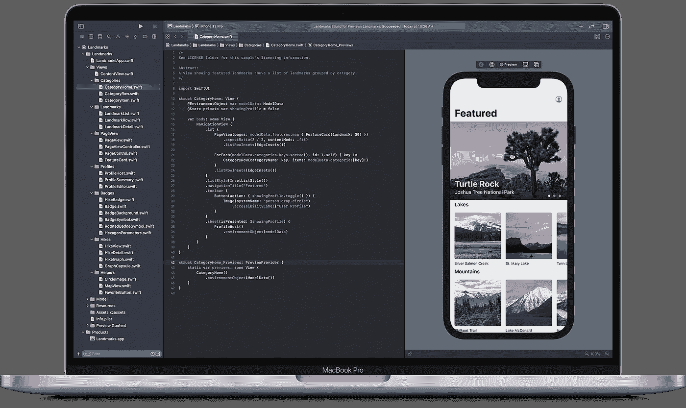
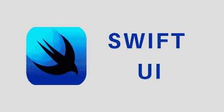
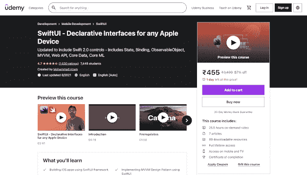
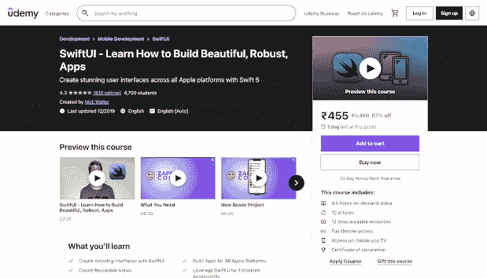
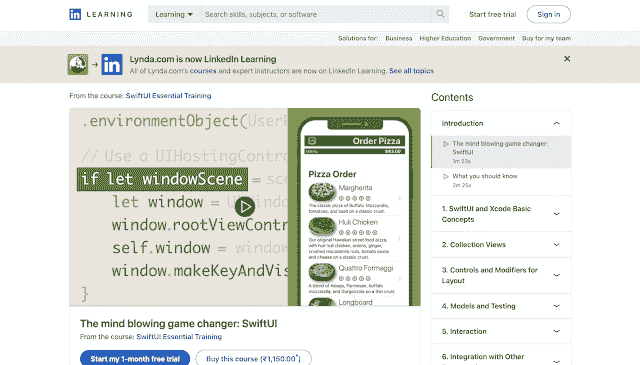
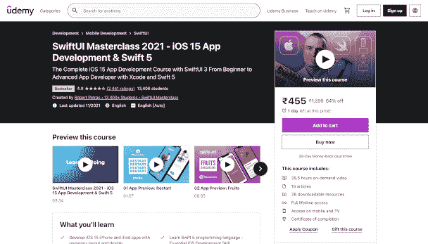

# 我最喜欢的 SwiftUI 在线课程，适合初学者学习

> 原文：<https://medium.com/javarevisited/my-favorite-swiftui-online-courses-for-beginners-to-learn-3fe96c9a1d92?source=collection_archive---------1----------------------->

## 2023 年想学 Swift UI？以下是你可以在 2023 年加入的最好的在线培训课程，以深入学习 Swift UI。

朋友们好，我们今天再次在这里讨论另一个令人兴奋的话题。但是，今天我们不会讨论与 Java 或任何其他语言或 spring boot 相关的东西。今天我们将讨论一些非常实用的东西，它有可能给你带来高薪工作。

今天，我们将了解最佳 SwiftUI 在线课程。那还等什么？开始吧！和往常一样，我们先来了解一下 SwiftUI 是什么。SwiftUI 是苹果为 iOS、tvOS、macOS 和 watchOS 打造的全新用户界面基础。SwiftUI 于 2019 年由苹果首次推出，此后一直在快速发展。

SwiftUI 是一个跨平台的框架，不像 UIKit 和 AppKit。Apple 提供了一个使用 SwiftUI 快速开发应用程序的解决方案。在本课程中，您将了解利用 SwiftUI 创建应用程序所需的所有知识。

SwiftUI 是一个全新的界面，但它有着熟悉的外观和感觉。尽管支持 SwiftUI 的原则与 UIKit 和 AppKit 的原则有很大不同，但苹果没有再造轮子。

该框架包含了创建用户界面所需的所有组件，包括列表、堆栈、按钮、选择器以及许多其他您已经从 UIKit 和 AppKit 中熟悉的组件。它还附带了制作自定义视图、添加动画和包含手势所需的工具。该框架包括对基本技术的支持，包括可访问性和适应性布局。

# 2023 年初学者最好的 Swift UI 在线课程有哪些？

如果你想知道在哪里学习 SwiftUI，不要担心，我已经创建了一个 2023 年学习 Swift UI 的最佳在线课程列表。以下是 Udemy、Pluralsight 和 LinkedIn learning 为初学者提供的最佳 SwiftUI 课程列表。让我们详细地看看每一个。

## 1.[swift ui——适用于任何苹果设备的声明式界面](https://click.linksynergy.com/deeplink?id=CuIbQrBnhiw&mid=39197&murl=https%3A%2F%2Fwww.udemy.com%2Fcourse%2Fswiftui-declarative-interfaces-for-any-apple-device%2F)

**独特的学习点课程-**

*   SwiftUI 是一个创建 iOS 应用程序的框架。
*   使用 SwiftUI 实现 MVVM 设计模式。
*   SwiftUI 用于消费 JSON Web API。

SwiftUI 框架的目标将在本课程中介绍。SwiftUI 框架的结构将被揭示。还将介绍 VStack、HStack 和 ZStack 等布局观点。您还将了解如何在您的应用程序中包含照片。

在 SwiftUI 中，您将学习如何显示可滚动列表。为了组织和定制您的界面，您将使用列表控件的强大功能。您还将了解如何在应用中加入导航功能并应用动画效果。

本课程将介绍状态的概念以及它如何帮助保持接口同步。您还将学习绑定的基础知识以及如何使用双向绑定。

## 2.[swift ui——了解如何构建漂亮、健壮的应用程序](https://click.linksynergy.com/deeplink?id=CuIbQrBnhiw&mid=39197&murl=https%3A%2F%2Fwww.udemy.com%2Fcourse%2Fswiftui-course%2F)

**独特的学习点课程-**

*   你的第一个 SwiftUI 应用
*   Xcode 中的预览
*   深入了解各种观点
*   SwiftUI 和数据
*   易接近
*   动画和绘画
*   SwiftUI 是用于 macOS、WatchOS 和 tvOS 的用户界面。
*   在现有项目中，SwiftUI

自从苹果刚刚推出 Swift 以来最大的东西，叫做 SwiftUI。随着 5 年前 Swift 的首次亮相，苹果彻底改变了游戏。它已经帮助数百万开发者用简洁、易懂的代码创建了优秀的应用程序。SwiftUI 采用了同样的理念，并将其应用于应用程序的美学方面。

SwiftUI 使开发人员更容易将他们的用户界面连接到他们的数据。用户界面会随着数据的变化而改变。当用户界面改变时，数据也会改变。SwiftUI 也很容易重用。您可以重复使用您构建的视图。

Xcode 11 中也包含 SwiftUI，它利用预览来实时向您展示您的代码更改将如何影响您的应用程序的外观。

## 3. [SwiftUI 基础训练](https://linkedin-learning.pxf.io/c/1193463/449670/8005?u=https%3A%2F%2Fwww.linkedin.com%2Flearning%2Fswiftui-essential-training%2Fthe-mind-blowing-game-changer-swiftui)

**课程的独特学习点-**

*   收藏视图
*   布局模型和测试的控件和修改器
*   与其他框架的交互集成
*   SwiftUI 和 Xcode 基本概念

SwiftUI toolkit 包括布局结构、控件和视图，允许您使用相同的代码为 Mac、iPhone、iPad、Apple Watch 和 Apple TV 创建用户界面。

如果您想了解 SwiftUI 与 UIKit 和 AppKit 的不同之处，或者如果您只是想开始使用这个强大的新工具包，本课程适合您。加入 Steven Lipton，他将展示如何使用 Xcode 和 SwiftUI 构建应用程序的用户界面。

了解如何使用集合视图、实现导航和动画交互等。他讲述了如何利用 SwiftUI 构建一个披萨店订购应用程序的前端，以将这些原则付诸实践。

顺便说一下，你需要 LinkedIn Learning 会员才能观看这门课程，每月费用约为 19.99 美元，但你也可以通过参加他们的 [**1 个月免费试用**](http://linkedin-learning.pxf.io/c/1193463/449670/8005?u=https%3A%2F%2Fwww.linkedin.com%2Flearning%2Fsubscription%2Fproducts) 来免费观看这门课程，这是探索他们 16000 多门最新技术在线课程的好方法。

  

## 4.[Swift ui master class 2023—iOS 15 App 开发& Swift 5](https://click.linksynergy.com/deeplink?id=JVFxdTr9V80&mid=39197&murl=https%3A%2F%2Fwww.udemy.com%2Fcourse%2Fswiftui-masterclass-course-ios-development-with-swift%2F)

**课程的独特学习点-**

*   组合框架，
*   SwiftUI 动画，
*   高级核心数据与 CloudKit 集成，
*   MVVM 建筑，
*   外部 REST APIs 集成，
*   MVVM 建筑，
*   应用程序小部件，
*   应用程序剪辑，
*   测试驱动的应用程序开发等等。

你将直观地学习 SwiftUI 3，并创建高质量的 iOS 15、iPadOS 移动应用、Apple Watch 应用，甚至 macOS 桌面应用。这个全面的 iOS 应用程序开发课程将教你如何使用 SwiftUI(苹果专有的用户界面框架)创建强大的多平台应用程序。

本课程采用基于项目的方法教授编程原理。通过参加本课程，您将增强自己的应用程序设计和开发能力，同时生成几个实际应用程序。

## SWIFT UI 常见问题:

*1。****swift ui 量产准备好了吗？***

*-当 iOS 14 作为最低操作系统安装时，SwiftUI 已准备好投入生产。*

2.***swift ui 是开源吗？***

**-** 苹果的大部分框架都是闭源的，因此你只能看到公共的头文件。也有例外(比如 Darwin 内核)，Swift 语言也是开源的，尽管框架本身(比如 SwiftUI)是封闭的。

以上就是 2023 年**学习 SwiftUI 的最佳在线课程**。这些是针对初学者的最新、最全面、最有吸引力的 Swift UI 课程，因为您将从头开始学习概念。它们也是基于项目的，会教你如何构建真实世界的项目，让你有开发经验。那么，现在还等什么？你们应该继续前进，根据自己的需要为 SwiftUI 选择任何最好的课程，然后关上:D 的苹果之门