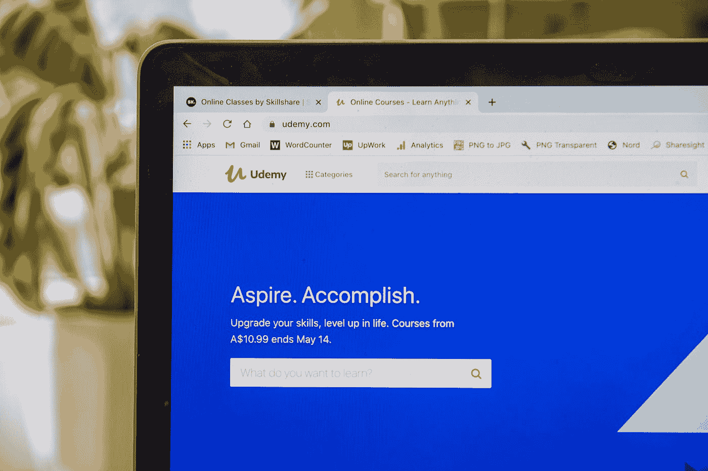
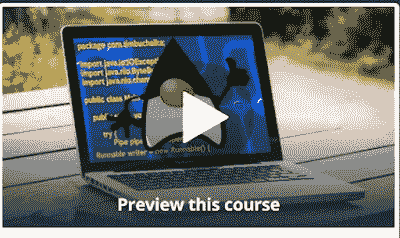
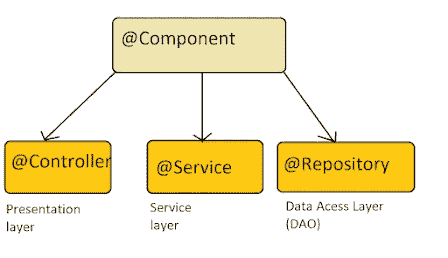
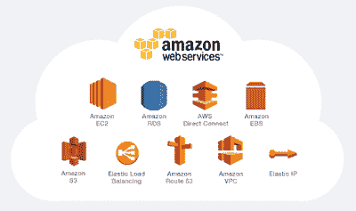
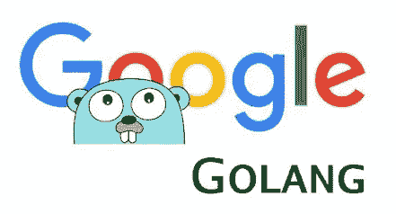

# 2023 年程序员和开发者的 15 门最佳 Udemy 课程

> 原文：<https://medium.com/javarevisited/my-favorite-udemy-online-courses-for-programmers-and-software-engineers-f9d941dd0035?source=collection_archive---------0----------------------->

路易斯·基根-Skillscouter.com 在 T2 Unsplash 的照片

大家好，毫无疑问，Udemy 是最受欢迎的电子学习平台之一，它帮助越来越多的人学习到有价值的技能，如[编程](https://javarevisited.blogspot.com/2019/03/top-5-online-courses-to-learn-to-code.html)、[编码](https://javarevisited.blogspot.com/2020/05/top-10-udemy-courses-to-learn-python-programming.html)、 [Web 开发](/better-programming/my-5-favorite-courses-to-learn-web-development-in-2019-a5e74167f8b2)、 [App 开发](/@javinpaul/10-frameworks-and-libraries-mobile-application-developers-can-learn-in-2020-e0b91391cade)、 [Python](https://javarevisited.blogspot.com/2018/03/top-5-courses-to-learn-python-in-2018.html) 、 [Java](https://javarevisited.blogspot.com/2018/05/top-5-java-courses-for-beginners-to-learn-online.html) 、 [C/C++](https://javarevisited.blogspot.com/2019/11/top-5-courses-to-learn-c-programming-in.html) 、[数据科学](https://javarevisited.blogspot.com/2018/10/data-science-and-machine-learning-courses-using-python-and-R-programming.html)、[机器学习](/@javinpaul/9-data-science-and-machine-learning-courses-by-harvard-ibm-udemy-and-others-12a0c7c23ec1)、“

尽管 Udemy 有各种各样的课程，从编程到摄影，从音乐到数字媒体，但在本文中，我们为程序员和开发人员整理了一份**最佳 Udemy 课程和认证清单。**

这些也是我最喜欢的 Udemy 课程。他们由专家讲师授课，并使用一流的培训材料提供全面且引人入胜的学习体验。

这些列表包括学习 Web 开发的 Udemy 畅销书、Java、Python、C++、AWS、数据科学、机器学习、Node.js 和 React.js，这些都是对现代软件开发人员最有价值的技能。

这些都是非常实惠的课程，你只需花 10 美元就可以在 Udemy 上买到，这种活动时有发生。

# 2023 年学习编程和软件开发的 15 门最佳 Udemy 课程

在不浪费你更多时间的情况下，这里是我列出的一些最好的 Udemy 课程和认证，用于学习 Java、Python、Web 开发、C++、机器学习、云计算、AWS、React 和 Node.js，以及其他获得工作的基本技能。

## 1.[完整的 Java 大师班](https://click.linksynergy.com/deeplink?id=JVFxdTr9V80&mid=39197&murl=https%3A%2F%2Fwww.udemy.com%2Fjava-the-complete-java-developer-course%2F)—Udemy 上最好的 Java 课程

Java 是我的强项和生命，可能是过去二十年中最重要的技术。它为数百万开发者提供了工作，因为大大小小的公司都使用 Java 来推动他们的业务。

它仍然是最受欢迎的编程语言之一，学习 Java 确实可以增加你在高盛、花旗银行或摩根士丹利等大型投资银行获得工作的机会。并且，这是学习 Java 最全面、最新的课程。

更新覆盖 Java 12，最新 Java 版本。它也是 Udemy 的畅销书之一，受到了超过 50 万学生的信任。

**这里是加入本课程的链接** — [完整的 Java 大师班](https://click.linksynergy.com/deeplink?id=JVFxdTr9V80&mid=39197&murl=https%3A%2F%2Fwww.udemy.com%2Fjava-the-complete-java-developer-course%2F)

## 2.[完整的 Python 训练营](https://click.linksynergy.com/deeplink?id=JVFxdTr9V80&mid=39197&murl=https%3A%2F%2Fwww.udemy.com%2Fcomplete-python-bootcamp%2F)—Udemy 上最好的 Python 课程

Python 是现代软件开发人员的另一项宝贵技能，这可能是 Udemy 上学习 Python 的最佳课程。由何塞·马西亚尔·波尔蒂利亚创建，这是另一个训练营风格的课程，你可以以 10 美元的一次性价格获得。

如果你把这个课程比作一个真正的现场 Python 训练营，它将花费你大约 10000 美元，几乎是它的 1000 倍。

同样，它是我学习 Python 的畅销书之一，受到了超过 635，952 名注册学生的信任。这门课程可能是 Udemy 有史以来销量最高的课程。

**这里是加入本课程的链接**——[完整的 Python 训练营](https://click.linksynergy.com/deeplink?id=JVFxdTr9V80&mid=39197&murl=https%3A%2F%2Fwww.udemy.com%2Fcomplete-python-bootcamp%2F)

## 3. [Spring 框架大师班:Java Spring the Modern Way](https://click.linksynergy.com/deeplink?id=JVFxdTr9V80&mid=39197&murl=https%3A%2F%2Fwww.udemy.com%2Fcourse%2Fspring-tutorial-for-beginners%2F)—Udemy 上最好的 Spring 课程

本课程的主要亮点是您将使用真实的项目来学习 Spring 框架。这意味着你将获得一个更加实用的 Spring 实践经验，使你能够更快地学习。

这个课程非常适合有 Java 编程经验的人，但是对于 Spring 来说是全新的。将向您介绍 Spring 和 Spring 模块的许多特性，如 JDBC、AOP 和 Data JPA。这门课程将是你进入春天奇妙世界的完美大门。'

**课程时长:12 小时
课程评分:4.5 星满分 5 分
课程讲师:28 分钟官方
课程价格:$14**

一旦您购买了本课程，您将终身获得 12 小时的点播视频讲座、13 篇文章和 1 个可下载的教育资源。整个课程内容分为 14 个板块，139 节课。

**这里是加入本课程的链接—**[Spring Framework master class:Java Spring the Modern Way](https://click.linksynergy.com/deeplink?id=JVFxdTr9V80&mid=39197&murl=https%3A%2F%2Fwww.udemy.com%2Fcourse%2Fspring-tutorial-for-beginners%2F)

## 4.[Web 开发者训练营](https://click.linksynergy.com/deeplink?id=JVFxdTr9V80&mid=39197&murl=https%3A%2F%2Fwww.udemy.com%2Fthe-web-developer-bootcamp%2F)——Udemy 上最好的 Web 开发课程

如果你想自学 Web 开发，可以加入 Udemy 上的这个 bootcamp 风格的在线课程。它涵盖了 web 开发人员需要了解的所有技术，如 HTML、CSS、JavaScript，甚至是 Bootstrap、Angular 和 React 等高级技术。

本课程由前 bootcamp 讲师 Colt_Steele 教授，这是 Udemy 上最受欢迎的课程之一，在他们的 web 开发旅程中受到近 50 万学生的信任。

**这是加入本课程的链接** — [网络开发人员训练营](https://click.linksynergy.com/deeplink?id=JVFxdTr9V80&mid=39197&murl=https%3A%2F%2Fwww.udemy.com%2Fthe-web-developer-bootcamp%2F)

## 5.[c++编程入门](https://click.linksynergy.com/deeplink?id=JVFxdTr9V80&mid=39197&murl=https%3A%2F%2Fwww.udemy.com%2Fbeginning-c-plus-plus-programming%2F) —从入门到超越—最佳 Udemy C++课程

除了 Java 和 Python，如果有另一种编程语言可以同时提供工作和满足感，那么它就是 C++。它早于 Java，经受住了时间的考验。

所有重要的软件，如操作系统、设备驱动程序、数据库等。都是用 C++编写的，这就是为什么对优秀的 C++开发人员有很高的需求。他们还因编写高频交易应用程序而在巴克莱等大型投资银行受到追捧。如果你想学 C++，那么这本 Udemy 畅销书再合适不过了。它被超过 43，872 人信任学习 C++。

**这里是加入本课程**—[c++编程入门](https://click.linksynergy.com/deeplink?id=JVFxdTr9V80&mid=39197&murl=https%3A%2F%2Fwww.udemy.com%2Fbeginning-c-plus-plus-programming%2F)的链接

## 6.[人工智能 A-Z](https://click.linksynergy.com/deeplink?id=JVFxdTr9V80&mid=39197&murl=https%3A%2F%2Fwww.udemy.com%2Fartificial-intelligence-az%2F)—Udemy 上最好的人工智能课程

毫无疑问，人工智能是一个受到广泛关注的领域，这是有充分理由的。就像电力在 20 世纪左右改变了商业一样，人工智能的时代即将到来。如果你不想落后，那么学习人工智能对你的职业和未来都有好处，这是在 Udemy 上学习人工智能的最佳课程。

本课程由基里尔·叶列缅科、哈德林·德·庞特维斯和他的 SuperDataScience 团队教授，这本 Udemy 畅销书受到了超过 10 万名程序员和数据科学爱好者的信赖。

**这里是加入本课程的链接** — [人工智能 A-Z](https://click.linksynergy.com/deeplink?id=JVFxdTr9V80&mid=39197&murl=https%3A%2F%2Fwww.udemy.com%2Fartificial-intelligence-az%2F)

## 7.[终极 AWS 认证解决方案架构师助理 2023！](https://click.linksynergy.com/deeplink?id=JVFxdTr9V80&mid=39197&murl=https%3A%2F%2Fwww.udemy.com%2Fcourse%2Faws-certified-solutions-architect-associate-saa-c02%2F)—Udemy 上的最佳 AWS 认证课程

除了 AI，云计算是现代软件开发人员应该学习的另一个东西，没有比从 AWS 开始更好的方法了。亚马逊 Web 服务是公共云计算的先驱，迟早你需要在 AWS 控制台上工作。

如果你现在想学习 AWS，没有比准备像 Solution Architect Associate 这样的 AWS 认证更好的方法了。

它不仅能为您提供实际操作的经验，还能让您深入了解不同的 AWS 服务，该课程是 Udemy 针对 AWS 认证的最佳课程。该课程由 AWS 大师夏羽·马雷克教授，也是 Udemy 的畅销书，受到超过 45 万 AWS 有志者的信任。

**这里是参加本课程的链接** — [AWS 认证解决方案架构师](https://click.linksynergy.com/deeplink?id=JVFxdTr9V80&mid=39197&murl=https%3A%2F%2Fwww.udemy.com%2Faws-certified-solutions-architect-associate%2F)

## 8.[完整的 JavaScript 课程](https://click.linksynergy.com/deeplink?id=JVFxdTr9V80&mid=39197&murl=https%3A%2F%2Fwww.udemy.com%2Fthe-complete-javascript-course%2F)—Udemy 上最好的 JavaScript 课程

从客户端脚本语言开始，JavaScript 走过了漫长的道路，成为了 web 的宠儿，也是唯一一种可以前后创建真正的 web 应用程序的语言。

JavaScript 绝对是现代 web 开发人员的必备技能之一，这本 Udemy 畅销书非常适合学习 JavaScript。由 Jonas *Schmedtmann* 设计的
它是 Udemy 上最受欢迎的 JavaScript 学习课程之一，受到全球超过 209，888 名学生的信任。

本课程最大的优点是它是最新的，涵盖了 ES6 中引入的新 JavaScript 特性和语法。还有一个好处就是非常的动手，你会用 JavaScript 开发出很多有趣的项目。

**这里是加入本课程的链接** — [完整的 JavaScript 课程](https://click.linksynergy.com/deeplink?id=JVFxdTr9V80&mid=39197&murl=https%3A%2F%2Fwww.udemy.com%2Fthe-complete-javascript-course%2F)

## 9.[完整的 Node.js 开发者课程](https://click.linksynergy.com/deeplink?id=JVFxdTr9V80&mid=39197&murl=https%3A%2F%2Fwww.udemy.com%2Fthe-complete-nodejs-developer-course-2%2F)—Udemy 上最好的 Node.js 课程

Node.js 在 JavaScript 的发展中发挥了重要作用。它还改变了 web 应用程序的传统开发方式。这就是为什么 Node.js 是一个现代软件开发人员至关重要的技能之一，这也是在 Udemy 学习 Node.js 的最好课程。

本课程由 Andrew Mead 和 Rob Percival 两位顶级讲师授课，这本 Udemy 畅销书是受到超过 135，000 名软件工程师信赖的学习节点 JS。

**这里是加入这个课程的链接**——[完整的 Node.js 开发者课程](https://click.linksynergy.com/deeplink?id=JVFxdTr9V80&mid=39197&murl=https%3A%2F%2Fwww.udemy.com%2Fthe-complete-nodejs-developer-course-2%2F)

## 10.机器学习 A-Z—Udemy 上最好的机器学习课程

机器学习是近年来最热门的技术之一。具有机器学习经验的程序员也获得了丰厚的报酬。

如果你正在转行或重新开始，简历中的机器学习可以创造奇迹，这个在线课程可能是学习机器学习的最佳培训课程。

本课程由两位最优秀的机器学习讲师基里尔·叶列缅科和哈德琳·德·庞特维斯教授，这本 Udemy 畅销书受到超过 45 万学习者的信赖。

**这里是加入本课程** — [机器学习 A-Z](https://click.linksynergy.com/deeplink?id=JVFxdTr9V80&mid=39197&murl=https%3A%2F%2Fwww.udemy.com%2Fmachinelearning%2F) 的链接

## 11.[完整的 React 大师班](https://click.linksynergy.com/deeplink?id=JVFxdTr9V80&mid=39197&murl=https%3A%2F%2Fwww.udemy.com%2Freact-the-complete-guide-incl-redux%2F)—Udemy 上的 Best React.js 课程

前端开发是一项重要的技能，而 React 是这一领域的一项基本技术。

如果你想成为一名前端开发人员或者全栈开发人员，那么学习 React.js 吧，它真的可以对你的职业生涯有所帮助，这也是在 Udemy 学习 React 的最好课程。

本课程由我最喜欢的导师之一 Maximillian 或 Max 教授，他是 Udemy 上学习 web 开发库和框架最好的导师之一。

该课程也是 Udemy 上最受欢迎的课程之一，受到超过 200000 名 React.js 和前端开发者的信任。

**这是加入本课程的链接**——[完整的 React 大师班](https://click.linksynergy.com/deeplink?id=JVFxdTr9V80&mid=39197&murl=https%3A%2F%2Fwww.udemy.com%2Freact-the-complete-guide-incl-redux%2F)

## 12.[面向 Java 开发者的 Docker](https://click.linksynergy.com/deeplink?id=JVFxdTr9V80&mid=39197&murl=https%3A%2F%2Fwww.udemy.com%2Fcourse%2Fdocker-for-java-developers%2F)【Udemy 上的最佳 Docker 课程】

udemy 的这门课程是 Java 课程中最受欢迎的 Docker 之一。这是为那些想学习 Docker 和 Java 编程语言的人准备的。

本课程涵盖了一些基本主题，如运行 docker 容器、将 docker 映像发布到 docker hub、使用 docker swarm、使用 maven 创建 docker 映像等。

由约翰·汤姆逊创建，他是我最喜欢的 Udemy 导师之一，也是《Spring Framework:[**初学者到大师**](https://click.linksynergy.com/deeplink?id=JVFxdTr9V80&mid=39197&murl=https%3A%2F%2Fwww.udemy.com%2Fcourse%2Fspring-framework-5-beginner-to-guru%2F) 的作者，这是学习 Docker 最好的 Udemy 课程之一，如果你喜欢约翰的教学风格，这是理论和实践的正确结合，那么你会喜欢这门课程。

要求

*   Java 基础知识。
*   推荐春天的知识。
*   Linux 的基础知识。

这门课程是专门为 Java 开发人员开设的。这是一个初级课程，视频总内容为十个小时。

**这里是加入本课程的链接** — [面向 Java 开发人员的 Docker](https://click.linksynergy.com/deeplink?id=JVFxdTr9V80&mid=39197&murl=https%3A%2F%2Fwww.udemy.com%2Fcourse%2Fdocker-for-java-developers%2F)

## 13.[iOS&Swift——完整的 iOS 应用开发训练营](https://click.linksynergy.com/deeplink?id=JVFxdTr9V80&mid=39197&murl=https%3A%2F%2Fwww.udemy.com%2Fcourse%2Fios-13-app-development-bootcamp%2F)【Udemy 上最好的应用开发课程】

如果你想学习应用程序开发，那么这可能是 Udemy 上世界上最好的 iOS 开发者课程。它太好了，甚至启发我创建了一个类，这是另一个故事，但这是一个该死的好课程。

余老师很有经验，也很热情。她在 Bootcamp 上教授 iOS 开发，这个课程是这些 boto camp 的在线版本，价格在 8000 美元到 12000 美元之间。

该课程的课程结构非常好，解释清楚，讲授到位。内容是对动画的极好利用，图形让人们很容易理解像 Core ML 2 和 ARKit 2 这样的 iOS 新概念。

这个 iOS 开发课程也很全面，524 节课，超过 59.5 小时的素材，不过不用担心，你不会觉得无聊。也很动手，你会开发差不多 25 个 apps 是的，你读对了 25 个应用程序，包括你自己的 Pokeman，go，一个哈利波特风格的报纸应用程序，等等。

以下是加入这一优秀的 iOS 和 Swift 课程的链接—[**iOS 和 Swift 训练营**](https://click.linksynergy.com/deeplink?id=JVFxdTr9V80&mid=39197&murl=https%3A%2F%2Fwww.udemy.com%2Fcourse%2Fios-13-app-development-bootcamp%2F)

## 14 . [Go:完全开发者指南(Golang)](https://click.linksynergy.com/deeplink?id=JVFxdTr9V80&mid=39197&murl=https%3A%2F%2Fwww.udemy.com%2Fcourse%2Fgo-the-complete-developers-guide%2F)【Udemy 上最好的 Golang 课程】

如果你想在 2023 年学习 Golang 编程语言，那么这是最适合你的 Udemy 课程。通过本课程，你将能够构建带有 Go 例程和通道的大规模并发程序。

该课程还将教你所有关于 Go 的高级特性，以及所有常用数据结构之间的区别。您将学习如何应用接口来简化复杂的程序，并使用类型来使您的代码经得起未来的考验。

**课程时长:9 小时
课程评分:4.6 星(满分 5 分)
课程讲师:斯蒂芬·格里德
课程价格:$14**

购买本课程后，您将获得超过 9 小时的点播视频讲座、5 篇文章和其他可下载的教育资源。

**以下是参加本课程的链接** — [Go:完整的开发人员指南(Golang)](https://click.linksynergy.com/deeplink?id=JVFxdTr9V80&mid=39197&murl=https%3A%2F%2Fwww.udemy.com%2Fcourse%2Fgo-the-complete-developers-guide%2F)

## 15.Andrei Neagoie 的《掌握编码面试:数据结构+算法》【UDemy 上的最佳编码面试课程

这是 Udemy 上从编码面试角度学习数据结构和算法最好的课程之一。本课程涵盖的数据结构是数组、链表、栈、队列、树、散列图和图。

Andrei Negaoie 是一位经验丰富的讲师，他很好地解释了每一种数据结构，还用例子描述了如何执行各种操作。这是一门很长的课程，总共有十四个小时的内容。所以如果你想详细学习数据结构，去上这门课。

如果你想学习编码面试的数据结构和算法，并深入学习 JavaScript 中所有主要的数据结构，那么 ZTM 学院的《掌握编码面试:数据结构+算法》是一个完美的选择。

**这里是加入本课程的链接** — [掌握编码面试:数据结构+算法](https://click.linksynergy.com/deeplink?id=JVFxdTr9V80&mid=39197&murl=https%3A%2F%2Fwww.udemy.com%2Fcourse%2Fmaster-the-coding-interview-data-structures-algorithms%2F)

顺便说一句，如果你喜欢安德烈的教学风格，你可能想去看看他的 [**ZTM 学院**](https://academy.zerotomastery.io/a/aff_fvgz1fnn/external?affcode=441520_zytgk2dn) 在那里你只需每月支付 39 美元的会员费就可以学习他的所有课程。您还可以使用我的代码朋友 10 获得您选择的任何订阅的 10%的折扣。

 [## 学习编码。被录用。加入零至掌握学院。|零到精通

### 不要在无聊、过时的教程上浪费时间。加入 500，000 多名学生的行列，学习编程，获得聘用并在以下领域取得成功…

academy.zerotomastery.io](https://academy.zerotomastery.io/a/aff_c0gnlvf7/external?affcode=441520_zytgk2dn) 

这就是关于程序员和开发人员的最佳 Udemy 课程和认证的全部内容。这些是 Udemy 学习热门和热门技能的畅销书，如 [Java](https://javarevisited.blogspot.com/2020/04/top-5-courses-to-become-full-stack-java-developer-with-Angular-and-Reactjs.html#axzz6Nq9yk7Sc) 、 [Python](/javarevisited/8-projects-you-can-buil-to-learn-python-in-2020-251dd5350d56) 、 [Web 开发](https://dev.to/javinpaul/top-6-courses-to-learn-web-development-best-of-lot-2fae)、 [C++](/javarevisited/top-10-courses-to-learn-c-for-beginners-best-and-free-4afc262a544e) 、 [AWS](/javarevisited/top-10-courses-to-learn-amazon-web-services-aws-cloud-in-2020-best-and-free-317f10d7c21d) 、[数据科学和机器学习](/javarevisited/my-favorite-data-science-and-machine-learning-courses-from-coursera-udemy-and-pluralsight-eafc73acc73f)、 [Node.js](/javarevisited/7-free-courses-to-learn-node-js-in-2020-2f1dd6722b49?source=---------10------------------) 、 [Angular](/javarevisited/10-courses-to-learn-angular-for-web-development-6da1bd2856dc) 、 [Reactjs](/javarevisited/top-10-free-courses-to-learn-react-js-c14edbd3b35f?source=extreme_main_feed----d3a191ac6ed-----5-1--------------------561c2dc6_a2b4_41e0_b7be_1d97edbf631c--8) 、 [Golang](/javarevisited/7-online-courses-to-learn-golang-or-go-programming-languages-in-2020-f599a25cf14a) 、[如果你想在技术和编程领域发展事业。

其他**编程资源文章**您可能喜欢:](/javarevisited/top-10-free-courses-to-learn-jenkins-docker-and-kubernetes-for-devops-in-2020-best-of-lot-62a0541ffeb3)

*   [2023 年网络开发者路线图](https://hackernoon.com/the-2019-web-developer-roadmap-ab89ac3c380e)
*   [五大 Coursera 专业认证，促进您的职业发展](https://javarevisited.blogspot.com/2019/10/top-5-coursera-professional-certificates-for-programmers-IT-professionals.html)
*   [2023 react . js 开发者路线图](https://javarevisited.blogspot.com/2018/10/the-2018-react-developer-roadmap.html)
*   [学习 Python 的 10 个最佳 Coursera 认证](https://javarevisited.blogspot.com/2020/02/10-best-coursera-courses--for-python.html)
*   [面向程序员的 10 大 Pluralsight 课程和认证](https://javarevisited.blogspot.com/2017/12/top-10-pluralsight-courses-java-and-web-developers.html)
*   [2023 年 Java 开发人员应该学会的 10 件事](https://javarevisited.blogspot.com/2017/12/10-things-java-programmers-should-learn.html#axzz5atl0BngO)
*   [面向程序员的 10 门免费 Python 编程课程](https://hackernoon.com/10-free-python-programming-courses-for-beginners-to-learn-online-38312f3b9912)
*   [十大数据科学和机器学习认证课程](https://hackernoon.com/10-machine-learning-data-science-and-deep-learning-courses-for-programmers-7edc56078cde)
*   [10 程序员数据结构与算法课程](https://www.java67.com/2019/02/top-10-free-algorithms-and-data.html)
*   [初学者学习 Java 的五大课程](https://javarevisited.blogspot.com/2018/05/top-5-java-courses-for-beginners-to-learn-online.html)
*   [面向开发者的十大 Java 和 Web 开发框架](http://javarevisited.blogspot.sg/2018/01/top-10-udemy-courses-for-java-and-web-developers.html)
*   [2023 年学习 Python 的 5 大课程](https://dzone.com/articles/top-5-courses-to-learn-python-in-2018-best-of-lot)

感谢您阅读本文。如果你喜欢这些最好的 Udemy 课程来学习最好的编程语言、技术和软件开发领域，那么请分享给你的朋友和同事。如果您有任何问题或反馈，请留言。

如果你正在寻找面向程序员和开发人员的[免费 Udemy 课程](/javarevisited/10-free-angular-and-react-js-courses-from-udemy-and-coursera-best-of-lot-e67f7d811e6b)，那么你也可以查看我之前列出的[前 20 名 Udemy 免费课程](/javarevisited/100-free-programming-and-web-development-courses-on-udemy-free-resource-center-3f8415eb5e6f)你可以在线加入。该列表与此列表非常相似，但有免费课程。

 [## 2023 年成为网络开发者的 20 大免费 Udemy 课程

### 呆在家里，保持安全，并通过免费 Udemy 课程的精选列表免费培养技能。

medium.com](/javarevisited/100-free-programming-and-web-development-courses-on-udemy-free-resource-center-3f8415eb5e6f)